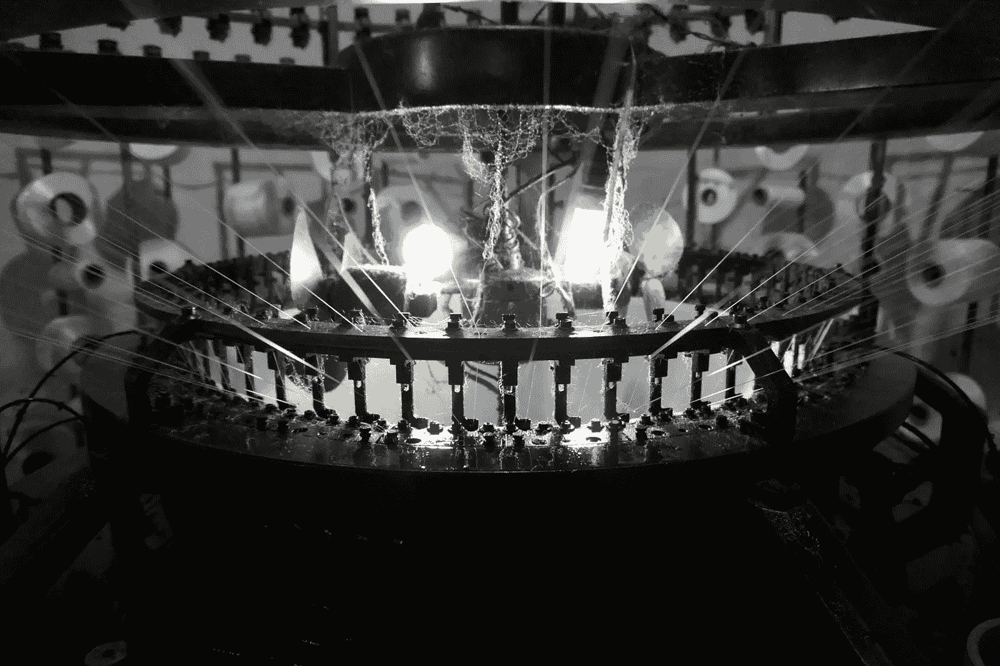
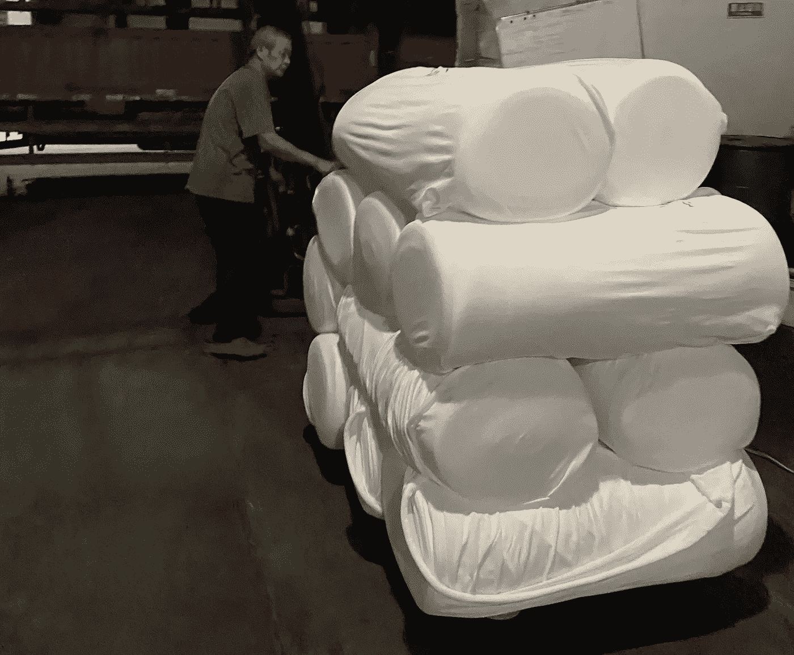
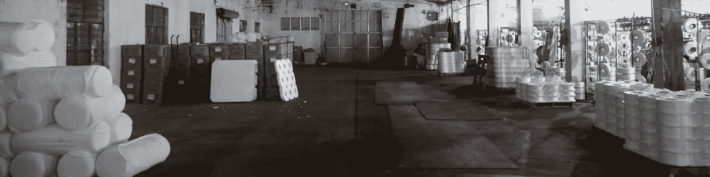

# 关于中国纺织业血汗工厂的简短采访

> 原文：<https://medium.datadriveninvestor.com/a-short-interview-about-a-chinese-sweatshop-in-the-textile-industry-aefa9c2229ef?source=collection_archive---------10----------------------->

来自亚洲最大的纺织品集散地——中国轻纺城

Photo by [Floris Andréa](https://unsplash.com/@florisand?utm_source=unsplash&utm_medium=referral&utm_content=creditCopyText) on [Unsplash](https://unsplash.com/?utm_source=unsplash&utm_medium=referral&utm_content=creditCopyText)

最近两个月我在中国，参观了轻纺城 [*【柯桥】*](https://en.wikipedia.org/wiki/Keqiao_District) 的一家小工厂，确切地说，那是一家家族式的血汗工厂。由于这座城市建于上世纪 80 年代，这家血汗工厂比柯桥年轻不超过 10 岁。

业主的家族在纺织行业有着悠久的历史，大约有 100 年。接受采访的工厂主的祖父曾经也有一个小纺织车间。不幸的是，由于第二次世界大战，他失去了一切，但在贫困中生存。今天，随着中国的蓬勃发展，有各种规模的工厂。家庭作坊是中国东南沿海纺织行业最典型的面貌。

我的采访对象，现在已经 60 岁了，已经在纺织行业工作了大约 30 年，相当于他生命的一半。

Circular Knitting Machine photo by author

在最近的二十年里，他为这种圆形针织机付出了最大的努力，如上图所示。展示了织针和喂纱器呈圆形排列，用于编织聚酯织物卷的机器。

a worker is loading rolls on the truck

小车间里有几个工人。一些人负责操作针织机，其他人负责处理材料和成品。生产中使用的原料是全拉伸丝(FDY)和拉伸变形丝(DTY)。因此，工厂总是挤满了纱线包装盒或成品织物卷。然而，我参观这家小工厂的那一天对工厂来说是个幸运日。新订单的材料和产品仍有足够的产能。

Workshop snapshot

车间必须一天 24 小时运转，无论周末还是节假日。但是中国农历的最后一个月通常是工厂假期，这样来自其他省市的工人就可以和他们的家人在家里度过一个长假。那可能是血汗工厂工人唯一的福利。就连工厂老板也是这样日复一日，年复一年的生活着。而且从他决定开家庭作坊到现在已经 30 多年了。

最后，我仍然有一些问题，但他必须打电话给客户。所以这个系列的第一个故事要中断了。在接下来的故事中，我将继续我的风格进行数据分析，试图从科学的角度讲述更多关于这个研讨会的故事。

# 接下来的故事更关注数据

 [## 用 python 从数据角度看中国工厂

### 这个故事是在采访了一个工厂老板后，在熊猫的帮助下揭开工厂隐藏的真面目…

towardsdatascience.com](https://towardsdatascience.com/view-a-chinese-factory-from-the-data-aspect-with-python-ad698461f40a)  [## 数据分析有助于仓库管理

### 在这个故事中，我们可以体验如何利用所有的交货凭证来监控仓库库存。

towardsdatascience.com](https://towardsdatascience.com/data-analytics-helps-warehouse-management-f6a7f44f47af)