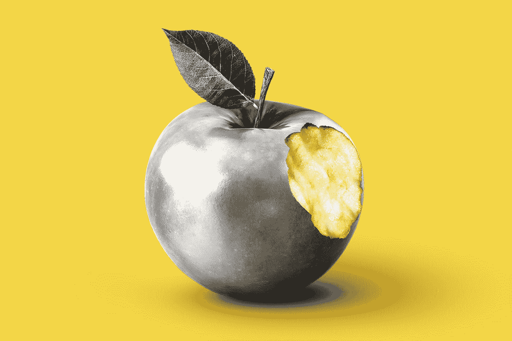
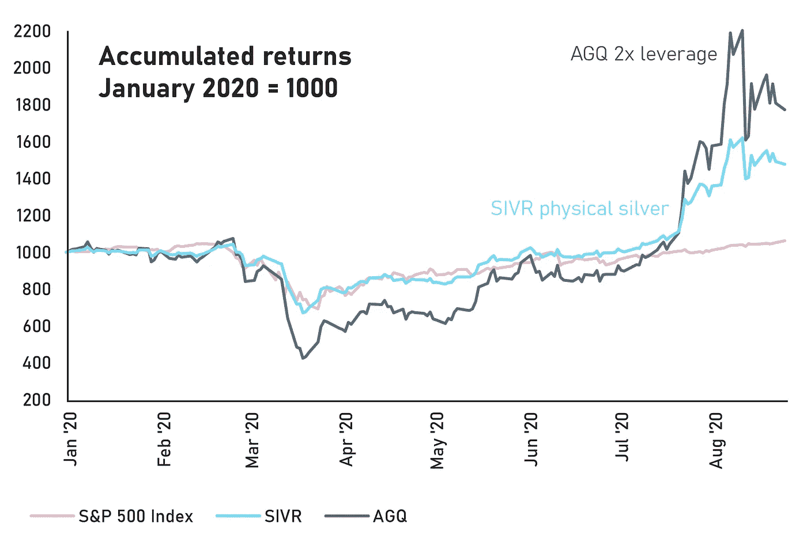

# 你投资组合的一线希望

> 原文：<https://medium.datadriveninvestor.com/a-silver-lining-for-your-portfolio-6644a123fb4f?source=collection_archive---------8----------------------->

## 黄金并不是现在唯一开始流行的贵金属

Photo by [Morning Brew](https://unsplash.com/@morningbrew?utm_source=medium&utm_medium=referral) on [Unsplash](https://unsplash.com?utm_source=medium&utm_medium=referral)

它被称为穷人的黄金，但在截至 7 月底的过去三个月中，它的表现超过了黄色金属 46%。当你看到黄金价格上涨时，很可能大量精明的资金也在流向白银。像黄金一样，白银可以在你的投资组合中发挥稳定作用，对冲通货膨胀和中央银行的意外事件，并从股票和固定收益等传统资产类别中分散投资。一般来说，投资者不会对贵金属采取长期买入并持有的策略，而是在市场不确定性和波动期间短期持有。

你可以通过与黄金类似的方式投资白银:通过在交易所交易并跟踪白银价格的白银 ETF，而不需要你拥有实物资产，以及通过可以从贵金属交易商那里买卖的银锭硬币和银条。像 Aberdeen Standard Physical Silver Shares ETF(股票代码 [SIVR](https://finance.yahoo.com/quote/SIVR?ltr=1) )这样受欢迎的白银 ETF 是由真银支持的[——信托公司持有储存在安全金库中的实物银条。这使得投资者可以在不参与期货市场的情况下从白银敞口中获益，而在到期合约展期时，期货市场可能存在风险。Aberdeen 在 JP Morgan 的伦敦金库中持有超过 2800 万盎司的银条，每年由独立审计师检查两次。](https://www.aberdeenstandard.com/docs?editionId=7690ff0f-7aed-44f1-b573-3146cc0d5c1e)

 [## 金融行业如何受益于机器学习发展和人工智能|数据驱动的投资者

### 在快速变化的金融世界中做出正确的决定并抓住机会可以让你的…

www.datadriveninvestor.com](https://www.datadriveninvestor.com/2020/07/28/how-finance-sector-can-benefit-by-machine-learning-development-and-ai/) 

对于那些特别看涨的人来说，像 ProShares Ultra Silver ETF(股票代码 [AGQ](https://finance.yahoo.com/quote/AGQ?p=AGQ&.tsrc=fin-srch) )这样的基金通过使用杠杆交易白银期货，提供了两倍于白银的日回报率[。该基金使用彭博白银子指数作为基准，该指数反映了以 COMEX 白银期货价格衡量的白银表现。这是一个“滚动”指数，这意味着它反映了像 ProShares 一样滚动期货合约而不进行实物持有的投资者的回报。](https://www.proshares.com/media/fact_sheet/ProSharesFactSheetAGQ.pdf?param=1598347158664)

Source: Yahoo! Finance

银有许多工业用途。银是所有金属中最好的电导体和热导体，使其成为电气应用的首选。银也用于制造太阳能电池板，并通常用作医疗设备的抗菌涂层。你甚至可以购买这些镀银口罩来抵御冠状病毒。据 BullionVault 称，白银的工业用途占[年白银需求的一半以上。相比之下，黄金的工业用途仅占年度黄金需求的 10%至 15%，其余用于珠宝和投资。这意味着经济周期会对银价产生更明显的影响。](https://www.bullionvault.com/silver-guide/silver-industrial-demand)

# **白银需求飙升**

银币以其民族图案而闻名。一只树袋熊在树杈上抱着它的宝宝，或者一只袋鼠的育儿袋里有一只小袋鼠。美国铸造的一盎司硬币正面印有秃鹰的图案。一片精细的枫叶。维也纳爱乐乐团。不列颠尼亚夫人闪亮的头盔。保罗·克留格尔干瘪的脸，他的侧面像出现在同名的南非克鲁格金币上，反面展示了一只在大草原上跳跃的跳羚。还有广受欢迎的诺亚方舟硬币，由一家德国公司为亚美尼亚政府铸造。

> 这些漂亮的设计让实物白银投资成为一种乐趣。即使你确实利用了 ETF 的便利，持有一些实物白银也是令人愉快的。

投资者可以直接从国家造币厂、专业交易商或银行购买，这正是过去几个月投资者成群结队所做的事情。对这种白色金属的需求比上一年大幅上升，推高了现货价格，获得了引人注目的收益，引起了好奇投资者的关注。

由于冠状病毒，白银在 3 月份跌至每盎司 12.59 美元的多年低点后，强劲反弹，在 8 月初触及 28.89 美元的高点。虽然自 2020 年初以来，黄金以美元计算的价值增加了三分之一以上，但白银价格却增加了 63%。相比之下，自 3 月份以来，美元兑欧元大幅贬值。这两种贵金属的表现都很好，但对白银的兴趣导致了大规模的挤兑和远高于黄金的回报。

# 白银息差正在扩大

这一势头吸引了买家。然而，市场的新来者可能会对利差的规模感到惊讶，利差在 2020 年已经急剧扩大，在欧洲最为明显。价差是买价(买方愿意买入的价格)和卖价(卖方愿意卖出的价格)之间的差额。

在全球交易所进行白银实时交易之前，价格是由伦敦固定价格决定的，该价格每天公布两次。现在，我们可以在现货和期货市场获得连续定价。现货价格是你现在支付的交割价格，与期货价格相反，期货价格是在未来特定时间交割的约定价格。现货价格实际上是两种价格:买价和卖价。要价总是高于出价，两者的差额叫做溢价。溢价包含了从造币厂到发货商再到分销商的供应链中每一个环节的所有额外成本。

到了卖的时候，你就打折卖。这是所有活跃在白银市场的参与者促进交易和赚钱的方式。当你购买白银作为投资时，你需要观察价差的两边，以了解你的总成本和潜在利润。一些贵金属有更好的转售价值，这取决于它们的产地和制造方式。白银溢价往往远高于黄金，[通常比现货价格高 9%到 10%](https://www.youtube.com/watch?v=BwM4WxpzUao)。

虽然银息差通常很宽，但最近几周[银息差大幅扩大。买家可以以高于售价 20%的价格购买一个克鲁格金币。对美国鹰来说，差价是 34 %,而对于一盎司的笑翠鸟硬币，投资者必须支付比他们将得到的回报多近 40%的钱。](https://www.degussa-goldhandel.de/infothek/preisliste/)

有各种各样的因素影响着价差。存储、保险和物流成本都要考虑在内。一些硬币的生产成本更高，要么是因为设计更加精细，要么是生产商使用了效率较低的生产方法。然后当然还有税。由于英国和欧盟税法的一个怪癖，银和其他金属的销售需要缴纳增值税，而黄金则不需要。为了创造一个公平的竞争环境，并阻止各国互相削价以鼓励从本国铸币厂购买黄金，增值税在全欧洲范围内被取消。

奇怪的是，你仍然需要像其他产品一样为白银支付增值税。然而，有一种方法。储存在欧盟外保税仓库中的白银可以在没有增值税的情况下购买，只有当你收到白银时才需要支付。当然，如果你在美国进行买卖，你只需为你的白银收益缴纳资本利得税(假设你持有白银的时间超过一年)。

# 白银供应中断

然而，即使考虑到这些因素，包括税收待遇，经验丰富的金属投资者和硬币收藏家也不记得这么多年来的利差有这么大。这些天来，经销商们似乎拿走了更大的份额。这部分是由于白银供应的问题。由于冠状病毒，白银生产商的产量已经不如以前了。根据白银协会的《2020 年世界白银调查》，预计开采产量将[下降 5450 万盎司](https://smallcaps.com.au/silver-mine-production-covid-19-global-output-drop-2020/)，下降 6.4%。

但另一个原因，也是欧洲特有的原因，是随着政府打击洗钱和其他非法转移，场外交易经历了监管步骤的变化。在德国，交易商只允许出售价值最高不超过 2000€的白银和其他贵金属，而无需[核实客户身份](https://safehaven.com/commodities/precious-metals/Why-Germany-Is-Going-To-War-With-Gold.html)。这导致人们更喜欢小批量的贸易，利润更低。为了弥补这一点，经销商降低了购买价格。

白银是一个迷人的交易市场，在许多方面都比黄金更有活力。银价对经济周期的敏感性意味着它可能会波动得更大，而它在从电子产品到医药等各个领域的应用意味着它将永远处于高需求状态。当市场波动时，通过 ETF 将白银作为一种战术性投资组合资产持有可能是一个明智的选择，但投资金币等实物白银可能更令人愉快，尽管投资者需要小心管理价差，并根据你的居住地，准备支付一些额外的税收。

**进入专家视角—** [**订阅 DDI 英特尔**](https://datadriveninvestor.com/ddi-intel)