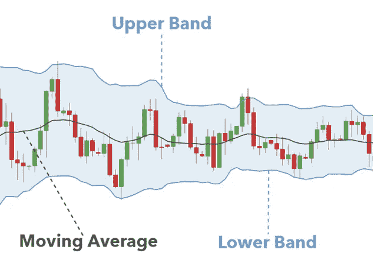
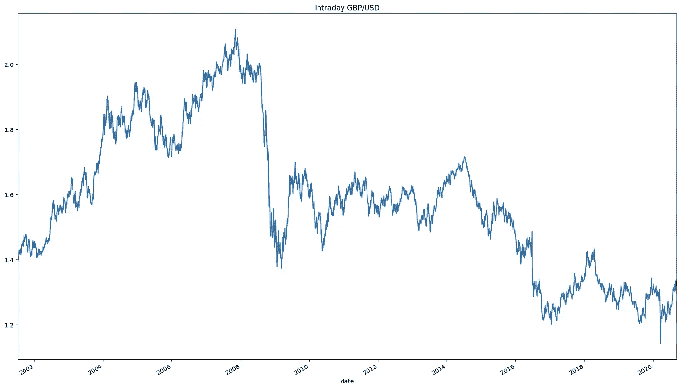
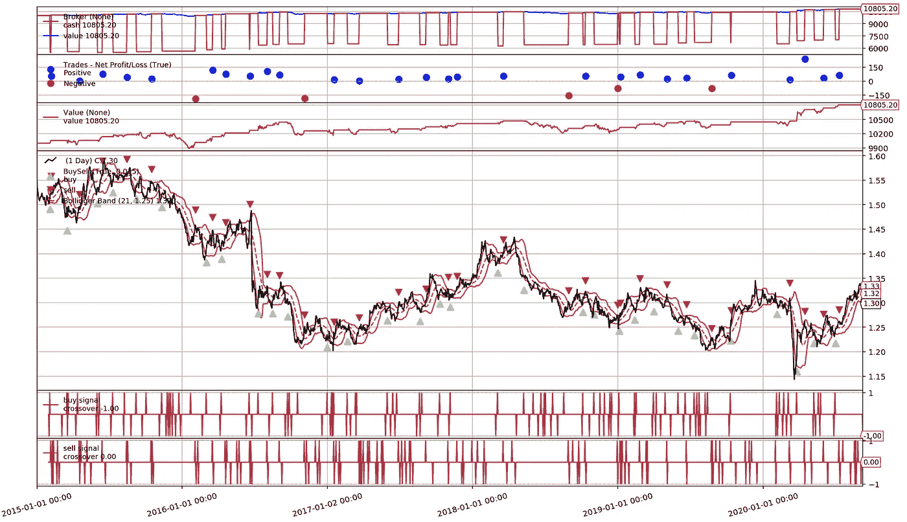

# python 中一个简单的算法交易策略

> 原文：<https://medium.datadriveninvestor.com/a-simple-algorithmic-trading-strategy-in-python-aadb5326dcb8?source=collection_archive---------0----------------------->


Photo by [Austin Distel](https://unsplash.com/@austindistel?utm_source=medium&utm_medium=referral)

在本文中，我将建立在我之前的[帖子](https://medium.com/datadriveninvestor/the-types-of-automated-trading-algorithms-228d537254a8)中描述的理论基础上，并向您展示如何构建您自己的策略实现算法。

现在，这不是建立一个完全复杂的模型，使用各种人工智能算法和信号来获得竞争优势，我们将在后面的文章中实现这一点。我将展示一个简单的策略，希望能给你一个模板，让你将来学习和编写自己的策略。

该策略使用布林线来定义欠买和超卖水平，并在这些区域进行交易。

约翰·布林格在 80 年代创造的布林线，给出了对一个工具的价格和波动性的简明的见解。由 3 条线组成，中间的线通常是 20 天简单移动平均线，上面的线和下面的线代表与 SMA 线的标准偏差，通常是标准偏差的 2 倍。



我们将编码的策略将在英镑/美元货币集上交易，并将涉及当价格突破**下限**时**买入**，当价格突破**上限**时**卖出**。

## 导入相关库并建立笔记本

与所有 python 工作一样，第一步是导入我们需要的相关包。

```
#import needed libraries
import pandas as pd
import numpy as np
import matplotlib.pyplot as plt
import backtrader as bt
from datetime import datetime
import os
from alpha_vantage.foreignexchange import ForeignExchange
import warnings#Configure certain elements to work best in Jupyterlab
%matplotlib inline#I add the line below to let the plots take advantage of my Macbook Retina screen, feel free to remove%config InlineBackend.figure_format ='retina'
plt.rcParams['figure.figsize'] = 16,9
pd.set_option('display.max_colwidth', -1)
warnings.filterwarnings('ignore')
```

## 收集数据

我使用 Alpha vantage 收集历史数据，为了让您自己收集数据，您需要创建一个免费帐户。访问网站
[https://www.alphavantage.co/](https://www.alphavantage.co/)并遵循那里的指示。

将您的凭证作为自由文本复制到您的代码中从来都不是一个好的做法。
我已经将我的凭证放在本地的一个. env 文件中。

下面的代码将返回过去 19 年英镑/美元货币对的每日 OHLC 价格。

```
cc = ForeignExchange(key=os.environ['alpha_vantage_token'],output_format='pandas')# We will retrieve daily OHLC prices, Alpha vantage also contains intraday results which are difficult to come by elsewheredata_df, metadata_df = cc.get_currency_exchange_daily(from_symbol='GBP',to_symbol='USD', outputsize='full')#Plot what the data looks likedata_df['4\. close'].plot()
plt.tight_layout()
plt.title('Intraday GBP/USD')
plt.show()
```

运行上面的代码还应该创建一个收盘价图，以确保您下载了正确的数据。它应该看起来类似于下图。



Ah the heyday of $2 to £1 pre-08 financial crash.

虽然您可以对您的策略进行整整 19 年的回溯测试，但我将过滤掉最近 5 年的例子。

[](https://www.datadriveninvestor.com/2020/07/07/introduction-to-time-series-forecasting-of-stock-prices-with-python/) [## 用 Python |数据驱动投资者进行股票价格时间序列预测简介

### 在这个简单的教程中，我们将看看如何将时间序列模型应用于股票价格。更具体地说，一个…

www.datadriveninvestor.com](https://www.datadriveninvestor.com/2020/07/07/introduction-to-time-series-forecasting-of-stock-prices-with-python/) 

我还将在这里重命名和重新排列列顺序，这是我们将使用的回溯测试包所必需的。

```
# Let's just look at 2015 onwardsdata_df.sort_index(inplace=True)data_df = data_df.loc['2015-01-01':]# Rename & rearrange the fields so they can be ingested by Backtraderdata_df = data_df.loc[:, ['2\. high', '3\. low', '1\. open', '4\. close']]
data_df.columns = ['High', 'Low', 'Open', 'Close']
```

## 定义策略

为了进行回溯测试，我们将使用 Backtrader Python 包[https://www.backtrader.com/](https://www.backtrader.com/)。与 Quantopian 等其他平台相比，这是一个更大的学习曲线，但我真的很喜欢增加的灵活性，以及您可以轻松地与其他 Python 包/平台集成的事实。

我已经硬编码，当买入信号触发时，我们不在市场上(我们不持有当前的头寸)，我将进入 3000 美元的头寸，并在卖出信号触发时完全卖出该头寸。

```
class boll_bander(bt.Strategy):
# Set a bollinger band indicator, buy when the price exceeds the lower band, sell when price exceeds higher band.# Set the parameters for the bollinger band. I chose a 21 day period as that mimics the number of days in a trading month, a smaller standard deviation on the band
# gives more entry & exit opportunitiesparams = dict(
        bperiod=21
        ,dev=1.25)

    def __init__(self):

        #Define Bollinger band

        self.boll = bt.ind.BollingerBands(period=self.p.bperiod, devfactor=self.p.dev, plot=True, plotname='Bollinger Band', subplot=False)

        #Define cross-over points

        self.buysig = bt.indicators.CrossOver(self.data0, self.boll.lines.bot, plotname='buy signal', plot=True)
        self.sellsig = bt.indicators.CrossOver(self.data0, self.boll.lines.top,plotname='sell signal', plot=True)def next(self):

        if not self.position:  # not in the market
            if self.buysig > 0:  # if fast crosses slow to the upside
                self.order_target_size(target=3000)   # enter long

        elif self.sellsig > 0:  # in the market & cross to the downside
            self.order_target_size(target=0)   # close long position
```

## 回溯测试

我们准备好回测了！让我们看看这个策略在 10，000 美元的启动资金下效果如何。

```
cerebro = bt.Cerebro()
data = bt.feeds.PandasData(dataname=data_df)
cerebro.adddata(data)
cerebro.addobserver(bt.observers.Value)
cerebro.addanalyzer(bt.analyzers.SharpeRatio, riskfreerate=0.0)
cerebro.addanalyzer(bt.analyzers.Returns)
cerebro.addanalyzer(bt.analyzers.DrawDown)
cerebro.addstrategy(boll_bander)
results = cerebro.run()
```

现在模型已经运行了，让我们看看我们做得怎么样。

```
print(f"Sharpe: {results[0].analyzers.sharperatio.get_analysis()['sharperatio']:.3f}")
print(f"Norm. Annual Return: {results[0].analyzers.returns.get_analysis()['rnorm100']:.2f}%")
print(f"Max Drawdown: {results[0].analyzers.drawdown.get_analysis()['max']['drawdown']:.2f}%")
cerebro.plot(iplot=False, volume=False, width=20)
```



A visualisation showing: cash value position (top), each trades performance (2nd from top), value of capital over time (3rd from top), instrument price and when the backtest trades were triggered (4th from top) and the buy/sell signal triggers (bottom).

```
Sharpe: 0.938
Norm. Annual Return: 1.32%
Max Drawdown: 3.37%
```

夏普比率为 0.938，年回报率为 1.32%。这么简单的车型还不错！

请注意，由于数据集较新，您的结果可能会略有不同。
值得注意的是，这个策略有几个要点需要考虑:

1.  上面的回溯测试假设我们可以在下一个交易时段的开盘价买入我们的买入信号。实际上，我们会稍微低于这个价格，但会非常接近。
2.  回溯测试假设没有交易成本，交易成本会侵蚀你的利润。
3.  目前，这只是一个做多策略，但正如你所看到的，我们没有利用许多买入/卖出信号，因此我们可以将它转变为一个多空策略。请注意，这将使你的交易次数翻倍，因此交易成本也会翻倍。

我希望这有助于你开始编写自己的策略，让我知道你进展如何！

你可以在这里找到完整的代码。

**访问专家视图—** [**订阅 DDI 英特尔**](https://datadriveninvestor.com/ddi-intel)