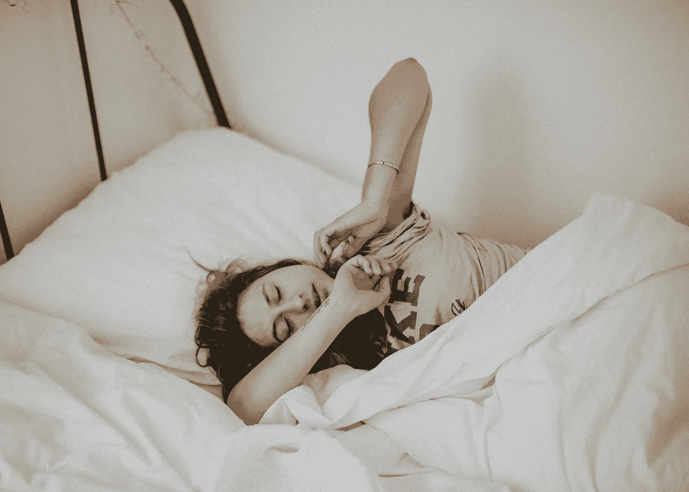

# 一个简单而有效的懒人晨间惯例

> 原文：<https://medium.datadriveninvestor.com/a-simple-but-effective-morning-routine-for-lazy-people-e6770f6c1302?source=collection_archive---------1----------------------->

## 你不需要成为一个早起的人来拥有一个美好的一天。

Photo by [Kinga Cichewicz](https://unsplash.com/@all_who_wander?utm_source=unsplash&utm_medium=referral&utm_content=creditCopyText) on [Unsplash](https://unsplash.com/collections/4578438/mind-cafe?utm_source=unsplash&utm_medium=referral&utm_content=creditCopyText)

如果你曾经需要一个早晨的惯例，那将是在我们现在生活的这个时代——当我们所知的世界颠倒过来，我们所有熟悉的惯例都被外部事件打乱的时候。这是我们需要找到平衡和一些平静的时候。这是我们需要确保我们有一些锚把我们和自己联系起来的时候。

这是困难时期，我们需要度过难关。例行的动作和有规律的行动会让你在当下站稳脚跟，并给你一些精神上的保证，一切都会好的。

我一直想成为一个早起的人，我花了很多年才接受自己不是早起的人。我渴望那些安静的、富有成效的时间，它们能帮助我以一种我们不着急的方式开始一天的生活；我很冷静，也很专注。

相反，我是那种端着一杯咖啡坐在床上，茫然地盯着看 20 分钟，只是为了能动一下的人。所有这些都发生在平均按下 3-4 次小睡按钮之后。

唯一的例外是，当我醒来已经很晚，除了穿上衣服，在喧闹的混乱中让我的孩子准备好，然后离开公寓，没有别的事可做。

 [## 跑步摆脱疯狂:锻炼如何提高你的生产力|数据驱动的投资者

### 没有比锻炼更好的方式来开始一天的工作了。我试着一周至少做四天，在…

www.datadriveninvestor.com](https://www.datadriveninvestor.com/2018/10/23/running-to-get-rid-of-the-crazy-how-working-out-increases-your-productivity/) 

有趣的是，在我晚年的时候，我学会了如何介绍我的晨间习惯。它从来没有计划和决定它。我从未有过美好的冥想或一小时写作的美好形象。我破坏了它——每一次。

但是当我没有选择的时候——我不思考，我只是做。如果我处于某种压力之下，通常会有足够的风险让我起床。

作为一个懒惰、不早起的人，我发现欺骗自己采取行动比决定和计划更有效。

近一个月来，我一直比平时早起 90 分钟——在 5:30 到 6:00 之间。虽然我没有足够的时间在我的孩子醒来并开始提出要求(早餐、小吃、帮助选择衣服、忘记的作业、一些兄弟姐妹的争吵或只是一个拥抱)之前写下一千个单词，但我仍然更擅长处理我的早晨。

以下是方法:

# 喝点水

当闹钟响起时，我做的第一件事就是喝水。这样做的绝对先决条件是在我的床边放一整瓶水——触手可及，所以我甚至不需要起床。

除了众所周知的水对健康的影响，我还发现了另外两件对懒人有帮助的事情:

1.  如果你一整天都喝了足够的水，那么晚上会很长，早上会很渴。这样，喝水就不是任务而是一种清爽的体验。
2.  如果你以喝水来结束一天的生活，你肯定需要在早上醒来后第一件事就是去尿尿。这是没有商量余地的，你不能拖延——一旦你不得不起床，就已经成功了一半。

# 整理床铺

在你起床的那一刻，确保你不能再回到床上。我喜欢爬回床上。盖子是如此温暖和模糊，如果我撒尿够快，它仍然会保持我身体的温暖。

但是如果你想要一个让你充满活力的早晨，这是应该避免的。

起床整理床铺(如果你足够幸运能和别人分享，至少是你的那一半。更进一步，不要穿浴袍，而是穿上你的衣服。运动服，如果你打算锻炼的话，或者一些你不会穿去睡觉的舒适的衣服。

# 移动一点

如果你仍然昏昏沉沉，这是有用的部分。如果你不喜欢早上锻炼，那就在你的大脑醒来之前锻炼。

它可以是任何事情——为 5 分钟的拉伸或瑜伽设置一个计时器，或者做一些可以提高心率的轻微运动。

对我来说，成功的一部分是我不认为这是锻炼，所以当我想到它时，我不会畏缩。我做平板运动、深蹲运动和跳跃运动——总共 5 分钟。老实说，在跳板的第 30 秒，我已经醒了，并试图挺过去——但一旦我到了那里，我就会去做。女孩们，做些凯格尔运动吧，那不会有坏处的。

如果你有能力做得更多，那就去做吧。但是如果你有点懒，只要确保你的心率加快，并且在体育锻炼中保持警觉。

让空气进来——然后呼吸

我们不会真的想到呼吸——因为我们不需要。即使我们只是在卧室里呼吸，我们也能生存，但呼吸新鲜空气的区别是巨大的。

打开你的窗户，不管外面有多冷或多热，深呼吸。你可以在这里混合一些正念——与你的身体同步，但老实说，我不这么做。我决定数到 20 次深呼吸，然后我们就出发。

当我数到 4 的时候，我会注意用鼻子慢慢吸气，然后用嘴呼气，同样数到 4。对我来说，计数本身是很重要的。

我发现我越不把它复杂化，我就越有可能坚持下去。

# 在心里快速列出一张待办事项清单

你也可以通过写下来来做到这一点，但是只要记住一些事情就可以了。我列出了我需要做的最重要的事情的清单。

通常，我会列出三条:

1.  对我来说很重要的事情
2.  我最讨厌的东西
3.  紧急的事情

我把它记在心里，因为我的一天从列出所有的事情并对它们进行优先排序开始。有时候我会把做清单和呼吸或者拉伸混合在一起，所以当所有事情都做完的时候，我觉得我已经准备好开始新的一天了。

这三件事帮助我优先考虑我的一天，并攻击那些我知道我会推迟(讨厌)或如果我不做就会迟到的事情(紧急)，我需要一些向前看的事情(重要)。

# 拥抱重要的人

这只是一个意外收获，但绝对是我会推荐的东西。没有它你也可以开始你的一天，但是如果你有一个人可以拥抱，你为什么会错过呢？它可以是你的配偶、孩子或宠物——选择权在你。

科学证明，拥抱可以降低血压，降低心率，通过降低皮质醇水平来缓解压力，支持免疫系统，减少焦虑，通过释放催产素来激发积极的情绪。

它也能让你更快乐，知道拥抱能让双方都从中受益，这很好。

你不需要成为一个早起的人来拥有一个令人惊讶的早晨惯例。你不需要变得超级活跃，或者一觉醒来就觉得很有效率。有可能建立一个不痛不痒、一点也不难受的日常习惯——所以你可能真的会坚持下去。

如果你像我一样，有一点懒惰，那么早上第一件事就是喝点水，让自己无法回到床上，在半睡半醒的时候活动一下，呼吸一些新鲜空气，准备好三件事的清单，拥抱一个爱人。

亲注:我建议放弃你的手机，远离任何屏幕。在这之后，你可以开始你一天的日常生活，比如喝饮料、吃早餐、写作、锻炼、淋浴等等。

简单到看起来效率很低。但这是有效的——它让你为即将到来的美好一天做好准备。

你要知道，你最多只有 10 分钟时间。

你每天有 10 分钟给自己吗？