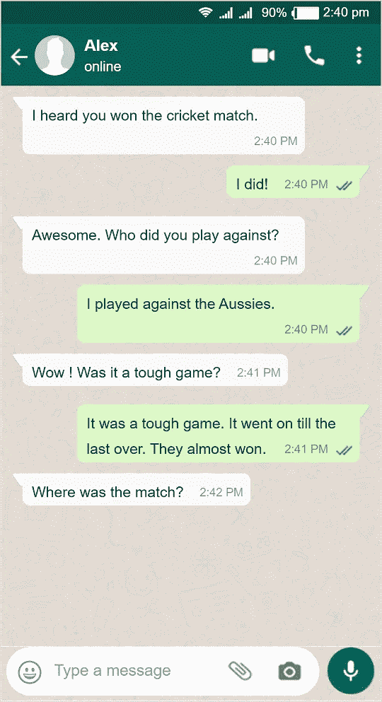

# 一个简单的上下文聊天机器人，通过预先训练的对话模型预测来自 Huggingface 的回复

> 原文：<https://medium.datadriveninvestor.com/a-simple-contextual-chatbot-to-predict-an-reply-with-pre-trained-dialogpt-model-from-huggingface-f681b550cd60?source=collection_archive---------4----------------------->



大多数聊天机器人会根据自己看过的**最后一句话**提供自动回复建议。然而，为了进行引人入胜的自然对话，聊天机器人必须记住之前的对话，并做出恰当的回应。

今天，我们将了解如何利用最先进的 [**DialoGPT**](https://www.microsoft.com/en-us/research/project/large-scale-pretraining-for-response-generation/) NLP 模型，生成高质量的对话响应。

我们将使用的例子显示在左边的 Whatsapp 图片上。我们将预测“**比赛在哪里进行？”这个问题的理想答案**通过之前的对话为模型提供背景。

我们开始吧！

在 Jupyter 笔记本中安装最新版本的[变形金刚](https://huggingface.co/transformers/)库-

```
!pip install transformers==2.8.0
!pip install torch==1.4.0
```

必要的代码改编自[此处](https://huggingface.co/microsoft/DialoGPT-medium)。这是我们程序的所有代码-

## 输出:

作为回答的预测句子是— **在墨尔本市。**

请注意，聊天机器人预测了**墨尔本**，因为我们之前提到过一些对话，这场比赛是与**澳大利亚人**(澳大利亚)进行的。

## 解释:

把所有的句子按顺序列出来。列表中的每个元素都应该对应于来自单个用户的消息。该列表应该在每个用户之间交替出现。例如:“用户 1”和“用户 2”

```
sentence_list = [
    "I heard you won the cricket match.",     # user 1
    "I did!",                                 # user 2
    "Awesome. Who did you play against?",     # user 1
    "I played against the Aussies.",          # user 2
    "Wow ! Was it a tough game?",             # user 1
    "It was a tough game. It went on till the last over. They almost won.",                                        # user 2
    "Where was the match?"                    # user 1
]
```

将一个**单用户**的所有**顺序消息**串联成一条。例如，如果用户连续键入 3 条独立的消息“这是一场艰难的比赛”，“它一直持续到最后一场比赛结束”和“他们几乎赢了”——将单个用户的所有连续消息连接成一条。

```
sentence_list = [
    ... "**It was a tough game**. **It went on till the last over**. **They almost won**.",                                        # user 2
    ....
]
```

现在，我们将列表中的所有句子与来自 tokenizer 的句尾 EOS 标记( **tokenizer.eos_token** )连接起来。 **all_sentences_string** 的输出是-

```
I heard you won the cricket match.**<|endoftext|>**I did!**<|endoftext|>**Awesome. Who did you play against?**<|endoftext|>**I played against the Aussies.**<|endoftext|>**Wow ! Was it a tough game?**<|endoftext|>**It was a tough game. It went on till the last over. They almost won.**<|endoftext|>**Where was the match?**<|endoftext|>**
```

我们现在**将 **all_sentences_string** 标记化**并将其传递给**model . generate**to**generate&解码最终的输出字符串(**decoded _ reply _ predicted _ with _ input**)**

```
I heard you won the cricket match.I did!Awesome. Who did you play against?I played against the Aussies.Wow! Was it a tough game?It was a tough game. It went on till the last over. They almost won.Where was the match?**It was in the city of Melbourne.**
```

请注意， **model.generate** 生成连接输入字符串的回复。因此，我们小心地将回复从生成的句子中分离出来，如下所示

```
decoded_reply_predicted = tokenizer.decode(reply_predicted[:,**prefix_length:**][0], skip_special_tokens=True)
```

我们从聊天机器人的变量 **decoded_reply_predicted** 中得到预测回复，作为 **-**

```
**It was in the city of Melbourne.**
```

[](https://www.datadriveninvestor.com/2020/02/19/five-data-science-and-machine-learning-trends-that-will-define-job-prospects-in-2020/) [## 将定义 2020 年就业前景的五大数据科学和机器学习趋势|数据驱动…

### 数据科学和 ML 是 2019 年最受关注的趋势之一，毫无疑问，它们将继续发展…

www.datadriveninvestor.com](https://www.datadriveninvestor.com/2020/02/19/five-data-science-and-machine-learning-trends-that-will-define-job-prospects-in-2020/)