# 机器学习中的 Adaboost 算法——集成技术

> 原文：<https://medium.datadriveninvestor.com/a-simple-guide-to-adaboost-algorithm-in-machine-learning-ensemble-techniques-41d59b0d7447?source=collection_archive---------9----------------------->

Photo by [Li Lin](https://unsplash.com/@northwoodn?utm_source=medium&utm_medium=referral) on [Unsplash](https://unsplash.com?utm_source=medium&utm_medium=referral)

## 在本文中，我们将通过一个示例和 AdaBoost 算法的 python 实现来了解什么是 AdaBoost 算法，AdaBoost 算法如何工作。

近年来，助推算法在 Kaggle 竞赛中获得了巨大的人气。许多 Kaggler 使用这些提升算法来实现更高的性能，从而赢得了竞争。Adaboost 算法是 boosting 算法的例子。我们将在 AdaBoost 算法中详细讨论。

# 集合方法的类型:

*   集成方法可以分为两组:基于基础学习者。

## **顺序学习者:**

在基础学习器顺序生成的情况下，例如自适应增强(AdaBoost)，基础学习器的顺序创建促进了基础学习器之间的依赖性。然后，通过给先前的学习者分配更高的权重来提高模型的性能。

## **平行学习者:**

其中基本学习器**T5 以并行格式生成，例如随机森林，随机森林包含许多决策树。基础学习者的并行创建促进了基础学习者之间的独立性。**

*   基于基础学习器的类型，集成方法可以分为两类。
*   同质集成方法在每次迭代中使用相同类型的基本学习器。
*   异构集成方法在每次迭代中使用不同类型的基学习器。

# 什么是 AdaBoost 算法？

*   **AdaBoost 或自适应 Boosting** 是由 Yoav Freund 和 Robert Schapire 于 1996 年提出的集成 Boosting 方法之一。你可以用它来解决分类和回归问题。AdaBoost 是一种迭代集成方法。它通过组合多个弱性能分类器来构建强分类器。最终的分类器是几个弱分类器的加权组合。它适合不同加权训练数据上的弱学习者序列。如果使用第一个学习器的预测是不正确的，那么它给予已经被错误预测的观察更高的权重。作为一个迭代过程，它继续添加学习者，直到达到模型数量或精确度的极限。你可以在 AdaBoost 图中看到这个过程。

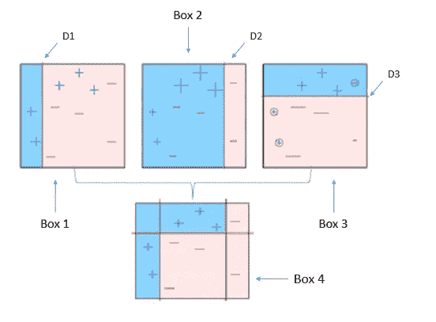

*   AdaBoost 可以使用任何基本分类器。这种算法不容易过拟合。AdaBoost 易于实现。AdaBoost 的一个缺点是它受离群值的影响很大，因为它试图完美地拟合每个点。与 XGBoost 相比，它的计算速度较慢。
*   简单来说，最初，AdaBoost 选择一个随机训练子集，并对每个观察值赋予相同的权重。如果使用第一个学习器的预测是不正确的，那么它给予已经被错误预测的观察更高的权重。该模型通过基于上次训练的准确预测选择训练集来迭代训练。作为一个迭代过程，该模型添加多个学习器，直到模型数量或准确度达到极限。

*   任何机器学习算法都可以用作基本分类器，只要它接受训练集的权重。
*   **AdaBoost** 应满足两个条件:

1.  分类器应该在各种加权的训练例子上被交互地训练。
2.  在每一次迭代中，它试图通过最小化训练误差来为这些示例提供最佳拟合。

# AdaBoost 算法直觉:

*   它按以下步骤工作:

1.  最初，Adaboost 随机选择一个训练子集。
2.  通过基于上一次训练的准确预测选择训练集来迭代地训练 AdaBoost 机器学习模型。
3.  通过基于上一次训练的准确预测选择训练集来迭代地训练 AdaBoost 机器学习模型。
4.  此外，它在每次迭代中根据分类器的准确性将权重分配给训练好的分类器。越准确的分类器将获得越高的权重。
5.  这个过程反复进行，直到完整的训练数据没有任何误差地拟合，或者达到指定的最大估计数。
6.  为了分类，对你建立的所有学习算法进行“投票”。

*   直觉可以用下图来描述:

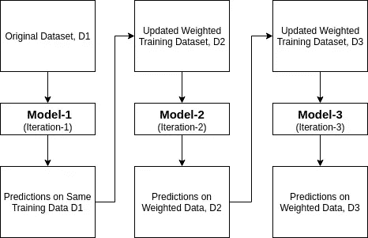

# AdaBoost 工作原理的一个示例:

首先，我们必须了解增压的工作原理。当我们训练数据时，它创建了 n 个决策树。当创建第一个决策树或模型时，定型示例错误地对第一个模式进行了分类，然后第一个模型具有更高的优先级。只有这些训练示例被发送作为第二模型的输入。这个过程将一直持续到我们没有提供我们想要在模型中创建的基础学习者的数量。请记住，所有增强方法都允许重复训练示例。

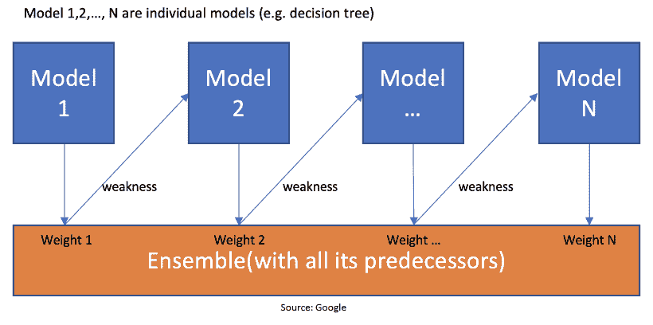

上图显示，当创建第一个模型时，算法注意到第一个模型的错误，错误分类的训练示例将作为下一个模型的输入。这个过程反复重复，直到不满足指定的条件。当你看上图时，有 n 个模型是通过最小化前一个模型的误差而创建的。这就是增压的工作原理。模型 1，2，3，…，N 是被称为决策树的独立模型。所有的组装方法都基于相同的概念。

现在我们知道了升压的概念，理解 AdaBoost 算法就很容易了。让我们深入了解 Adaboost 算法的工作原理。当使用随机森林算法时，该算法创建 n 棵树。它创建了完美的树，由一个起始节点和几个叶子节点组成。一些决策树可能比其他树更大，但在随机森林中没有固定的深度或长度。但有了 Adaboost，情况就不一样了。在 AdaBoost 中，该算法只创建一个具有两片叶子的节点，这被称为决策树桩。

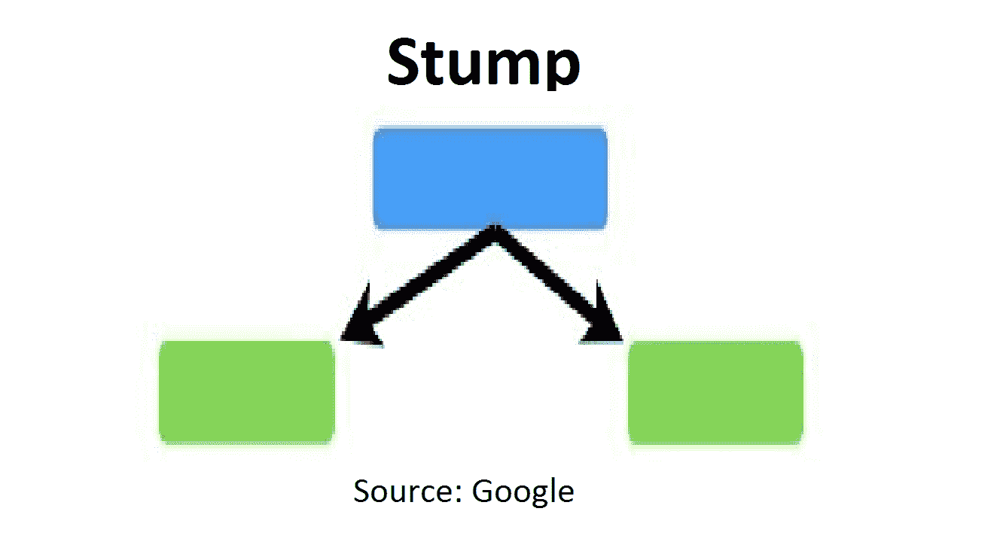

上图代表了一个决策树桩。我们可以清楚地看到，它只有一个节点，只有两片叶子。这些决策树桩是弱学习者，boosting 算法使这些小学习者成为强学习者。决策树桩的顺序在 AdaBoost 算法中非常重要。第一个决策树桩的错误反映了另一个决策树桩是如何创建的。让我们举一个理解的例子。

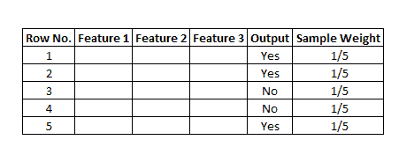

这里我们有一个仅包含三个要素的样本数据集，输出是二进制的。由于输出是二进制格式，这就变成了一个分类问题。在现实生活中，数据集可以有许多训练示例和数据集中的许多要素。为了便于解释，我们假设有 5 个训练示例。输出是二进制格式，这里是“是”或“否”。所有这些训练示例都将分配一个样本权重。使用的公式是，W=1/N，其中 N 是分配一些权重的记录数。在这个数据集中，只有 5 个训练样本，所以样本权重最初为 1/5。每一行都得到相同的权重。是 1/5。

## 步骤 1-创建第一个基础学员

现在是时候创建第一个基础学习者了。该算法采用第一特征，例如特征 1，并创建第一决策树桩 f1。然后，它将创建与特征数量相同的决策树桩。这个案例将产生 3 个决策难题，因为在这个数据中只有 3 个变量。所有这些决策树桩将创建三个决策树和一个基于决策树桩的学习者模型。AdaBoost 算法将只选择一个。在选择基学习器时，有两个属性，即基尼系数和熵。我们应该用计算决策树的方法来计算基尼系数或熵值。决策树桩是最小值将被视为第一基本学习者。在下图中，所有 3 个决策树桩都可以由 3 个变量构成。叶子下面的数字表示正确和错误分类的训练示例。具有最小熵或基尼的树桩将被选择作为基础学习者。让我们假设决策树桩一的熵指数最小。因此，让我们将决策树桩 1，即特征 1 作为我们的第一个基本学习者。

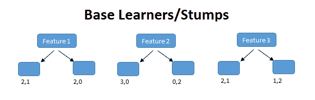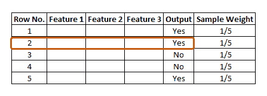

这里，特征 f1 正确地分类了 2 个观察值，错误地分类了 1 个观察值。图中标记为红色的行分类不正确。我们将只计算这一行的总误差。

# 步骤 2 —计算总误差(TE)

总误差是样本权重的分类训练示例中所有误差的总和。在我们的例子中，只有 1 个误差，所以总误差(TE) = 1/5。

# 步骤 3 —计算树桩的性能

计算决策树桩性能的公式是:-

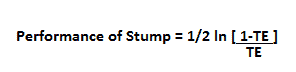

其中 **ln** 是自然对数， **TE** 是总误差。

在我们的例子中，总误差为 1/5。通过保留上述公式中的总误差值，我们得到决策树桩的性能值为 0.693。你一定在问为什么确定 stump 的 TE 和性能很重要？对，我们应该在进入下一个模型之前更新样品重量。只有错误的训练样本/错误分类的记录比正确分类的训练样本得到更多的偏好。因此，只有来自决策树或决策树桩的错误记录被传递到另一个决策树桩。在 AdaBoost 中，两个记录都被允许通过，错误的训练示例比正确的训练示例重复得多。我们应该增加错误分类的训练样本的样本权重，并减少正确分类的训练样本的样本权重。在下一步中，我们将根据决策树桩的性能更新权重。

# 步骤 4 —更新权重

对于分类不正确的训练示例，公式为:

**新样品重量=样品重量* e^(Performance)**

在我们的例子中，样本重量= 1/5 所以， **1/5 * e^ (0.693) = 0.399**

对于正确分类的训练示例，我们使用带有负号的相同公式来表示性能。与不正确的分类相比，正确分类的训练样本的权重将减少。公式是:

**样品重量=样品重量* e^-(性能)**

放入数值， **1/5 * e^-(0.693) = 0.100**

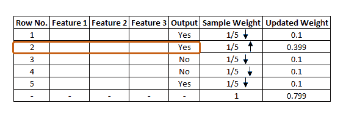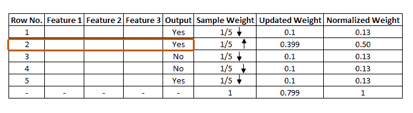

图中可以看到所有训练示例的更新权重。所有权重的总和应为 1。但是我们可以看到，所有训练示例的总更新权重不是 1，而是 0.799。为了使总和为 1，我们必须将每个更新的权重除以更新的权重的总和。比如更新后的权重是 0.399，我们就必须用这个除以 0.799，像 **0.399/0.799=0.50** 。

**0.50** 可识别为归一化重量。我们可以在下图中看到所有的标准化权重，总和大约为 1。

# 步骤 5-创建新数据集

现在，我们可以从前一个数据集创建一个新的数据集。在这个新数据集中，错误分类的训练样本的频率将高于正确分类的样本。在分析这些归一化权重时，我们必须创建一个新的数据集，该数据集将基于归一化权重。出于训练目的，它可能会选择错误的训练示例。这将是第二个决策树或决策树桩。为了基于归一化权重生成新的数据集，算法将把它划分为周期。

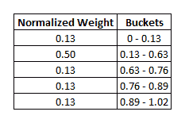

我们的第一个范围是从 0 到 0.13。第二个范围是从**0.13–0.63(0.13+0.50)。**第三个范围是从**0.63–0.76(0.63+0.13)、**等等。此后，该算法将运行 5 次迭代，以从旧数据集中选择不同的记录。想象一下，在第一次迭代中。该算法将采用随机值 **0.46。然后**它将查看值将落在哪个周期中，并在新数据集中选择该训练示例，然后它将再次选择随机值并查看它在哪个周期中，然后为新数据集选择该训练示例，相同的过程重复 5 次迭代。

错误的训练样本很有可能被选择几次。这将是新的数据集。在下图中可以看到，从旧数据集中多次选择了第 2 行，因为该行在之前的数据集中被错误地分类。

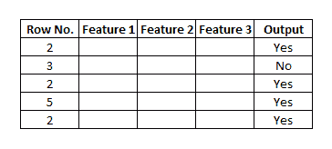

基于新的数据集，该算法将再次创建新的决策树或树桩，并且它将从步骤 1 开始重复相同的过程，直到它顺序地通过所有的决策树桩，并且发现当与我们在初始步骤中具有的归一化权重相比时，存在最小的误差。

# 用 Python 实现 AdaBoost

*   现在，我们来看看 Python 中 AdaBoost 算法的实现部分。
*   第一步是加载所需的库。

# 导入库

# 加载数据集

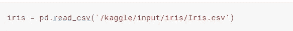

# 电子设计自动化(Electronic Design Automation)

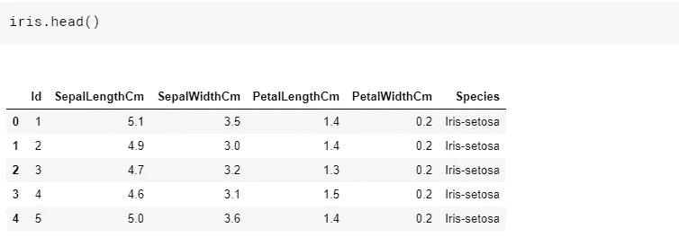

# 查看数据框的摘要

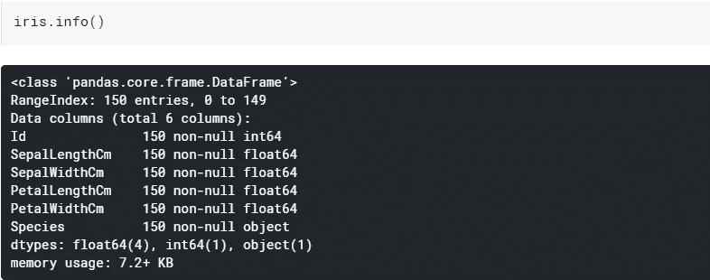

我们可以看到数据集中没有缺失值。

# 声明特征向量和目标变量

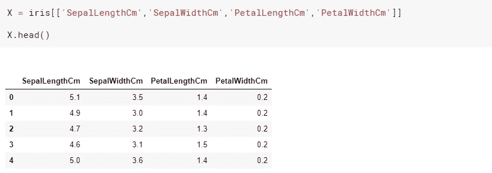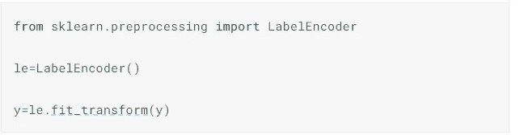

# 将数据集分为训练集和测试集

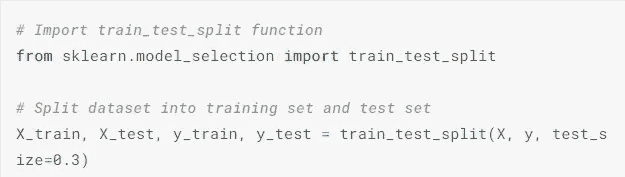

# 构建 AdaBoost 模型

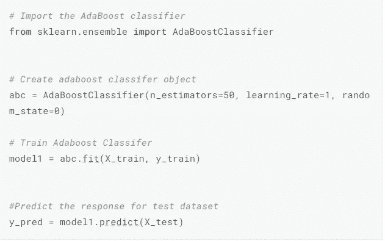

# 评估模型

让我们估计分类器或模型预测品种类型的准确度。

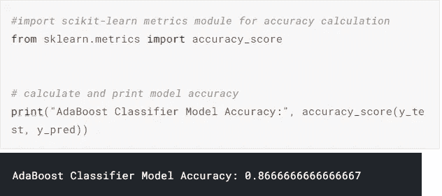

*   在这种情况下，我们得到了 86.67%的准确度，这将被认为是良好的准确度。

# 基于 SVC 估计量进一步评估

*   为了进一步评估，我们将使用 SVC 作为基本估计值，如下所示:

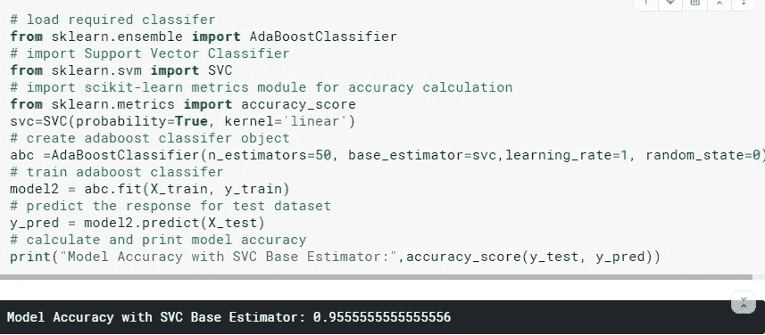

*   在这种情况下，我们得到了 91.11%的分类率，这被认为是杰出的准确性。
*   在这种情况下，基于 SVC 的估计器比基于决策树的估计器具有更好的准确性。

# AdaBoost 的优缺点

其优点如下:

1.  AdaBoost 易于实现。
2.  它迭代地纠正弱分类器的错误，并通过组合弱学习器来提高精度。
3.  我们可以在 AdaBoost 中使用许多基本分类器。
4.  AdaBoost 不容易过拟合。

缺点如下:

1.  AdaBoost 对噪声数据很敏感。
2.  它受异常值的影响很大，因为它试图完美地拟合每个点。
3.  AdaBoost 比 XGBoost 慢。

# 结果和结论

*   我们已经讨论了 AdaBoost 分类器。
*   我们已经讨论了基础学习者是如何分类的。
*   然后，我们继续讨论 AdaBoost 分类器背后的直觉。
*   然后，我们介绍了 AdaBoost 分类器在虹膜数据集上的实现。
*   最后，我们讨论了 AdaBoost 分类器的优缺点。