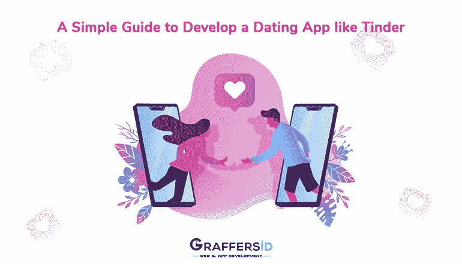
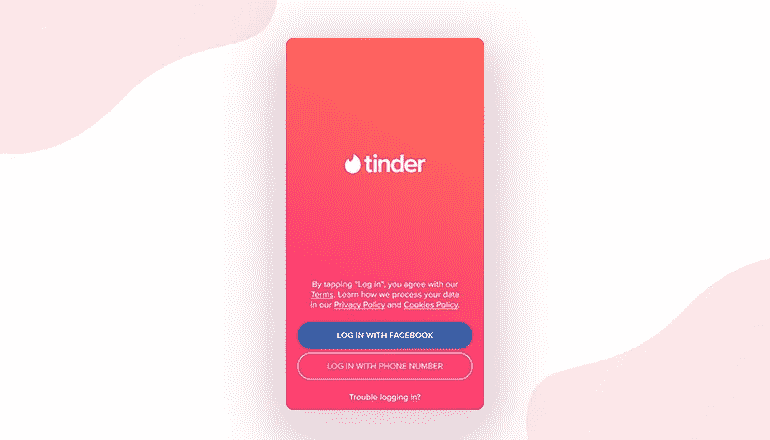
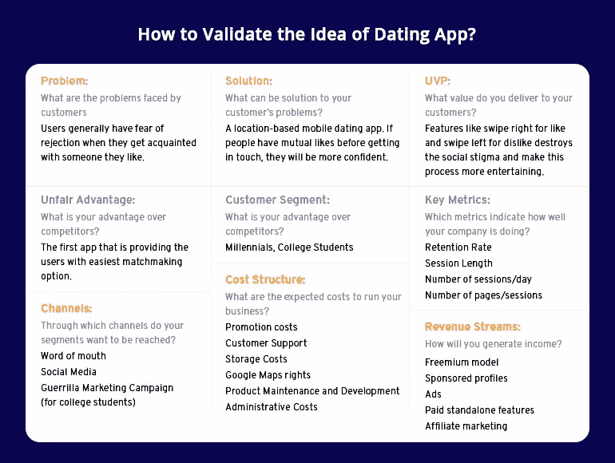

# 开发像 Tinder 这样的约会应用程序的简单指南

> 原文：<https://medium.datadriveninvestor.com/a-simple-guide-to-develop-a-dating-app-like-tinder-ca3624bed7c9?source=collection_archive---------19----------------------->

根据最近的统计，今天全世界大约有 27%的关系是从网上约会软件开始的。这清楚地表明，网恋现象不再是一个禁忌。

世界各地的约会应用程序和网站上大约有 2000 万次匹配。这个数据告诉我们，有 4000 万人是这一现象的一部分。

因此，毫无疑问的事实是，随着按需应用的经济增长，这个数字将成倍增加。所以，如果你正计划创建一个像 tinder 这样的应用程序，可以帮助单身人士找到他们一生的爱，那么这是你的最佳时机。

据预测，到 2030 年底，全世界大约一半的已婚夫妇会在网上遇到他们的伴侣。平均而言，一个在线约会服务用户在这些应用程序和网站上的花费是 243 美元。此外，对于约会服务，在当前场景中，每个用户的平均收入为 4.30 美元。

# 网站或应用程序:构建什么？

当它是关于约会的时候，开发一个 app 是最好的选择。思考为什么？原因如下。

首先，与应用程序相比，网站不容易访问。除此之外，你不会远离一个应用程序，因为它总是在你的智能手机上。而且，这允许您即时响应推送通知。这就是约会 app 比约会网站越来越受欢迎的原因。

根据最近的研究，五分之四的人在智能手机上搜索他们的“bae”。这是合法的。因此，与网站相比，创建像 Tinder 这样的应用程序更能创收。甚至现在市场上有各种各样的约会应用，比如严肃约会应用，LGBT 约会应用等等。

 [## 2019 年移动 App 发展之路

### 任何在移动应用程序开发行业工作的人，无论他们是专注于在伦敦开发 iOS 应用程序还是…

www.datadriveninvestor.com](https://www.datadriveninvestor.com/2019/01/15/the-path-of-mobile-app-development-in-2019/) 

创建应用程序既简单又可取。所以，如果你想创建一个像 Tinder 一样的应用程序，你需要做的就是将你的项目外包给合适的开发者。在这里，同样重要的是要记住尽可能让你的用户界面和 UX 上瘾，让你的用户沉迷其中。

# 最好的约会应用

这里有几个最受用户欢迎的约会应用。

**1。火绒:**

你一定很熟悉这个名字，因为 Tinder 是最受欢迎的约会应用之一，每月有 5000 万用户。

体验 Tinder 付费功能的用户数量占 410 万，其中 8 亿美元是 2018 年应用程序的报告渠道。该应用程序不断推出新的有趣功能，如能够“超级喜欢”一个人。

**2。匹配:**

Match 出现在 Tinder 之后的第二位，有 32%的提及率。该应用程序提供了一个非常简单的注册过程，用户不必通过脸书登录应用程序。在注册过程中，用户需要添加一些照片，并回答一些基本问题，如他们的喜好和性别。此外，如果用户在 Match 上创建帐户，他们必须创建用户名和密码。

Match 还附带了一个有趣的功能，它被称为“错过的连接”。

**3。鱼很多:**

大量的鱼或 POF 是美国第三大流行的约会应用。就像匹配，用户不需要链接他们的脸书帐户到他们的 POF id。这意味着大量的鱼让你保持匿名，并通过用户名登录，这可能不同于你的真实姓名。

**4。OkCupid:**

OkCupid 是继 Tinder、Match 和 fully Fish 之后第四个广受欢迎的约会应用。

该应用程序与上述应用程序有所不同。它不允许用户匿名登录，而是使用他们的名字。除此之外，众所周知，OKC 还会提出一些有助于开始对话的问题。

**在创建像 Tinder** 这样的应用时，以下是需要记住的一些特性

**1。与社交媒体的整合:**

让人们只需通过注册谷歌、脸书或 Instagram 账户就能访问账户，就能给潜在用户留下好印象。

例如，Tinder 允许用户用电话号码或脸书登录。这个功能对应用程序是有益的，也有助于应用程序收集关于喜欢和不喜欢的数据。此外，该应用程序还将能够访问用户的好友列表。让用户通过他们的社交媒体资料登录也可以防止虚假资料。

Log in Options in Tinder

**2。地理定位:**

如果用户来自伦敦，而比赛的建议来自曼彻斯特，那么对用户来说就没有用了。因此，约会应用需要有基于位置的匹配。您甚至可以让用户选择他们的位置偏好，例如让他们设置建议匹配的距离限制。

通过 Tinder 的付费订阅，用户可以根据他们要去的地方改变他们的位置。

因此，当你创建一个约会应用时，地理定位是一个重要的功能。

**3。配对应该是你的 USP:**

匹配是所有关于内部算法，取决于用户的好恶。毫无疑问，一个约会应用程序的算法并不那么简单，重要的是展示给别人之前已经喜欢过个人资料的人。

**4。信息服务:**

归根结底，你希望用户保持对应用程序的参与，不是吗？为此，你需要用户继续使用你的应用程序，即使他们找到了正确的匹配。最好的方法是添加消息传递工具。

让你的用户通过他们的应用进行对话，而不是寻找其他应用来营造浪漫气氛。为此，你需要一个聊天框。

Chatbox 设施也使你的女性用户的应用程序安全。如果他们面临虐待或不良行为，他们可以直接通知管理小组。在这种情况下，不公开他们的联系方式是安全的。

**5。推送通知:**

推送通知是一个优秀的内置沟通桥梁，让用户了解应用程序的实时活动。推送通知通常以简短的响应消息的形式发送。

使用你的应用程序的人必须被通知有一个匹配，因此，当你创建一个像 Tinder 这样的应用程序时，推送通知发挥了至关重要的作用。

**如何将一款交友应用货币化？**

尽管有很多免费的约会应用程序，但应用程序所有者仍然有机会通过约会应用程序赚钱。以下是适合约会应用的赚钱方法:

**付费订阅:**

付费订阅是最常见的货币化方式。你可以让用户向你支付额外的费用，或者按月、按季度或按年加入会员计划。要使订阅策略不同于其他策略，您可以为不同的时间段创建订阅包。

例如，Tinder 为其用户提供了两个订阅包:Tinder Gold 和 Tinder Plus。Tinder 上的付费会员可以获得倒带、超级赞、智能照片、无限刷屏、Boost 等选项。Tinder 为付费账户提供了许多有用的选项；然而，Tinder 的基本版本也为用户提供了足够的功能，以获得良好的约会体验。

**广告:**

如果一个应用程序有很多非付费用户，应用内广告也是一个很好的赚钱选择。原生广告通常是约会应用的最佳选择，因为它尊重应用的功能。Tinder 上一个应用内广告的费用是 5000 美元。并且，Tinder 的广告最神奇的地方在于，它们甚至不会打断用户。

**免费增值:**

这是另一种流行的方法，通过你的约会应用赚钱。通过一些约会应用程序提供的免费增值服务，人们可以访问约会应用程序，但需要为一些服务付费，如在消息中发送 gif 的能力。

**第三方服务:**

一些约会应用程序提供鲜花、贺卡和巧克力等礼物，用户可以购买。在一些特定的日子，比如情人节或妇女节，这是有利可图的。

你还可以为用户提供第三方服务，比如餐桌和出租车预订。这不仅方便了用户，而且在应用程序中提供计划约会的机会也让约会应用程序有利可图。

**如何验证交友 App 的商业创意？**

创业是高风险的投资。创建一个精益画布允许企业家在检查所有风险和开始开发之前验证他们的商业想法。这里是 Tinder 的精益画布，可以优先考虑可行的项目，以建立像 Tinder 这样的约会应用程序。

How to Validate the idea of Dating App

**开发团队中谁需要创建一个类似 Tinder 的应用程序？**

如果你想建立一个像 Tinder 一样的应用程序，项目团队应该包括:

*   2 名后端开发人员
*   1 名设计师
*   2 名 iOS 开发者
*   2 名安卓开发者
*   1 名项目经理
*   1 名质量保证工程师

**结束了！**

不需要给自己的头脑太多压力，只需要通过 Tinder、Match 或者 OkCupid 这样的应用，找到自己想要的类型。无论你是想创建像现有的约会应用程序一样的东西，还是有一些独特的想法，请随时联系我们的应用程序开发专家。

约会应用领域肯定会在未来几年见证一场巨大的革命。如果你打算在这个行业成名，这是你向前迈进的最佳时机。