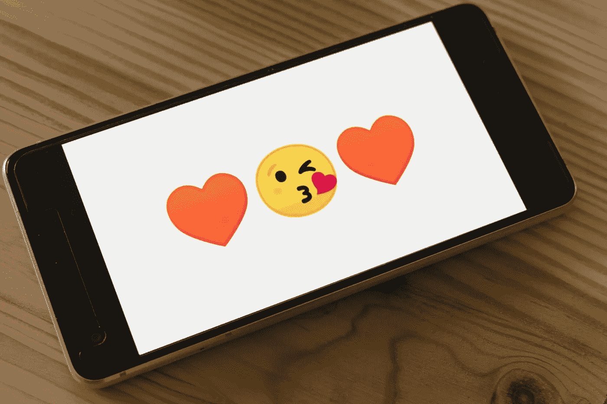
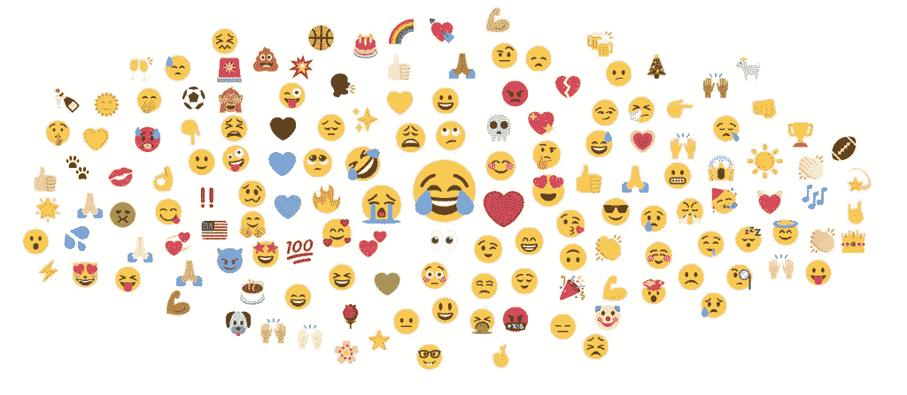
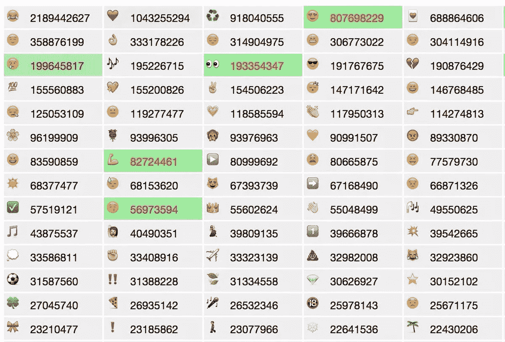

# 一个简单的微笑向世界讲述你的故事

> 原文：<https://medium.datadriveninvestor.com/a-simple-smile-tells-your-story-to-the-world-c8873a138a21?source=collection_archive---------16----------------------->

## 多面表情符号给你的信息增加了深度和情感

Photo by Markus Winkler on Unsplash

何笑脸迎人。欢笑、哭泣、深思等表情和符号构成了表情符号不断扩大的广阔世界。

如果表情符号太多了，不用担心。监管机构正在密切关注。

截至 2020 年 3 月，Unicode 标准中共有 3304 个表情符号。最近发布的表情符号是表情符号 13.0，增加了 117 个新的表情符号。该图包括性别、肤色、标志的序列以及用于创建键帽、标志和其他序列的组件。

如果你想表达一种特殊的情绪，有一个表情符号，这是[吉格内什·塔卡](https://twitter.com/socialjignesh)和[玛德琳·斯克拉尔](https://twitter.com/MadalynSklar/)非常熟悉的。社交媒体策略师 Thakkar 和数字营销专家 Sklar 都使用表情符号来表达在狭小的空间里仅靠文字无法传达的信息。

任何描述——照片、图片、视频或表情符号——都不应该仅仅用几个词来传达信息。这就是精心挑选的表情符号派上用场的地方。一个警告:确保你的选择不会被其他人解读。

 [## 发微博要有计划，而不是想法

### 沟通战略计划包罗万象，Twitter 应该在社交媒体部分发挥主要作用…

medium.com](https://medium.com/datadriveninvestor/tweet-with-a-plan-not-a-notion-a3fbe8cd88cd) 

“是的，我喜欢表情符号，因为它们超级强大，”塔卡说。“它们让我们比单纯用文字交流要多得多。

“表情符号是用来增强电子交流的一种方式，是描绘各种情绪、人物、地点和物体的小图像，”他说。“很明显，在未来几年，表情符号的使用将会增加，并在数字交流中发挥重要作用。”

# **不仅仅是文字**

Sklar 是一个表情符号的最大粉丝。

“他们说一张图片胜过千言万语，那么为什么表情符号不能如此呢？”她说。“一个简单的表情符号可以为社交媒体上的纯文本帖子增添视觉趣味和情感。

Sklar 说:“表情符号可以很容易地表达你的感受。”“在撰写帖子时，问问自己如何才能融入表情符号，以更好地传达你的感受和你想表达的观点。”

 [## 成功的词是什么？数据驱动的投资者

### 话语很重要。世界上最好的想法也会因为缺乏描述而化为乌有。无论是口头的、书面的还是传达的…

www.datadriveninvestor.com](https://www.datadriveninvestor.com/2019/11/08/whats-the-word-for-success/) 

Thakkar 强调，在数字交流中，表情符号对于翻译情绪来表达面部表情是有价值的。

他说:“表情符号让这项任务对读者和发送者来说都不那么令人生畏，而且更有趣。”他补充说，表情符号可以有多种用途:

*   通过引入讽刺或幽默来缓和气氛
*   减轻打击
*   找到一种更舒适的方式来表达自己
*   当我们说不出话的时候去交流

“使用表情符号可以提高 Twitter 的参与度，因为它们给你的推文添加了有趣的元素，”Sklar 说。“智能表情符号的使用可以抓住人们的注意力，并成为他们回复或分享你帖子的原因。”

根据 [WordStream](https://twitter.com/WordStream/) 的一项研究，与没有表情符号的信息相比，在推文中使用表情符号可以增加 25%的参与度。一般来说，表情符号有以下好处:

*   更好地吸引你的观众
*   为您的内容添加上下文
*   表示欣赏
*   注意
*   人性化你的品牌

由 [Brandwatch](https://twitter.com/Brandwatch/) 撰写的一篇文章列出了[最受欢迎的表情符号](https://www.brandwatch.com/blog/the-most-popular-emojis/)。

# **简单得令人沮丧**

“最近，可以肯定地说，任何一种代表沮丧的表情符号都得到了大量使用，”Sklar 说。

Lifewire 博客的另一幅插图显示了社交媒体上最常用的表情符号的巨大列表。

使用表情符号来添加——而不是替换——推文。在某些时候，所有的表情符号——除了表情符号什么都没有——是懒惰的交流。

“我喜欢用表情符号来吸引人们对推文特定部分的注意，”Sklar 说。“如果你有一个行动号召，使用一个像箭头一样的表情符号，将人们引向你的链接或你希望他们采取的下一步措施。”

Thakkar 建议使用表情符号可以增强推文的参与度:

*   让它变得相关。
*   要原创，要清晰。
*   用表情符号创新推文。
*   让它更有纪念意义。
*   提出问题，并在推文和帖子中使用，如在传记和回复中。
*   表达你的感激。
*   Emojify 你的品牌。
*   以一种有趣且富有表现力的方式使用。

确保表情符号对你和读者的意义是一样的。你需要清晰、明确的交流。

# **避免走极端**

Thakkar 添加了这些指针:

*   确保表情符号有意义。
*   不要轻视严重的情况。
*   与你的品牌保持一致。
*   尝试制作自己的表情符号。
*   不要让表情符号混淆了你的信息。
*   不要勉强。
*   不要发疯。

Sklar 说:“当你把某些表情符号用于你的品牌内容时，你肯定要考虑它们隐藏的含义。”“你不会想发布一些意外不恰当的信息，从而传递错误的信息。”

 [## 不要迷失在混乱的世界里

### 在社交媒体上摆出一副好面孔是凯莉·安·柯林斯的专长。她创建了 Vult Lab 来研究前瞻性思维…

blog.markgrowth.com](https://blog.markgrowth.com/dont-get-lost-in-a-chaotic-world-ba284daa7116) 

有几个来源可以选择正确的表情符号。

“这有助于你熟悉可用的表情符号，这样你就知道你可以用什么来更好地传达你的信息，”Sklar 说。“快速滚动一下，看看现在有哪些表情符号。发布新版本时保持更新。

“如果你不确定，网上资源会告诉你每个表情符号的意思，”她指着终极表情符号指南说。

Thakker 在选择表情符号时遵循自己的直觉，确保在发布之前根据需要进行检查和编辑。他推荐这些有用的来源:

*   Twitter 表情选择器
*   情绪百科
*   Skype 表情符号
*   脸书和 WhatsApp 表情符号集
*   Android 表情符号搜索

如果对你使用最多的表情符号有任何疑问，Sklar 建议使用 Twitter 的[表情符号](https://emoji.life/)，就像她使用[自己的表情符号跟踪](https://emoji.life/MadalynSklar)一样。

“根据 Emojilytics 的数据，我在两个多月的时间里用表情符号发布的推文有 24186 个赞，用表情符号发布的推文有 6135 个转发，”她说。“不确定你最常用的表情符号是什么？查看 Emojilytics 或免费。”

**关于作者**

吉姆·卡扎曼是拉戈金融服务公司的经理，曾在空军和联邦政府的公共事务部门工作。你可以在[推特](https://twitter.com/JKatzaman)、[脸书](https://www.facebook.com/jim.katzaman)和 [LinkedIn](https://www.linkedin.com/in/jim-katzaman-33641b21/) 上和他联系。

## 访问专家视图— [订阅 DDI 英特尔](https://datadriveninvestor.com/ddi-intel)