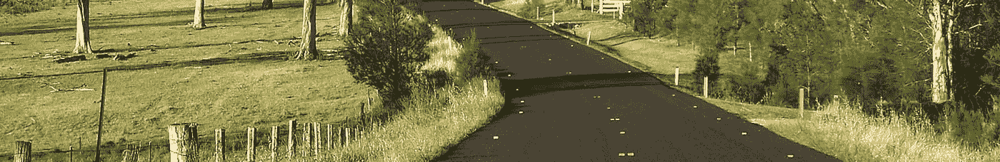

# 解释通向数据科学之路的简单方法

> 原文：<https://medium.datadriveninvestor.com/a-simple-way-to-explain-the-pathway-to-data-science-1dbb63117661?source=collection_archive---------15----------------------->

你从数据科学中获得的见解有时就像灵光一现。但是你不能让他们在你面前过夜或者推倒你面前的选择。事实上，有很多活动部件。你必须计划和协调这些点，以获得那些有价值的见解。在我看来，我们应该想象像**这样的数据科学项目沿着**的道路前进，每一步都让你更接近你心中的目标。

# 规划您的道路…

你首先需要**确定你的目标**。你试图发现或完成的是什么？这样，你就能知道什么时候你已经达到目标，或者什么时候你需要稍微调整一下。

你需要组织**你的资源**。这可能包括一些简单的事情，如获得合适的计算机和软件、访问数据、获得可用的人员和时间。

你需要**协调这些人的工作**，因为数据科学是一项团队工作。不是每个人都会做同样的事情，有些事情必须先发生，有些事情必须后发生。

 [## 成为数据科学家所需的 8 项技能|数据驱动型投资者

### 数字吓不倒你？没有什么比一张漂亮的 excel 表更令人满意的了？你会说几种语言…

www.datadriveninvestor.com](https://www.datadriveninvestor.com/2019/02/07/8-skills-you-need-to-become-a-data-scientist/) 

你需要**安排项目，**这样它就不会扩展到占用大量的时间。时间框，或者说我们将在这段时间内完成这项任务，在时间紧迫或者你有预算，并且正在与客户合作的情况下特别有用。

# 步行从这里开始…

规划之后，下一步就是扯皮或者准备数据。这意味着你首先需要得到数据。您可能正在收集新数据，您可能正在使用开放数据源，或者您可能正在使用公共 API。这里的要点是，你必须把原材料收集在一起。

下一步是**清理数据**，这是数据科学领域的一项巨大任务。它是关于准备好数据，所以它适合范式。例如，您正在使用的程序和应用程序可以对其进行处理，以获得您需要的洞察力。

一旦你准备好数据，并把它放在你的电脑上，你需要**浏览数据**。这可能需要进行可视化，做一些数字汇总；一种感受你可能从数据中得到什么样的洞察力的方法。

然后，基于你的探索，你可能需要**提炼数据**。您可能需要对案例进行重新分类。你可能需要将变量组合成新的分数。任何可以帮助你为洞察做好准备的事情。

# 评估您的途径…

数据科学道路的第三个阶段是**建模**。这是您创建统计模型的地方，如线性回归、决策树或深度学习神经网络。

然后，你需要**验证模型**。这是重要的一步。你有多清楚这将从当前数据集推广到其他数据集。当你去一个新的地方时，你不会想最后得出不成立的结论

下一步是**评估模型**。它与数据的吻合程度如何？它的投资回报率是多少？它会有多有用？

根据评估的模型，您可能需要细化模型。您可能需要尝试不同的处理方式，调整神经网络中的参数，获得更多的变量以包含在您的线性回归中。

最后，数据路径的最后一部分是应用模型，这包括展示模型，向其他人、决策者、投资方、客户展示你学到的东西。因此，他们知道你发现了什么。

# 重复旅程(从显性到隐性)…

然后部署模型。例如，您创建了一个推荐引擎。你可以把它放到网上，这样它就可以开始向客户提供这些建议，或者你可以把它显示在一个仪表板上，这样它就可以开始向你的决策者提供建议。您最终将需要重新访问该模型，并查看它的执行情况，尤其是当您有新数据并且可能有它运行的新环境时。

此外，你可能需要修改它，并再次尝试这个过程。最后，完成上述所有工作后，您需要归档资产，自己清理数据。这是数据科学中一个关键的学科。它包括记录数据的来源和处理方式。它包括对你用来分析的代码进行评论，也包括让事情经得起未来的考验。所有这些加在一起可以使项目更成功，管理起来更舒适，更容易得到投资回报的计算。总的来说，只要每个人都按照上面提到的步骤去做，这个项目就会更加成功。

综上所述，这些步骤会让你达到目标。这可能是你徒步旅行结束时的一个惊人的视角，也可能是对你的商业模式的一个奇妙的洞察，这是你一直以来的目标。

**来自作者**:我欢迎你对异花授粉学习的想法和反应。请随意为我喜欢的博客鼓掌。这是我继续写博客的巨大鼓舞！