# 理解角度绑定的简单方法

> 原文：<https://medium.datadriveninvestor.com/a-simple-way-to-understand-angular-bindings-13fdb24ff94c?source=collection_archive---------10----------------------->

## 让我们来谈谈角度类绑定、样式绑定和事件绑定


Photo by [Maxwell Nelson](https://unsplash.com/@maxcodes?utm_source=medium&utm_medium=referral) on [Unsplash](https://unsplash.com?utm_source=medium&utm_medium=referral)

**类角度绑定**

Angular 类绑定用于在 HTML 元素中添加或删除类。您可以有条件地将 CSS 类添加到元素中，从而创建动态样式的元素。Angular 提供了三种向元素添加类或从元素中移除类的方法

*   类名
*   班级
*   ngClass

在这个例子中，我正在使用内嵌样式模板。如果要为 h2 元素添加样式，可以使用 CSS 类选择器后跟属性。

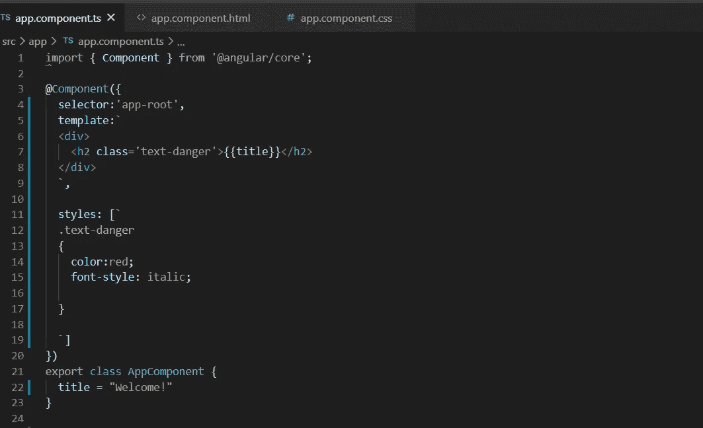

app.component.ts

让我们看看如何对 HTML 元素应用角度类绑定

使用类

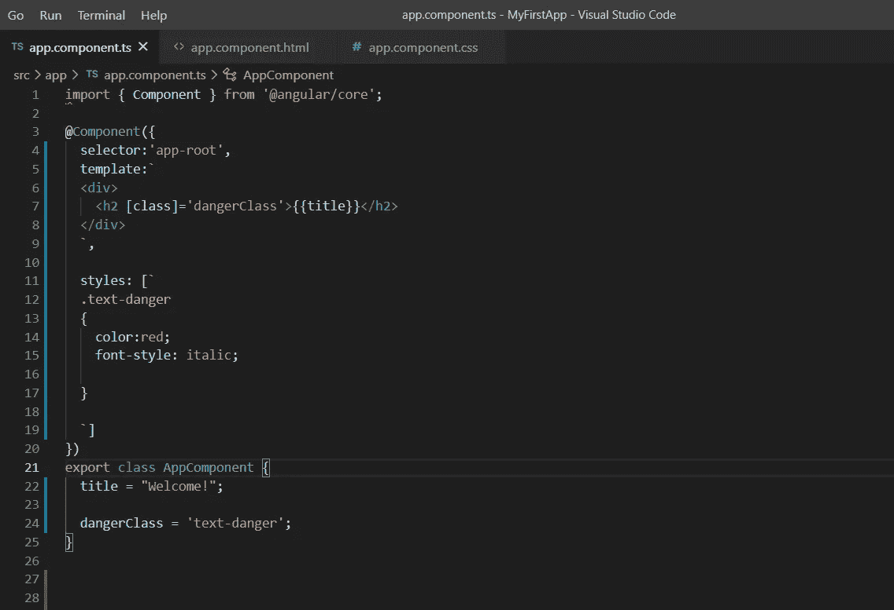

app.component.ts

使用类名

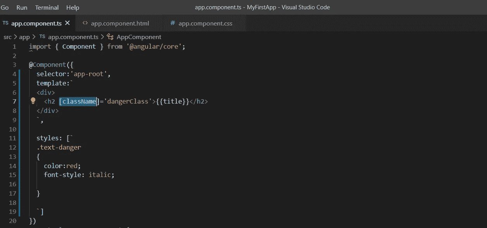

app.component.ts

使用 ngClass(C 应该是大写)

如果您希望对单个 HTML 元素应用多种样式，这很有用。为此，让我们创建一个对象 myClass，并从 CSS 中分配属性。

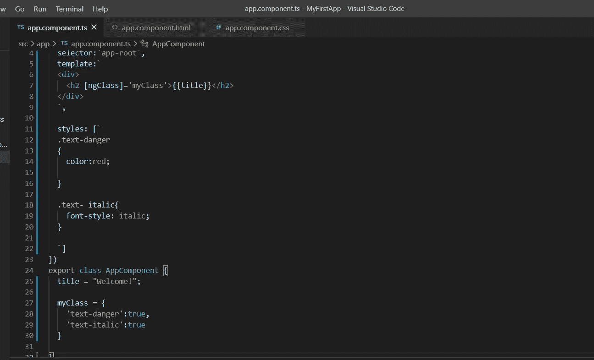

了解如何有条件地应用类。所以，我将取一个变量 hasError，用布尔值“true”初始化。

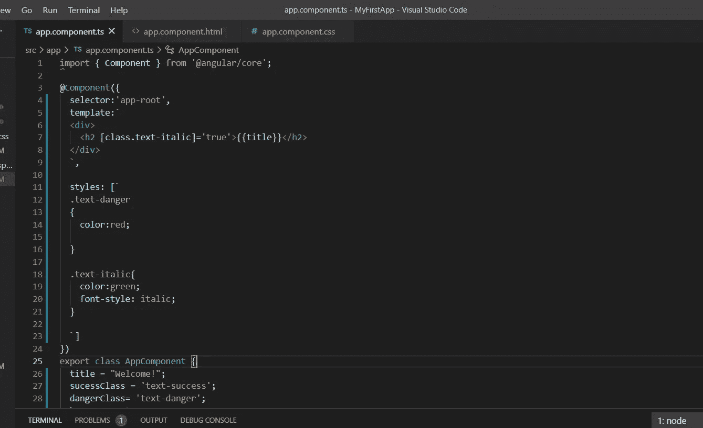

app.component.ts

使用绑定类

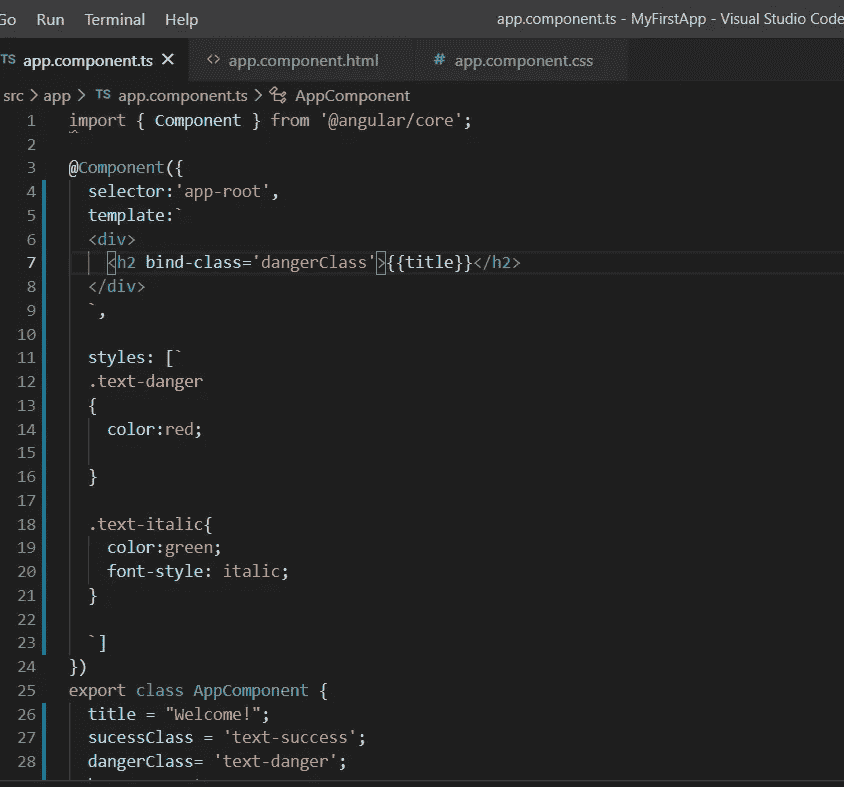

app. component.ts

**风格棱角分明的装帧**

我们可以使用 angular 中的样式绑定来设置 HTML 元素的内联样式。语法类似于属性绑定的语法。您可以有条件地向元素添加样式，从而创建动态样式的元素。

```
[style.style-property] = “style-value”
```

样式绑定使用[ ]括号。将 CSS 样式属性(绑定目标)放在方括号内。CSS 样式属性必须以“Style”开头，后跟一个点(。)然后是样式名。

**注意**:要对单个 html 元素应用多种样式，请使用 ngStyle

方法 01:

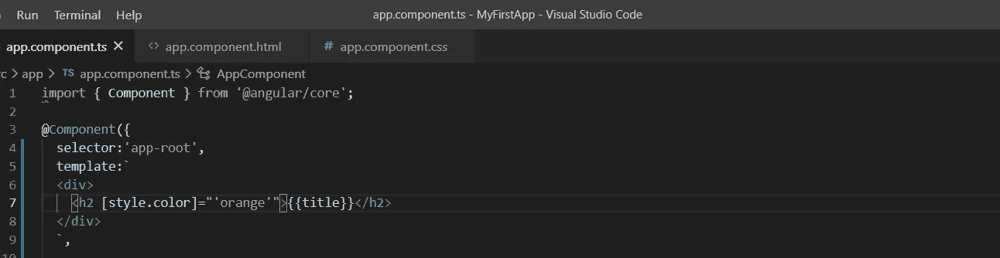

app. component.ts

方法 02:

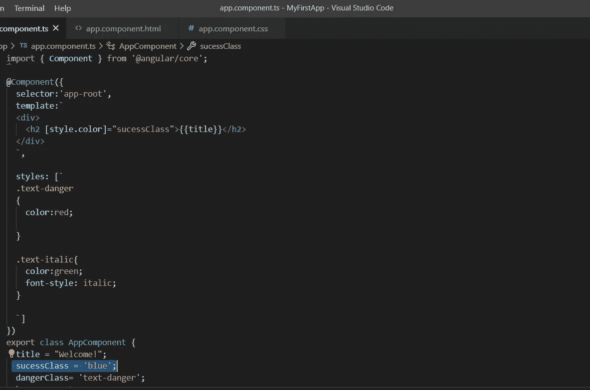

app. component.ts

方法 03:如何有条件地应用样式。(如果条件为真，则应用该样式)

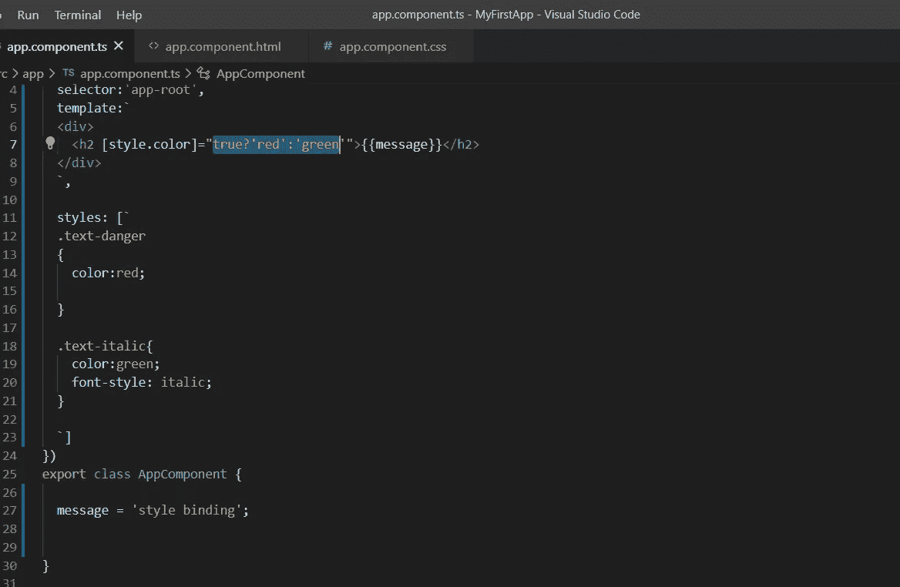

app.component.ts-If true

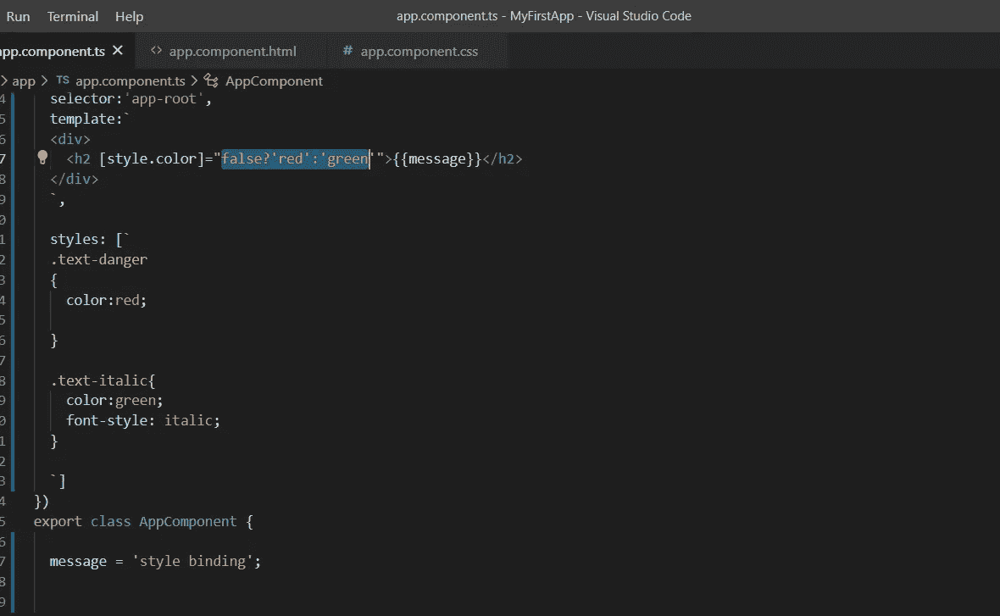

app.component.ts -If false

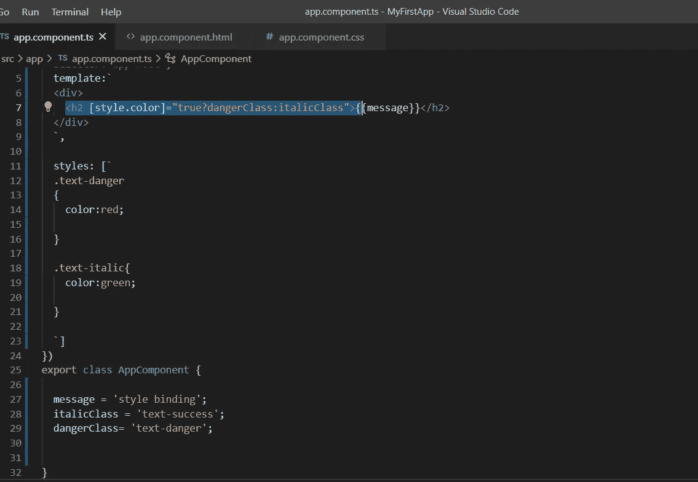

app.component.ts-Using conditional classes

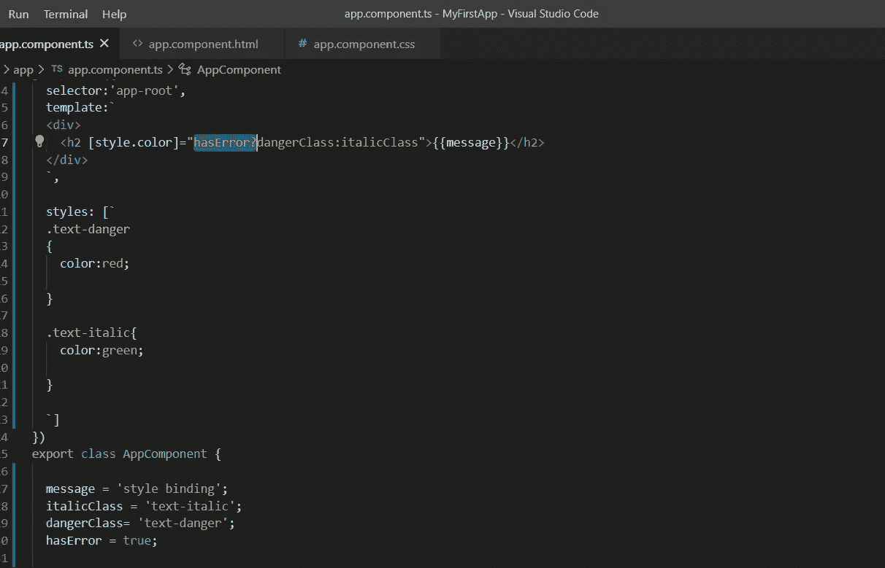

app.component.ts -applying haserror instead of true or false

让我们看看如何一次对一个 HTML 元素应用多种样式。这是通过使用 ng 样式属性来完成的。让我们创建一个名为 myStyles 的对象。

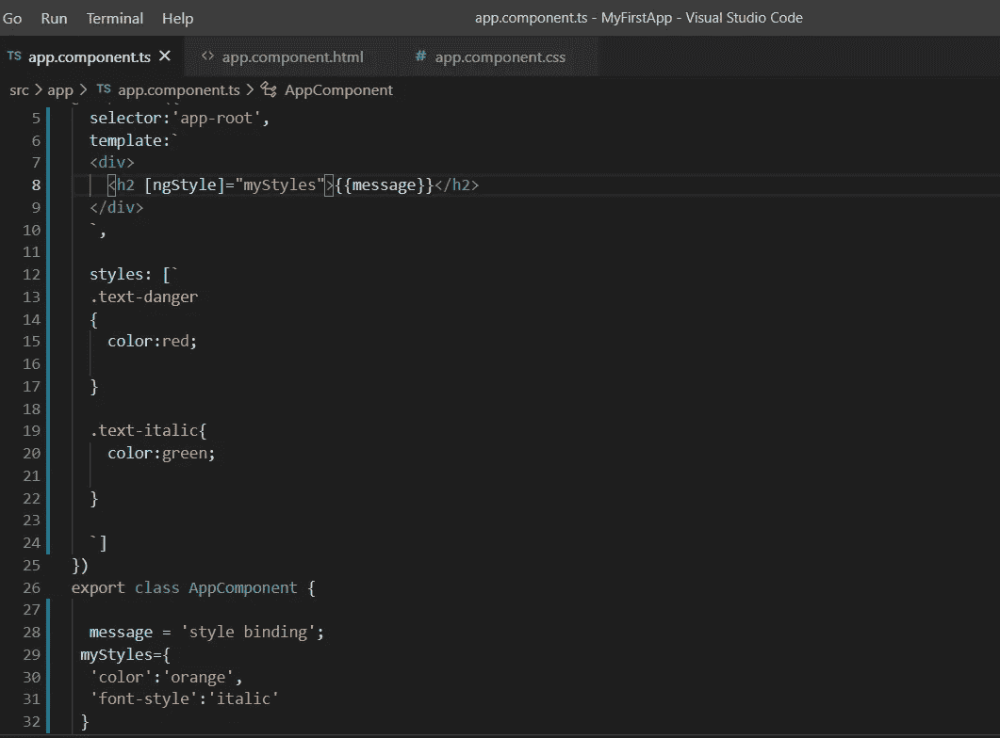

app.component.ts

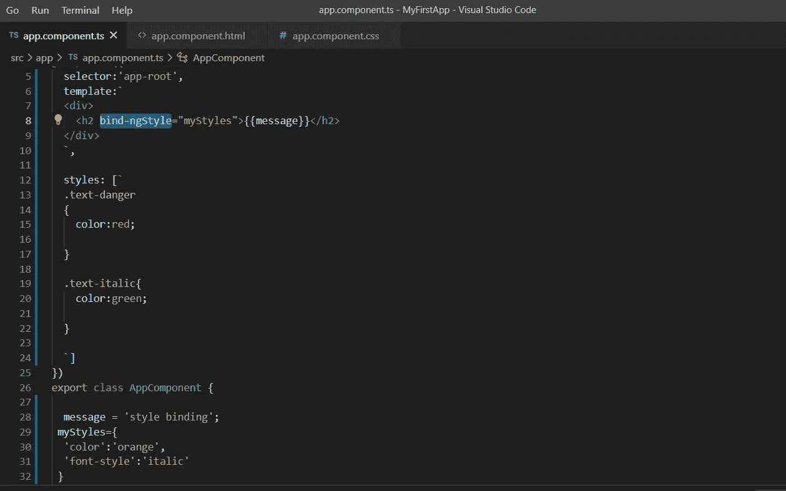

app.component.ts-use bind-ngstyle instead of [ngstyle]

**事件绑定角度**

事件绑定允许我们将击键、点击、悬停、触摸等事件绑定到组件中的方法。这是从视图到组件的一种方式。通过跟踪视图中的用户事件并响应它们，我们可以保持组件与视图同步

例如，当用户更改文本框中的输入时，我们可以更新组件中的模型，运行一些验证，等等。当用户提交按钮时，我们可以将模型保存到后端服务器。

```
<target-event)="TemplateStatement"
```

示例:

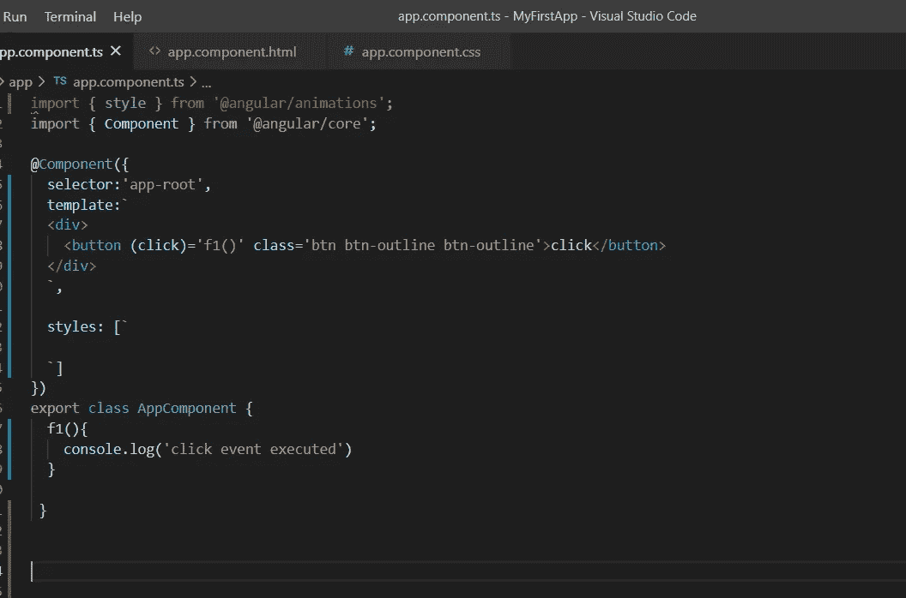

app.component.ts

**$event PayloadDOM**

事件携带事件负载。即关于事件的信息。我们可以通过使用$event 作为处理函数的参数来访问事件负载。$event 对象的属性因 DOM 事件的类型而异。请记住，您需要在模板语句中将变量用作$event。

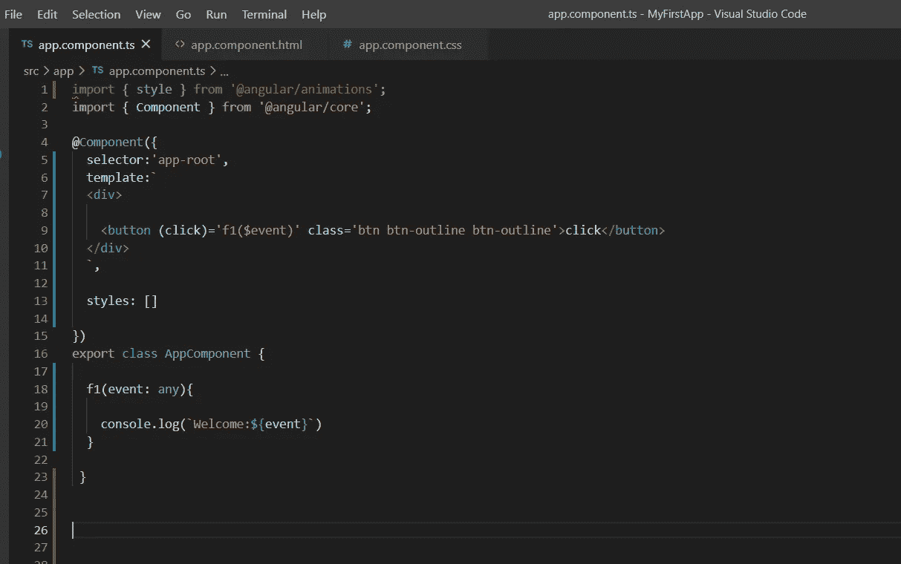

app.component.ts

**模板参考变量**

我们还可以利用模板引用变量来传递值，而不是$even。模板引用变量以#符号开始。

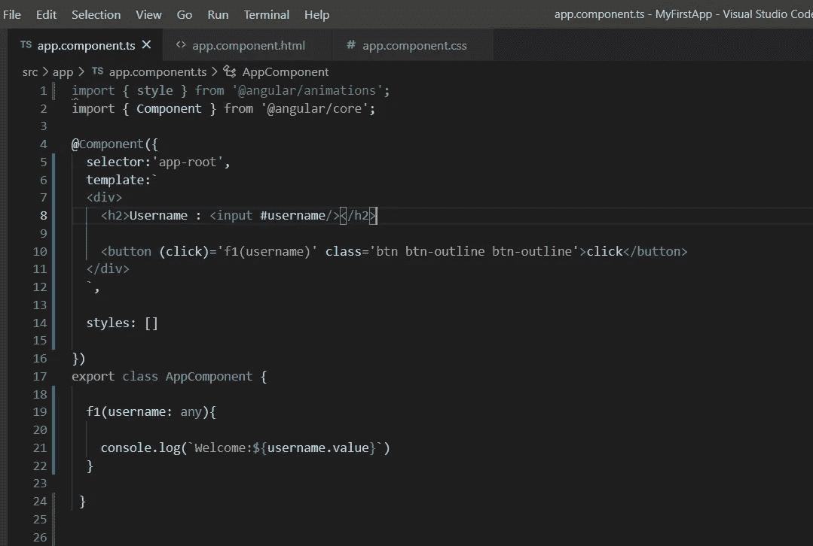

app.component.ts

编码快乐！

**进入专家视角—** [**订阅 DDI 英特尔**](https://datadriveninvestor.com/ddi-intel)