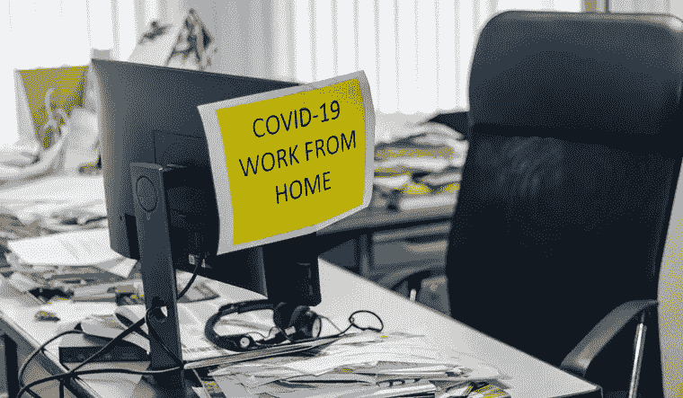
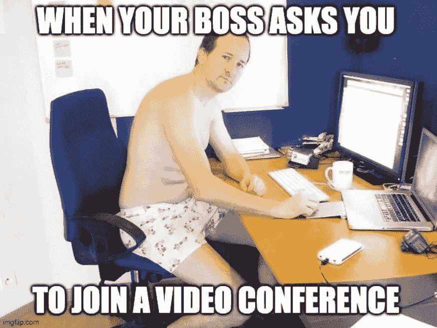

# 软件工程师的生活:在家工作反思

> 原文：<https://medium.datadriveninvestor.com/a-software-engineers-life-work-from-home-reflection-f3410533786f?source=collection_archive---------26----------------------->

## 偏远的生活是多么放松或紧张…

The messy workplace

那是 2020 年 3 月的一个晚上，我收到了一个 Outlook 通知，主题是“新冠肺炎:在家工作公告”。就这样。一切，包括个人生活，从此都变得遥远。

> "你认为远程工作和体力工作有什么不同？"、“你的通勤时间永远节省了吗？”、“你现在是怎么管理时间的？”以及“现在的生活是变好了还是变坏了？”。这些是许多人问我的一些常见问题。

虽然硬币有两面，但我希望反映出对我目前面临的情况的诚实观察。

# 身体活动

在办公室工作和在家工作是完全不同的。

我记得我通常在上午 10:45 左右到达工作地点，与同事闲聊几句，然后在上午 11 点开始工作。虽然我过去常常花大约 1 小时 45 分钟通勤(我同意这是完全疯狂的！)，我开始意识到这是为了好。通勤虽然很累，但也迫使我锻炼身体，并让我思考除了工作以外的事情，这是我目前在 WFH 看不到的。午饭后和你的同事散散步真的可以让你在接下来的半天集中注意力。

目前，这 105 分钟被我的工作量所补偿，我需要为我的身体健康削减额外的时间(这真的很难:/)。

# 沟通与协作

有人说伟大的想法源于伟大的物理协作，这是对的。

> “单独我们能做的很少；我们一起可以做很多事情。”—海伦·凯勒

虽然只需轻触一个按钮就可以轻松实现远程连接，但人们并没有真正感受到在办公室中观察到的那种连接感。有时恰恰相反——导致孤立。Eric Schmidt 在他的书[“Google 如何工作”](https://books.google.co.in/books/about/How_Google_Works.html?id=Yk9zAwAAQBAJ&redir_esc=y)中，生动地描述了工作场所的活力和结构如何在塑造协作中发挥关键作用。肢体互动时，手势是不清晰交流的救星之一。而在在家工作的场景中，这是大多数时候的情况。

或者更像是…

> 虽然随意的谈话有时会很有趣，但远程学习会耗尽身体和精神上的能量，特别是当一个人没有足够的背景知识或交流一些重要的事情时，尤其是当日历上排满了会议时。

尽管有各种各样的技巧和诀窍来使它成为一个更好的过程并减轻其局限性，但它最终永远不会像预期的那样工作。

# 分心增加

这是在家工作时不可避免的事情——孩子、配偶、宠物等等！虽然你可能至少会担心你的老板会盯着你的工作，并不断询问你的最新情况，但远程工作却不是这样。

工作和生活之间频繁的环境转换会导致精力消耗的比预期的要快。除了身体上的干扰，还有各种各样的电子干扰肯定会激怒你，因为你离得很远。每个人的家庭工作场所都是不同的，他们控制干扰的能力也是不同的。但是，如果员工经常分心，他/她可能不适合远程工作。

# **收工**

当我去办公室的时候，不管情况如何，我都会在下午 6 点停止工作。但现在，我无法做到这一点，经常发现自己检查最后的事情，发送工作邮件，直到晚上 9 点。有时，参加会议直到晚上 11 点！一个人必须非常小心，否则精神疲惫很容易接管，从而导致工作和生活平衡的下降。必须严格遵守时间管理。

# 你只需要知道

所以，回到之前问我的问题:

> 1.你认为远程工作和体力工作有什么不同？—如以上几点所述。
> 
> 2.你的通勤时间永远节省了吗？—没有。
> 
> 3.你现在如何管理你的时间？—大部分是工作，部分是课外活动。
> 
> 4.现在的生活是变好了还是变坏了？—接近中性

无论我们是走向混合生产力模式还是长期在家工作，以上都是远程工作的一些残酷现实，在某个时间点肯定会经历。正如一枚硬币有两面一样，远程工作对他们中的一些人来说无疑是一杯咖啡。虽然每个人都有自己独特的处理事情的方式，但重要的是要认识到，在家工作并不像听起来那样美好，自律并不适合每个人。

**改善远程工作的关键要点**

*   无论在什么情况下，都要严格遵守 ***时间管理*** 。分配时间表。有大量的生产力应用程序。如果你的工作需要更多的关注，除非非常紧急，否则试着把它安排在第二天。没人会杀你。
*   ***日常锻炼*** 保持良好的体能。中间偶尔休息一下，以免精疲力尽。记住，*健康就是财富！如果你损害了健康，你的公司不会感到遗憾。*
*   不断检查你的 ***情商。如果得不到照顾，在家工作很容易使其退化。***
*   和你爱的人一起度过 ***优质时光*** 。不管在工作中是否得到提升或赏识，职业生涯都是有限的。你所爱的人是那些会与你同甘共苦的人。

总而言之，在家工作需要大量的调整和学习。这种反映仅仅是基于我的经验；这可能与其他远程工作的人不同。我很想听听你对此的回应:)

> 感谢阅读到帖子末尾！我喜欢分享信息，希望能帮助外面的人。我会写更多，你的支持将意味着很多！如果你喜欢我的作品，就点击[媒体](https://abishaik.medium.com/)上的关注按钮。在 LinkedIn[LinkedIn](http://linkedin.com/in/abishaik-mohan-90513013a)、[脸书](https://www.facebook.com/abishaik.mohan.144/)或 [Twitter](https://twitter.com/AbishaikM) 上与我联系，获取任何关于技术或帮助的指导或讨论。

**感谢您的阅读，祝您度过美好的一天！**