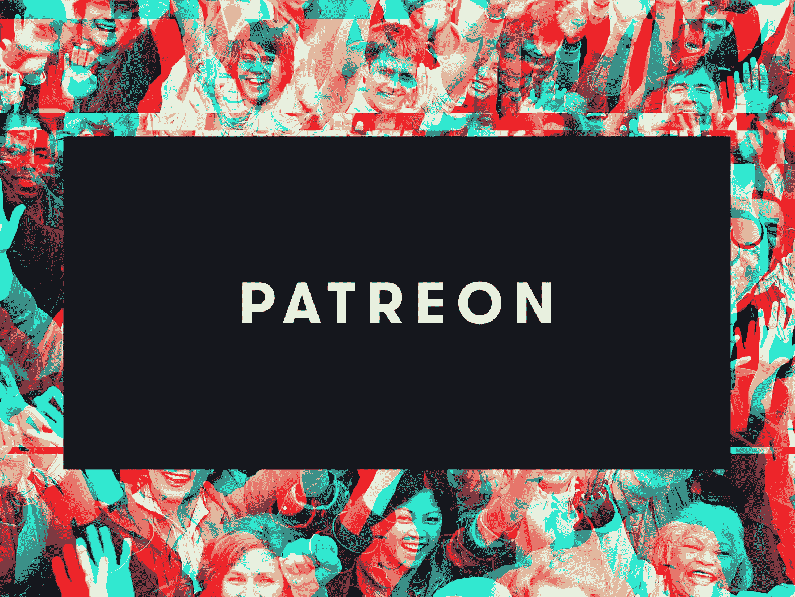

# 从一个 YouTuber 到全球最大创作者平台的创始人。下面是帕特里翁的故事。

> 原文：<https://medium.datadriveninvestor.com/a-startup-that-pays-more-than-1-billion-to-creators-e830685b09ec?source=collection_archive---------13----------------------->

## 以下是创建世界上最大的创造者平台所需的条件。

Photo by [Gabriel](https://unsplash.com/@natural?utm_source=medium&utm_medium=referral) on [Unsplash](https://unsplash.com?utm_source=medium&utm_medium=referral)

如果你是一名艺术家并创作任何类型的内容，你会知道写下你最好的作品、展示你最好的舞蹈或上传你最好的视频是什么感觉。你们都兴奋地面对摄像机，摄像机会在第二天出现在你们家，看下一个 JK 罗琳、迈克尔杰克逊或凯西·奈斯塔特。

但是这些都没有发生。是吗？

你在那件事上投入了数周、数月、数百小时，希望它会爆炸。但那只是你的期望，没人在乎你是谁。

你获得了 100 万的浏览量，100 万的赞数和 100 万的粉丝，却没有能力支付账单。那会是什么感觉，你还愿意花这些时间去创作你曾经创作过的最好的艺术作品吗？

我们大多数人都不会。但杰克·康特做到了，下面是他如何创办 Patreon 的故事。

# 帕特里翁之前

杰克·康特从斯坦福大学毕业后，想写音乐。他创作了一些专辑、乐队和音乐视频，但只有少数获得了阳光。

他曾经和他的朋友一起制作粘土动画，花费数周和数百个小时来制作几秒钟的动画。他是一名演员，为模拟人生 2 录制声音，然后他组建了自己的乐队，名为“现在我们有脸了”。他去城市，酒吧，演奏音乐，但是没有人出现。有一次在一个 500 人的酒吧里，他独自一人演奏。

在这种情况下，我们大多数人都会放弃，但他对音乐的痴迷和热爱让他保持动力。他创建了一个名为“T2”的乐队，该乐队迅速走红，他们的一场演出场场爆满。人们不得不站在会场外面听他们的音乐。

这是杰克·康特在一长串失败中的一次成功。

随后，杰克开始着手另一个项目，他必须复制《星球大战》中标志性的千年隼的控制面板。为了这个项目，他花了大约 50 天每天 18 个小时来完善它。他痴迷于制作一部完美的音乐录影带，花光了他的积蓄，刷爆了他的信用卡，只为了看到他的梦想成真，并助长他的痴迷。

在一个他知道他的粉丝会喜欢的视频上投入如此大的努力，却只能让他赚几百美元，这对他来说是无法忍受的。

请想一想。你把你的整个心灵、灵魂、积蓄、努力和时间都放在了某件事情上，而你不会得到任何金钱上的回报。有些人讨厌把艺术和金钱联系在一起，但是他们忘记了把食物放在桌子上是必要的。

帕特里翁就是这样诞生的。

它为创作者提供了一个平台，真正的粉丝可以在每月订阅的基础上为创作者做出贡献。创作者可以创建几个包，在幕后提供独家内容，近距离观察他们的创作之旅。这种模式允许创作者在获得月薪的同时保留他们的创作自由，粉丝可以近距离了解他们的创作者的旅程。

# 订阅模式

Made with Canva and Patreon brand assets

在 YouTube 上发布那个“踏板”视频的时候，杰克在最后为他的粉丝放了一个小视频。他通过访问一个名为[Patreon.com](https://www.patreon.com/)的网站来鼓励他的粉丝支持他。在这里，他的粉丝可以为每一个即将到来的视频做出贡献，他们承诺总共捐赠超过 5000 美元，比 100 美元的广告收入好得多。这是 2013 年 5 月 7 日。

**让我们回到几个月前。**

2012 年 2 月，当杰克在制作他的“踏板”音乐视频时，他知道这会耗尽他的现金，最后只收到 100 美元只是让他心痛。他知道他的一些粉丝会愿意支持他的每一个项目。他在纸上记下了自己的想法，并联系了他的老室友 Sam Yam，因为 Jack 没有技术背景或编程经验。

毕业后，萨姆加入了社交地图初创公司 Loopt。Loopt 收购后，Sam 创办了 Adwhirl，后被 AdMob 收购。在接下来的几年里，萨姆尝试了一些新颖的创业想法，最终登陆了我们的自由摄影师市场 OurSpot。2013 年 3 月 6 日，Sam 和 Conte 在一家咖啡店见面，讨论关于 Patreon 的事情。由于萨姆已经有了自己的创业想法，他并没有太在意，但当杰克提出他的想法时，萨姆情不自禁地爱上了这个想法。

从那天起，萨姆开始编写帕特里翁的代码。经过许多不眠之夜，把他的办公桌当成自己的床，帕特里翁还活着。杰克·康特发布了他的“踏板”音乐视频，每部视频可以获得 5000 美元。看到 Jack 和平台的成功，很多其他内容创作者也加入其中。

但这并不是结束。他们仍然需要资金。对于第一轮融资，他们设定的目标是 70 万美元。在几次被拒绝后，Yam 联系了之前拒绝过我们节目的 Josh Felser。Josh Felser 的公司 Freestyle Ventures 于 6 月 12 日正式承诺投资 70 万美元，进行 550 万美元的前期评估。CRV 帕洛阿尔托办事处的合伙人萨尔·古尔听说了帕特里翁。起初，他对 Patreon 并不特别感兴趣，因为他一直在评估各种众筹初创公司，而 Patreon 在指标方面并不突出。但看到杰克·康特音乐视频的幕后视频后，他知道他们是敬业的，有创业能力的。

到 2013 年 8 月，Patreon 从 Alexis Ohanian(Reddit 的联合创始人)和风险投资公司如 Freestyle Capital、CRV、Garry Tan 等人那里筹集了 210 万美元。2014 年，帕特里翁从 17 位支持者那里筹集了 1500 万美元，丹尼·里梅尔成为主要投资者，并与萨姆和杰克一起获得了董事会席位。

Patreon 曾经从给创作者的钱中抽取 5%来运营。一些支持者表示有兴趣将费用从 5%改为 10%，并在一夜之间将收入增加一倍，但这违背了 Patreon 的创始原则，杰克避开了这类投资者。

目前，Patreon 有 3 个层次，为其创作者提供选择。有 5%的 lite 计划、8%的 pro 计划和 12%的 premium 计划，每种计划都有更多额外津贴。

**Patreon 目前每月有 500 万活跃用户和 15 万多名创作者。自 2013 年以来，Patreon 已经向 Patreon 创作者支付了超过 10 亿美元。**

值得注意的是，Patreon 不同于任何其他初创公司。这不是为了赚更多的钱或获得更多的观众、订户或读者。相反，它只是为创作者提供一个更密切地与粉丝联系的平台，并直接从真正的粉丝那里获得收入。

> “我看到许多公司成长起来，却忘记了他们是从哪里开始的，并且他妈的忽视了他们的用户……我很害怕 Patreon 会发生这种事情。”——杰克·康特

**我从这个故事中学到了一个巨大的教训:努力工作、决心和努力是没有借口的。**

找到解决自己问题的方法是创造新事物的最好方式。你会全身心的投入进去，不需要任何外在的动力。

做自己是一个人应该学习的最好品质。假装，直到你做到了，时间已经过去，任何人都可以看到你的真实意图。

[我的纪录片风格 YouTube 视频专题](https://youtu.be/LN54KeRkvPo)

## **必看**

[杰克·康特的演讲](https://www.youtube.com/watch?v=Zf5rKTCMNnU&t=226s)