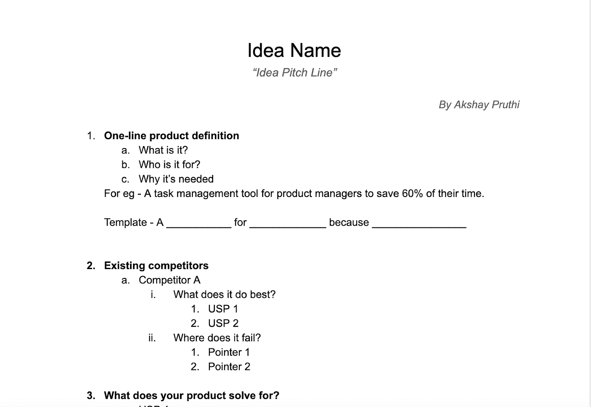
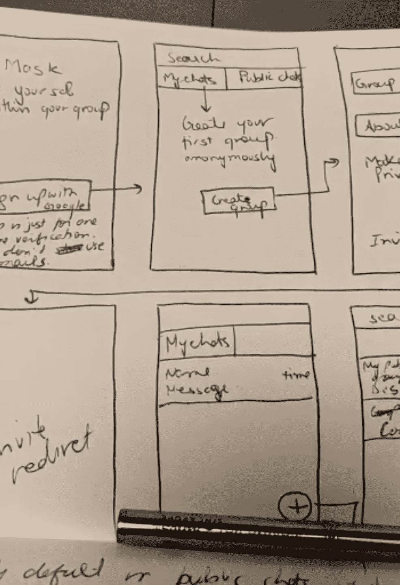
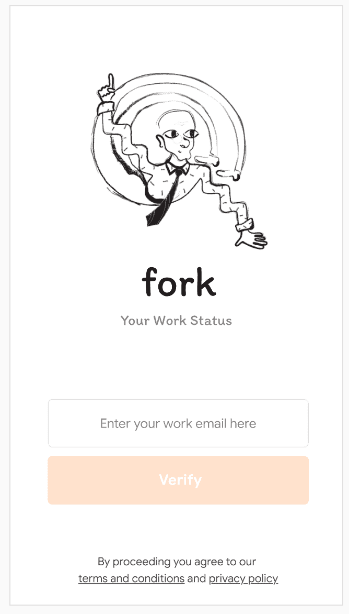

# 成功启动 MVP 的逐步指南

> 原文：<https://medium.datadriveninvestor.com/a-step-by-step-guide-towards-launching-a-successful-mvp-de7022a0c1e1?source=collection_archive---------14----------------------->

大量产品在发布后就夭折了。有些人花了很长时间才推出“完美产品”，不管这意味着什么。在过去 6 年的职业生涯中，我推出了 8 款产品，其中只有两款达到了 100 万 DAU 大关。在经历了这些产品的成功和失败之后，我创建了一个成功发布产品的剧本。

## 第一步:不要爱上新产生的想法。还没有。

一旦我们有了一个想法，我们大多数人都会爱上它。我们太执着了，以至于我们经常会找到这样的事情会成功的理由。

每当我有了一个令我兴奋的想法，我会立即记录下来。

[文件的结构在这里](https://docs.google.com/document/d/1D-La8HY0Aar8mZlVIHuiuOALj_4gn0Wb5rple5fadlo/edit?usp=sharing)

这份文件对我来说就像圣经一样。我把所有的信息都放在这里，积极的反馈，消极的反馈，用户研究，愿望清单

## **第二步:释放你的兴奋。跳转到线框**

使用问题陈述作为你的指路明灯。当你在构思或获取用户反馈时，你的方向会不断改变。只有一个办法可以阻止它。

回到问题陈述。问题陈述是对问题的简明描述，它填补了应该发生的事情(将来的情况)和实际发生的事情(现在的情况)之间的空白。

**定义问题陈述的简单模板是:**

> “x”目标用户需要一种方式来满足“Z-insight”显示的“Y-需求”

一旦你有了你的问题陈述，用它来为你的想法创建线框。

快速破解:用铅笔和纸制作线框。不要追求完美。这只是开始。不要在它上面投资太多，这样你就不会被线框图缠住。

我正在开发的一个应用程序的线框看起来像这样:

## **第三步:与你的网络分享线框，你的网络也是你的目标受众**

这是你与 10 位潜在客户分享线框图的时候了。为了做好这件事，我遵循以下方法:

1.  我请客户看一下线框，并向我描述产品的功能
2.  我一直注意概念说明文档中的所有反馈。
3.  你不需要告诉你的顾客产品是做什么的。接受反馈就好。这是至关重要的。想法是不要在你的客户头脑中产生任何偏见。

例如，我正在开发的一个产品是一个工作状态应用。但是当我开始从我的潜在客户那里得到反馈时，我发现他们认为这只是一个用于任务管理的花哨的 excel 表格。这是改进我的原型的关键。

 [## 后 COVID 世界中具有前瞻性思维的虚拟财富管理顾问|数据驱动…

### 随着世界范围内病例数量的持续上升，新冠肺炎绝不是一个过去，但是我…

www.datadriveninvestor.com](https://www.datadriveninvestor.com/2020/07/28/virtual-wealth-management-with-forward-thinking-advisors-in-a-post-covid-world/) 

## **第四步:在反馈中寻找模式**

回到概念说明，浏览反馈。寻找模式。寻找人们经常谈论的话题。不管那是什么，那是你的定位。这就是人们现在对你的想法的看法。

## **第五步:原型制作时间。你一直在等待的。**

虽然很多人不太推荐，但我更喜欢在高保真设计中创建原型。我是一个快速的设计师，所以这很有帮助。

这是你努力使**信息适应市场的地方。这是我们大多数人都不会做的事情。你在原型上写的每一个字都定义了人们会如何看待你的产品。在副本上工作。花一整天的时间来复制你的产品。**

[例如，这是我在](https://xd.adobe.com/view/30fbda54-1c63-400a-8781-f53b0f21a408-65a8/)时做的一个原型。

我该写“你的工作状态”还是“和日常单口相声说再见”。这两者在使用者的头部产生不同的定位。所以对你来说，重要的是要像应用程序在和客户对话一样处理文案。

## **第六步:分发。获取反馈。迭代。**

是时候向同样的 10 个人分发原型并收集他们的反馈了。同样，在反馈中寻找模式。寻找模式很重要，因为这有助于你决定大多数人的想法。

## **步骤 7:创建一个只邀请测试用户的列表。**

为了成功的产品发布，你需要发现你的目标客户，了解他们的需求，并知道如何与他们沟通。作为一种习惯，在推出任何产品之前，我会创建一个单页的网站，清楚地描述我的产品是做什么的，它是为谁设计的，以及它将如何对你有所帮助。该网站必须有一个用户加入的等候名单。这有助于打破我的泡沫(如果有的话),并创造我的第一批客户，他们可以帮助我对产品给出诚实的反馈。

## **第八步:开始编码**

这是您将设计移交给开发人员并开始为产品编码的地方。重要的是花尽可能多的时间围绕产品做研究。它有助于了解对你产品的需求。

## **第九步:让早起的鸟儿有特别的感觉**

一旦你准备好了产品，就开始把它分发给对你的产品感兴趣的用户群。写一封个性化的电子邮件，欢迎他们使用产品，让他们觉得自己很特别。灌输一些产品反馈循环，因为这将是你在改进产品的同时贴近客户的最佳时机。

希望这有所帮助:)

**进入专家视图—** [**订阅 DDI 英特尔**](https://datadriveninvestor.com/ddi-intel)