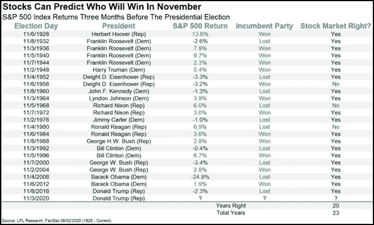

# 自 1984 年以来，这是一个正确预测美国总统选举结果的股票市场指标

> 原文：<https://medium.datadriveninvestor.com/a-stock-market-metric-that-has-correctly-predicted-the-united-states-presidential-election-results-4ffcf3023a5e?source=collection_archive---------20----------------------->

## 对于即将到来的选举来说，这是正确的吗？

Photo by [Jonathan Simcoe](https://unsplash.com/@jdsimcoe?utm_source=medium&utm_medium=referral) on [Unsplash](https://unsplash.com?utm_source=medium&utm_medium=referral)

股票市场是上市公司股票买卖和发行的交易所的集合。当谈到衡量股票市场的表现时，特别是在美国，保持这一角色的关键指数是标准普尔 500 指数。

标准普尔 500 是美国 500 家最大上市公司的市值加权指数。自 1984 年以来，标准普尔 500 的表现是正确预测美国总统选举结果的股票市场指标。

2020 年美国总统大选将在共和党现任总统唐纳德·特朗普和民主党前副总统乔·拜登之间进行。根据[最近的民调](https://www.investors.com/news/trump-vs-biden-poll-favors-democrat-after-debate-ibd-tipp-presidential-poll/)，拜登以 51%比 44%领先川普。问题是，到 2020 年 11 月 3 日，这种情况是否会持续下去。

2020 年 3 月，由于新冠肺炎的抛售，标准普尔 500 达到了 2304.92 的显著低点，但自 2020 年 10 月 26 日以来反弹至 3402.01。标准普尔 500 的表现最重要的方面是它在选举前 3 个月的表现，这次选举将于 2020 年 8 月 3 日开始。

据领先的独立金融和投资指导公司 [LPL 研究](https://www.lpl.com/about-Us.html)称，如果标准普尔 500 指数在选举日前 3 个月上涨，执政党往往会获胜。如果标准普尔 500 指数在选举日之前的 3 个月内下跌，反对党往往会获胜。LPL 研究公司的下表有助于对此进行分解:

正如你所看到的，从 1928 年到 2016 年，标准普尔 500 在预测谁将赢得总统大选时只错了 3 次。值得注意的是，1957 年以前的数据包括了 1926 年建立的 S&P 90。1957 年，S&P 90 扩展到 500 家公司的形式，就是我们今天所知道的标准普尔 500。从 1984 年到 2016 年，标准普尔 500 一点也没错。

从 2020 年 8 月 3 日到 2020 年 10 月 26 日，标准普尔 500 上涨了约 3.3%。在这种情况下，根据我们目前掌握的数据，执政党有望获胜。这意味着仅仅基于标准普尔 500 的表现，唐纳德·特朗普将有望赢得 2020 年美国总统大选。

下周 S&P 会大幅下跌吗？尽管自 1984 年以来，标准普尔 500 对总统大选的预测一直是正确的，但由于新冠肺炎疫情的爆发以及川普的处理方式，这场即将到来的选举在研究人员和分析师眼中一直被视为掷硬币。

下周二，就是 11 月 3 号。如果标准普尔 500 到 11 月 3 日还在上升，那么再次预测总统选举结果是否正确？我们将拭目以待，看看标准普尔 500 32 年来连续正确预测总统大选的势头是会继续还是会结束。

[查看 Tunji 信，保持联系](https://tunji.substack.com/)。