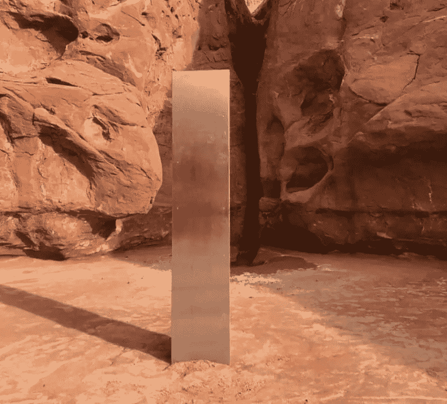

# 一名直升机机组人员在犹他州沙漠发现了一块奇怪的金属块

> 原文：<https://medium.datadriveninvestor.com/a-strange-metal-monolith-has-been-discovered-in-the-utah-desert-by-a-helicopter-crew-164cd3544606?source=collection_archive---------8----------------------->

## 太 2020 年了

> 野生动物官员在美国东南部偏远地区的一次天桥上数羊时发现了这个“不寻常”的物体。
> 
> 他们说这个建筑被种植在红岩之间的土地上。
> 
> 没有迹象表明是谁安装了这块大约 10 到 12 英尺(3.6 米)高的巨石。
> 
> 直升机飞行员布雷特·休金斯在接受当地新闻频道 KSLTV 采访时说:“这是我多年飞行生涯中遇到的最奇怪的事情。”

从[https://www.bbc.com/news/world-us-canada-55056570](https://www.bbc.com/news/world-us-canada-55056570)

2020 年发生了奇怪的事情。为了结束这一年，一名机组人员在飞越此地时发现了一块奇怪的金属巨石。

我不禁想起电影 **2001:太空漫游**。这是一部 1968 年由斯坦利·库布里克制作和导演的史诗科幻电影。

 [## 为什么这个消息让你焦虑？数据驱动的投资者

### 疾控中心称，案件数量远高于美国部分地区报道的数字——纽约时报持枪歹徒持有炸药…

www.datadriveninvestor.com](https://www.datadriveninvestor.com/2020/07/31/why-is-the-news-making-you-anxious/) 

有一个场景，我们所谓的祖先也遇到了一块巨石。我知道接下来会发生什么，因为我每次想看电影的时候都睡着了，但在我看来，电影的开头，整块石头的场景和那首歌是电影史上最壮观的场景。

如果你想记起来，请看

## 但是回到犹他州的巨石柱

我们还不知道它是什么，这就给各种猜测留下了空间。
这里有一个线索:科幻系列《西部世界》正在那个区域录制，所以这一部的制作成为了该物体作者的主要嫌疑。会吗？

我们所知道的是，在该物体公布几天后，社交网络上已经有几张人们自豪地与巨石合影的照片。

## 另一个假设

艺术报纸网站将这件物品与艺术家约翰·麦克拉肯的作品进行了比较，约翰·麦克拉肯于 2011 年去世，以创作金字塔、立方体和闪亮盘子的雕塑而闻名。麦克拉肯的经纪人已经证实沙漠中的神秘物体与他画廊中的一件作品相似。但是这仍然不足以证明这个秘密被揭开了。

谷歌地球显示的卫星图像显示，这块巨石是在 2015 年 8 月至 2016 年 10 月期间安装在犹他州沙漠中的，因此，在艺术家去世后。

## 当局怎么说

美国官员表示，无论是否是外国人，这块巨石都是非法的。“禁止在联邦政府管理的公共土地上未经授权安装构筑物或艺术品，无论你来自哪个星球，”官方声明开玩笑说……希望这一声明不会产生星际战争。

我们需要召唤复仇者联盟来保护我们自己吗？

我个人不知道解释。我只知道我们在 2020 年，这是“新常态”的一年，任何事情都可能发生的一年…

## 更新:增加神秘感

犹他州土地管理办公室说，它有可靠的报告说，该对象被删除-这是谁不知道。

“我们已经收到可靠的报告，称那个非法安装的结构，称为‘巨石’，已经被拆除，”该部门表示，并保证它不负责拆除神秘的金属物体，“这被认为是私有财产”。

## 获得专家视图— [订阅 DDI 英特尔](https://datadriveninvestor.com/ddi-intel)