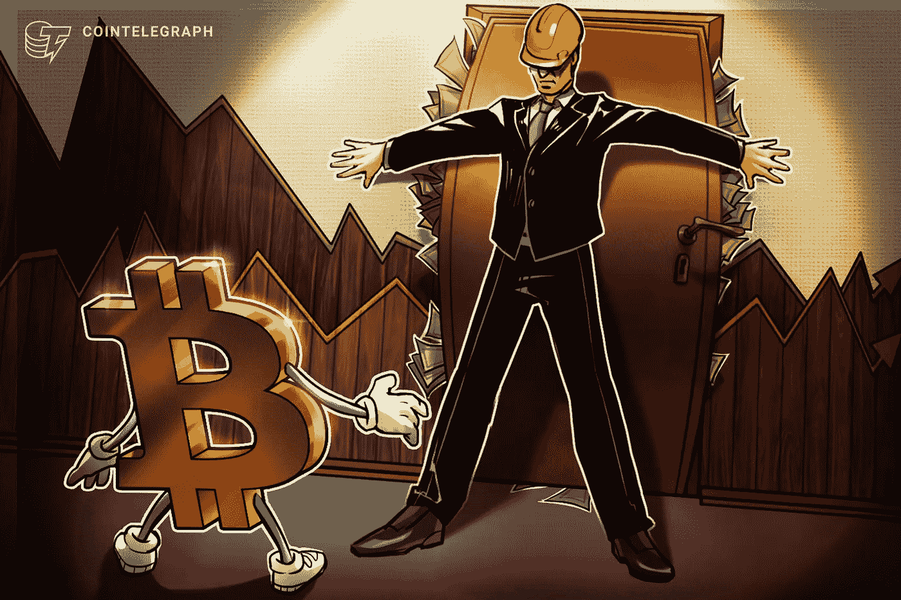
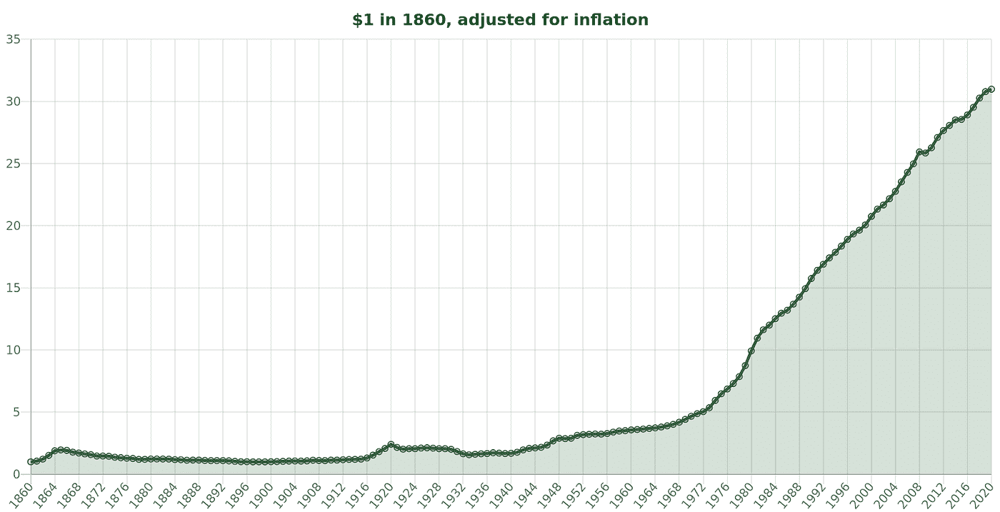
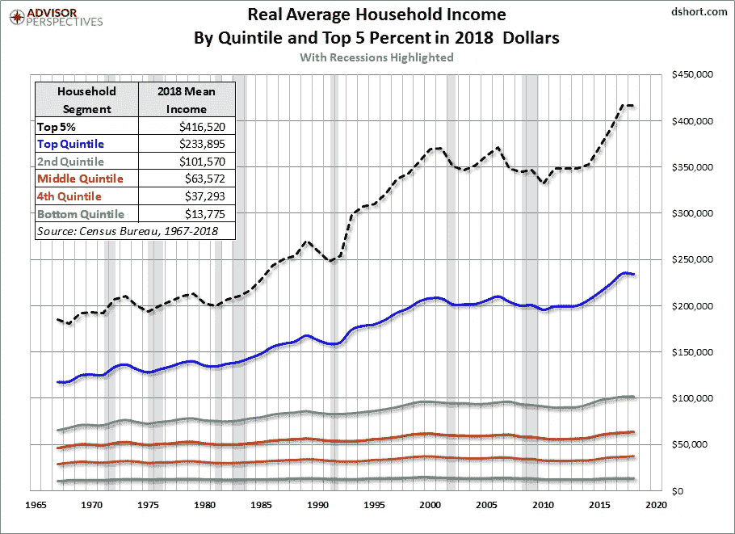
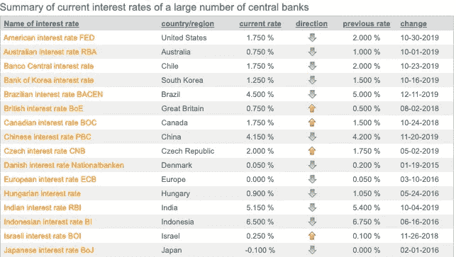
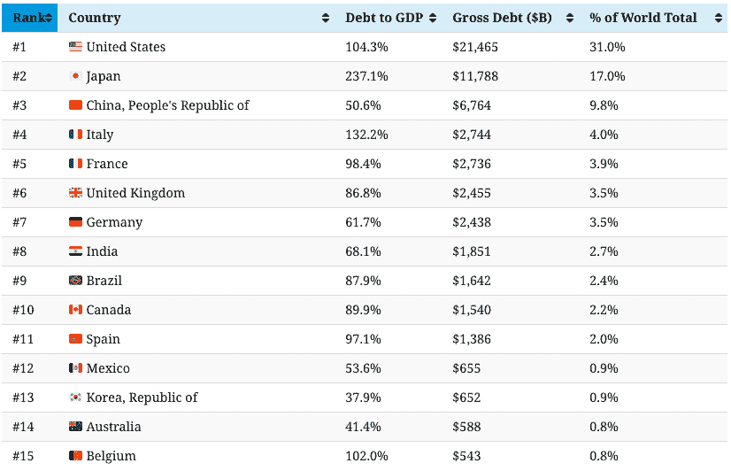

# 2020 年一个倔强男人对比特币的辩护

> 原文：<https://medium.datadriveninvestor.com/a-stubborn-mans-defense-of-bitcoin-in-2020-290f7acaad5e?source=collection_archive---------3----------------------->

当涉及到我确定的事情时，我往往会毫不留情地坚持己见。我对 BTC 的信仰就是其中之一。尽管存在合理的担忧和挑战，甚至可能存在一些矛盾，但这是我将捍卫的东西，直到它痛苦的结束。

在这篇文章中，我为 BTC 的重要性辩护，虽然有点零散，但却是整体性的。为了做到这一点，我在不同的框架中处理这个主题，因为背景非常重要。

下面的列表是按时间顺序排列的，这意味着我也试图强调比特币的叙事和总体情绪在其一生中是如何变化的。这份名单当然也意味着比特币的叙事将继续流动和变化，也许是以行业以前没有想到的方式。

 [## 总部位于瑞士的 ETP 进入加密交易市场|数据驱动的投资者

### 虽然金融市场几乎没有沉闷的时刻，特别是在引入…

www.datadriveninvestor.com](https://www.datadriveninvestor.com/2019/03/10/swiss-based-etp-enters-the-crypto-trading-market/) 

完全披露——虽然这些观点是我自己的信念，但我并不一定提出它们。在这一点上，我甚至不记得其中哪些是我自己开发的，哪些是我借用的，但可以肯定地说，这是一个播客的融合( [*盛况*](https://blockworksgroup.io/off-the-chain-podcast) *，* [*劳拉·辛*](https://unchainedpodcast.com/) *，*[*Basel*](https://blockworksgroup.io/base-layer-podcast)*等)，各种报告(* [*区块链资本*](https://medium.com/blockchain-capital-blog/blockchain-capitals-2019-year-in-review-c567a0f8ddde) *，[*melt em*](https://coinsharesgroup.com/research/2019-crypto-trends-report)*等)和 presentations(*[*Tom Lee*](https://www.youtube.com/watch?v=UXntK5qVhvo)*，*[*Tetras Capital*](https://www.youtube.com/results?search_query=brendan+bernstein+tetras+capital)*等)。 )过去两年。**

# **1。数字‘现金’**

不需要更多的解释。这是中本聪的白皮书中概述的论点，它催生了比特币。它描述了一种数字化的本地货币形式，一种可以用来转移价值而无需任何中介的货币。然而，批评家们马上忽略了这一点的重要性，他们说信用卡也是数字化的，并且易于使用。

虽然日常商业可能是比特币的终极游戏，但今天这是我最不喜欢的思考比特币重要性的方式。“和 BTC 一起为你的星巴克咖啡买单”的叙述经常分散新来者对真正天才发现的注意力。我目前在星巴克的结账经历还不至于糟糕到让我觉得 BTC 很有吸引力。引人注目的是基于激励的、无许可的、抗审查的和分散的架构，它既解决了重复支出的问题，又是防篡改的(加密保护)。正是这种数学、密码学、经济学、计算机科学、博弈论等的结合。这成功地启动了 BTC 网络，其规模之大是迄今为止其他数千个区块链中没有一个能够复制的。它引入了一个新的协议，一个新的会计系统和技术来转移价值。这让我们想到了第二点…..

# 2.抵制审查，没有许可，权力分散

这一观点得到了安德烈亚斯·安东诺普洛斯和阿里·保罗等人的支持，是理解比特币重要性的一种更哲学的方法。简而言之，这种观点认为，在当今的“社会”中，金钱是人类不可或缺的一部分，获得金钱应该是与生俱来的权利。因此，个人应该拥有完全的权力和所有权。**不应该有任何机构，不管是银行、政府还是监控国家，来规定你如何储存、支出、转移或接收资金。**使用这些强制性服务也不应该花费数千亿美元。这并不是说不能有任何服务来帮助你管理你的钱，但应该有一个不需要这些服务的基金会——T4 让人们选择是否利用这些服务。今天，我们没有这种选择。我们必须使用由政府操纵、由机构控制的货币。

可能感觉不像，但今天我们的存在是如此密切监视和控制，政府和机构可以大规模冻结和扣押资产。虽然你可能会说这是一个如此不切实际的末日场景，但这个*是*发生在世界的小角落*已经*了。无论是[中国阻止公开反对政府的人](https://www.scmp.com/tech/big-tech/article/3035661/beijings-subway-system-will-use-facial-recognition-single-out-people)乘坐地铁，还是[香港抗议者](https://qz.com/1642441/extradition-law-why-hong-kong-protesters-didnt-use-own-metro-cards/)避免对他们的支出和活动进行数字记录，还是[阿根廷政府](https://en.wikipedia.org/wiki/Corralito)在货币政策让他们的国家陷入债务危机时冻结银行，等等，我们看到这一切都在不经意间发生。比特币并不是一个完美的解决方案，但它可以防止这类事件失控。

# 3.将未银行化的银行化

我缺乏证据的猜测是，这种说法是对批评者(主要在西方发达国家)的回应，他们说在 BTC 交易并不比使用信用卡或 paypal/venmo 之类的服务更容易或更高效。虽然这是真的，但事实上世界上大多数地方并没有像大多数阅读这篇文章的人所习惯的那样可靠的信用卡系统。事实上，一些统计数据显示，世界上几乎一半的人没有银行账户，许多人有银行账户，但功能/可靠性非常有限。因为银行从缺钱的人身上赚不到多少钱，所以没有多少动力为这些人服务。但是在经济上排斥这些群体就是让他们永远陷入贫困。

我们还知道，全球智能手机的渗透率正在达到 50%，在某些情况下，使用手机比清洁水更容易获得(这完全是另一个问题)。这也是为什么手机通话时间在非洲部分地区被普遍用作货币的原因，因为便于转移，甚至可能是因为手机通话时间不受通货膨胀和政府货币普遍不可靠的影响。这也是 Libra(脸书)正在试验可以通过数字平台获得的“全球储备”货币概念的原因。

**利用比特币和分散金融只需要一台设备和接入网络。**一种新的货币形式将解决这些无银行地区的所有问题，这还远远不是真的，但我们也要发现，当人们在经济上获得可靠的价值转移和保存形式时，会出现什么样的进步。

# 4.汇款

啊，2017-2018 年崩盘前弥漫的最后一句话。在某个时候，比特币的支持者决定将目标对准收费高的银行和转账服务。西联汇款和类似的汇款业务成了邪恶公司的典型代表，他们从移民劳工的微薄收入中攫取大量利润。他们可能有一个好的观点。

除了昂贵的转账费用，银行还从透支或逾期付款的人身上赚取令人厌恶的巨额利润。如果你存了很多钱，大多数服务都是免费的，但如果你没有钱，那就非常昂贵。Fundstrat 的 Tom Lee 指出，尽管利率从 1970 年至 2019 年从 16%降至 2%以上，但全球银行 ***在同一时期的利润翻了一番*** 。技术进步应该使服务更便宜，然而我们却看到银行收取的费用实际上增加了。今天，普通人仅仅为了使用和储存他们的钱，就不得不花费将近一个月的年薪。这相当于每位客户每年约 900 美元。脸书每个用户只赚 7 美元。难怪苹果、谷歌、FB 和科技巨头都试图进入支付领域。

在 BTC 网络的扩展问题上仍有一些工作要做，无论是协议级别的升级，还是更有可能的侧链和闪电网络(Lightning Network)等国有渠道，在我们能够将费用降低到比目前银行收费更低的水平之前。但正如他们所说，如果你想颠覆旧模式，你必须想出一个更好的模式，让旧模式过时。

# 5.数字黄金/价值储存

在某些方面，2017 年 BTC 价格的疯狂上涨对其品牌的损害大于好处。随着价格超过开发/采用/能力，它也暴露了其在日常商业中的一些弱点。它的波动性和由于网络拥塞而导致的高交易成本很快成为它的克星(没有双关语)。

因此出现了一种新的方式来思考 BTC 的用途，一种更精炼的身份，作为一种新的资产类别，与黄金等大宗商品最为相似。感谢 Mike Novogratz 的 Galaxy Digital、VanEck、gray 等的喜欢。它标志着机构开始考虑比特币。我们不需要能够购买日常商品，甚至大型企业交易，黄金才会被认为有用或有价值。人们喜欢黄金只是因为它是金子(闪亮，永恒)。所以当你仔细想想，这是一个令人信服的论点。领先黄金数千年的技术，比黄金有更好的属性:更易分割，更易转移，更易储存，更安全，不会增加任何重量，可以随身携带到任何有互联网或手机的地方，流动性更强…你明白我的意思了吗？

如果历史有所启示，你知道反对变革通常是一个糟糕的决定。我认为 BTC 不一定会很快取代黄金，也不是说它们不能共存……但在 5-10 年内，赚最多钱、管理公司和国家、控制财富的一代人将会忘记互联网出现之前的生活。事实上，*在接下来的十年里，将会有 300 亿美元***的财富从婴儿潮一代转移到千禧一代*。谁说人们会继续喜欢黄金而不是数字黄金呢？*

# *6.国际转让*

*除了目标受众不是第一代移民劳工，而是企业或富有的个人之外，与#4 汇款没有太大区别。例如，在我的公司，我们实际上更喜欢接受 BTC 作为付款方式，因为这意味着我们的销售人员可以更快地拿到佣金支票。因为我们的许多客户都是国际客户，电汇到我们公司账户平均需要 2-3 天。BTC 需要 15 分钟。今天有足够多的流动性来可靠地接受 BTC，并立即出售它以避免价格风险。*

*不过，最好的例子是 BTC 网络上有史以来最大的交易。10 分钟内转账 50 万 BTC，花了 0.2 美元。*按照今天的汇率，一个计算条目就转移了 37.5 亿美元的价值。* 哇。我不知道世界上有多少银行有这么多的现金储备来完成这么大规模的交易，更不用说在 10 分钟内完成了。*

# *7.国家与货币分离*

*我的直觉是，尽管这一直是比特币运动的主导精神，但早期采用者忙于瞄准华尔街和金融机构，没有意识到比特币不仅仅是取代中介。就我个人而言，我第一次听到这个短语是在 Pomp 的播客上，它立即变得很有意义。曾经有一段时间，教会是维护法律、秩序、稳定和社会权力动态的主要支柱。最终，民主、警察、执法机制、法律体系等成为服务于这些目的的更好选择。*

*同样的，现代金融体系，银行的发明，甚至现代货币理论，联邦储备银行等等都曾经是天才的发现。在没有互联网和可编程货币的情况下，毫无疑问，他们为社会进步做出了巨大贡献。但是我们现在生活在一个科技可以完成很多我们依赖政府和机构的功能的时代。主要是信任层，虽然它确实带来了很多好处，但也可能非常具有控制性、排他性、限制性、低效和腐败。*

*如果教会曾经与国家分离，想象未来金钱与政府指令脱钩也不是不可能的。同样，这并不是说政府不能在监管或促进数字货币方面发挥作用，而是它的作用可以从目前完全操纵的角色演变而来。**就像 TCP/IP 一样，互联网、电子邮件等不是任何政府的财产，“钱”也应该是一种普遍共享的工具，规则、市场结构和法规都围绕着一个*协议*而不是一个权威来建立。***

*思考比特币的另一个角度是作为一种开放参与的方式。在经历了几代人的独裁和暴政之后，为什么世界最终选择了民主作为主导的政治制度？这是因为人们认为这是一种更公平/公正/繁荣的社会组织方式。决策、贡献、参与等的*权力下放有利于更大的利益。同样，从概念上讲，开放货币的创造、分配、管理和参与，而不是由政府垄断，会带来很多好处。**

**更多信息请见#8…**

# **8.笨蛋保险公司**

**在 2008 年金融危机和 60 万亿美元的额外全球债务爆发 8 年后，越来越多的知名投资者公开反对历史上最大的货币实验之一，该实验引发了前所未有的牛市，现已超过其预期寿命 3 年。这些人包括雷伊·达里奥、马克·尤斯科和彼得·希夫。我们来看看为什么。**

**自 2008 年以来，美国一直沉迷于量化宽松，超低利率，以及对美元将永远有全球需求的信心，无论印刷多少美元，美国政府借多少美元。**

****

**[https://www.visualcapitalist.com/63-trillion-world-debt-one-visualization/](https://www.visualcapitalist.com/63-trillion-world-debt-one-visualization/)**

**这张看似 BTC 价格的图表实际上是美元，显示了 1980 年后其购买力变化有多快。现在把它与过去 40 年的平均家庭收入相比较。**

****

**你可以看到货币供应增加的影响只惠及最富的五分之一人口，对第二个五分之一人口有一点好处，但没有购买力下降的速度快。这是有道理的，因为人为地增加美元供给会提高资产价格，所以那些拥有资产的人(富人)会更快地增加财富。[与此同时，对每个人来说，商品成本都在上涨，而且比传统的 CPI 上涨记录可能显示的要快得多。](https://chapwoodindex.com/)**

****

**[https://www.global-rates.com/](https://www.global-rates.com/)**

**从全球来看，利率处于历史最低水平，在欧洲和日本的一些地区，利率甚至为负。**

****

**[https://www.visualcapitalist.com/63-trillion-world-debt-one-visualization/](https://www.visualcapitalist.com/63-trillion-world-debt-one-visualization/)**

**除了韩国和澳大利亚，前 15 个国家的债务超过了 GDP 的一半。二战以来最高。这还没有考虑到对婴儿潮一代的承诺(医疗保健权利，社会保障权利，等等。)是历史上增长最快的退休群体。如今，债务利息支付是美国财政支出的第四大类别，大约 10%的税收用于支付****利息。尽管如此，我们知道，在进一步减税和不断上涨的医疗和退休费用的帮助下，联邦赤字将继续加速增长。美联储甚至试图在 2018 年通过加息来缩减规模，但最轻微的转变都会导致全球不稳定，并暴露出复杂衍生品的纸牌屋，这些衍生品依赖于这些低利率环境。德意志银行是这场混乱的典型代表，但肯定不是唯一的银行。******

**那么这笔借款给我们带来了什么？你可能会认为无限制的支出会让每个人都富裕起来，就像开派对一样，对吗？相反，我们的社会主义情绪日益高涨，贫富差距日益扩大，毕业生深陷学生贷款，房屋所有权下降，超过 60%的美国人储蓄不足 1000 美元以备不时之需。当然，私营部门现金充裕，市场处于历史高点，但这是因为通货膨胀抬高了资产价格。对于 50%没有任何投资的美国人或现金储蓄者来说，这相当于对他们的收入征收附加税。这也是为什么总统候选人杨安泽的全民基本收入平台让他从默默无闻到在民主党民调中排名第四或第五的原因之一。在我看来，这些都是对同一个问题的自然反应:**人们的购买力正在下降，生活变得越来越负担不起。它惩罚储蓄者，只让拥有资产的富人受益。****

**我们还知道，婴儿潮一代很快就会退休，这将创造有史以来最大的退休人口。与此同时，我们的养老金和社会保障偏离了承诺的轨道。事实上，美国社会保障的受托人已经报告说，按照目前的速度，到 2034 年，它将陷入财务破产。**

**顺便说一下，这发生在一个有史以来最富有、最有权力、最受欢迎的国家。一个掌管“全球储备货币”的国家，在某种程度上，其他国家仍然对其如此有信心，以至于他们的本国货币对其大幅贬值。想象一下，如果这种供应过剩开始超过需求，会发生什么…**

**需要明确的是，这并不是一个所有的地狱将立即爆发的预测。债务泡沫破裂或美国被视为资不抵债可能需要数年时间，但谁也说不准会持续多久。很难理解如果对美元和美国经济的信心动摇会发生什么——但我们知道这一次，在 08 年救了我们的 QE 只会火上浇油。*所以，如果你是一个像雷伊·达里奥一样的怀疑论者，你可以去哪里寻找避险天堂来对冲这种风险呢？* **答案是避险资产，可以保值，与股票&债券不相关，而且没有通胀风险。那可能是像黄金这样的商品…或者如前所述更好的黄金版本…比特币！****

**如果你有疑问，这就是马克·尤斯科著名的“从零开始”建议的关键所在。你当然不需要把所有的钱都放在比特币里，但为什么不是 1%呢？为什么不干脆从零开始算“笨蛋保险”呢？没有人会因为失去 100%的 1%而被解雇。但是，如果 BTC 确实发挥了它的潜力，而你在有机会的时候却忽视了它，你确实有很多要解释的。**

# ****9。全球储备货币****

**让我们想象这样一个世界，我们所知的法定货币(美元、日元、欧元等)贬值，需要全球衰退来修复一些结构性损害。让我们想象一个世界，世界各地不同的政府都在拥抱加密技术，并推出中央银行数字货币(CBDC)。更不用说像天秤座和优步硬币等非政府货币。在这种情况下，BTC 将扮演什么角色？**

**首先，我的猜测是，在不同的 CBDC 货币对之间存在直接流动性之前，BTC 将充当基础货币对，充当中介基础，就像许多替代货币一样，你只能用比特币购买，而不能直接用美元购买。**

**第二，这将迫使许多政府更仔细地考虑他们的货币将如何与 BTC 竞争。他们必须保持对稳健的货币政策和反腐败的信心，并在通胀之前三思而行。否则，该国公民将选择在 BTC 而不是 CBDC 储存他们的价值，这将使其对 BTC 的价格下降。更重要的是，它让人们有自由和选择来保护他们的财富免受不良货币行为的影响。**

**最后，当法定数字货币不稳定时，它将充当全球储备货币。它将作为一个后备选择，这样，如果再次出现债务危机、流动性危机、恶性通货膨胀等，公民就不会因国家金融系统犯下的错误而遭受损失。**

# **10.取消银行存款**

**也称为分散金融(DeFi)。这方面的领先者是以太坊，在以太坊的生态系统中，马克道可能是这个领域中最成功的先行者。这个想法是执行银行提供的许多功能，只是不是在银行。**

**虽然比特币没有以太坊那样复杂的链上借贷、衍生品、交易等，但它确实拥有最大的流动性。因此，已经有很多集中的加密贷款平台，如 BlockFi/Nexo/Celsius，它们主要是 BTC 远期。这些平台允许您获得金融服务，如以加密作为抵押的贷款和加密存款的利息。从理论上讲，像比特币基地这样持有大量 BTC **的交易所，将有能力将银行今天从事的许多活动制度化并付诸实施。**看看这个行业如何应对这种二分法将会很有趣—*我们希望金融产品围绕加密，但不一定希望世界的比特币基地成为下一个“老大哥”银行。***

# ****结论****

**说实话，我不知道这 10 个中哪一个将是最重要的，也不知道 BTC 将如何演变。我甚至不知道 10 年后比特币的意义会有多大。**

**但是我不愿意赌上它所有的属性、用例以及潜力。它的婴儿期将会有怀疑者质疑它的波动性……它的成熟产品/市场适应性将会有怀疑者怀疑它的身份……它不确定的监管环境将会有怀疑者担心它的风险。但我始终牢记的一件事是:没有什么比比特币更好的了，这让它变得不可替代。**

**斯潘塞·博加特曾将比特币比作鸭嘴兽。他指出，当科学家们第一次发现这种动物时，他们认为这是一个笑话，因为它结合了如此多的动物纲/目中的特征，这种不一致似乎不可能发生在一种动物身上。即使在研究了鸭嘴兽之后，科学家们也很难使用现有的类别对其进行分类……所以他们创建了一个新的类别。鸭嘴兽成为了类别创造者。**

> **比特币非常类似。它表现出跨资产类别的特征:比特币像货币一样用于支付，像商品一样稀缺，像股票一样分配“特殊红利”(硬分叉)，像技术平台一样从开发者的贡献中获得附加价值。-斯潘塞·鲍嘉**

**因此，如果有一件事可以借鉴，那就是**比特币擅长成为比特币**。它是一个品类创造者，我们对它的欣赏不应该来自于它像什么，而应该来自于它改变现状的潜力！**