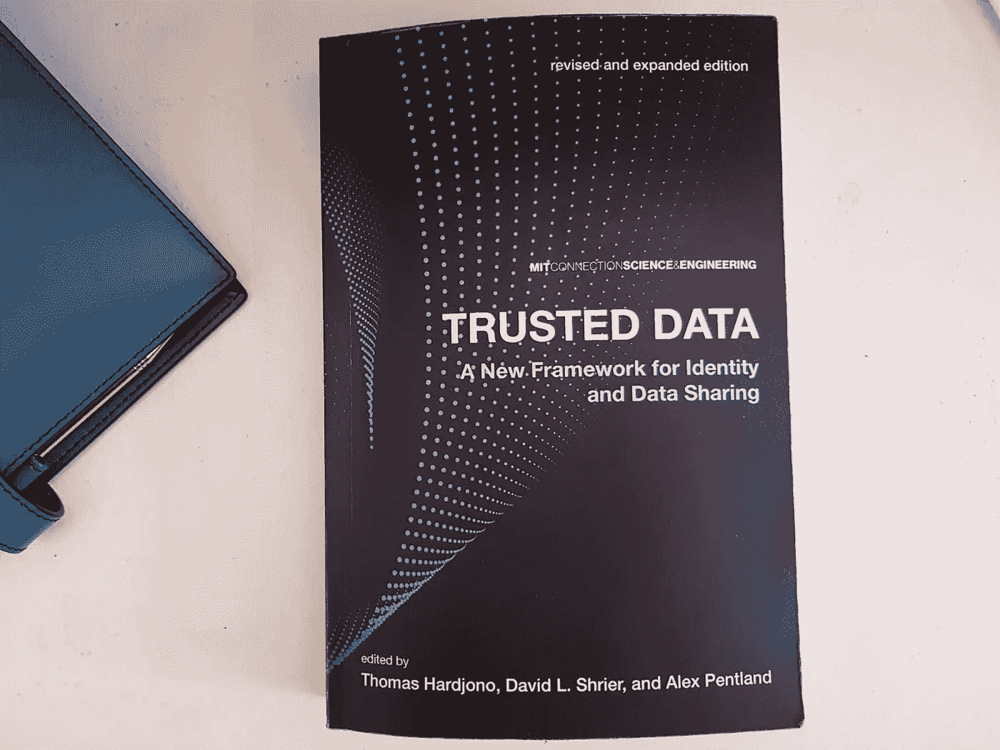

# “可信数据——身份和数据共享的新框架”综述

> 原文：<https://medium.datadriveninvestor.com/a-summary-of-trusted-data-a-new-framework-for-identity-and-data-sharing-94ada762b3fe?source=collection_archive---------2----------------------->

## 我读了《可信数据》，这是一本麻省理工学院的连接科学和工程书籍。这是对他们可信数据互联网的革命性框架的简要总结。

Source: SP, 2020, “Trusted Data — A New Framework for Identity and Data Sharing” Cover

可信数据——由 Thomas Hardjono、David L. Shrier 和 Alex Pentland 编辑的身份和数据共享新框架介绍了一种革命性的架构和框架，用于构建可信数据互联网。该框架的目标是在保护数据隐私的同时实现高效的实时数据和见解共享——随着数据需求的增加以及国际数据保护法规对数据使用方式的新限制，这一挑战近年来备受关注。

这是对核心概念的总结，但它只是在很高的层面上触及了框架。我承认 380 页的理论、研究和分析没有让你夜不能寐，但这个项目超级有趣。此外，施里尔是我参加的赛德商学院和牛津大学区块链战略项目的主要讲师。施里尔在区块链、数字身份证和数据共享领域做了大量工作，这也是我渴望阅读更多关于这项工作的另一个原因。

 [## 数字货币、区块链和货币的未来|数据驱动的投资者

### “区块链”、“加密货币”、“令牌化”，以及现在的“央行数字货币”已经成为…

www.datadriveninvestor.com](https://www.datadriveninvestor.com/2020/02/18/digital-currencies-blockchain-and-the-future-of-money/) 

# **谁应该读？**

这本书对任何想学习和阅读更多关于数据共享和数字身份证的替代框架的人来说都很有趣。你应该至少对数据框架和区块链技术有一个基本的了解，否则这本书的第一部分，讨论了框架的技术执行，可能很难理解。

# **眼下的问题是什么？**

数据在很大程度上被称为世界上最有价值的资源。没有人否认，在数字时代，数据就是力量，数据驱动的决策将改变我们所知的生活。然而，我们目前的数据共享生态系统是有缺陷的，过时的，不适合的目的。这本书解决了以下问题:

## 缺乏在线身份识别

随着我们不断连接，仍然没有安全可靠的方法在网上识别自己，就像书中描述的**“在互联网上，没有人知道你是不是一只狗”。在这个日益数字化的世界里，我们现有的身份识别系统仍然是模拟的。这使得核实你是谁变得很困难，但也很容易成为身份盗窃的案件，现在这些案件经常成为新闻头条。**

## 现有基础架构没有解决数据隐私问题

多年来，我们现有的基础架构基本上是为了满足不断增长的数据需求而构建的，没有考虑太多关于维护数据隐私的问题。尽管国际上正在引入数据保护法规来解决这一问题，但如果没有一个以“设计隐私”原则为核心的技术架构，几乎不可能实现强大的在线数据隐私。

## 数据大部分存储在孤岛中

每分钟都在收集大量有价值的数据。然而，这些数据基本上是不可访问的。传统上，IT 系统是在孤岛中构建的，彼此不兼容。这是非常低效的，原因有二:

1.  结合起来才能解锁数据的真正价值。例如，将医疗数据与位置数据相结合可以从根本上检测到潜在疫情病毒的威胁(想象一下，我们可以从一开始就检测到并追踪到冠状病毒)，
2.  它消耗了大量的容量。相同的数据在不同的数据存储中存储了很多次。想想你多久分享一次你的家庭住址。最重要的是，数据通常是过时的和不准确的，并且没有适当的系统或记录来跟踪和追溯所做的任何更改。

# **解决办法是什么？**

该框架和架构被称为**可信数据互联网**。它允许**高效准确地共享数据，同时保护数据隐私。**本质上提出一个适合并值得处理“现代社会的石油”的框架。

这本书深入讨论了软件架构如何工作，包括部署计划、安全性、技术要求、治理以及它如何适应当今社会。该总结触及了蛋白石框架的要点和特点:

1.  个人数据存储或 PDS
2.  通过经过审核的算法获得数据洞察力
3.  同意查阅数据
4.  数字标识

## 1.个人数据存储或 PDS

该框架的一个关键部分是数据存储库，也称为“个人数据存储”(PDS)。您的所有原始数据都存储在指定的 PDS 中，而不是到处复制您的数据。PDS 有一些独特的特征:

**a)数据永远不会离开存储库**

乍一看，这似乎有悖常理，因为该框架的目标是允许更多、更准确的数据共享——我们将会谈到这一点。目前，思维过程是您知道您的数据存储在哪里，它只有一个副本，并且数据永远不会离开它的位置，除非您想将它移动到其他地方。

**b)PDS 作为一项服务提供给您**

这些存储库可以由现有的公司和机构(如银行)管理，也可以是向您提供 PDS 即服务的新型服务提供商。您可能有几个不同提供商的 PDS 来存储您的数据属性(健康数据、财务数据等)。).想法是一样的，存储库提供商代表你存储你的数据，即使他们没有访问权。

**c)数据被加密，存储被分配**

将这些有价值的数据存储在一个地方会给黑客攻击带来很大威胁。为了保护您的数据，该框架采取了几项措施。两个最重要的:加密和分布式存储。

当存储库被分割并分布在包含加密数据片段的许多不同位置时，数据将一直保持加密状态。这是一个安全的机制来保护您的数据，并使恶意黑客几乎不可能获得它。这是怎么回事？想象一下，你所有的数据都锁在一个保险箱里。黑客只需要“打开”一个保险箱就可以访问所有东西。相反，想象一下你的数据被分割成碎片，分布在许多不同的保险箱里，这些保险箱被放置在未知的地方。如果一个恶意玩家进入一个保险箱，他只能得到对他没有价值的不可读数据的碎片。他需要同时黑进所有的系统并解密数据才能访问。

只有你有钥匙让第三方访问你的数据。

## 2.通过经过审核的算法获得数据洞察力

还记得我们说过您的原始数据不会离开 PDS 吗？因此，问题是，如果有人需要，他们如何能够访问它。管理它的软件架构被称为 OPAL 或“开放算法”。服务提供商通常需要数据来为您提供服务，例如，人寿保险公司需要您的某些数据来为您提供报价。此时，他们会收集数据(希望数据是真实和正确的),并在本地系统上运行分析以得出报价。

有了 OPAL，保险公司可以使用算法向您的 PDS 发送洞察查询，而不是复制数据并将其存储在其他地方。算法进入您的数据存储，在防火墙后运行分析，并向数据查询者返回请求的结果或见解。因此，存储库需要能够接收、执行和评估针对可用数据的查询。保险公司不需要知道你的健康史是什么样的，他们只需要知道你健康的某些方面是或不是，就可以给你一个报价。类似地，政府可以实时查询数百万人的日常通勤数据，以评估交通状况和改善基础设施，而无需知道你是谁，也无法找到你。查询者收到的不是可识别的信息，而是匿名的见解。

此外，每个(data insight)事务都有一个唯一的标识符，并在分布式分类帐中不可逆地记录时间戳，从而使每个数据事务都是可跟踪和透明的，为给定数据集的真实性和历史提供了单一的真实来源。

你可能想知道这些算法从何而来。本质上，可以在加密数据上运行以提供见解的算法必须由官方机构(该领域的主题专家)根据由可信框架的参与者决定的特定规则和标准进行审查。例如，这可以是像医院和健康信息系统运营商这样的健康护理系统中的参与者的可信框架。当一家保险公司请求洞察时，该算法会与您在任何一家保险公司的所有 PD 进行比对。算法本身可以被想象成查询者可以从中选择的被认可的命令。

要实现这一点，需要组织、企业和机构的合作。这个想法是你的数据被存储在指定的地方，数据查询者可以使用经过审核的算法进行数据请求。您可以确保您的数据是安全的，查询者也可以确保实时获得经过验证的见解。

## 3.同意查阅数据

该体系结构的另一个重要方面是，虽然存储库操作员将 PDS 作为服务提供，但他们没有权力决定如何处理数据。数据属于数据所有者，他决定如何处理这些数据。在我们当前的数据经济中，你的数据在你不知情的情况下被分享和出售给第三方。在 OPAL 框架中，数据所有者同意查询者。

## 4.数字身份证

可信数据框架为可验证且安全的数字身份提供了一种潜在的解决方案。第一，有一个人的核心身份。这种核心身份类似于数字格式的身份证或护照。核心身份可由可信实体(如政府)发布。此外，该身份仅由身份的所有者独家访问，决不会与任何人共享。从那里，所有者可以创建所谓的“角色”或假名身份。人物角色是一个人的独特属性，你可以有一个“工作”人物角色，“政府”人物角色和“健康”人物角色，这些人物角色是这个人独有的，但不会泄露任何敏感信息。例如，当你在网上申请工作时，你不能分享你的婚姻状况、出生日期、宗教信仰和性别等信息。相反，你要与公司分享你的“工作”角色。由于属性与您的核心身份相关联，因此与您的工作角色共享的任何信息都是可信的。你的文凭、工作证明等。可以连接到该角色，公司将保证共享的信息是真实的，同时不会受到性别、宗教、年龄等数据的影响，从而提供更大的平等性，防止偏见。申请抵押贷款也是如此。你可以分享你的“财务”角色，让经纪人了解你的财务稳定性、消费行为等。但是没有数据显示你把钱花在了什么地方，你的年龄和性别(尽管不应该)会对决定产生负面影响。

要实现这样一个系统，需要一个全球性的身份和访问管理项目，并在许多受信任的参与者之间分配权限，否则系统安全性会受到威胁。

Trusted Data 更深入地研究了该架构的治理方式、测试和研究工作以及该架构的技术设置，该架构在很大程度上基于区块链技术。但这给了你一个很好的概念概述。

# **总结和主要优点**

身份和数据共享框架是一个革命性的解决方案，可以极大地改变我们访问和处理数据的方式，同时保留和保护隐私。麻省理工学院和所有相关方正在引领“可信数据互联网”的发展。这种架构的优势可以产生巨大的影响:

## 数据所有者处于控制之中，隐私受到保护

显然，事情并不完全是黑白分明的，数据所有权也不总是简单明了的，哪些数据属于个人，哪些数据属于公司？虽然这是一个定义问题，但该框架允许拥有数据的人控制数据。此外，由于数据永远不会离开其存储库，并且总是被加密，因此隐私得到了保证。

## 大规模的实时、经验证的洞察和分析

这种模式开启了一个充满机遇的全新世界。研究、新兴技术(如人工智能)和政府可以实时获得经过验证的综合见解，并确保信息来自单一的真实来源。例如，政府可以在不侵犯隐私的情况下，准确了解公民在一个地区的日常活动和互动方式，从而改善整体福祉。随着新的数据洞察力变得可用，研究机构可以获得真实的洞察力，而不必经过漫长的研究和调查，网络创新将得到促进。

## 它是安全和透明的

基于区块链技术的原则，该框架在很大程度上是去中心化的。不是一个单独的实体(或少数几个强大的实体)控制基础设施，而是它分布在许多节点中，这些节点提供计算资源，并在适当的位置执行共识机制。它为攻击提供了最高的保护。此外，它允许追溯各种数据、算法和过程的来源，支持审计的“来源链”,同时保证透明度。

## 网络可扩展性和互操作性

使用 PDS，一个单一的数据来源和一个分散的架构，该框架没有与我们当前的系统相同的挑战，解决了围绕互操作性的问题，并允许可扩展性。

# **批判**

随着我们以光速进入一个主要使用数据工作和运行的数字社会，非常需要一个支持数据并适合其用途的新基础设施。现有的系统是随着时间的推移按需构建的，没有从效率和安全的角度考虑太多模型。恶意玩家太容易得手了，因为当前的体系结构从未被构建或设计为保护其核心数据。因此，转向“可信数据互联网”不仅令人钦佩，也是可取的。

我的主要批评点是执行力。尽管给出了软件架构如何在所谓的“活实验室”(参与实时实验以测试 OPAL 框架可行性的城市和环境)中进行测试的各种示例，但实施挑战是巨大的。这种方法非常具有战略性，并且是自上而下的。麻省理工学院与包括政府、大学和研究机构在内的合作伙伴密切合作，公平地说，要取得如此大的成就，你确实需要这些关系。然而，你也需要人们的集体认同。

事实是，即使实施了数据保护法规，围绕数据泄露和身份盗窃的丑闻，如果以人们的日常行为来衡量，大多数人并不真正关心这一点。无论是在英国还是在欧盟，许多研究都发现了这种矛盾。人们在调查中陈述的隐私问题并不能反映他们日常的实际行为。分享数据带来的便利被认为比数据隐私问题更重要。因此，似乎对隐私保护框架的需求并不是公众普遍关心的问题。

如果数据所有者不真正关心或没有工具来理解这个问题，大多数政府不会投资一个革命性的框架，只有当信息生态系统的所有部分都参与进来，尤其是数据所有者处于信息生态系统的中心时，这个框架才能发挥作用。此外，该书多次强调，要使这一框架发挥作用，尤其是数字身份证，需要全球协作、认可和共识。不幸的是，围绕集体买入和大规模适应需求的挑战往往是实施基于区块链的解决方案失败的主要原因之一。这些解决方案通常具有开创性，但需要整个生态系统的参与，才能真正展示其优势和价值。

施里尔确实谈到了这些挑战，也提到了许多初创公司正在该领域进行创新。然而，目前，执行计划缺乏个人的参与。

我认为，让人们能够通过一个单一的接触点了解他们的完整数字足迹，并允许企业和个人之间就数据使用同意书进行直接交互的解决方案，将是建立所需意识并获得公众支持以实施可信数据互联网的第一步。

**需要根据隐私法规管理数据隐私？**查看 [**Palqee**](https://www.palqee.com/) 的数据隐私管理软件。