# 超高效的神经网络或超级网络

> 原文：<https://medium.datadriveninvestor.com/a-super-efficient-neural-network-or-hypernet-67d6be300a7?source=collection_archive---------9----------------------->

创造人工智能需要什么？往这个目标走哪条路？许多人会自信地回答说，科学界已经在沿着这条道路全速前进了。随着拥有更多参数的下一代神经网络模型，更强大的神经形态计算机，以及适用于所有场合的更大数据集，我们将进入思维机器的时代。在我看来，这就像是一场争夺胡萝卜的比赛，当模型中可调参数的数量超过人脑中的连接时，这种情况对每个人来说都会变得更加明显，但不会达到预期的效果。在这篇文章中，我将概述走出恶性胡萝卜竞赛的方法，并谈谈我的研究道路和进展。

在通往人工智能的路上首先需要解决的是神经网络训练效率低的问题。没有地基，或者在很差的地基上建造宏伟的高层建筑是愚蠢的。许多研究人员在此基础上继续发展他们的智能概念和模型，而不是专注于显而易见的问题:生物神经网络的学习效率比人工神经网络高很多倍。

是的，有人可能会说，生物神经网络处于持续不断的信息流中，不断接收来自其受体的信号。一天之内，一个婴儿可以从他或她的视觉和听觉器官接收到大量的信息，相当于许多兆兆字节的视频和音频数据。但是如果我们详细分析这些信息，那么并没有那么多对训练真正有用的信息，可以说是“被标记”的信息。我们可以说，一个人在质量非常差的数据集上学习，大多数例子是不相关的，没有标记，一些例子非常嘈杂，但同时，他学习得相当成功和迅速。

显然，计算机神经网络并不对应于生物神经网络，或者我们以完全不同于生物神经系统的方式训练它们。

*要集中精力开发超高效的神经网络，而不是增加学习参数的数量。*

此外，主要重点应该是网络学习的速度，而质量或准确性现在是次要的。
只有超高效的神经网络(SNN)才能成为创造人工智能的基础和根基。
有了 SNN 技术，你可以以不同的方式前进，比如基于图形、超图等创建认知架构。加上 SNN，以生物学的方式重复生物大脑的结构。我是生物学方法的支持者，尽管我不认为这是实现目标的唯一途径。

## 走向人工智能的路线图

1.  第一阶段。创建感官分析器模型，主要是视觉和听觉。总的来说，生物神经系统的感觉分析仪应该成为超高效神经网络的原型(SNN)。
2.  第二阶段。获得关于 SNN 概念中的瞬间、暂时和长期记忆机制的知识。生物感官分析仪很容易与上下文一起工作，只有理解生物神经网络中的记忆概念，才能让我们采用与上下文一起工作的能力，这将大大扩展 SNN 的能力。
3.  第三阶段。运动网络模型的创建。尽管[大脑皮层](https://medium.com/datadriveninvestor/modeling-of-the-cerebellum-c841023a4dcf)的同质性，运动网络在某些方面比感觉分析器更复杂，尽管有一些深刻的相似之处。所以，这个阶段不会属于。运动网络将包括一个小脑模型，作为记忆和复制精确运动的短时间间隔的结构。也是一种奖励机制，以确保学习正确的动作，类似于生物大脑中的多巴胺奖励机制。
4.  第四阶段。运动动作的重要形式之一是言语。也许，正因如此，这一阶段和前一阶段将同时实施。在这个阶段，讲话不会是完全有意识的。作为一个人，言语发展的阶段是必须经过的，比如哼唱，单个音的发音，然后是单词。这一阶段的最高水平的语言能力是命名呈现的物体，描述场景，回答简单的问题，阅读，或宣布文本。在这个阶段，将会奠定演讲圈的网络基础(我在《[什么是头脑](https://medium.com/datadriveninvestor/what-is-the-mind-b59d639b6c06)》一文中详细写过关于演讲圈的内容)。
5.  第五阶段。创建一个[基本情绪和需求](https://medium.com/datadriveninvestor/simulation-of-emotions-2e01b2dc2b2e)的模型。这个阶段不会是一个明确的阶段；它的许多概念将在早期阶段显现出来。需要建模的主要基本情绪是新奇的情绪。在不同的抽象层次上创建信息新颖性的评估机制并在此基础上执行网络参数的调整就足够了。好奇心是有效学习的必要条件。你还需要给模特提供控制需求的感官。例如，机器人的电池电量低可能会给机器人带来某种饥饿感，机器人会寻求满足，也就是说，它会寻找充电器或电源。或者制造某种疼痛或不适的感觉，以使机器人避免创伤情况。另一种很容易建模的有用情感是各种各样的依恋。感情是基于一种印记机制。这对所有需要跟随主人并具有奉献精神的助手机器人或宠物机器人都很有用。一个人会更愿意与和他智力相似的人互动，因此，可能会出现更广泛的情绪机制。比如焦虑和恐惧，同情，喜悦，失望。至于将艾萨克·阿西莫夫机器人定律引入基本情感的层面，它们具有高度的抽象性，这使得它们的建模变得非常复杂。首先，必须对模型进行训练，以便能够识别“人”和“伤害”这两个图像的表征，类似于人们如何在一个人身上找到“祖母的神经元”。然后你可以把情绪机制和避免组合这些图像的愿望联系起来。很难说这样的方法会有多大效果。
6.  第六阶段。我们可以说，这一阶段同第一阶段一样困难，如果不是更困难的话。有条件的可以称之为前额皮质阶段。高级认知活动被分配到前额叶皮层；我们可以说，判断力和长期目标设定位于。前额叶皮层控制着情绪中心和需求中心的工作，它调节着它们对行为的影响程度。在这个阶段工作需要对人类行为有深入的了解。只有在这个阶段，一个人才能推理和谈论意识和有意识的行为。到这个阶段，我不仅包括前额叶皮层的创建，还包括几个重要的生物神经网络和机制。例如，“解释者”网络，它试图为我们的任何行为辩护。在涉及大脑半球分裂的人的实验中，这种网络的存在非常明显。
    还是网络造成了感受性的错觉，产生了对世界的集中感知感。此外，感知一个人的身体和行动的边界的机制，违反这一机制的人可能会导致一种摆脱自己身体某一部分的强迫性欲望，或者无法区分自己的行动和另一个人的行动。
    我们知道，各种精神机制的紊乱会导致自闭症谱系中的各种疾病或各种形式的精神分裂症。在通往人工智能的道路上，注定会遇到人工心灵中这些偏差的例子，但它也有有用的一面。人工智能方面的工作将让我们更好地了解人类精神疾病的本质。

## 超圆柱网络，或超网络

我们现在正处于这个路线图的第一阶段，处于创造超高效神经网络的阶段。对我来说，这并不是第一阶段，首先我必须了解周围神经系统的原理，以及神经网络如何在[简单神经系统](https://medium.com/@it.belkin/opentadpole-the-first-cybernetic-animal-1dcba8a01e9d)中工作，并且，总的来说，创建一个以上的神经元操作模型。现在我正在开发一个主要结构元素的模型，它不是一个神经元，而是一个超柱或皮质模块。因此，工作名称超圆柱网络或简称为*超级网络*。

接下来我会更详细的告诉你它是基于什么原理，我是怎么实现的。

## 第二信号系统—节点

让我们看看来自受体的信息是如何在大脑皮层中表现出来的，为此，我们需要了解辐射和感应这两种简单的机制是如何进行的，这两种机制已经被人们知道了一个多世纪。
照射是神经兴奋向邻近神经元或邻近神经组织扩散的趋势。

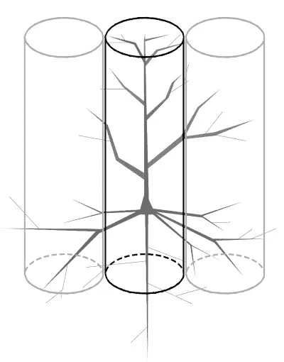

通常，一列细胞的突起可以扩散到相邻的列，并在相邻的列中发挥刺激作用。这种对相邻列的激励效应的性质可以表示为某个圆形光环，该光环在中心具有最大效应，并且随着远离中心而逐渐减弱。

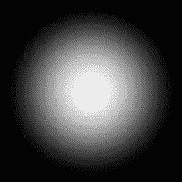

Irradiation map

诱导是在兴奋部位周围的皮层上出现抑制区域。这可能是因为一个列的神经元在离该列一定距离处的向外生长可以与其他列的抑制性细胞形成连接。对相邻柱的抑制作用的性质可表示如下:

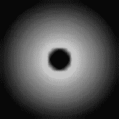

Induction map

这些过程同时在大脑皮层起作用。让我们模拟在这两种机制的影响下，大脑皮层中产生的兴奋将如何转换。为此，编写了像素着色器——由 GPU 为图像中的每个像素执行的程序。

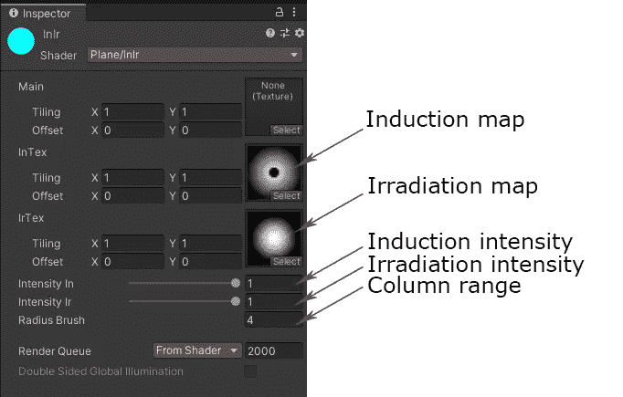

Shader in Unity

在模型中，图像的每个像素将是一个独立的皮层模块；像素越亮，列中的整体激发越强。

An example of the shader, the image size is 28x28 pixels, the radius of the column is 5 pixels, the shader is applied several times

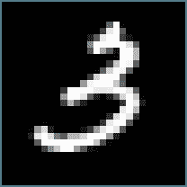

Column radius of 7 pixels

正如你所看到的，在辐射和感应机制的作用下，任何活动都被分解成小的激发焦点。这些焦点的大小取决于对相邻超柱的总影响的大小，以及激励和抑制图的作用力的比率。

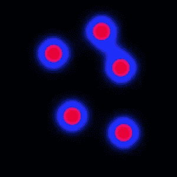

可以说，这些兴奋的焦点被包裹在抑制作用的区域周围。此外，它们的中心部分，随着对图像的着色器计算的几次应用，由于辐射，变得越来越活跃，从而这些焦点变得显著和稳定。

这些激发中心在下文中将被称为*节点*。节点是大脑皮层的一些新出现的属性；它表现为辐射和诱导两种机制相互作用的结果。节点与神经元或超圆柱的大小和位置无关，它们就像在这些结构上一样工作。节点的组合和位置是大脑皮层中信息的表征。

节点是第二个信号系统，是大脑中图像的符号表示。

大脑皮层和大脑作为一个整体使用简单而优雅的解决方案是令人惊讶的。
为了理解节点如何存储图像或图像的一部分，有必要研究大脑皮层中的另一种工作机制。

## 激励混响

兴奋的回响是神经元网络中或中枢神经系统的不同结构之间的兴奋脉冲的延长循环。对我们来说，皮质丘脑反射和发生在皮质不同区域之间的反射非常重要。正是这些回响在大脑的脑电图中创造了各种模式和节奏。对于这样的回响，需要下行或反馈，这通常是上行直接连接的数倍。

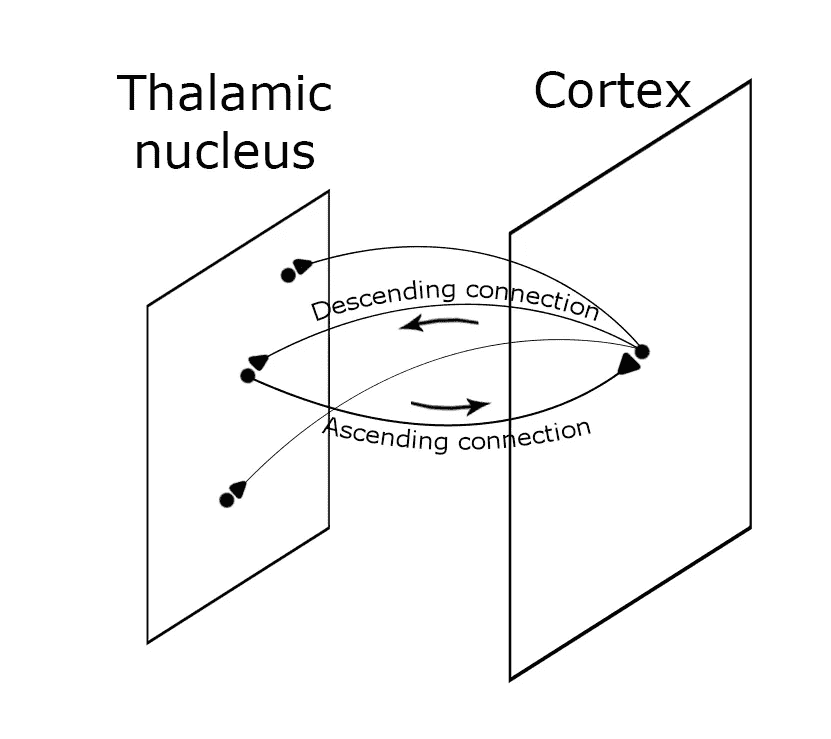

我们需要四张贴图来模拟混响过程。在这里，我将图像称为贴图，如果我们的模型需要，我们将对其应用一些像素着色器。

丘脑核的地图，我们将在上面投射一些图像，在这种情况下，来自标准 MNIST 集的手写数字的例子。MNIST 数据集中的影像为 28x28 像素，因此我们也将该地图设置为 28x28 像素。在这个版本中，皮质地图将是 21x21 像素。
上行突触连接图将存储连接丘脑核图和皮层图的突触的所有权重值。通常，皮质的每个像素超柱将与丘脑核图的 64 个(8×8 核)像素具有突触。如果你以一个像素的增量将 8×8 像素内核与丘脑核图一起移动，那么你就可以制作上行突触连接的地图。相应地，这给出了皮层图的大小 28–8+1 = 21，反过来，上行突触联系的图的大小将是 168×168 像素(21×8 = 168)。

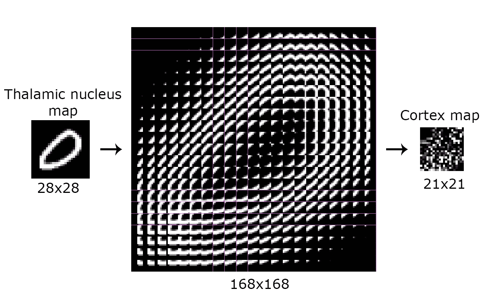

synapse 权重将由一个从 0 到 1 的数字确定，这便于在贴图上进行图形显示，并允许您以图像的形式存储和处理这些参数，这也便于使用着色器。
另外重要的一点，在我将要描述的模型中，总是有两张突触连接图:一张是兴奋性突触图，第二张是抑制性突触图。这总是两张同样大小的牌。
已知生物神经系统中突触接触的类型在一生中不会发生变化，即一个激励性突触不能变成抑制性突触，反之亦然。在计算机神经网络中，突触权重的符号在学习过程中很容易改变，这对于声称是生物的模型来说是不正确的。

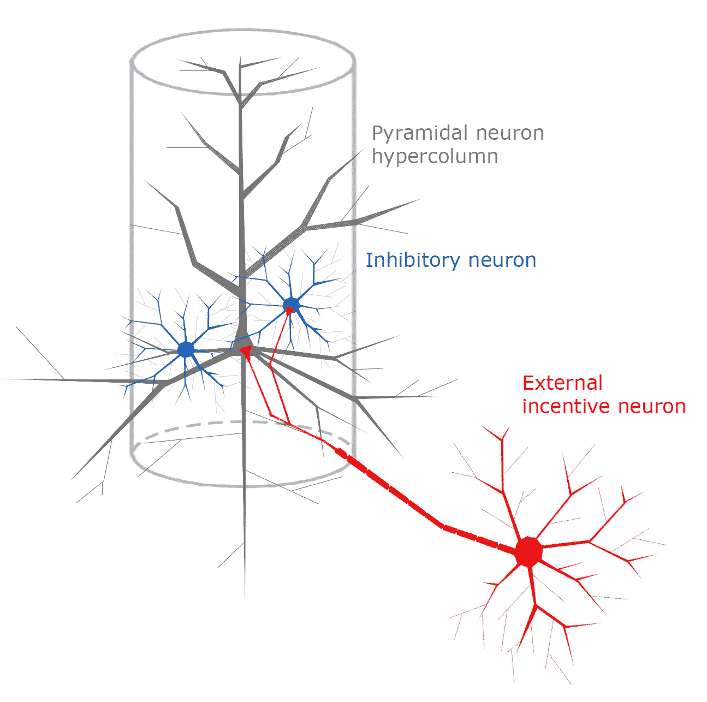

在皮层的柱中，除了兴奋性锥体神经元之外，还有许多抑制性神经元，从兴奋性细胞指向该柱的任何轴突都可以与兴奋性和抑制性细胞建立突触联系。类似地，我们有两张突触联系卡，一张用加号，另一张用减号。在这两张卡片中，权重将由 0 到 1 之间的一个数字决定。我们用从 0 到 1 的随机数填充上行突触联系的权重值。
下行突触连接的图谱会明显变大。如前所述，生物大脑中的下行连接要多几倍。在我们的例子中，我们选择一个地图大小来演示在节点中存储图像的概念。皮层图的每个像素超柱将与丘脑核图的每个像素相关联，即每 784 个像素(28×28 = 784)，则图的大小将是 588×588 像素(21×28 = 588)。

最初，下行突触连接图中的权重值将全部等于 0，但是我们将在训练期间改变这些权重。
我们在这种情况下应用于神经系统的教学方法已经得到实验证实，这就是 Hebb 法则。它最简单的解释是:我们一起工作，意味着我们加强了联系；也有不好的一面:如果他们不能一起工作，这种联系就会减弱。
首先，让我们举一个例子，将我们的模型投影到丘脑核的地图上。然后，通过向上的连接，我们在大脑皮层的地图上有一个求和的效果。对于皮层图的每个像素，来自上行突触连接图的所有相应权重被相加，乘以丘脑核图的相应像素的活动水平值。来自上行突触连接的抑制图的权重值将加上负号。所得数量乘以选定的系数，称为灵敏度系数。在这种情况下，它是 0.5。
如果收到的总和小于或等于零，那么像素超柱不被激活，其活动性等于零。如果得到的和大于 1，那么树皮图的像素值将等于 1，就像超圆柱的最大激活度一样。如果总和的值在 0 到 1 的范围内，那么树皮图的像素超列将采用该值。

选择灵敏度系数，使得作为求和的结果，皮层图的大量超柱没有被激活，因为当使用感应时，这导致活动的相互抑制。此外，灵敏度因子不能太低，因为这会导致超柱的活性非常低。

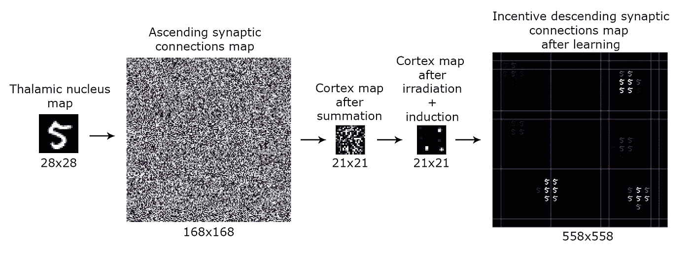

接下来，我们将照射和诱导着色器应用于皮质贴图。我们可以多次应用这个着色器。结果，我们在皮层图上得到几个节点。然后，我们转向下行突触连接图，并对其应用 Hebb 规则进行学习。我们是这样使用它的:在联合触发的情况下，我们显著地加强了突触联系。如果突触前起作用，而突触后不起作用，那么我们只会少量削弱突触连接。这种情况下，有了联合触发，突触的权重会增加 0.8；在没有联合触发的情况下，重量只会减少 0.1。因为巧合比它们的缺席更重要。注意，突触前被调节，而不是突触后被调节，尽管现在这并不重要，因为整个突触由一个重量调节，但这具有重要的思想意义。事实是，在经典的神经网络中，重点是突触后的调节，突触前的变化被完全忽略，尽管在生物神经网络中，突触的两个部分都发生变化，并且在突触前，它们通常更明显([大脑与计算机神经网络的比较](https://blog.goodaudience.com/comparison-of-the-brain-with-a-computer-neural-network-3ecd3c1fef57))。

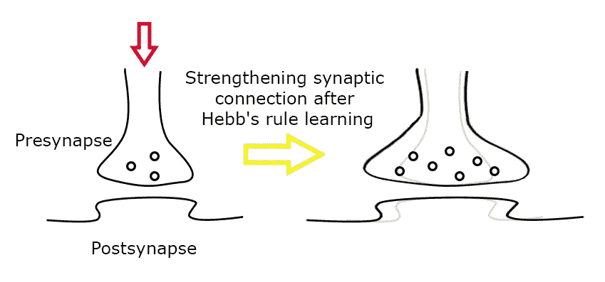

对于一个下行突触连接的抑制性图谱，应用 Hebb 法则是符合逻辑的，相反，前突触活跃时，后突触不激活时，抑制性连接会增加。
这是使用 100 个例子(每个图 10 个例子)训练后下行突触连接图的样子。

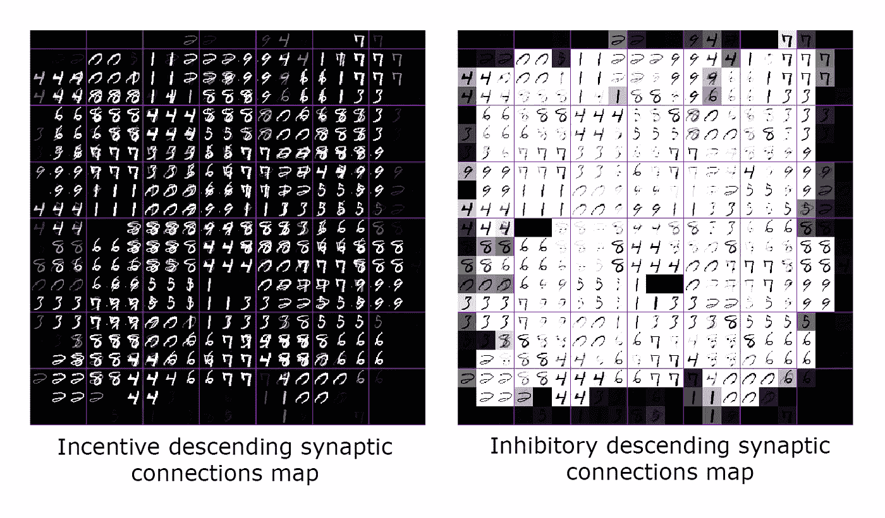

你可以看到下行突触连接的地图反映了整数的图像，在那些对应于这些图像上被激活的节点的地方。这是可能的，因为为每个微柱选择的反馈数量覆盖了丘脑核的整个图；如果反馈只覆盖了地图的一部分，那么超圆柱只能存储图像的一部分。所以在节点中，可以写入一些图像或图像的一些组成部分。
激活时，节点“看”到激活它的活动，并把它保存在自身中。可以说，这些节点存储了一些图像的参考示例。

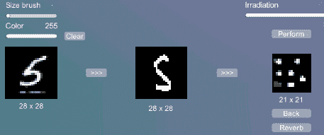

现在，在学习了下行突触连接的图谱后，你就可以开始兴奋的循环传递了——混响。
我们可以看到这样的例子，一个例子在丘脑核的地图上的初始投影如何在混响的过程中转换成同一图形的某个参考版本，有了这个版本，混响就稳定了。
这个过程非常类似于 Hopfield 网络的工作，由于存在循环连接，这种类型的神经网络在我看来最接近生物神经网络的工作。与 Hopfield 网络相比，在我们的版本中，节点有一定的分离，这提供了一些优势。Hopfield 网络的输入和输出数目是相同的，每个神经元通过递归连接与其他神经元相连。事实证明，每个图像都存储在每个神经元的权重中，这大大降低了网络的容量。在我们的例子中，选择不同的列组来存储单独的图像。我们的网络版本更容易理解，我们可以准确地说出这个或那个元素负责哪个图像。在这里，我们可以跟踪信息的显式表示，类似于大脑皮层中“祖母的神经元”的存在，我们看到了负责特定数字图像的皮层图的像素列。

 [## 机器学习和人工智能如何改变电子商务的面貌？|数据驱动…

### 电子商务开发公司，现在，整合先进的客户体验到一个新的水平…

www.datadriveninvestor.com](https://www.datadriveninvestor.com/2020/11/19/how-machine-learning-and-artificial-intelligence-changing-the-face-of-ecommerce/) 

## 模拟迷幻药对大脑皮层的影响

这个小小的题外话将展示我们的模型和生物大脑工作之间的一些相似之处。事实是，对我们来说，LSD 对树皮的影响是很容易模拟的。LSD 通过其作用干扰神经递质 GABA 的工作，GABA 是皮层的主要抑制性神经递质；它在感应机制中工作。因此，为了模拟这一点，在我们的像素着色器的设置中减少诱导程度就足够了。

与此同时，我们可以看到，通常的边界和节点的大小变得模糊和扩大。如果诱导效应进一步降低，那么活动的焦点可能会合并，形成一些模式。在 LSD 的影响下，大脑皮层中也会出现类似的现象，这一点从服用 LSD 的人身上进行的 MRI 扫描中间接得到了证明，在这种情况下，大脑皮层的活动比正常大脑工作期间要大得多，范围也更广。考虑到几乎每一列都包含图像或其部分，为什么会有图像的混淆和混合就变得很清楚了，损害感知的原因也就很清楚了。大脑功能的这种紊乱对他没有用处。

**药物不利于大脑健康和身体健康。**

## 学习上行突触连接

上行突触连接的调谐也非常重要，因为当使用辐射和诱导时，它们的颜色决定了节点将在哪里出现。
首先，我们将稍微修改和补充我们的模型。首先，我们将增加皮层图的大小；在生物大脑中，皮质的大小或面积比与其相关的皮质下和丘脑核的大小大得多。其次，我们将增加另一个信息处理层，因为较高的层次在教授下面层次的向上联系方面非常重要。
为了增加皮层图的大小，同时保持丘脑核图的大小(28x28 像素)，我们将不得不增加上行突触连接的数量。为此，我们将应用某种神经模型，即连接图。神经图是一种使用双色通道对信号源图的像素坐标进行编码的图像。

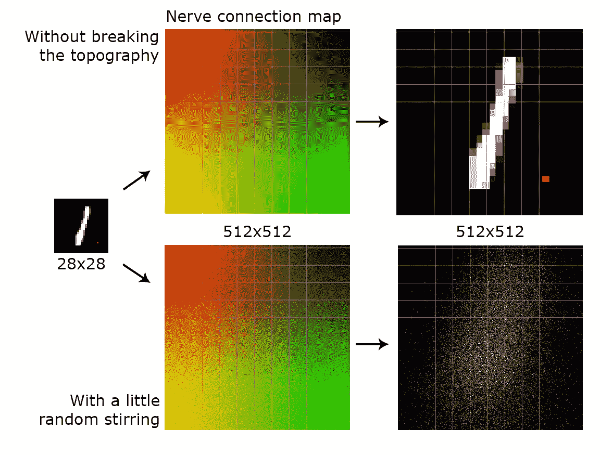

我们可以首先创建一个神经图，其中源图的像素坐标与神经图本身一致。如果我们将这样的神经图应用到我们的丘脑核图上，我们只是得到一个放大的图像。但是如果像素的混合被引入到该神经连接图中，那么使用这样的图将导致这样的事实，即源图的每个像素在神经图上被表示为一组像素，并且根据混合的程度和方法，这些像素的位置将会不同。通过混合，像素以短距离放置在一起，您可以获得一种代表性像素的随机累积。这与来自外侧膝状体的神经元轴突的纤维如何折叠成神经非常相似，其中轴突被重复分离，轴突的末端分散在整个初级视觉皮层中，同时保持视网膜的一些地形图，同时混合。

在我们的版本中，在丘脑核的 28×28 像素图上，我们将应用 512×512 的神经连接图。该神经图将丘脑核图与皮质的 64x64 像素图连接，即，将整个神经连接图分成 8x8 像素正方形，然后每个这样的正方形将通过像素超柱(512/8 = 64)包括所有连接。

神经连接图在网络的学习和运行过程中不发生变化；它是在开始与网络一起工作之前设置的，类似于出生前大脑中神经的形成方式。

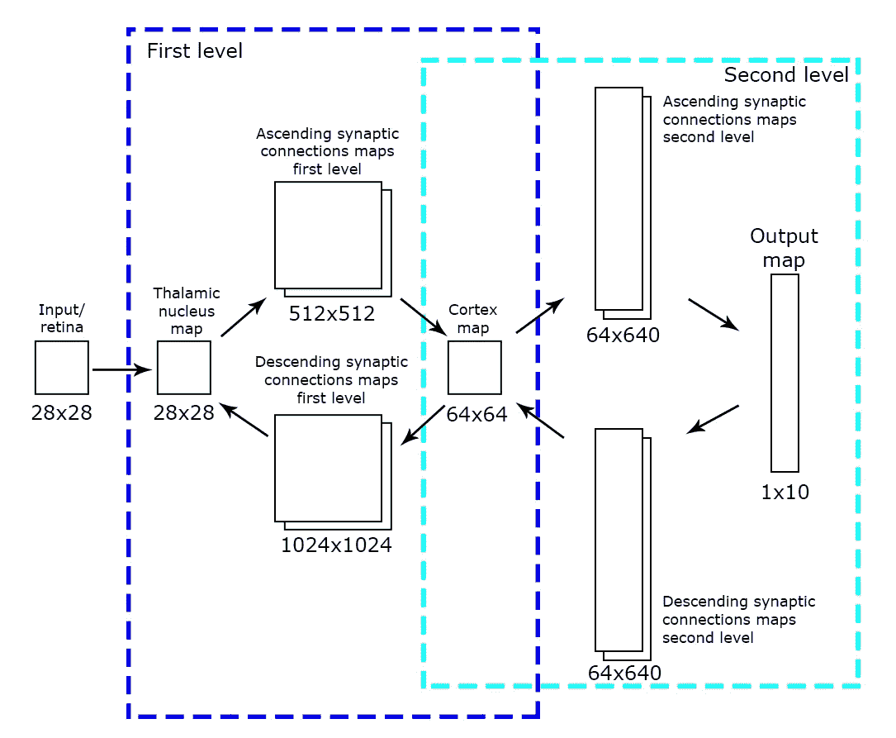

因此，上行突触连接图的大小为 512×512 像素。下游突触连接的图将具有 1024×1024 的大小，因为为了稳定的回响，循环连接的数量必须更大。这里，皮层图的每个像素将对应于丘脑核图的 16×16 个像素(64×16 = 1024)。

下一级的信息处理由输出图表示，其大小为 1x10，每个数字一个像素，因为我们的网络旨在从标准 MNIST 集中识别手写数字。出口图与皮层图的关联方式与丘脑核图与皮层图的关联方式相同。相应地，也有上行突触连接图和下行突触连接图，它们具有 64×640 像素的尺寸。因此，皮层图的每个像素与出口图的每个像素有突触联系，从而出口图的像素具有最大感受野。如前所述，下行突触连接通常比上行突触连接数量多，但在这种情况下，它们的数量将是相同的，因为这将是反向突触连接的最大尺寸。所以出口图的每一个像素都“看到”了皮层图的每一个像素。

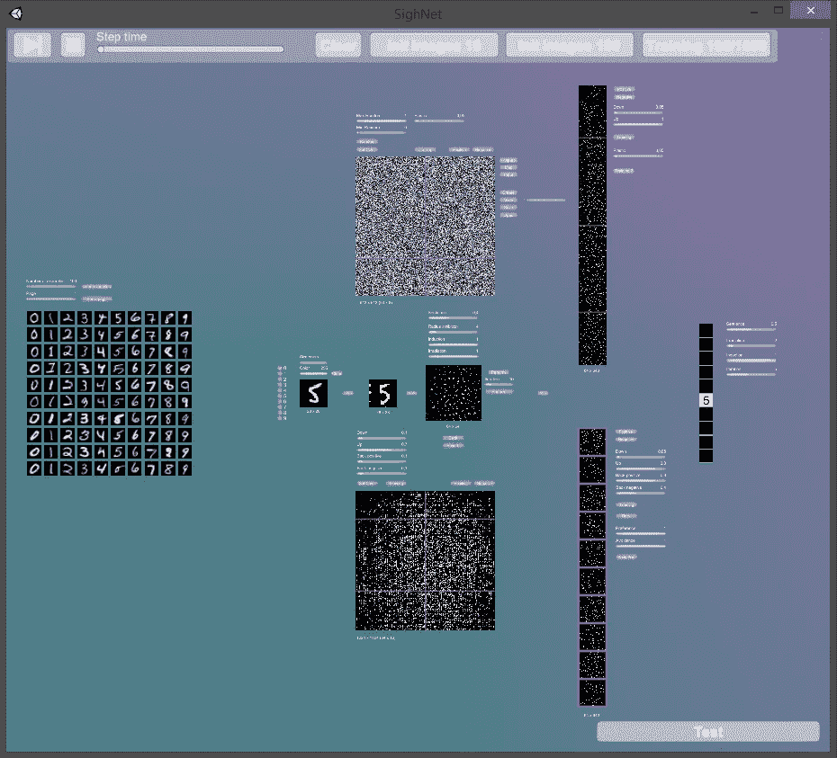

Screenshot of the program

第二层的上行突触连接图的训练或调谐可以根据我们已经应用的 Hebb 规则来进行。在这种情况下，在训练期间，我们将考虑输出图的活动或等于 1 个像素，其对应于一个数字，其示例被呈现给网络。因此，我们似乎将皮层图上的某些活动与所需的输出联系起来，并加强了这种联系。这类似于条件反射的反射弧的形成，因为数字的表示通过与丘脑核图中活动像素的组合的连接而联系起来。因此，由于循环连接而实际上没有通过直接接触连接的元素可以连接并加强它们之间的连接。它可以在许多层面上发挥作用。

但是如果你按照 Hebb 规则训练或者调整第一级的上升突触连接的映射，这个规则导致弱活性的像素-超柱，由于与它们的连接加强，会最大限度地增加它们的活性，这样就会产生大量的活性像素-超柱，这就导致了使用归纳法时的相互压制。这导致了网络质量的严重下降。因此，我们将使用不同的教学方法。它将包括两个阶段。第一阶段是图像的初始化。在这个阶段，我们将使用少量的例子，对每个可识别的数字模式形成一定的基本概念。为此，10 到 100 个例子就足够了，或者每个数字 1 到 10 个例子。在这个阶段，除了第一级上升突触连接图之外，所有突触连接图都将被配置，但它们必须用随机值填充。

首先，我们将示例投射到丘脑核图上，然后使用突触图的随机权重进行总结。在应用辐射和感应着色器之前，我们可以影响皮质贴图，以便不同数量的结果节点不匹配。为了做到这一点，让我们转向第二层的向下连接图，它存储了基于以前的经验形成的每个数字的节点模式的“印记”。因此，如果没有这样的经历，那么就不会对大脑皮层的地图产生影响。例如，如果例子是数字“5”，那么我们将把对应于数字“5”的图像的扇区的下行突触连接的激励图的值添加到皮层的图中。这将增加结在学习数字“5”的最后一个动作中形成这些结的相同位置形成的机会。我们还将从树皮图中减去与数字“5”无关的剩余扇区的值。这有助于确保节点不会在对应于其他数字的位置形成。
在对皮层图的值进行这样的校正后，我们应用负责照射和诱导的像素着色器。

然后，我们根据 Hebb 规则建立第二级的上升突触连接的图，考虑到对应于所呈现的例子的像素将在输出图上是活动的。

此外，根据 Hebb 规则，我们配置了第二层和第一层的下行突触连接图。

这是使用 100 个例子进行这种训练后突触连接的样子:

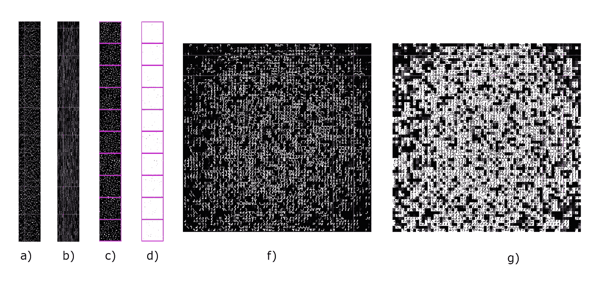

a and b maps of the ascending incentive and inhibitory synaptic connections of the second level; c and d maps of descending incentive and inhibitory synaptic connections of the second level; f and g maps of the descending incentive and inhibitory synaptic connections of the first level

我特别注意第二层的下行突触连接的地图，可以说，在它上面，每个数字的所有节点在皮层地图上的位置都被捕捉到了。此外，各个数字的节点很少重合，也就是说，每个数字都有自己独特的节点模式。

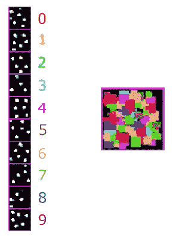

我们进入训练的下一个阶段，在这个阶段中，我们需要主要调整第一级的上行突触连接的图，并且优选地，以这样的方式，呈现给不熟悉的网络的例子在皮层的图上形成对应于该例子的图形的节点模式。为了做到这一点，在求和之后，我们将获得皮层图的值和下行突触连接图的相应示例扇区之间的差异。由于这种差异，有可能调整上行突触连接图中的权重，使得所呈现的示例导致与其图像相对应的节点的活动。

该视频展示了对 100 个随机例子的网络训练和对 10，000 个测试案例的测试。根据所选择的训练实例，也许从随机选择的上游突触连接图的权重，这种测试中的网络给出的结果在 40%到 60%的范围内。这是一个非常适中的结果，但这项任务需要更复杂的网络架构。我们的大脑在相当高的抽象层次上识别数字和符号。相应地，模型需要更多的层次。在生物视觉分析仪中，还使用了一些额外的机制，一种来自神经元网络的特殊过滤器，这些神经元对特定方向的刺激做出反应。该过滤器简化了视觉信息的处理。增加这样一个过滤器也能提高我们网络的质量。所有这些修改都需要进一步的研究，这方面的工作将继续下去。这篇文章和这个例子的目的是讲述这个模型和方法的一些理论方面。

通常，艺术家不会像绘图仪那样画图，从顶角开始，一次画出底层作品的所有细节。首先，艺术家在画布上画出一张草图，上面用细到几乎看不到的线条来表示艺术概念的总体规划。渐渐地，这幅画变得细节过多，越来越小，最后只有最精确和几乎不明显的笔触被应用。同样，你需要解决大脑建模的问题。试图通过顺序创建具有多种类型的神经元和神经递质的多个突触连接的皮质模块来详细建模是没有希望的。最好的解决方案是通过逐渐向模型中添加必要的细节来创建单个机制的初始简单模拟。

试图模拟大脑皮层中两种简单机制的相互作用，使我产生了上述超网络的想法。超高效神经网络思想的发展将从根本上改变人工智能领域的事态。这样的网络不需要大量的训练数据，这意味着许多由于收集训练数据的复杂性而在机器学习中难以实现的任务将得到解决，在应用问题中的开发速度将显著加快。训练用的计算资源不会要求那么高，也就是说不需要用专门的架构来构建功能强大的计算机，这是非常昂贵和费力的。开发者将变得不那么依赖技术、数据和服务。每个人都可以创造出很酷的智能软件，而不需要很高的成本。这将在人工智能领域创造大量有趣的新技术解决方案。

**进入专家视角—** [**订阅 DDI 英特尔**](https://datadriveninvestor.com/ddi-intel)