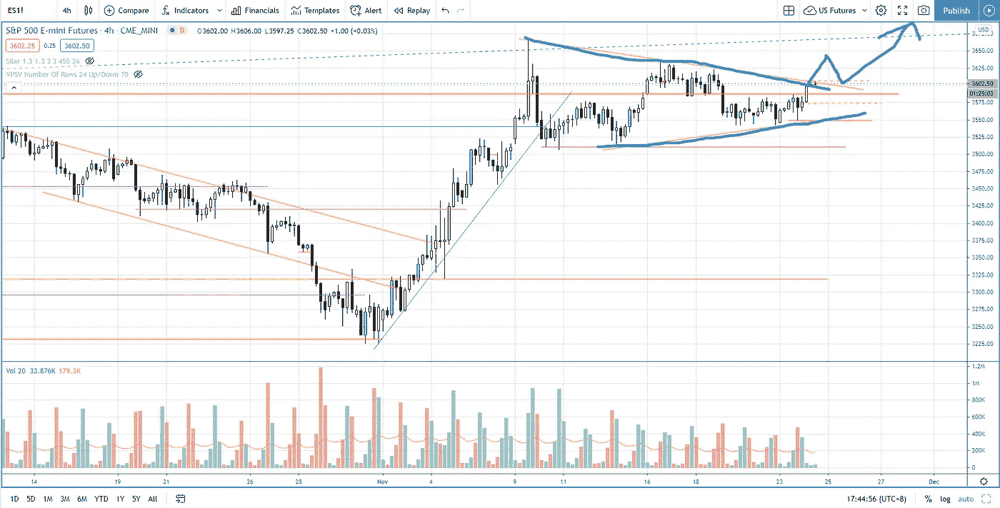

# 如何交易正在形成的对称三角形(没人告诉你)

> 原文：<https://medium.datadriveninvestor.com/a-symmetrical-triangle-pattern-in-the-making-s-p-500-day-trading-f6f3a63c04d8?source=collection_archive---------12----------------------->

标准普尔 500 股市是否将突破对称三角形格局，挑战历史高点？在股市展望中一探究竟。

观看视频，了解 2020 年 11 月 24 日交易时段标准普尔 500 指数期货的**每日市场分析。在这段视频中，你将看到上一个交易日的市场回顾和三分钟内的潜在交易回顾(包括进场、出场和背后的原理)。展望未来，我将涵盖偏见，要注意的关键水平，我稍后的交易计划。**

## 时间戳

*   [1:24](https://www.youtube.com/watch?v=x4jMfxd626Y&t=84s) 市场回顾
*   [3:40](https://www.youtube.com/watch?v=x4jMfxd626Y&t=220s) 贸易回顾
*   [4:35](https://www.youtube.com/watch?v=x4jMfxd626Y&t=275s) 假突破
*   供应增加的疲软迹象
*   [7:45](https://www.youtube.com/watch?v=x4jMfxd626Y&t=465s) 当前股市展望

如果你还没有看我的[每日市场分析视频](https://www.youtube.com/watch?v=jZRKJbVURQQ)，为了更好地了解市场回顾和交易回顾。

**偏向** —中性(日内交易)；看涨(长期)

**关键点位** —阻力:3660，3630；支持:3587，3550，3500

**潜在设置** —在关键级别寻找潜在反转。

# 资源

**每周市场展望&最佳交易建议【https://www.tradeprecise.com/】直达您的收件箱:[最佳交易建议](https://www.tradeprecise.com/)**

**职业免费**制图平台:创建账户→[www.TradingView.com](https://bit.ly/2U2Femd)

非美国居民？ ( **马来西亚、新加坡**、澳大利亚、新西兰、欧洲等):[点击此处，存款 2000 新加坡元](https://ji.hn/sgtiger)即可获得**免费股票(价值 100++美元)&老虎经纪**的欢迎礼物

美国居民？[点击此处，存款 1500 美元](https://ji.hn/ustradeup)，就有机会在 TradeUP 获得**份免费的 AMZN(价值 3000++** ) & **份欢迎礼物**

**从媒体获取无限文章** —加入以下:[https://priceactiontrading.medium.com/membership](https://priceactiontrading.medium.com/membership)

# 进一步阅读

 [## 凯西·伍德警告市场即将调整——标准普尔 500 价格走势分析

### 在 2020 年 12 月 18 日对彭博的采访中，方舟投资公司的首席执行官兼首席信息官凯西·伍德警告说…

medium.com](https://medium.com/datadriveninvestor/cathie-wood-warns-market-correction-soon-price-action-analysis-on-s-p-500-7e621e013310)  [## 阿里巴巴崩溃——马云失踪了吗？—购买或销售

### 自 2020 年 10 月以来，阿里巴巴股价暴跌 34%，负面消息不断。巴巴触底了吗还是…

medium.com](https://medium.com/datadriveninvestor/alibaba-baba-crashes-is-jack-ma-missing-buy-or-sell-90c20dd6ba21)  [## 用异常的交易量和价格确定市场方向——标准普尔 500 日交易

### 了解如何确定日交易标准普尔 500 时异常的成交量和价格趋势的市场方向…

medium.com](https://medium.com/datadriveninvestor/identifying-market-direction-with-unusual-volume-and-price-s-p-500-day-trading-eec9fb9854b5) 

Photo by Author — Ming Jong Tey

Photo by Author — Ming Jong Tey

披露:如果您点击本文中的链接进行购买或开立账户，并将所需金额存入推荐的经纪人账户，我们将免费为您赚取佣金。

免责声明:本演示中的信息仅用于教育目的，不应作为投资建议。