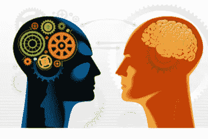
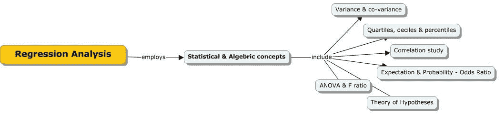
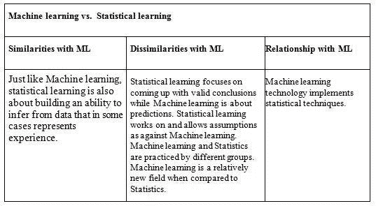

# 对统计学家思维方式的一点看法

> 原文：<https://medium.datadriveninvestor.com/a-take-on-statisticians-way-of-thinking-b1d45b8c2390?source=collection_archive---------27----------------------->

*Source: Web*

当我试图学习概率机器学习下的贝叶斯、回归分析和基于实例的学习技术时，我意识到统计技术有多深，以及它们如何形成上述监督学习技术的基础。下面显示的是基于回归分析的算法使用的统计和代数概念的思维导图。

我想用一种简单的方式来解释统计学家的思维过程，这是我的观点。

统计学家的目标是使用数据回答来自不同领域的人提出的问题。典型的工程方法使用一些不需要数据来回答问题的主观/客观方法。但是，统计学家总是看数据来回答问题。他们还在所有模型中加入了可变性(在两个不同时间对准确数量进行的测量会略有不同的概率)。

 [## DDI 编辑推荐:5 本让你从新手变成专家的机器学习书籍

### 机器学习行业的蓬勃发展重新引起了人们对人工智能的兴趣

www.datadriveninvestor.com](https://www.datadriveninvestor.com/2019/03/03/editors-pick-5-machine-learning-books/) 

让我们举个例子:M.F .侯赛因是个好画家吗？回答这个问题的一种方法是根据一些公认的绘画质量标准(由个人或团体)来衡量绘画。在这种情况下，答案可能是基于创造性的表达，颜色的使用，形式和形状。我相信侯赛因先生是个好画家。在这种情况下，这种反应可能相当主观(这意味着你从一个人那里得到的反应可能与你从另一个人那里得到的反应非常不同)。统计学家对此的回答方法大相径庭。他们首先从被认为是评估绘画质量专家的人群样本中收集数据(大学艺术教授、其他艺术家、艺术收藏家等等)。然后，在分析数据后，他们会得出这样的结论:“从 3000 名调查参与者(每个类别的参与者人数相等)的数据来看，75%的大学艺术教授、83%的专业艺术家和 96%的艺术收藏家认为 M.F .侯赛因先生是一位优秀的画家”。因此，可以说他被大多数人认为是一个好画家。很明显，这是一个非常客观的衡量标准。

总的来说，在统计学习中，预测函数主要是从数据样本中得出的。在这个过程中，如何收集、清理和管理数据非常重要。统计学非常接近数学；它是关于量化数据和操作数字的。这是一个简单的表格，比较和区分了统计学习和机器学习

