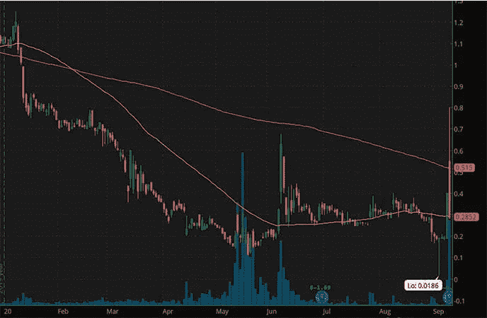
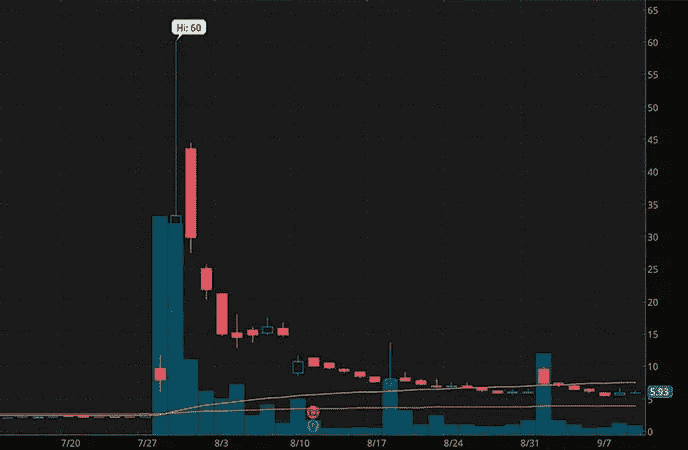
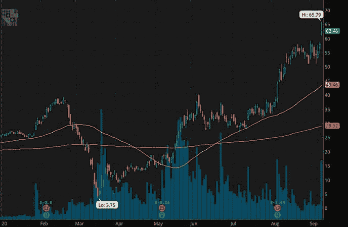

# 一个 3 便士股票的故事:破产、丑闻和甜蜜的成功

> 原文：<https://medium.datadriveninvestor.com/a-tale-of-3-penny-stocks-bankruptcy-scandal-sweet-success-d22aec9721b5?source=collection_archive---------34----------------------->

# 3 只仙股(有些是以前的),有着非常不同的故事

[什么定义了仙股](https://pennystocks.com/penny-stocks-trading)？是交易它的交易所吗？会不会是股票的市值？虽然有些人可能会试图将这一点复杂化，但定义一只仙股的仅仅是它的价格。根据 T2 对细价股的标准定义，这些股票的交易价格低于每股 5 美元。

某些交易者多年来已经制定了自己的定义。然而，你的普通细价股将会低于 5 美元。说了这么多，2020 年是疯狂的一年。我们不仅看到了疯狂的经济状况，还看到了无数行业的巨大动荡。

不管我们谈论的是科技、房地产、零售、交通还是能源；你说吧。每个部门和每个行业都感受到了一些严重的压力。在此之后，许多典型的“[蓝筹股](https://pennystocks.com/learn-to-trade-penny-stocks/2019/09/21/penny-stocks-basics-of-blue-chip-companies/)”最终变成了低价股。其中一些公司甚至破产或彻底停业。另一方面，一些最不知名的公司最终在创造的“新常态”中蓬勃发展。

**阅读更多**

*   [学习交易技巧&如何每天持续盈利](https://truetradinggroup.com/ttg-three-subscription-page/?utm_source=PS_ArtBlock&utm_medium=PS_ArtBlock&utm_campaign=PS_ArtBlock&utm_term=PS_ArtBlock&utm_content=PS_ArtBlock)
*   这些是在 1 美元以下买入的最佳仙股吗？3 立即观看
*   [现在买什么仙股最好？4 个需要知道的名字](https://pennystocks.com/featured/2020/09/11/best-penny-stocks-to-buy-now-4-to-know-september-11-2020/)

谁能想到像赫兹这样的公司会成为今年 0.50 美元以下的股票之一？此外，你能想象马拉松石油公司的交易价格低于 5 美元吗？与此同时，无数历史有限的生物技术细价股经历了爆炸性的波动。在这种情况下，我想到了诺瓦瓦克斯。

# 细价股购买，出售，持有，或完全折叠

今年早些时候，它的交易价格低于 5 美元，仅几个月后就达到了 189.40 美元的高点。不用说，当有人问“细价股值得吗”时，2020 年将带来一个全新的思考过程来寻找最佳答案。突破和崩溃硬币的两面都有更多的例子。让我们来看看今年到目前为止，3 仙股和 5 美元以下的前股票是如何表现的。

 [## 胁迫时期提升美国劳动力技能|数据驱动的投资者

### 给一个人一条鱼，他可以吃一天。教一个人钓鱼，你可以喂他一辈子。令人吃惊的是…

www.datadriveninvestor.com](https://www.datadriveninvestor.com/2020/08/26/upskilling-the-american-labor-force-during-a-time-of-duress/) 

# 彭尼公司

对于 J.C. Penney Co. ( [JCPNQ 股票报道](https://pennystocks.com/ticker/?symbol=JCPNQ) )(JCP)来说，这从来都不是一个巨大胜利的故事。在过去的几年里，我们断断续续地报道了这家公司。尽管该公司在扭亏为盈方面取得了长足进步，但其“新举措”却不尽如人意。在冠状病毒的任何传言之前，市场上最古老的零售商之一 J.C. Penney 正在处理问题。该公司一直未能实现盈利，同时也出现了亏空。你也不能忘记该公司已经对抗了相当长一段时间的巨额债务负担。

此外，随着实体店退居电子商务之后，零售连锁店继续关闭门店。正如我在过去讨论过的，以实体店面闻名的零售细价股一直在强化他们的砖块和点击策略。这包括既要有物理位置，也要有同样突出的在线存在。这不是对 J.C. Penney 的描述，JCPNQ 的股价清楚地反映了这一点。

**【阅读更多】** [本周 Fiverr (FVRR)有没有推动这些细价股走高？](https://pennystocks.com/featured/2020/09/10/fiverr-fvrr-stock-pushed-penny-stocks-higher-september-10-2020/)

最近，JCPNQ 股票经历了异常强劲的上涨势头。周三，股价从 0.19 美元左右飙升至 0.40 美元的高点。这种趋势在周四持续了很短时间，JCPNQ 股票达到了 0.80 美元的高点。但随后一切又恢复正常。收盘时，JCPNQ 股票已从高点下跌近 65%，仅比一天前的开盘价低 11 美分。最初令人兴奋的是，据报道，该公司已经安排了一个追求者以 8 亿美元收购这家零售商。这实际上会成为 J.C. Penney 的一个转折点还是下滑更低时的颠簸？

# 伊士曼·柯达公司

如果有一件事是确定的，那就是伊士曼·柯达公司(KODK 股票价格)已经经历了财务困境。这家因“柯达时刻”而闻名的公司今年迎来了它的[短暂]时刻。7 月，仙股(当时)的交易价格约为 2.13 美元，突然在 3 天内飙升至 60 美元的高点。成交量大幅飙升的背后是什么？

据报道，根据国防生产法案，它正在争取 7.65 亿美元的政府贷款。虽然确实有一项潜在的协议摆在桌面上，但当美国总统兜售这项协议时，意向书上的墨水还没有干。显然，交易员将这些话视为确认，尽管当时负责审查这笔交易全部范围的部门并没有这么做。

快进一点，美国国际发展金融公司暂停贷款。对不当行为的指控以及对高管和董事会成员股票期权的担忧是根本原因。这一丑闻导致 KODK 股票从 7 月份的高点大幅下跌，但还不足以再次成为仙股(到目前为止)。

**【了解更多】** [细价股&尽职调查:了解重要的 SEC 文件](https://pennystocks.com/featured/2020/09/05/penny-stock-basics-how-to-read-sec-filings-types/)

在过去的几天里，KODK 的股票获得了一点喘息的机会，这源于围绕机构购买其股票的兴奋情绪。本月早些时候，对冲基金 D.E. Shaw 新购入该公司 5.2%的股份。此外，本周，东南资产管理公司在一份 [13G 文件](https://pennystocks.com/ticker/?symbol=KODK#tabs-7)中报告了 KODK 股票 15.8%的股份。这足够让船恢复正常吗？

# 宾夕法尼亚国家博彩公司(Penn)

还记得我是如何谈论从未被认为是细价股的股票吗？PENN National Gaming Inc .([PENN Stock Report](https://pennystocks.com/ticker/?symbol=PENN))今年就是其中之一。虽然短暂，但在市场大规模抛售中，PENN 股价在 3 月份跌至 3.75 美元。

宾州国家博彩公司股票的正常价格通常在 20 美元左右。今年 2 月，该指数还飙升至 39.18 美元的高点；创下 52 周以来的新高。然而，冠状病毒在全球范围内的封锁给 PENN stock 以及无数其他游戏股票带来了灾难，如 EVRI、米高梅、CZR 和其他公司。不用说，接下来的几个月对赌场股票来说无疑是令人印象深刻的。

本周，Penn gaming 的股价已经创下 52 周新高，达到 65.79 美元。另外值得一提的是，这也是宾州股票的历史新高。本周，该公司宣布，宾夕法尼亚州博彩控制委员会已经批准在宾夕法尼亚州对其新的 Barstool Sportsbook 移动应用程序进行现场真钱测试。

Penn National 总裁兼首席执行官杰伊·斯诺登(Jay Snowden)表示:“Barstool Sportsbook 应用是我们公司全渠道战略的核心。随着 NFL 准备“开球”，体育博彩相关股票的交易活动再次激增。

此外，Rosenblatt 分析师 Bernie McTernan 对 PENN 股票的评级为买入，目标价为 80 美元。他说，“佩恩有机会在网上体育博彩市场获得巨大的份额，其利润率高于同行，这是由他们的酒吧伙伴关系和物理足迹推动的。”

*原载于 2020 年 9 月 11 日*[*【https://pennystocks.com】*](https://pennystocks.com/featured/2020/09/10/tale-3-penny-stocks-bankruptcy-scandal-sweet-success-september-10-2020/)*。*

**访问专家视图—** [**订阅 DDI 英特尔**](https://datadriveninvestor.com/ddi-intel)