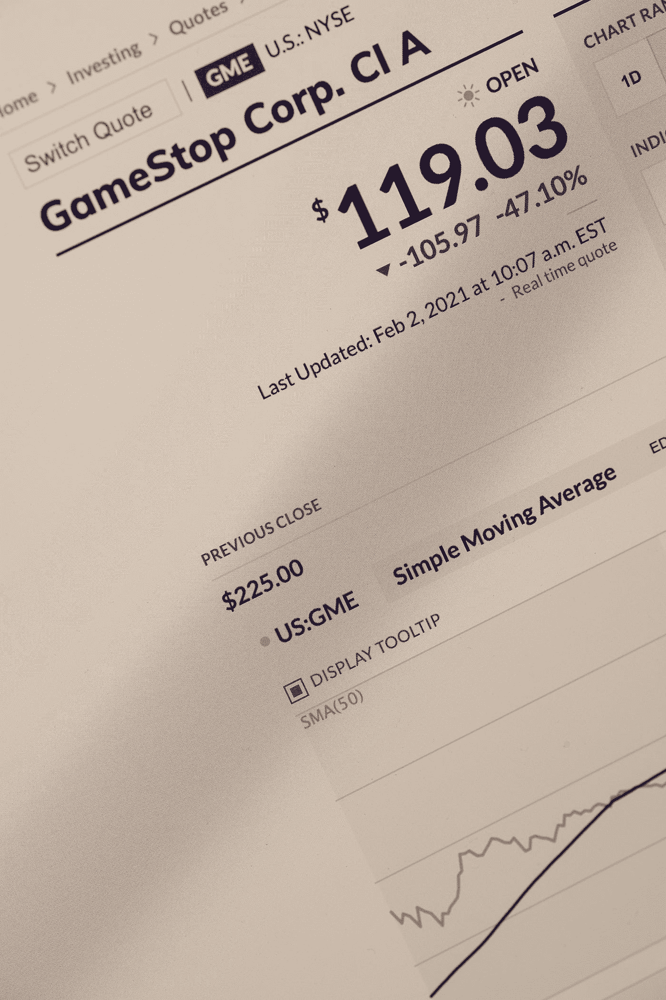
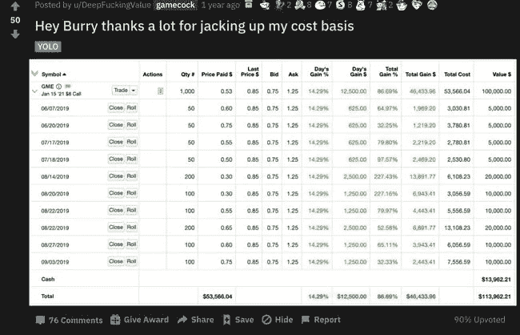

# GameStop 传奇的时间线

> 原文：<https://medium.datadriveninvestor.com/a-timeline-of-the-gamestop-saga-c6ddd913b2a3?source=collection_archive---------10----------------------->

长达 16 个月的互联网与华尔街之战

Photo by [Markus Spiske](https://unsplash.com/@markusspiske?utm_source=medium&utm_medium=referral) on [Unsplash](https://unsplash.com?utm_source=medium&utm_medium=referral)

2019 年 9 月，在 GameStop 出现之前的 16 个月，Reddit 上一位名叫 u/deepfuckingvalue 的用户发布了一张他的股票经纪账户截图，其中包含在名为 r/WallStreetBets 的子编辑上对 GameStop 的长期呼吁。WallStreetBets 是一个子网站，用户在这里分享他们的冒险游戏，并就他们的收益或损失制作搞笑的模因。他很早就投资了 GameStop，并在 Michael Burry(来自电影《大空头》)购买同一家公司的股票时公布了他的头寸。然而，subreddit 的许多人嘲笑他在这样一个“衰落的行业”购买股票，并告诉他在一两年内他不会找到任何人出售他的股票。当时没人知道 u/deepfuckingvalue 的投资最终会体现在什么方面。

u/DeepFuckingValue’s original post **(Reddit: r/WallStreetBets)**

Deepfuckingvalue 是一名前保险经纪人，Youtuber，父亲住在马萨诸塞州。虽然他的个人资料非常正常，但他看到了别人在 GameStop 看不到的东西。作为一名价值投资者，他对 GameStop 的财务状况和业务前景充满信心，并以每股 4 美元的价格向其股票投入了 5 万美元。每个月，他都会在华尔街的 Bets 上发布他的最新仓位和收益，在那里他经常被嘲笑。然而，一年后，GameStop 的交易价格达到了每股 10~12 美元，是他最初投资的三倍。

事情在 2020 年 12 月发生了重大转折，当时 Chewy 的亿万富翁创始人瑞安·科恩通过购买 900 万股股票加入了 GameStop 的执行董事会。这对该公司来说是一个重大消息，因为 Ryan Cohen 是一位电子商务巨头，他可能会将 GameStop 的商业模式从目前的实体模式转变为更加专注于在线的模式。这让投资者兴奋不已，并吸引了华尔街的许多用户意识到 Deepfuckingvalue 可能一直都是对的。许多 Reddit 用户的兴奋和参与推动 GameStop 的价格在 1 月初上涨到每股近 40 美元。

这是卖空者大举介入的时候。卖空者押注一家公司股价下跌以获利，他们卖空了 GameStop 中约 140%的流通股。这意味着对冲基金在 GameStop 的下跌上下了很大的赌注，许多 Reddit 用户认为这是对他们最喜欢的股票的挑战。此时，一个做空的想法在 Reddit 用户中流行起来。

做空是指股价飙升，对冲基金别无选择，只能以任何价格回购，随后进一步推高股价。Reddit 用户被这个想法迷住了，这个想法是由社区中许多 GameStop 的早期投资者提出的，比如 Deepfuckingvalue。这促使社区将股价推高到卖空者别无选择，只能以用户决定的任何价格回购的地步。

从 1 月 21 日到 26 日，在一个交易周内，GameStop 的股价从 43 美元飙升至 147 美元。第二周，价格跃升至 483 美元的高点，许多人怀疑这是由于围绕股票的兴奋情绪和许多卖空者急于回补他们的头寸。然而，Reddit 用户对更大的空头挤压持乐观态度，并在狂热中继续购买 GameStock。其他被严重做空的股票，如黑莓、诺基亚、AMC 以及 Bath and Bodyworks 也受到了提振。

1 月 28 日，美国最大的散户经纪公司 Robinhood 阻止了 GameStop 股票的购买。这使得许多政治家和有影响力的人，如 AOC、特德·克鲁兹、伊丽莎白·沃伦、本·夏皮罗、埃隆·马斯克和马克·库班，纷纷批评罗宾汉阻止散户投资者投资的举措。Reddit 上的许多人对此感到愤怒，媒体此时正在创造 Reddit 与华尔街的故事。

在罗宾汉阻止购买后，股价在不到一小时内跌至 193 美元，自那以来，股价大幅波动。Reddit 用户仍然相信他们能够战胜对冲基金，媒体认为对 GameStop 的炒作在一周之后就要结束了。无论结果如何，这一长达 16 个月的传奇将作为股票市场历史上最有趣、最扣人心弦的时刻之一被人们铭记。