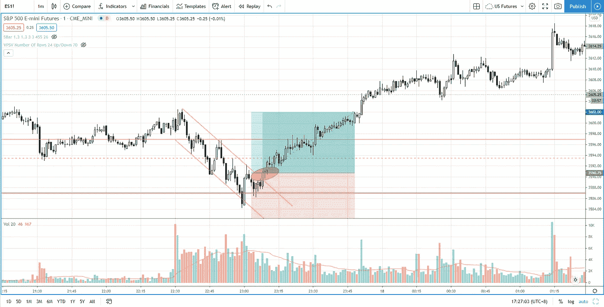
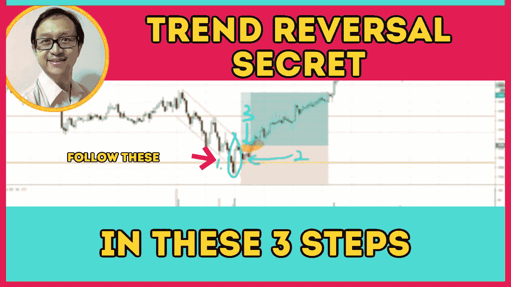

# 趋势反转交易策略(有效)——标准普尔 500 日交易

> 原文：<https://medium.datadriveninvestor.com/a-trend-reversal-trading-strategy-that-works-s-p-500-day-trading-193443c731d2?source=collection_archive---------5----------------------->

了解如何使用这种有利可图的趋势反转交易策略，以最小的风险抓住底部。

观看视频，了解 2020 年 11 月 18 日交易时段标准普尔 500 指数期货的**每日市场分析。在这个视频中，你将看到最后一节的市场回顾和三分钟内的交易回顾(包括进场、出场和背后的原理)。展望未来，我将涵盖偏见，要注意的关键水平，我稍后的交易计划。**

## 时间戳

*   [1:24](https://www.youtube.com/watch?v=jZRKJbVURQQ&t=84s) 市场回顾
*   [3:23](https://www.youtube.com/watch?v=jZRKJbVURQQ&t=203s) 贸易回顾
*   寻找性格上的改变
*   [8:53](https://www.youtube.com/watch?v=jZRKJbVURQQ&t=533s) 最大上涨浪之后是浅回调
*   [10:00](https://www.youtube.com/watch?v=jZRKJbVURQQ&t=600s) 威科夫法律的努力与结果
*   [12:15](https://www.youtube.com/watch?v=jZRKJbVURQQ&t=735s) 当前股市展望

如果你还没有看我的[每日市场分析视频](https://www.youtube.com/watch?v=dkV5unIb93M)，为了更好地了解市场回顾和交易回顾。

**偏向** —中性(日内交易)；看涨(长期)

**关键点位** —阻力:3660，3630；支持:3587，3500

**潜在设置** —在关键级别寻找潜在反转。

# 资源

**每周市场展望&最佳交易建议**直达您的收件箱:[https://www.tradeprecise.com/](https://www.tradeprecise.com/)

**职业免费**制图平台:创建账户→[www.TradingView.com](https://bit.ly/2U2Femd)

**非美国居民？** ( **马来西亚、新加坡**、澳大利亚、新西兰、欧洲等):[点击此处，存款 2000 新加坡元](https://ji.hn/sgtiger)即可获得**免费股票(价值 100++美元&老虎经纪**的欢迎礼物)

美国居民？[点击此处，存款 1500 美元](https://ji.hn/ustradeup)，就有机会在 TradeUP 获得**份免费的 AMZN(价值 3000++** ) & **份欢迎礼物**

**从媒体获取无限文章** —加入以下:[https://priceactiontrading.medium.com/membership](https://priceactiontrading.medium.com/membership)

# 进一步阅读

 [## 抓住底部和上升趋势开始的 3 个简单步骤——标准普尔 500 日交易

### 找出如何使用这 3 个简单的步骤来抓住底部，并参与上升趋势的开始，当一天…

medium.com](https://medium.com/datadriveninvestor/3-simple-steps-to-catch-the-bottom-and-the-start-of-the-uptrend-s-p-500-day-trading-5b1097b081a0)  [## 简单而有利可图的强势反弹交易策略——标准普尔 500 日交易

### 了解如何交易这个简单而有利可图的力量反弹交易设置时，日交易标准普尔 500 期货。

medium.com](https://medium.com/datadriveninvestor/a-simple-and-profitable-sign-of-strength-rally-trading-strategy-s-p-500-day-trading-1bf7d854e519)  [## 如何通过提前退出将损失降到最低——标准普尔 500 日交易

### 了解如何发现价格结构中的故障，并通过提前退出而不是完全退出来最小化损失

medium.com](https://medium.com/datadriveninvestor/how-to-minimize-losses-with-early-exit-s-p-500-day-trading-866dc487d4ec) 

Photo by Author — Ming Jong Tey

Photo by Author — Ming Jong Tey

披露:如果您点击本文中的链接进行购买或开立账户，并将所需金额存入推荐的经纪人账户，我们将免费为您赚取佣金。

免责声明:本演示中的信息仅用于教育目的，不应作为投资建议。