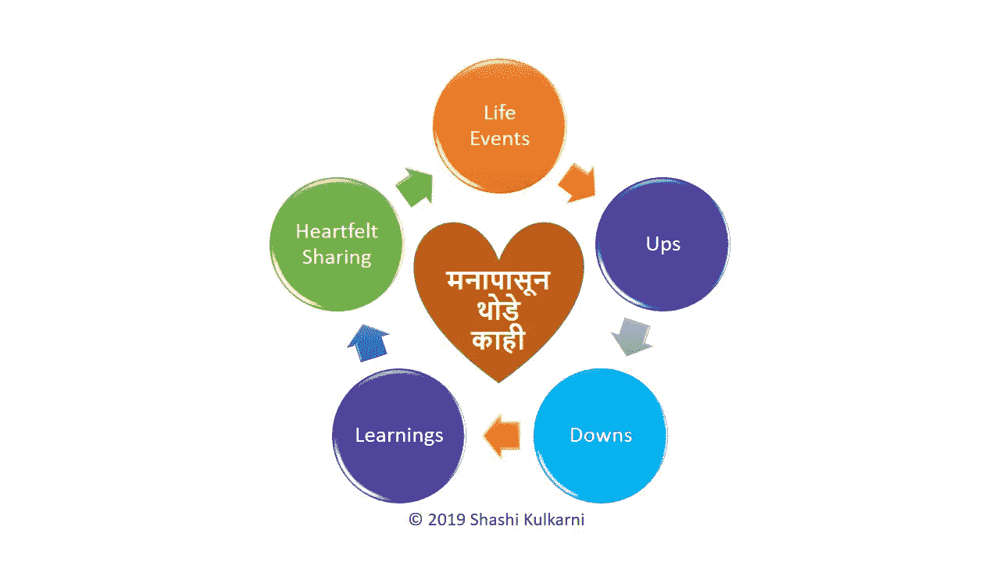

# 向那些在 2020 年离开我们的人致敬

> 原文：<https://medium.datadriveninvestor.com/a-tribute-for-those-who-left-us-in-2020-16d39d2c6dae?source=collection_archive---------12----------------------->

## 代表所有的家人和朋友

Photo by [Aliyah Jamous](https://unsplash.com/@aliyahjam?utm_source=unsplash&utm_medium=referral&utm_content=creditCopyText) on [Unsplash](https://unsplash.com/s/photos/sorrow?utm_source=unsplash&utm_medium=referral&utm_content=creditCopyText)

2020 年是我们所有人都想忘记的一年。它对世界造成了巨大的破坏。截至目前，全球已有超过 160 万人因此次撞击而丧生。

即使我们为每个人考虑大约 25 个亲密的家庭成员和朋友，这意味着超过 4000 万人有一个亲近的人已经不在这个世界上了。

他们中的大多数人甚至不能说再见，也不能在他们在这个世界上最后的日子里与心爱的人共度时光。

这篇文章代表所有的家庭和朋友，表达他们对所遭遇的损失的感受。

有一首非常著名的印地语《加扎尔》，作者是阿南德·巴克西，由著名的加扎尔歌手贾吉特·辛格演唱，极其优美地抓住了这些情感。

我试着用英语翻译那首 ghazal 歌，尽可能接近我的原始情感，并给出了原始歌词作为参考。欢迎对翻译的更好措辞提出建议。

 [## 新冠肺炎期间股票交易的 9 个教训|数据驱动的投资者

### 在你浏览之前，让我告诉你一些关于我自己的情况。我是…

www.datadriveninvestor.com](https://www.datadriveninvestor.com/2020/12/09/9-lessons-learned-about-stock-trading-during-covid-19/) 

我希望这能引起所有人的共鸣，向我们失去的所有人致敬，并触动他们所有家人和朋友的心。

> चिट्ठीनाकोईसंदेस
> जानेवोकौनसादेस
> जहाँतुमचलेगये
> 
> chit hi na koi sandes
> Jane woh kaun sa des
> Jahan tum chale gaye

## **不能给你写信或发信息
不确定那是你飞走的地方** 

-

> इसदिलपेलगाकेठेस
> जानेवोकौनसादेस
> जहाँतुमचलेगये
> 
> 她是同性恋吗？

## **伤透了我们的心
不确定那是你飞走的地方** 

-

> एक आह भरी होगी，
> हमनेनासुनीहोगी
> जातेजातेतुमने
> आवाज़तोदीहोगी
> 
> 向上帝祈祷
> 向上帝祈祷
> 向上帝祈祷

## 你一定发出了一声长长的叹息，但我们听不见。我敢肯定，在离开的路上，你一定发出了最后一声呼喊

-

> हरवक्तयहीहैग़म
> उसवक्तकहाँथेहम
> कहाँतुमचलेगये？
> 
> 美国对同性恋的态度？

## 我们每时每刻都有一种悲伤
那时我们在做什么
你究竟飞到哪里去了？

-

> हरचीज़पेअश्कोंसे
> लिखाहैतुम्हारानाम
> येरस्तेघरगलियां，
> तुम्हें कर ना सके सलाम
> 
> 你的名字叫什么？你的名字叫什么？

## 上面的每样东西都写着你的名字，写满了泪水房子、道路和小巷都不能为你最后的欢呼

-

> हायेदिलमेंरहगईबात
> जल्दीसेछुड़ाकरहाथ
> कहाँतुमचलेगये？
> 
> 你说我是同性恋吗？

## 未表达的是我们心中的话
因为你匆匆离开我们的手
你究竟飞到哪里去了？

-

> अब यादों के काँटे，
> इसदिलमेंचुभतेहैं
> नादर्दठहरताहै，
> ना आँसू रुकते हैं
> 
> 你知道你在说什么吗？

## 现在回忆的荆棘继续伤害我们的心，痛苦没有停止，泪水继续流淌

-

> तुम्हेंढूँढरहाहैप्यार
> हमकैसेकरेइकरार
> केहाँतुमचलेगये
> 
> 他说:
> 他说:
> 他说

## 爱首先是寻找你，所以你不可能接受“是的，你已经去休息了”

-

> चिट्ठीनाकोईसंदेस
> जानेवोकौनसादेस
> जहाँतुमचलेगये
> 
> chit hi na koi sandes
> Jane woh kaun sa des
> Jahan tum chale gaye

## 我不能给你发一封信或一条信息
不确定你飞走的地方是哪里

这里是 YouTube 的链接，供那些想听印度歌曲的人使用。

**访问专家视图—** [**订阅 DDI 英特尔**](https://datadriveninvestor.com/ddi-intel)