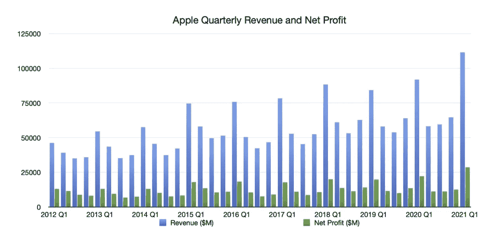
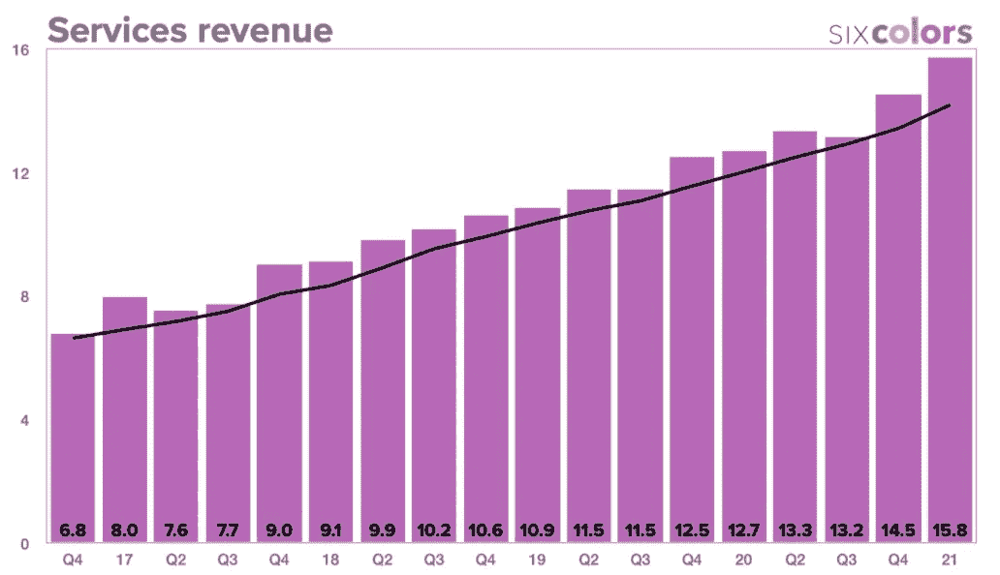

# 苹果后疫情时代成功的真正秘密

> 原文：<https://medium.datadriveninvestor.com/a-true-secret-to-apples-post-pandemic-success-390fbca63dfc?source=collection_archive---------27----------------------->

如果这些天你一直在跟踪剧烈波动的股票市场，你的大脑可能已经筋疲力尽了。当我看到苹果公司打破了所有记录并经历了惊人的销售增长时，我很着迷，但也很吃惊。他们的收入达到了 1000 亿美元，比以往任何时候都高。看了这条新闻后，一些让我抓狂的问题出现了:

*   *这难道不是一个疫情，当经济应该崩溃的时候吗？*
*   *最新的 iPhone 12 发布不是因为中国最初的 Covid 爆发而推迟了吗？*
*   *苹果不是关闭了一堆受 Covid 冲击的零售店吗？*

Credit: AppleInsider

当全球数以百万计的员工和企业主申请破产和失业时，这家科技巨头的财报电话会议不仅动听，而且让我挠头。

## **苹果疫情证明商业模式的关键成功因素:**

*   **苹果未受影响的消费者群体**:

虽然 Covid 经济对许多人来说是毁灭性的，但对许多其他人来说却很好，也许购买苹果产品的人往往属于“经济很好”的那一部分。众所周知，苹果消费者的思考深度超出了前期价格，他们会考虑美学、品牌价值、“拥有成本”和现金流价值等因素。

*   **设备需求突然增加:**

由于完全依赖远程学习和工作，几乎整个世界都向设备过渡。作为一名职业妈妈，有时我会在帮助女儿做科学项目时参加 zoom 会议。我无法想象没有我的 Ipad 能做到这一点，Ipad 相对来说比较轻便，长时间使用也很舒适。我敢打赌，肯定有很多父母会有同感，他们可能只是因为 WFH 的情况才订购了苹果产品。

你能想象家里有四个人，包括至少两个孩子和一只狗，在家务杂事和办公室会议之间周旋吗？Airpods 非常适合消除噪音，并且可能已经成为能够执行多任务的基本必需品。

此外，我的很多朋友最终取消了他们今年夏天的度假计划，所以钱必须花在一些奢侈品上。

*   **附加服务与设备齐头并进:**

Credit: Apple Disclosures, Jan 27, 2021, & [SixColors](https://sixcolors.com/post/2021/01/q1-2021-financial-results-apples-latest-record-holiday-quarter/)

随着新设备的大量涌入，配套服务的销售额也超出预期。这导致了破纪录的收入，甚至来自包括 iCloud、iTunes、App Store 等在内的服务部门。

*   **远程员工的 Covid 津贴**:

苹果产品一直享有盛誉，更多的是一种身份的象征。苹果产品与审美和风格联系在一起。如果你必须在苹果和任何东西之间做出选择，你为什么不选择苹果？

大多数雇主都慷慨地提供远程工作津贴和用品。为什么不用“我工作需要它们”的借口，拥有一台苹果设备呢？如果费用已经支付，人们倾向于比平时花费更多。

此外，由于裁员和解雇，许多以前被限制购买非苹果产品和使用公司推荐设备的员工现在可以自由地跑到苹果商店。

*   **我们从未想象过的社会限制:**

现在，孩子们被期望练习社交距离，而不是去操场/玩耍日或集体学习。看到我女儿在 Facetime 上和一群朋友讨论数学问题，我感到很惊讶。

*   **推迟 iPhone 12 的生产——一个胜利:**

Source: Apple

新款 iPhone 12 因其先进的功能而备受青睐。众所周知，苹果的大部分收入来自 iPhones。

消费者几乎对新机型的发布失去了耐心，但生产被推迟到了 10 月，而不是 iPhone 通常的 9 月亮相。由于 Covid 在中国爆发，一些版本直到 11 月才能上市。

这可能会中断他们的假期销售，但令人惊讶的是，对最新创新的压抑需求刺激了购买热潮。

*   **在无聊的疫情中让人兴奋:**

尽管存在干扰和不确定性，苹果公司还是推出了 4 款新产品，包括 Apple watch series 6、Apple watch SE、Homepod 迷你扬声器和 Airpods Max 耳机。新设备很受在家等待令人兴奋的东西的苹果爱好者的欢迎。即使商店不再有上门服务，人们也有足够的动力进行网上预约或网上购物。

# 你只需要知道

尽管大多数公司都屈服于全球性的障碍，但由于其**一贯的**、**以客户为中心、**和**与众不同的**方法，苹果脱颖而出，打破了它的历史记录。

即使在最无聊的时候，苹果也一直成功地让用户兴奋起来，只不过是手里拿满了产品。他们不难承受多样化的压力，推出不同颜色的 MacBooks。相反，苹果努力选择正确的东西。他们是创造人们渴望的东西的大师(由于社会限制，这种渴望增加了 10 倍)，我们都知道，**渴望=盈利。**

总而言之，苹果最成功的一个季度主要是由新发展的后 covid 市场和人们焦虑的心态推动的。