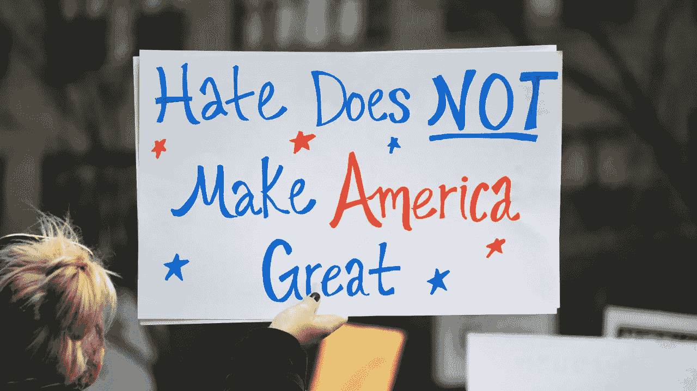
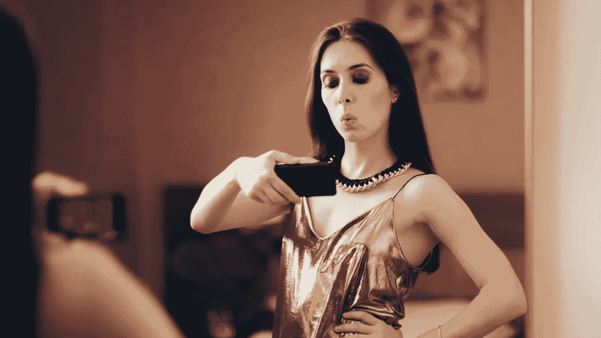

# 我对付特朗普支持者的唯一办法

> 原文：<https://medium.datadriveninvestor.com/a-undiagnosed-mental-illness-hiding-in-plain-site-a583ab58aa5a?source=collection_archive---------23----------------------->

## 改变我的看法是我唯一剩下的应对机制。

by vivalapenler from Adobe Stock Images

我永远不会忘记 2016 年大选后的那个早晨。我醒来，看着我的手机，从床上坐直，“这一定是一个笑话，”我喊道。“不可能有超过百分之五十的人相信这个充满仇恨的小丑适合做自由世界的领袖？!"

但是可以肯定的是，天空是蓝色的，我们在另一个宇宙中醒来——在这个宇宙中，说话没有过滤，没有礼貌，没有阶级，也不考虑他人的感受，这是一个配得上总统席位的行为。在另一个维度，贬低每个不富有、不白人或没有权威地位的人突然变得没问题了。现实的阴暗面，一个在任的总统号召他身边的骑自行车的人，或者指示白人至上主义团体站在他一边。

在过去的四年里，我目睹了这个令人难以置信的恐怖场景，这个国家的三分之一被一个[法西斯邪教](https://medium.com/honestly-yours/trump-has-covid-19-and-i-have-zero-sympathy-for-him-9273f8092455?source=linkShare-ab12d7518a60-1601743136&fbclid=IwAR10Hvjpbt0L1jLUtHybBNLoStsVUWxZdUIvKdpnGbGqpfE1UWZwGtq8J2c&_branch_match_id=811693091476770495)所控制。我惊讶地站在我曾经钦佩和尊敬的人的落后，冷漠的行为。然而，他们继续为这个煽动仇恨的人欢呼，就像他是救世主一样，坦率地说，这让我既害怕又愤怒。

 [## 为什么看起来不可能战胜特朗普？数据驱动的投资者

### 我注意到标题说拜登仍然在总统竞选中领先。在这样的标题背后，人们可以感觉到一种恐惧…

www.datadriveninvestor.com](https://www.datadriveninvestor.com/2020/10/07/why-it-seems-impossible-to-trump-trump/) 

# 社交媒体的贡献

不幸的是，社交媒体只是这个问题的一个例子。那是 1996 年。当我 20 岁出头的时候，[预言了由于数字通信](https://medium.com/@kristina_etter/my-lessons-from-a-tech-detox-797912d86280)和缺乏人类面对面的交流，人类将会衰落。在一次演讲会上，我站在讲台上，在一个挤满了美泰克电器高管的房间里。这一周轮到我向同学们发表演讲了。我描述了屏幕和键盘如何起到过滤器的作用，保护说话者不承认他的信息对接收者的影响。

换句话说，我们想说什么就说什么，不用担心对方会因为我们刚才说的话打我们鼻子。我们可以是破坏性的小巨人，永远不必面对音乐。同样，我们不必看到我们造成的痛苦。我们不必看到眼泪。当我们冒犯某人时，我们不必感到不舒服的能量。

作为美国人，我们吹嘘自己虚假的虚张声势，“我不在乎别人怎么想！”然后，我们迅速发布一张自拍，寻求对我们外表的赞美和认可。我们还不如模仿罗恩·博根狄的声音大喊:“嘿，大家快来看看我有多棒！”

Image By nicoletaionescu from Adobe Stock

我不想打击你…但是每个人都在乎别人的想法。如果不是这样，我们就不会有价值 492 亿美元的[化妆品产业](https://www.statista.com/statistics/243742/revenue-of-the-cosmetic-industry-in-the-us/#:~:text=The%20revenue%20of%20the%20U.S.,billion%20U.S.%20dollars%20in%202019.&text=Since%20the%20early%20twentieth%20century,handful%20of%20multi%2Dnational%20corporations.)或价值 678 亿美元的[奢侈时尚产业](https://www.grandviewresearch.com/industry-analysis/luxury-apparel-market#:~:text=The%20global%20luxury%20apparel%20market,anticipated%20to%20fuel%20the%20growth.)。也没有人会拥有一辆豪车，买一栋大房子，或者觉得需要在我们的社交网络上拥有 60，000 名粉丝。

脸书最初的设计是帮助校园里的大学生联系，并与老朋友保持联系。现在它变成了一个地方，让我们真正看到我们曾经信任的人最丑陋的一面。它扩散了过时的理想主义和法西斯观念。它向我们展示了这个国家根深蒂固、黑暗的根基依然牢固，尽管已经被笼罩在阴影中很多年了。

在 2016 年选举特朗普就职就像是从伤口上摘下痂。现在，我们留下了一个出血，感染的烂摊子，需要开始整个愈合过程。我为此愤怒了四年。

但是我最近决定我不能再为此生气了。我不能让这影响我自己的思维清晰和对世界的感知。我不想再生气了。所以，我决定采取不同的心态，同情特朗普的支持者，而不是生他们的气。

> "宽恕他们吧，上帝……他们不知道自己在做什么。"

# 发育障碍或化学失衡

我确信有一种未被诊断的精神或发育障碍只影响一部分人——它甚至可能是基于 DNA 的。当我们看特朗普支持者的人口统计数据时，肯定有相似之处。也许这是由于他们饮食中的高果糖玉米糖浆过多，或者一生都在喝含氟量高的水来吞下一些药物。

然而，这部分人表现出一种深不可测的傲慢，一种正义的态度，一种权利感，这使他们觉得自己比其他人优越。他们觉得自己是不可战胜的，并相信他们用虱子感染其他人的权利是一种自由的行为。他们反抗科学和我们国家一些最聪明的人，只相信一个建议我们研究使用漂白剂和/或光来“清洗血液”的人。

他们分享他们的#SaveTheChildren 迷因，并支持支持特朗普的古怪、荒谬的阴谋论。与此同时，他希望一个已知的性贩子，而她等待她的审判。这里有如此明显的虚伪，我不禁相信这些人的发展中有一定程度的精神或情感迟钝。

就像莱昂纳多·迪卡普里奥在*中说的，什么在吃吉尔伯特葡萄？* —阿尼不知道喊“爸爸死了！爸爸死了！爸爸死了！”在餐桌上一点都不好笑。恐怕很多特朗普的支持者无法理解他们所造成的伤害。

# 啊，祝福你的心

所以，为了保护我自己的理智，我必须改变我的看法。当我在社交媒体上看到这些可怕的评论和明显的错觉迹象时，我只会同情地看着它，并采取更南方的方式说，*“哦，上帝保佑你的心，亲爱的。”*

也许这种方法不会改变世界，但会改变我对世界的看法。我不再觉得周围都是冷酷无情的人，我的新心态让我相信我周围都是不懂事的白痴。这些可怜、不幸的灵魂患有发育障碍，这使得他们无法像理性人一样行事。所以我会同情他们可怜的生活，而不是被他们冒犯，因为不值得我再花时间去解决愚蠢的问题了。

## 获得专家观点— [订阅 DDI 英特尔](https://datadriveninvestor.com/ddi-intel)