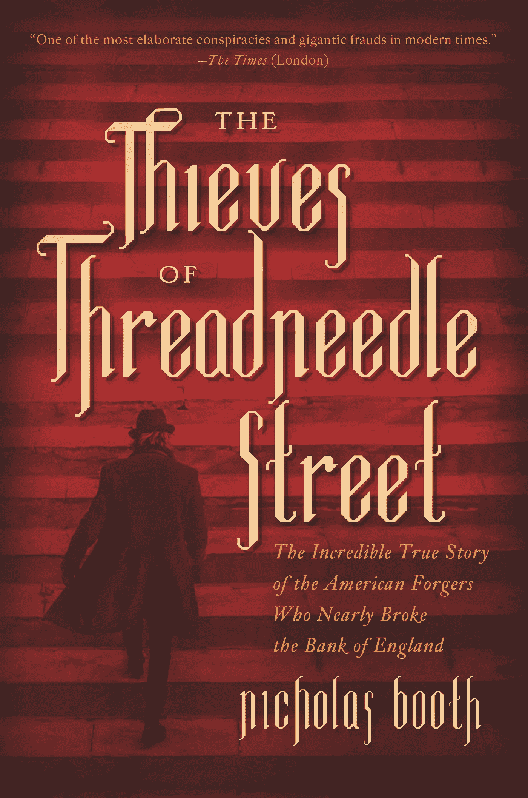

# 19 世纪 70 年代的大骗局伦敦给了我们很多教训

> 原文：<https://medium.datadriveninvestor.com/a-vast-fraud-in-1870s-london-has-much-to-teach-us-f55e9ee95158?source=collection_archive---------18----------------------->

Photo by [Nick Cozier](https://unsplash.com/@nickcozier?utm_source=medium&utm_medium=referral) on [Unsplash](https://unsplash.com?utm_source=medium&utm_medium=referral)

Pegasus Crime

早在 19 世纪，一些美国恶棍对英格兰银行“针线街的老太太”进行了大规模诈骗。他们将数百万美元的假金融工具冒充真的卖给了该国的中央银行。大致相当于现在成功地在美联储实施了一次巨大的金融抢劫。发生这种情况的时期也是重大金融创新的时期之一，这一点现在应该引起投资者的注意。

尼古拉斯·布斯在他最近出版的书《针线街的小偷》中巧妙地讲述了这个故事。这是一个魔鬼般大胆的故事，可以拍成一部令人敬畏的电影。(我不会过多地详述叙述的线索，因为这样做可能会破坏潜在读者的一本好书。)

# **为什么它很重要**

最重要的是，布斯的书在几个方面提供了信息，目前的投资者可能会觉得有用。

 [## 如果资本主义失败了，那么还有什么选择呢？数据驱动的投资者

### 在当前政治领域的修辞之旅中，我们都可以面对面地接触到流行词汇，如…

www.datadriveninvestor.com](https://www.datadriveninvestor.com/2020/03/16/if-capitalism-is-a-failure-then-what-is-the-alternative/) 

首先，它详细介绍了汇票的工作原理，也就是前面提到的创新。这些金融工具是商业票据的前身，被认为和现金一样好。它们允许企业轻松地为交易融资。但是像许多其他的创新一样，有些事情出了差错。

在布斯的故事中,“账单”的问题在于美国骗子伪造了大量的文件并把它们交给了 BofE。当时，这是一个问题，但创新得到了调整，我们都因此受益。其他有益的金融创新暂时变坏的例子是期货交易的引入，它最终导致了荷兰的郁金香狂热；次级房屋贷款导致了 2008-2009 年的金融危机。这就是创新的本质:虽然规范已经确定，但事情并不总是那么好，至少在一段时间内是这样。

# 银行业的傲慢可以追溯到很久以前

第二个例子可以很好地用下面的傲慢交流来总结为什么这个故事现在很重要。

> *“[……]他问上校伪造是否可能。他被明确告知事实并非如此。*
> 
> “为什么不可能？”他回答道。其他银行有时也会受到冲击，为什么英格兰银行不会？
> 
> 经理显然很生气。我们聪明的祖先留给我们一个完美的系统。”

对于任何关注我们最近的金融危机的人来说，这种对话可能听起来令人不安地熟悉，无论是来自政府官员的声明还是私人谈话。我记得在 2007 年告诉一位记者同事，抵押贷款债券(CMO)被称为“有毒废物”。我立刻被回绝了:“别傻了，这些东西都是三 A 级的，”她说。事实上，一些这样的混合物是 AAA 级的，它们比有毒废物还要糟糕。

教训很简单:买家当心！

*这是 2016 年 12 月 27 日在 Forbes.com*上首次发表的一篇报道的编辑版本