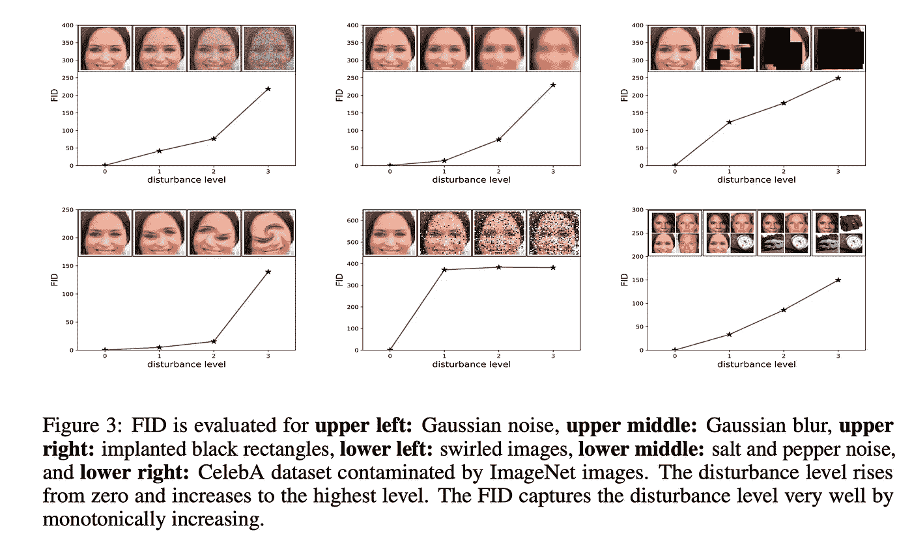
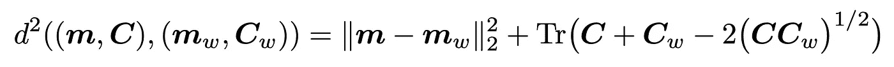

# Frechlet 初始距离(FID)的简短介绍

> 原文：<https://medium.datadriveninvestor.com/a-very-short-introduction-to-frechlet-inception-distance-fid-86c95deb0930?source=collection_archive---------1----------------------->

与其他网络相比，生成敌对网络很难评估。并且，评估 GANs 的质量是非常重要的，因为它可以帮助我们选择正确的模型，或者何时停止训练，或者如何改进模型。在多种方法中，Frechlet 起始距离(FID)是评估 GANs 质量的一种性能指标。

## 为什么很难？

1.  GANs 很难训练，训练中的不稳定会导致各种问题
2.  现有的方法不够精确
3.  如果我们手动或用肉眼评估 GANs，可能会很费时且容易出错

## 什么是 Frechlet 初始距离(FID)？

FID 是一种性能度量，它计算真实图像的特征向量和伪图像的特征向量(由生成器生成)之间的距离。较低的 FID 分数表示生成器生成的图像质量较高，与真实图像相似。FID 基于图像的特征向量。如果您使用 FID 作为您的性能指标，请尽量将其最小化。它是由 Heusel 等人在 2017 年推出的。

> 较低的 FID 意味着合成数据分布和真实数据分布之间的距离较小

来源:https://arxiv.org/pdf/1802.03446.pdf

Source: [https://arxiv.org/pdf/1706.08500.pdf](https://arxiv.org/pdf/1706.08500.pdf)

## **公式**

FID Formula | Source — [https://arxiv.org/pdf/1706.08500.pdf](https://arxiv.org/pdf/1706.08500.pdf)

## **如何计算 FID？**

1.  使用 Inception V2 预训练模型提取真实图像和伪图像的特征向量(由生成器生成)
2.  计算步骤 1 中生成的特征向量的逐特征平均值
3.  生成特征向量的协方差矩阵— C，C_w
4.  计算(C+C_w-2*(C*Cₓ) /2)的迹(沿方阵主对角线的元素之和)
5.  计算步骤 2 中计算的平均向量的平方差— ||m-m_w||
6.  最后，添加步骤 4 和步骤 5 的输出

 [## AI 和医学影像创业公司？6 大趋势|数据驱动的投资者

### “IBM Watson 健康成像”是医疗保健的未来吗？谷歌详细说明了人工智能对胸部 x 光的分类…

www.datadriveninvestor.com](https://www.datadriveninvestor.com/2020/08/30/ai-and-medical-imaging-startups-6-key-trends/) 

1.  优于 Inception 评分，因为它对噪声、图像失真和扰动具有鲁棒性。
2.  多样化数据集的良好衡量标准
3.  计算效率高
4.  可以检测类内模式丢弃

> 然而，与初始得分不同，它能够检测类内模式丢弃，即，每个类仅生成一个图像的模型可以获得高 is 得分，但是将具有差的 FID

来源:[https://arxiv.org/pdf/1802.03446.pdf](https://arxiv.org/pdf/1802.03446.pdf)

## 它是用来做什么的？

gan 生成图像，为了评估图像的质量，我们需要一个度量标准。如上所述，手动检查图像非常耗时，我们可能会错过很多细节。FID 是来拯救我们的，因为它可以很准确地评估模型的性能。

## 资源

 [## GAN——如何测量 GAN 性能？

### 在 GANs 中，生成器和鉴别器的目标函数通常衡量它们做得有多好…

medium.com](https://medium.com/@jonathan_hui/gan-how-to-measure-gan-performance-64b988c47732)  [## 如何实现 Frechet 初始距离(FID)来评估 GANs -机器学习…

### Frechet 初始距离得分，简称 FID，是一种计算特征之间距离的度量标准

machinelearningmastery.com](https://machinelearningmastery.com/how-to-implement-the-frechet-inception-distance-fid-from-scratch/) 

由双时标更新规则训练的甘斯收敛到局部纳什均衡—[https://arxiv.org/abs/1706.08500017](https://arxiv.org/pdf/1706.08500.pdf)

弗雷歇盗梦空间-【https://nealjean.com/ml/frechet-inception-distance 

GANs 评估措施的利弊—【https://arxiv.org/pdf/1802.03446.pdf 

> *感谢您的阅读。*
> 
> *想联系我—****ahikailash1@gmail.com***

**关于我:**

我是 MateLabs 的联合创始人兼首席技术官。在 Mate Labs，我们正在让在机器学习中使用自动化的企业更容易进行需求预测。我也是 Raven 协议的创始人之一。在 Raven Protocol，我们正在构建世界上第一个去中心化和分布式人工智能平台。而我代表的是 [Snapy](https://play.google.com/store/apps/details?id=ai.snapy.snapy_collect&hl=en_IN) ，这是一款面向消费者的即时物体检测和发现工具。

> ***注*** *:我在 2019 年出版了一本关于 GAN 的书，名为《生成对抗网络项目》，书中涵盖了大部分广泛流行的 GAN 架构及其实现。DCGAN、StackGAN、CycleGAN、Pix2pix、Age-cGAN 和 3D-GAN 已在实施层面详细介绍。每种架构都有专门的一章。我已经使用 Keras + Tensorflow(后端)用非常简单的描述性语言解释了这些网络。如果你正在开发 GANs 或者打算使用 GANs，请阅读一下，并通过****ahikailash1@gmail.com***与我分享你的宝贵反馈

 [## 生成对抗网络项目:使用 TensorFlow 构建下一代生成模型…

### 生成对抗网络项目:使用 TensorFlow 和 Keras 建立下一代生成模型

www.amazon.com](http://www.amazon.com/Generative-Adversarial-Networks-Projects-next-generation/dp/1789136679) 

> 您可以从以下网址获取您的副本:

[*http://www . Amazon . com/energy-Adversarial-Networks-Projects-next-generation/DP/1789136679*](http://www.amazon.com/Generative-Adversarial-Networks-Projects-next-generation/dp/1789136679)

[https://www . Amazon . in/Generative-Adversarial-Networks-Projects-next-generation/DP/1789136679](https://www.amazon.in/Generative-Adversarial-Networks-Projects-next-generation/dp/1789136679?fbclid=IwAR0X2pDk4CTxn5GqWmBbKIgiB38WmFX-sqCpBNI8k9Z8I-KCQ7VWRpJXm7I)

[*https://www . packtpub . com/big-data-and-business-intelligence/generative-adversarial-networks-projects*](https://www.packtpub.com/big-data-and-business-intelligence/generative-adversarial-networks-projects?fbclid=IwAR2OtU21faMFPM4suH_HJmy_DRQxOVwJZB0kz3ZiSbFb_MW7INYCqqV7U0c)

**访问专家视图—** [**订阅 DDI 英特尔**](https://datadriveninvestor.com/ddi-intel)