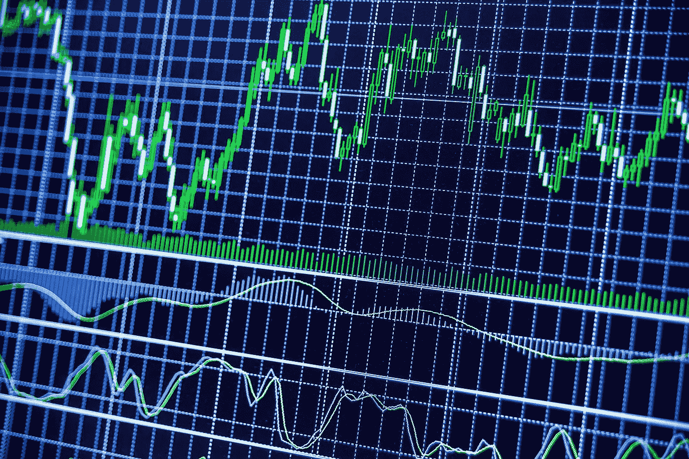
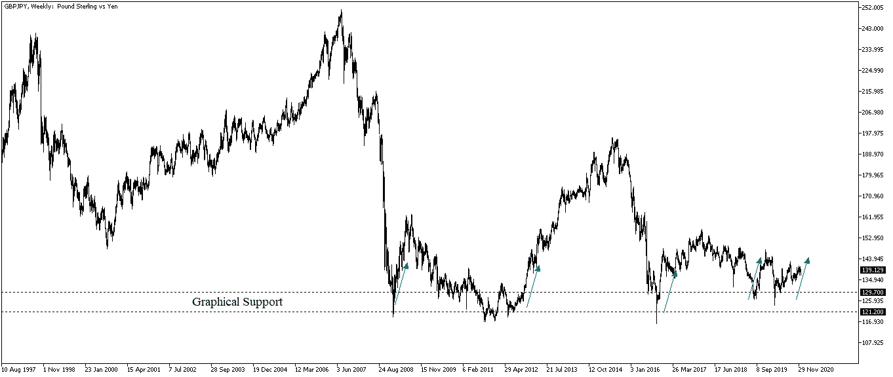
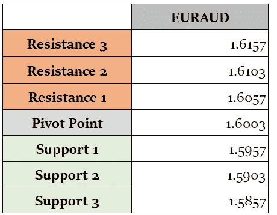
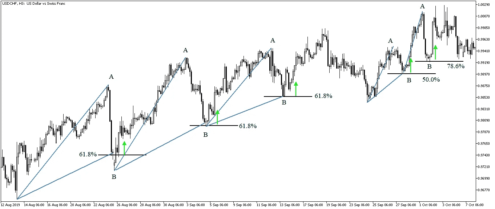
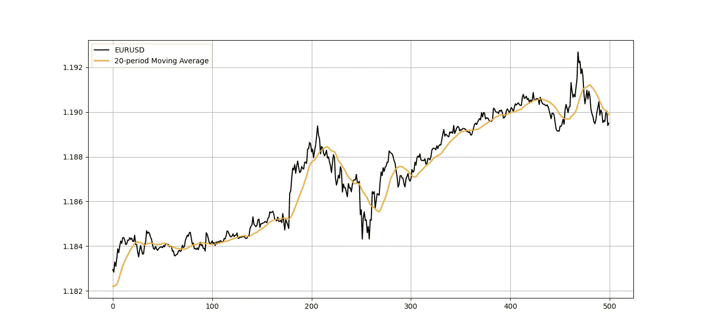
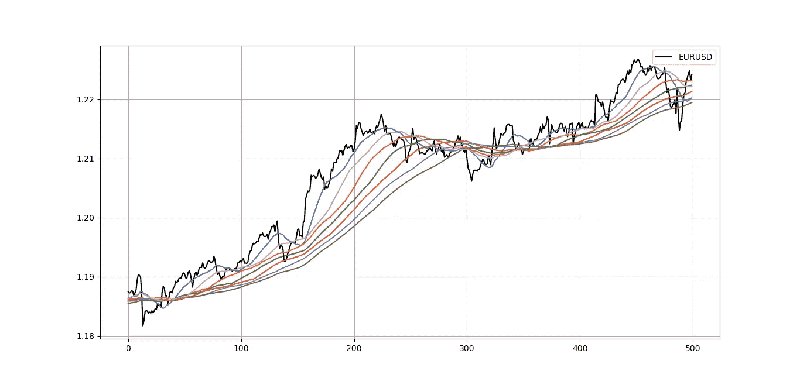
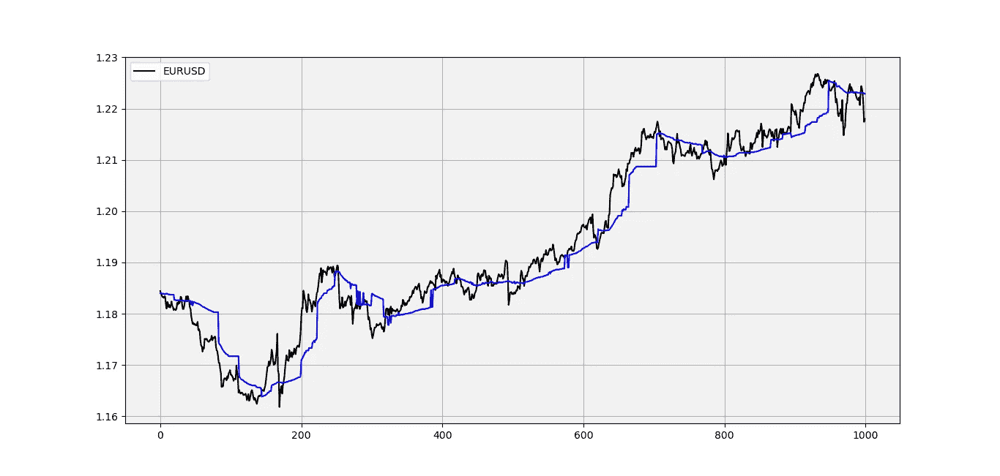
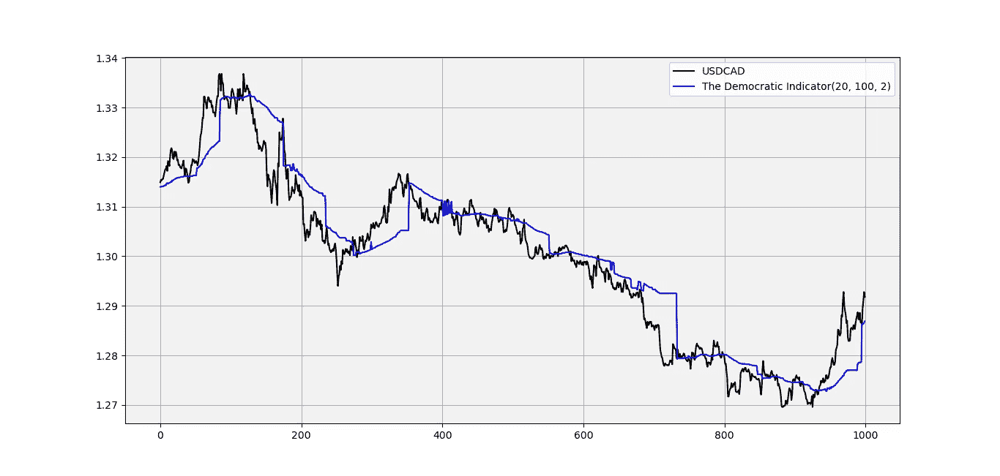
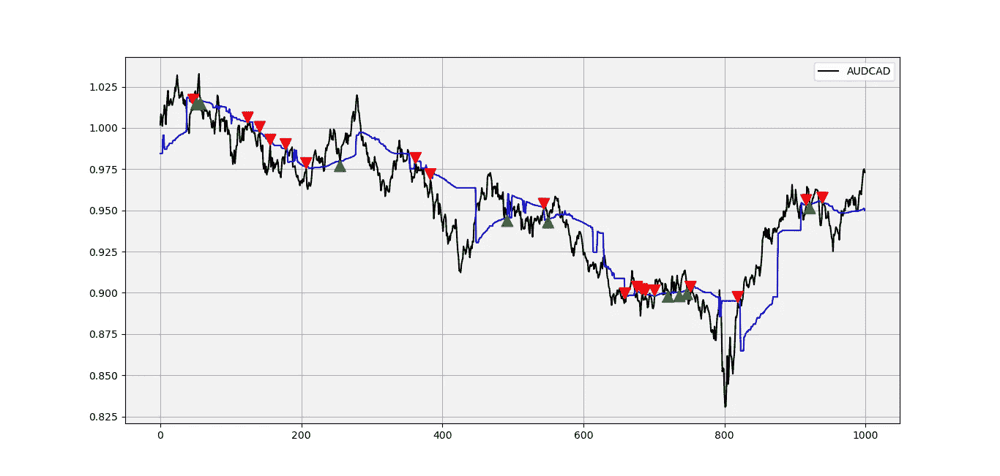
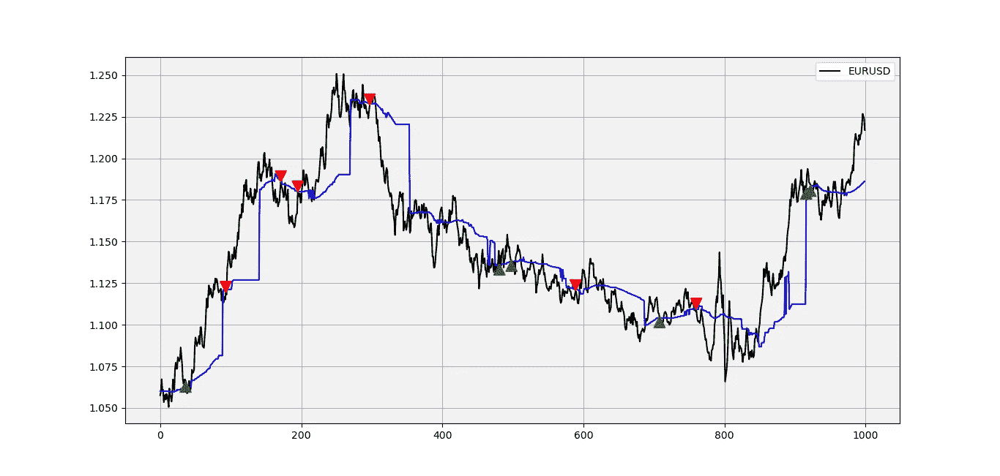

# 找到交易支撑位和阻力位的投票系统。

> 原文：<https://medium.datadriveninvestor.com/a-voting-system-to-find-trading-support-resistance-levels-13978f750ca?source=collection_archive---------2----------------------->

## 交易民主能帮助我们找到更好的支持和阻力水平吗？Python 中的一项研究。



[https://blackwellglobal.com/](https://blackwellglobal.com/)

我们能利用民主来交易市场吗？老实说，这个概念确实看起来很新奇，但这个想法确实很吸引人，尽管它还是新鲜的。关于如何做到这一点的想法取决于有多少确认因素给了我们对某一支撑或阻力位的确信。毕竟，反动式交易是在隐含的支撑位和阻力位附近买卖证券的行为。让我们首先定义这些水平是什么，它们是如何被普遍发现的，以及如何使用这个新的民主指标来发现最普遍认同的水平。

在 Python 的 ***新技术指标成功后，我刚刚出版了一本新书。它对复杂的交易策略进行了更完整的描述和补充，Github 页面致力于不断更新代码。如果你对此感兴趣，请随时访问下面的链接，或者如果你喜欢购买 PDF 版本，你可以在 Linkedin 上联系我。***

[](https://www.amazon.com/gp/product/B09919GQ22/ref=as_li_tl?ie=UTF8&camp=1789&creative=9325&creativeASIN=B09919GQ22&linkCode=as2&tag=sofien-20&linkId=bc5df3f6ab0f3af2df79641c56b949ba) [## 交易策略之书

### 亚马逊网站:交易策略之书:9798532885707: Kaabar，Sofien:书籍

www.amazon.com](https://www.amazon.com/gp/product/B09919GQ22/ref=as_li_tl?ie=UTF8&camp=1789&creative=9325&creativeASIN=B09919GQ22&linkCode=as2&tag=sofien-20&linkId=bc5df3f6ab0f3af2df79641c56b949ba) 

# 支撑位和阻力位的概念

金融时间序列据说是随机移动的，但有时我们可以检测到某些水平，这可以让我们了解市场是上涨还是下跌。到时候，如果我们做得好，就可以反驳市场完全随机的假设(我知道我是这样的)。这些级别被称为:

*   **支撑位:**这是我们预计价格将反弹并走高的水平。这里的逻辑交易是多头(买入)。
*   阻力:这是我们预计价格会暂停并走低的水平。这里的逻辑交易是空仓(卖出)。

可以通过多种方式找到这些级别。让我们快速浏览一下，然后进入文章的主题，民主指标。

*   **图形支撑位和阻力位。**

这是最基本的技术。这取决于交易者的主观解释。人们不认为它非常可靠，因为它随着交易者的变化而变化，然而，配置越清晰，它工作的可能性就越大。也是技术分析的支柱之一。


Graphical resistance zone on EURGBP weekly data. (Image by Author)



Graphical support zone on GBPJPY weekly data. (Image by Author)

*   **支点支撑和阻力位。**

支点是观察市场的一种客观方式。他们依靠简单的数学公式找到预期的支撑位和阻力位。支点的客观性使它们成为交易时预测反转水平的不可否认的强大工具。


Image by Author.

支点可以被认为是一个引力水平，因为它倾向于将价格拉向它，也就是说，如果价格低于支点，交易者可以预期价格会上涨，反之亦然。从支点，我们可以计算出当天隐含的支撑位和阻力位。交易它们的方式也很简单。接近隐含支撑的价格可能给我们做多的机会，而接近阻力位的价格可能给我们做空的机会。

换句话说，利用今天的收盘价、最高价和最低价，我们将能够预测明天的预期反应水平。计算隐含支撑位和阻力位的公式如下:

一级点:


Image by Author.

第二个水准点(以防第一个不成立):


Image by Author.

第三等级点(以防第二等级点不成立):


Image by Author.

例如，假设欧元对具有昨天的这些值{开盘:1.6000，高:1.6050，低:1.5950，收盘:1.6010}。当我们开始一个新的交易日时，我们可以发现支点水平如下:



Pivot Points Table. (Image by Author)

因此，当市场交易并接近其中一个水平时，我们可以考虑围绕它可能发生的预期反应。

*   基于斐波那契的支撑位和阻力位。

我个人最喜欢的寻找支撑位和阻力位的方法之一是斐波纳契回撤。我们先来了解一下斐波那契数列。该序列遵循以下独特的模式:


Image by Author.

这些数字是通过将后面的前两个数字相加得到的。在 13 的情况下，它被计算为 8 + 5，因此公式为:


Image by Author.

简单对吗？现在，这些数字的美妙之处在于某种比例，叫做黄金比例。如果我们在序列中取任意两个连续的数字，它们的比率(X n / X n-1)会更接近 1.618，这就是我们所说的黄金比例:


根据这个比率，我们可以推导出超出本文范围的其他比率。它们帮助我们找到支撑位和阻力位。交易中的主要(但不仅仅是)回撤是:


我知道这些很难理解，但是你实际上不应该记住它们，因为在任何交易软件中，当你使用斐波纳契回撤时，你可以将它们编程为可见的，到时候你就会熟悉它们了。

如果你也对更多的技术指标和使用 Python 创建策略感兴趣，那么我关于技术指标的畅销书可能会让你感兴趣:

[](https://www.amazon.com/gp/product/B08WZL1PNL/ref=as_li_tl?ie=UTF8&camp=1789&creative=9325&creativeASIN=B08WZL1PNL&linkCode=as2&tag=sofien-20&linkId=e3cb9716bb6a07cf6c8b9fb585412b07) [## Python 中的新技术指标

### 亚马逊网站:Python 中的新技术指标:9798711128861: Kaabar，Sofien 先生:书籍

www.amazon.com](https://www.amazon.com/gp/product/B08WZL1PNL/ref=as_li_tl?ie=UTF8&camp=1789&creative=9325&creativeASIN=B08WZL1PNL&linkCode=as2&tag=sofien-20&linkId=e3cb9716bb6a07cf6c8b9fb585412b07) 

虽然，在金融和交易中不存在极端的准确性，但是我们应该尝试用我们所拥有的任何手段来接近它，这反过来要求我们使用蜡烛线，以便从其真正的底部(即上涨中第一根蜡烛线的低点)追溯上涨，直到波的可疑终点的最高点(上涨)。



Fibonacci-based support levels showing retracements as reactionary zones. (Image by Author)


Fibonacci-based resistance levels showing retracements as reactionary zones. (Image by Author)

*   **使用移动平均线的动态支撑位和阻力位**

动态这个词的意思是*及时改变*。移动平均线随着每个新的价格点移动，因此它们提供了动态的最新支撑位和阻力位。民主指标以移动平均线为基础。我们将在下一部分看到完整的细节。

如果你对检测这些水平感兴趣，用简单的方法，那么不要犹豫阅读我最近发表的这篇文章，这篇文章展示了我如何在我的个人交易中使用均线:

[](https://medium.com/swlh/detecting-support-resistance-levels-with-ks-envelopes-8c391ef4a471) [## 用 K 包络线检测支撑位和阻力位。

### 移动平均线的改进版本。Python 中的一项研究。

medium.com](https://medium.com/swlh/detecting-support-resistance-levels-with-ks-envelopes-8c391ef4a471) 

# 民主指标

均线帮助我们确认和驾驭趋势。它们是最著名的技术指标，这是因为它们的简单性以及它们为分析增值的良好记录。我们可以用它们来寻找支撑位、阻力位、止损位和目标位，并了解潜在的趋势。这种多功能性使它们成为我们交易中不可或缺的工具。

顾名思义，这是一个简单明了的平均数，在统计学和我们生活中的任何地方都会用到。它就是观察值的总和除以观察次数。从数学上来说，它可以写成:


Image by Author.



EURUSD with the 20-period Moving Average. (Image by Author)

我们可以看到移动平均线提供了不错的动态支撑和阻力位，万一市场下跌，我们可以从这里下单。

> 但是，如果我们有很多这样的人，就像下面的图一样，会怎么样呢？



EURUSD with a few Moving Averages. (Image by Author)

我们可以看到，当移动平均线围绕一个区域重合时，它往往会提供一个良好的反应水平。例如，当许多移动平均线在同一水平，低于市场价格时，这往往是一个好的反弹区域。与此同时，当许多移动平均线在同一水平，高于市场价格时，这往往是一个很好的暂停区域。这是因为许多交易者在观察不同的均线，当它们重合时，你很可能会发现相同方向的订单。

[](https://www.datadriveninvestor.com/2020/07/23/learn-data-science-in-a-flash/) [## 一瞬间学会数据科学！？数据驱动的投资者

### 在我之前的职业生涯中，我是一名训练有素的古典钢琴家。还记得那些声称你可以…

www.datadriveninvestor.com](https://www.datadriveninvestor.com/2020/07/23/learn-data-science-in-a-flash/) 

民主指标的概念包含在统计**模式**的概念中。它只是在一定时间内最常见的值，因为我们使用移动平均线，*我们想找到目前被大多数移动平均线确认的支撑位。*让我们更详细地了解如何构建和使用民主指标:

*   **计算至少 50 条不同时期的移动平均线。例如，移动平均线(20，34，57，66，94，…)。, 99).**
*   **计算每行的模式。这将代表移动平均线行中最频繁出现的值。不要忘记先将数值四舍五入到 4 位小数，以便货币对存在该模式。**
*   **将零值(来自没有模式的行)替换为其前面的值，以便指标保持稳定。**
*   **民主指标将显示覆盖在图表上的预期支撑位和阻力位。**



EURUSD Hourly data with the Democratic Indicator in Blue. (Image by Author)

> 提醒:模式是最常出现的值。

我相信，我称之为民主指标是很清楚的，因为它以多数人的价值作为其主要产出。按多数来说，可以是 100 个中的 4 个移动平均线，但在票数分散的情况下，仍然是多数。以下是用 Python 编码的指示器:

```
import numpy as np
from statistics import multimodedef democratic_indicator(Data, beginning_ma, final_ma, step, what, where):

    for i in range(beginning_ma, final_ma, step):
        Data = adder(Data, 1)
        Data = ma(Data, i, what, where)
        where = where + 1

    Data = rounding(Data, 4)
    Data = adder(Data, 1)

    for i in range(len(Data)):

        transposed = np.transpose(Data[i, 4:43])
        transposed = list(transposed)
        mode_value = np.array(stats.multimode(transposed))

        if len(mode_value) > 1:
            mode_value = 0

        Data[i, 44] = np.array(mode_value)

    for i in range(len(Data)):

        if Data[i, -1] == 0:
            Data[i, -1] = Data[i - 1, -1]

    return Data#### **Necessary functions for the Democratic Indicator to work** ###def adder(Data, times):
    for i in range(1, times + 1):

        z = np.zeros((len(Data), 1), dtype = float)
        Data = np.append(Data, z, axis = 1)return Datadef rounding(Data, how_far):
    Data = Data.round(decimals = how_far)

    return Datadef ma(Data, lookback, what, where):
    for i in range(len(Data)): try:
       Data[i, where] = (Data[i - lookback + 1:i + 1, what].mean())

     except IndexError:
       pass
    return Data
```

我推荐使用的默认条件是:

*   **起始移动平均线= 20**
*   **最终移动平均值= 100**
*   **步进= 2**

因此，命名为 DI(20，100，2)。让我们看看更多的例子以及如何使用该指标:



USDCAD hourly data versus the Democratic Indicator. (Image by Author)

如果我们看到下面的信号会怎么样:



Signal chart on the AUDCAD Daily data. (Image by Author)



Signal chart on the EURUSD Daily data. (Image by Author)

这仅仅是一个想法的开始，这个想法将随着时间的推移而蓬勃发展，并使主观和客观成为现实。民主党指标仍处于婴儿模式，我会很快发布更多的更新。

> 有趣的事实是，我们也可以在民主党指标旁边创建一个共和党指标，但是它们不能很好地一起工作，并且会不断地给我们矛盾的信号。既然我们已经讲完了这个糟糕的笑话，我们可以继续讨论结论了。

和任何技术指标一样，它也有弱点。例如，有时，由于统计上的巧合，模式会发生剧烈变化，我们可能会在图表上看到一个难看的斑点。此外，它现在是最好的市场范围，但它在趋势和确认新趋势方面非常有效。

# 结论

为什么写这篇文章？这当然不是填鸭式的方法，也不是盈利战略之路。如果你关注我的文章，你会注意到我更强调**如何做**而不是**这里是**并且我也提供函数 ***而不是完全可复制的代码*** 。在金融行业，你应该自己从其他外生信息和数据中组合碎片，只有这样，你才会掌握研究和交易的艺术。

## 获得专家观点— [订阅 DDI 英特尔](https://datadriveninvestor.com/ddi-intel)