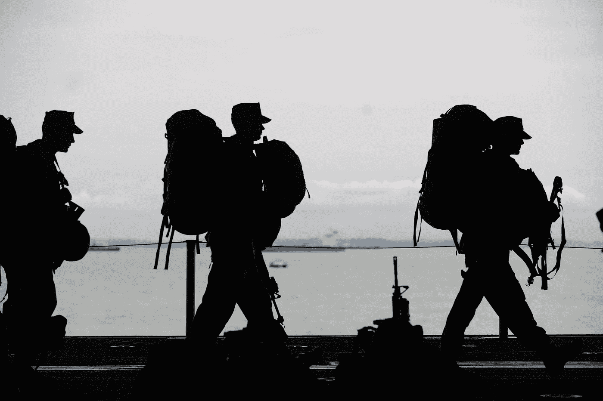
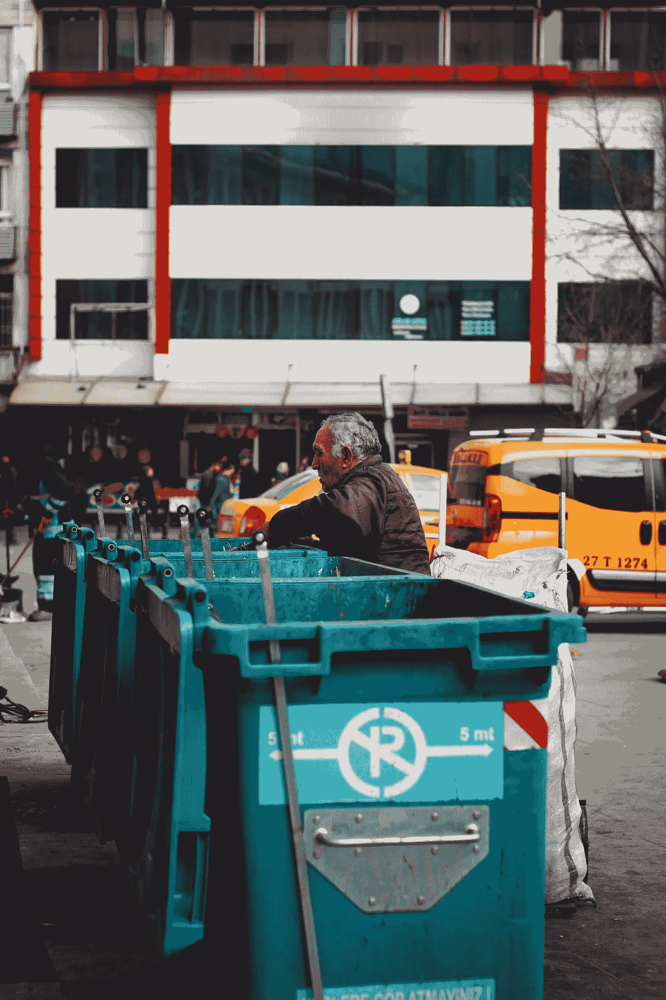
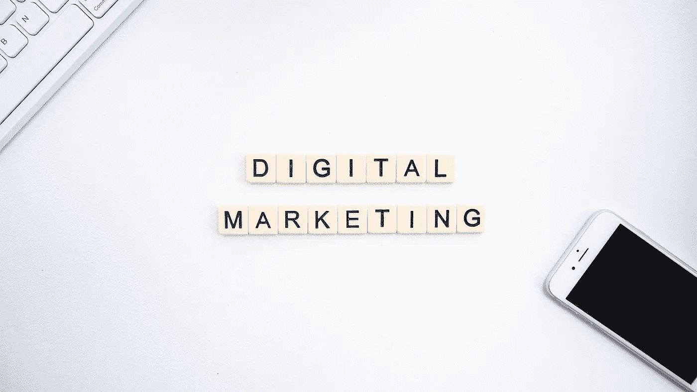

# 第三次世界大战将会出现在社交媒体上

> 原文：<https://medium.datadriveninvestor.com/a-war-in-which-guns-are-replaced-by-smartphones-ce14f4f9d300?source=collection_archive---------17----------------------->

> 这将是在网络上，而不是在战场上

我们看到现在人们主要在社交媒体(脸书和推特)上煽动敏感话题，如演员、宗教、性、政治，很多人在这些话题上争吵。

Credits — PEXELS

持不同观点的人总是会发生冲突，然后讨论/争论会一直持续下去。有时甚至可以看到，社交媒体帖子的评论部分并不讨论实际内容，而是充斥着仇恨言论，并且可以看到针对人类宗教的攻击。

**为什么会出现上述情况？**

人们对偷窥他人生活中发生的事情很感兴趣，可以看出，与整个电视频道相比，像《老大哥/大老板》这样的电视节目获得了很高的 TRP，而《发现》则侧重于知识的积累。

这在群众中引起了轰动，人们通过制造争议来跟踪这些所谓名人的生活。

**如何阻止这种仇恨之火？**

**不要报复**。是的，这是真的，不回应这些人，你实际上是在拒绝社交媒体的流行算法。

一般来说，作为一个人，当我们看到这样的帖子时，我们会变得激动，并倾向于对他们进行评论或证明事实，但我们实际上是在促进他们发布更多的帖子，你越是争辩，他们就越是灌输更多的战斗。

当你忽略这些帖子的时候，它们就会消失在网络世界中，相反，你越是回复它们，你就在鼓励这些人发布更多的帖子和图片。

遵循日本的 Wabi-Sabi 原则，看看生活的变化。

**社交媒体不是垃圾场**

Credits- PEXELS

是的，社交媒体不是一个传播仇恨或与陌生人打架的地方，而是一个获取知识、娱乐、获得灵感和反馈的地方。

**社交媒体的实际用途是什么？**

社交媒体对你的个人生活和职业生活来说都是一个令人惊叹的平台，因为它是互动和结识朋友的好方法，也是在本地和全球推广你的业务的好方法。

社交媒体通过创造对世界上正在发生的事情的认识，将世界带到了用户的智能手机上。

如果你没有明智地使用它，那么你就是这个数字世界中的模拟大脑。

与 Instagram 和 Twitter 相比，上述声明是人们更重视 LinkedIn、Pinterest 的原因，Medium 和 Quora 等平台上的用户每天都在增长，人们开始抵制 TIKTOK，因为喜欢分享知识的人正在开车前往这些平台，并将争斗和焦虑抛在身后。

社交媒体各有利弊，限制使用，看到生活的变化。

Credits — PEXELS

你是用大脑而不是心来利用社交媒体的吗？

## 关于作者

嗨！！！我是 Sachin，一个旅游和美食博主，如果你喜欢阅读它们，在这里见我。

如果你不喜欢阅读关于旅游和食物的书籍，不用担心，我的媒体故事已经准备好激励你了。
保持动力，保持微笑:)