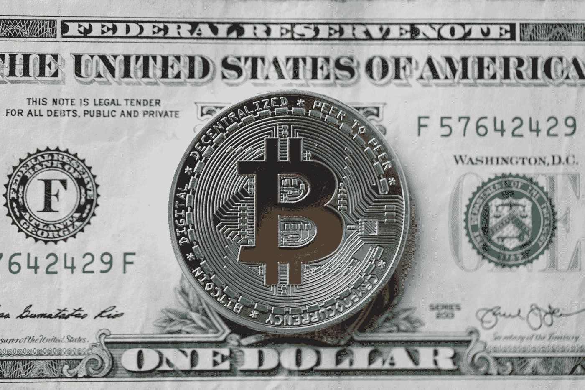

# 为什么疲软的美元会将比特币推向新高！

> 原文：<https://medium.datadriveninvestor.com/a-weakening-dollar-will-catapult-bitcoin-to-new-highs-597cf54bb5fe?source=collection_archive---------28----------------------->

上周，比特币受到一个重要因素的推动，即美元。让我们仔细看看他们现在的关系。

Photo by [Piotr Cichosz](https://unsplash.com/@ptrc?utm_source=medium&utm_medium=referral) on [Unsplash](https://unsplash.com?utm_source=medium&utm_medium=referral)

一个不言自明的图表是美元汇率和比特币自 3 月中旬崩盘以来的表现对比。尽管作为碰撞的直接结果，美元仅下跌了 3.5%，而 BTC 下跌了近 60%，但总体比较显示出有利于领先加密货币的明显趋势。由于美国政府发起的金融救市措施，美元在 3 月底甚至上涨了 5%多一点；然而，自那以后，它一直在稳步下降，目前已经比 3 月份的关口低 4%。另一方面，比特币在大约 50 天内从大规模崩溃中恢复过来，然后在 3 月份的水平附近交易了 80 天，直到 7 月 21 日开始当前的牛市，我们目前看到与抛售开始时相比上涨了 25%以上。

德尔福数码表示:“美元疲软，加上实际收益率为负值，给黄金和贵金属带来了一场完美风暴。

“随着最近的上涨，黄金是今年表现最好的资产之一，比全球股市高出 34 个百分点。自今年年初至 8 月 6 日，35%的涨幅是自 20 世纪 70 年代初以来最好的。

如果我们以同样的方式比较黄金和 BTC，我们也可以看到，与黄金相比，BTC 的回报看起来并不差！此时此刻，比特币领先 8 个百分点。

德尔福数码并不是唯一认同弱势美元观点的知名分析师。最近，王峤在推特上明确表态，要求交易员区分正常和异常的市场环境。
王的观点与著名宏观投资者拉乌尔·帕尔(Raoul Pal)早些时候的言论直接矛盾，帕尔自 2020 年初以来一直是美元的长期投资者，他认为全球金融市场疲软将导致美元短缺，并最终导致价格上涨。

王峤评论道:

时间框架至关重要:例如，美元可能在下周或几个月后走强，但在未来 2 至 5 年内，贬值的可能性相当高”。

未来是未知的，但庞大的全球债务、疲弱的经济增长和美国美联储不断膨胀的资产负债表，很可能导致美元长期疲软，预计这将反映在比特币和黄金的资产价格上涨上。

我在每月一期的 [**简讯中分享了更多私密的想法，你可以在这里**](https://mailchi.mp/bf8f8e8ed697/keep-in-touch-with-lukas) 查看。请在评论中告诉我，并在各种社交媒体平台上加入我:

[**推特**](https://twitter.com/WiesfleckerL)●[**insta gram**](https://www.instagram.com/lukaswiesflecker/)●[**脸书**](https://www.facebook.com/lukaswiesfleckerr)●[**Snapchat**](https://www.snapchat.com/add/luggooo)**●[**LinkedIn**](https://www.linkedin.com/in/lukas-wiesflecker-1b11251a5/)**

**无论你做什么，都要带着爱和激情去做！**