# 基于电子邮件和谷歌表单的工作流系统

> 原文：<https://medium.datadriveninvestor.com/a-workflow-system-based-on-email-and-google-forms-fc8f08ca7212?source=collection_archive---------4----------------------->

[https://blog.betalabs.com.br](https://blog.betalabs.com.br/a-importancia-do-workflow-no-atendimento-ao-cliente/)

目标是使用 Google Forms 收集的信息，应用 python 发送电子邮件的过程，以大规模和自动的方式管理 Google 电子表格中注册的信息。

## 定义:

工作流是根据一组已定义的规则，使业务流程自动化所必需的一系列步骤，允许业务流程从一个人传递到另一个人。

理论上，这种管理可以手工组织，但目前，大多数工作流是在信息技术(更好地称为 IT 系统)的背景下系统化的。

从技术角度来看，什么是工作流？它如何改进业务流程？

工作流技术指的是一套工具，从宏观环境的角度来看，这些工具在最终单位和特定公司的办公室之间架起了一座桥梁。

 [## 认知计算——一套被广泛认为是……

### 作为它的用户，我们已经习惯了科技。这些天几乎没有什么是司空见惯的…

www.datadriveninvestor.com](https://www.datadriveninvestor.com/2020/02/19/cognitive-computing-a-skill-set-widely-considered-to-be-the-most-vital-manifestation-of-artificial-intelligence/) 

一般来说，工作流技术不仅保证了同一业务流程中不同部门之间的沟通和信息交换，而且保证了任何和所有任务都由预定的员工来执行。

[https://blog.betalabs.com.br](https://blog.betalabs.com.br/a-importancia-do-workflow-no-atendimento-ao-cliente/)

**发展:**

我们需要制定 5 项工作策略:

1.创建一个谷歌表单(非常容易)

2.为 Google Drive 定义一个关键 API

3.为 Google 电子表格共享信息，其中包含从 Google 表单收集的信息

4.用 python 程序读取电子表格到熊猫数据框

5.创建 python 程序来发送电子邮件，其中包含来自熊猫数据帧的信息

## 我们走吧:

**1。创建一个谷歌表单**

Google Forms 是一个搜索管理应用程序，与 Google Docs、Google Sheets 和 Google Slides 一起包含在 Google Drive office 套件中。表单展示了文档、电子表格和演示文稿中的所有协作和共享功能。这是一种强大、简单和免费的方式来创建您的查询和/或从您的客户那里收集格式化的信息。

去[https://docs.google.com/forms/](https://docs.google.com/forms/)创建你的表格。

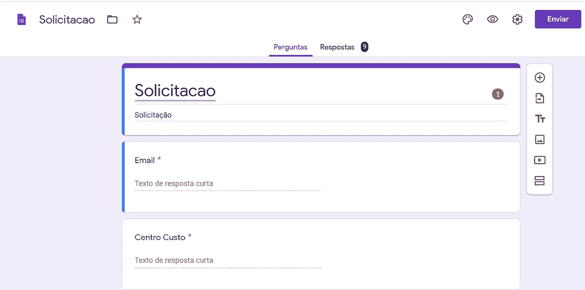

Google Forms example

Google 自动创建一个与表单相关联的电子表格 Google Spreadsheet，它将把从填写表单中收到的所有信息放在那里。这是一个电子表格，在云中。我的电子表格创建的示例:

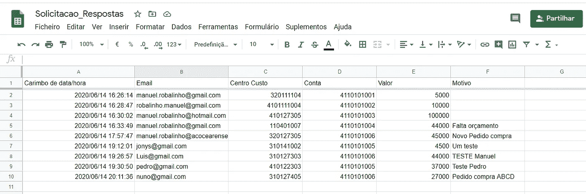

The spreadsheet generated with my google form

**2。为 Google Drive 定义一个关键 API**

要用程序访问 Google Drive，我们需要创建我们的 API。要创建 API，请转到谷歌控制台:[https://console.developers.google.com/](https://console.developers.google.com/)

一部好的作品描述的就是这个过程，[这里](https://towardsdatascience.com/accessing-google-spreadsheet-data-using-python-90a5bc214fd2)。

这个配置 Google API 生成一个 JSON 文件，可以访问您的 Google Drive。

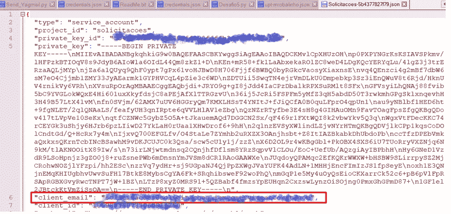

My JSON File

**3。为谷歌电子表格共享信息，该表格包含从谷歌表单收集的信息**

最后一步给了我们一个在 Google Drive 上的文档中使用的密钥。这个键是我们向其提供电子表格共享的元素。使用“客户端电子邮件”信息。

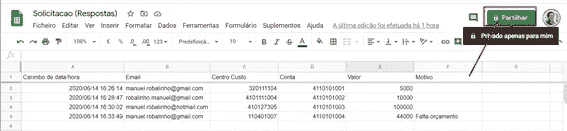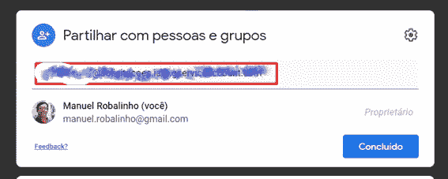

我们可以使用这个密钥在 python 程序中访问文件。

**4。用 python 程序将电子表格读入熊猫数据框**

我们需要在 python 程序中导入 **gspread** 和 **oauth2client** 。

文件“Client _ My _ Drive _ API _ secret . JSON”是在 Google API 配置期间创建的。这是一个 JSON 文件，包含使用程序访问 Google Drive 的密钥。您需要将 JSON 文件放在您的工作路径中。

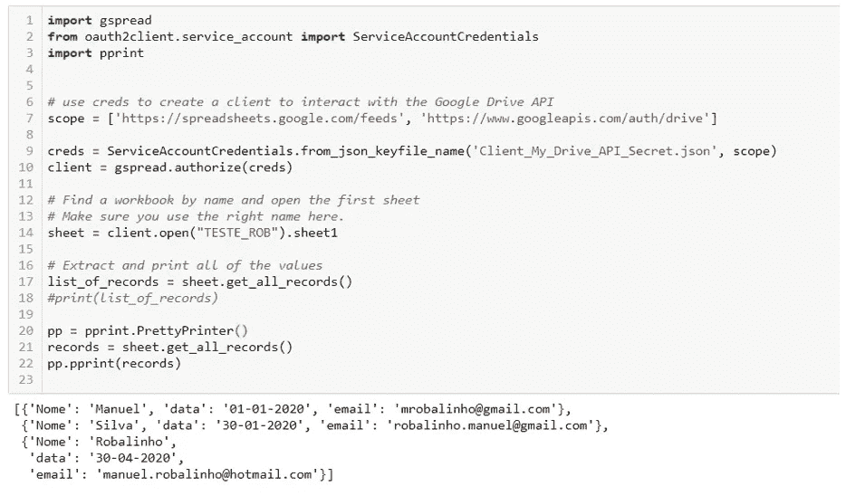

**另一种方法是获取电子表格的密钥。**

为此，我们需要发布我们的谷歌电子表格文件:文件>发布在网络上> CSV 格式

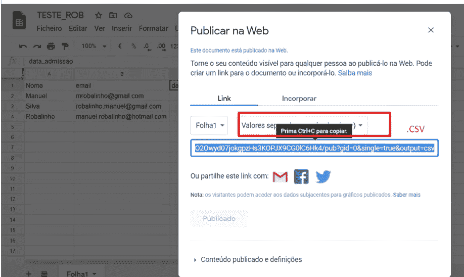

在 Python 程序中，我们像这样访问，读取电子表格，然后放入 Pandas 数据框中:

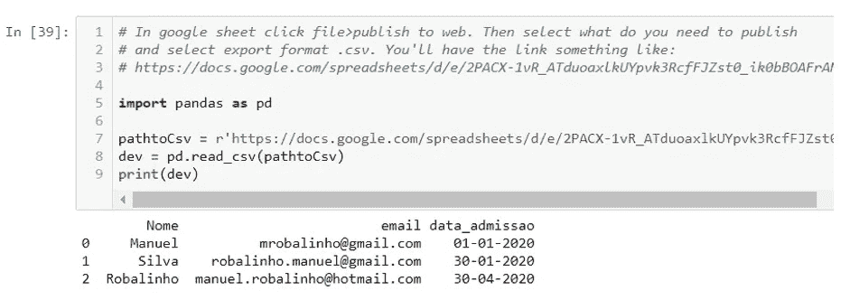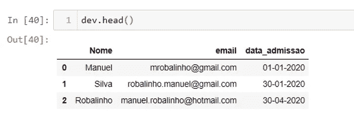

**5。我创建了一个 python 程序来发送电子邮件，信息来自熊猫数据框**

我尝试了两种方法，一种是使用 email.mime 功能，另一种是使用 Yagmail。使用 yagmail 更容易。

我需要**导入 yagmail** ，我创建了一个循环来读取 pandas 数据帧并调用函数为每一行发送电子邮件。

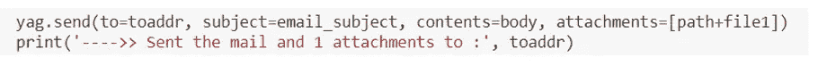

在正文中，我们可以使用 HTML 来创建更好的设计。

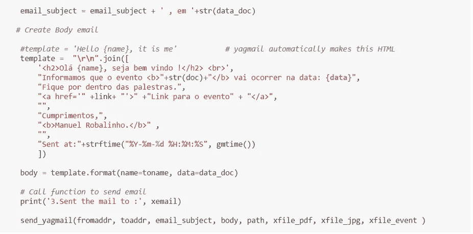

对于附件只需要告知路径和文件名就可以在邮件中附上。我尝试附加许多类型的文件，包括 PDF、JPG 和 ICS(用于日历约会)，并成功执行。创建 ics 文件的一个更简单的方法是，我找到了网页[https://ical.marudot.com/](https://ical.marudot.com/)，在那里我们可以定义事件并将其下载为 ics 格式的文件。

这是收到的邮件。

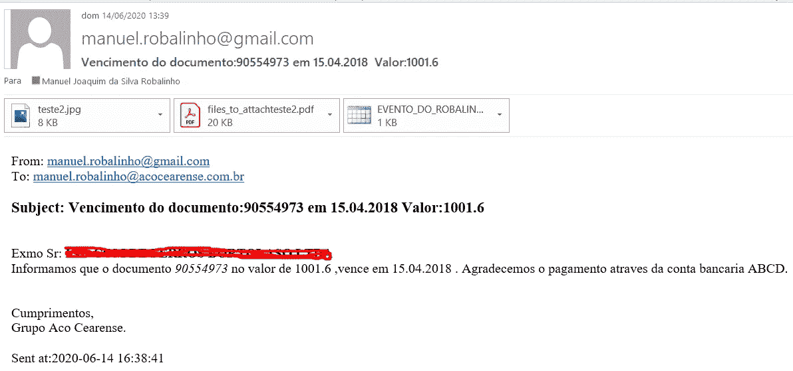

## 结论

过程自动化、数字化和工业 4.0 有很多创新，通常从每个软件公司检索软件片段，合并跨各种平台和语言分布的许多知识。安全方便管理的实例。

## 参考资料:

 [## MRobalinho/Read_Google_Sheet

### 阅读谷歌电子表格使用谷歌表单收集的信息，应用 python 发送电子邮件的过程…

github.com](https://github.com/MRobalinho/Read_Google_Sheet)  [## MRobalinho/发送电子邮件

### 发送电子邮件并附上文件 JPG，PDF 和。ICS(日历事件)…

github.com](https://github.com/MRobalinho/Send_email)  [## iCal 事件生成器-创建 icalendar(。ics)分享您的活动

### 创建 iCalendar(。ics)文件...单个或多个事件。重复发生的事件。带时区…

ical.marudot.com](https://ical.marudot.com/)  [## 使用 Python 访问 Google 电子表格数据

### 当构建一个简单的内部应用时，你可能会想‘我现在就需要一个数据库！’…

towardsdatascience.com](https://towardsdatascience.com/accessing-google-spreadsheet-data-using-python-90a5bc214fd2) 

**进入专家视图—** [**订阅 DDI 英特尔**](https://datadriveninvestor.com/ddi-intel)