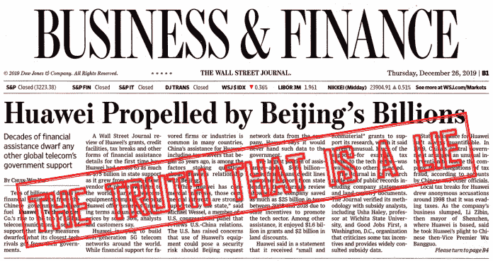

# 关于华为的一个错误方式

> 原文：<https://medium.datadriveninvestor.com/a-wrong-way-about-huawei-data-driven-investor-cb3b01813e4d?source=collection_archive---------6----------------------->

在最近的一篇文章中,《华尔街日报》详细描述了华为是如何被北京的数十亿美元推动的。在网络版中,《华尔街日报》的编辑将这段文字标记为独家新闻。事实上,《华尔街日报》做了大量研究，准确估算了华为从中国政府那里得到了多少帮助。这不应该被认为是新闻，因为众所周知，中国政府大力支持被视为国家实力关键的企业。《华尔街日报》公布的数字很可能是真实的，但这篇文章根本不是新闻。这是一篇观点文章，但由于没有将这些数字放在更广泛的背景下，它也不是新闻；这是巧妙的宣传。

# 从零到一

在每一个可能的场合，华为的领导人都会提到，该公司仍然相对年轻，从 1987 年的零开始。其创始人任郑飞在每一步都严格按照彼得·泰尔[建议初创公司](https://www.wsj.com/articles/gordon-crovitz-three-cheers-for-creative-monopolies-1413150477)去做，以求成功。他以执着的毅力寻找并执行未开发的利基市场的机会，至少在一段时间内获得了主导地位。当 20 世纪 80 年代中国开始

为了促进私营企业的发展，每个新企业都需要一个小型电话系统。中国的每个直辖市都需要升级其过时的电话系统，中国军方也是如此。任正非决定在这个领域做世界上最好的产品，就像每个处于这个位置的初创公司一样，他进行逆向工程，想出如何在中国制造适合当地市场、价格合理的手机开关。华为在市场上击中了要害，主要瞄准了小企业和农村地区，但大部分被主要市场参与者拒绝。在获得一些市场份额后，更大的合同到来了，包括来自中国人民解放军(PLA)的关键合同。

 [## 保护主义、政治和经济动荡|数据驱动的投资者

### 美国股市昨日出现 400 多点的大幅反转，为未来的事情发出了警告信号。市场…

www.datadriveninvestor.com](https://www.datadriveninvestor.com/2018/06/28/protectionism-politics-economic-turmoil/) 

从早期开始，任正非的重点就不是获取现有的技术，而是利用已经存在的“轮子”，发明新的技术。在进入无线电信技术领域时，华为再次将重点放在边缘市场，主要是农村社区，这一次遍及全球，并逐渐扩展到主要网络。华为成为全球蜂窝交换机和天线的主要供应商。据华尔街日报报道，在 2018 年的前三个季度，它提供了全球安装的所有 4G 设备的 [28%。](https://www.wsj.com/video/why-it-almost-impossible-to-extract-huawei-from-telecom-networks/122E816F-856B-4D3F-A361-B832D9862A99.html)

# 在 5G 领域，华为是世界领导者

《华尔街日报》没有问最明显的问题，即美国电信业是如何失去其主导地位的。相反，它需要一个放大镜才能发现中国公司华为是否一直在按美国的规则行事。从一开始，它就忽略了一个事实，即在寻找未来技术的技术优势时，华为在 2009 年发现了土耳其科学家埃尔达尔·阿里坎教授的工作，他拥有加州理工学院的工程学位和麻省理工学院的博士学位。从早期的《华尔街日报》[出版物](https://www.wsj.com/articles/the-5g-race-china-and-u-s-battle-to-control-worlds-fastest-wireless-internet-1536516373)中，我们知道它的编辑了解这个关键因素。提及这一细节不符合文章的主题，即推动华为发展的是北京的资金，而非商业头脑和辛勤工作。

数字通信的艺术可以归结为压缩数据，然后以尽可能少的错误发送数据。克劳德·e·香农于 1948 年提出了量化这一过程的关键理论。作为一名学生，阿里坎教授对香农定理的某些方面感兴趣，这些方面可以使通信网络更加有效。他于 1986 年在麻省理工学院的博士论文中发展了他的想法，并在 2009 年发表的一篇[文章](https://arxiv.org/abs/0807.3917)中提出了最终概念，发现了所谓的极地代码。有趣的是，在麻省理工学院，阿里坎教授在罗伯特·g·加拉格尔教授的指导下工作，罗伯特·g·加拉格尔教授受到香农的强烈影响；一开始是他的学生，后来是他在麻省理工学院的初级同事。更有趣的是，在 20 世纪 60 年代，加拉格尔教授发明了加拉格尔码，直到 20 世纪 90 年代末才找到实际应用，现在，被称为低密度奇偶校验(LDPC)码的加拉格尔码常用于数字数据传输。特别是，当谈到 5G 标准时，LDPC 是阿里坎教授发明的 polar 码的主要替代方案。

当被问及哪种代码更好时，阿里坎教授婉转地回答说这取决于应用程序。华为赌 polar 码最适合 5G。经过多年的努力，2016 年，在实验室测试中，他们获得了高达 29.3 Gbps 的速度。从来自美国的巨大政治压力来看，专家们似乎同意 polar code 是 5G 的必由之路。尽管美国人事先有关于其发展的内部消息，但华为从美国人的鼻子底下扫除了这项技术。现在，正如《华尔街日报》证实的那样，华为拥有大部分关键专利，并且比竞争对手至少领先一年，可以部署 5G 交换机，而且比其他公司更便宜。除此之外，华为在研发上投入了大量资金，2018 年为 153 亿美元。简而言之，它在世界范围内没有有意义的竞争对手，在可预见的未来也没有人挑战它的地位。

# 实际上

这意味着在具有重要战略意义的电信技术领域，美国失去了主导地位。美国政治领导人面临的挑战是，这一损失是中国的，中国显然渴望利用其新获得的经济实力和技术进步来提高其在世界上的政治和军事地位。

在无线电信系统中，在 5G 之前，进步是通过手机和平板电脑性能的增强来衡量的。正在实施并全力以赴的 4G 技术可以满足我们便携式设备的大多数当前和预期需求。高速和低延迟的 5G 网络开启了大量的新应用，通常被称为[物联网](https://www.datadriveninvestor.com/glossary/internet-of-things/) ( [物联网](https://www.datadriveninvestor.com/glossary/internet-of-things/))。自动驾驶汽车是最常被提及的。每辆车都是网络中的一个环节，我们可以想象一个系统，在这个系统中，安全不仅可以像现在这样通过分析车上的传感器来获得，还可以通过了解周围地区其他车辆的位置和活动来获得。潜在的商业应用很多，可能的军事用途也是无穷无尽的。由于这些原因，美国政治领导人越来越紧张，意识到他们在 5G 上输给了中国。

如果华为只是中国在技术上领先于美国的一个孤立例子，美国人就不会如此恐慌。根据美国国防部专家的说法，除了 5G，中国在无人机、电池、电动汽车、高超音速、太阳能、高铁、移动设备制造等领域已经拥有了超越美国的[不可逾越的](https://www.wsj.com/video/us-defense-official-lays-out-concerns-about-china-tech-dominance/C564CBE2-858A-4EB6-A6D1-DDDC3FE652B6.html)技术领先优势。

不知何故，他们错过了地理导航。自 20 世纪 70 年代以来，美国政府运营着最初为军事用途开发并逐渐用于民用的全球定位系统(GPS)。目前，这是世界范围内的主导系统，使美国政府有权限制其使用，正如 1999 年与巴基斯坦发生军事冲突时对印度军队所做的那样。中国刚刚完成北斗系统的研发，它是美国全球定位系统的全球替代品。在美国的全球定位系统中，通信只能从卫星传送到接收器。北斗提供双向通信，这使得它在许多新的商业和军事应用中比 GPS 更具吸引力。

# 他们做得更快更好

《华尔街日报》的编辑在撰写有关华为的文章时发现，值得一提的是，21 年前，华为与中国的国税局发生了麻烦。如果《华尔街日报》的编辑本身是企业家，他们就会知道，在避税方面有创意是每个初创公司生存策略的一部分，这往往会导致国税局的麻烦。国税局没有兴趣对创业公司征税到死。如果有人能提出一个合理的论点，即现在的一些宽大处理可以在未来给财政部带来更多的钱，那么就不需要政治阴云。这就是它在美国的运作方式。人们可以合理地假设，中国的税务当局没有太大的不同。《华尔街日报》以耸人听闻的语气报道称，1998 年，华为因涉嫌税务欺诈而需要北京高层政界人士的救助，对于一个直接了解美国如何解决此类问题的人来说，这听起来并不令人信服。

《华尔街日报》还感叹道，“中国国家开发银行和中国进出口银行在过去 20 年里为华为的客户提供了超过 300 亿美元的信贷额度。”公平地说，他们还报告说，根据华为的说法，使用的信用额度很少超过 30 亿美元。鉴于华为在 2019 年[的收入为 1220 亿美元](https://www.cnn.com/2019/12/30/tech/huawei-revenue-smartphone-sales/index.html)，来自中国的资金推动了华为的增长并不令人信服。然而，华为为他们的产品提供融资是正确的，但主要来自其自身的现金流。

根据记录，自 1934 年以来，美国进出口银行在美国所做的工作与中国发展银行和中国进出口银行在中国所做的工作相同。《华尔街日报》援引美国进出口银行(U.S. Export-Import Bank)前董事长弗雷德·霍克伯格(Fred Hochberg)的观点，他坦率地表示，在为产品提供融资方面，华为比竞争对手更聪明。《华尔街日报》的编辑们没有注意到，这一段引文偏离了他们文章的主要论点。

《华尔街日报》的编辑义愤填膺地写道，在 2014 年至 2018 年期间，华为从中国政府购买东莞最新研究中心的土地时，获得了约 20 亿美元的折扣。最近开放的[校园](https://www.theatlantic.com/photo/2019/05/photos-of-huaweis-european-themed-campus-in-china/589342/)的设计华丽地模仿了欧洲城市最令人印象深刻的建筑。计划拥有 25，000 名工人，2019 年初约有 [17，000 名](https://www.cnbc.com/2019/01/15/huawei-new-campus-in-dongguan-china-photos.html)员工。就在最近，华为获得了一个许可证，可以在它旁边增加一个智能制造中心，可以容纳 4 万人工作和居住。《华尔街日报》评论中的苦涩可以来自这样一个比较:2017 年，富士康因在威斯康星州建造一家雇佣 1.3 万人的工厂而获得了 30 亿美元的税收优惠。到目前为止，还没有发生太多的事情，如果有什么实现的话，也只是最初计划的一小部分。看到中国人能做到这一点，而美国人却做不到，这是令人痛心的。

《华尔街日报》编辑的研究也证实，中国政府通过拨款和税收优惠大力支持华为的研发工作。这是同时期华为的主要竞争对手之一诺基亚从芬兰政府获得的金额的 17 倍。更不用说另一个竞争对手，瑞典的[爱立信](https://www.ericsson.com/en)从政府那里什么都没得到。人们应该问的问题是:政府支持的适当规模(如果有的话)是多少？它应该与特定公司市场的规模有关，还是与增长的愿望有关？政府的支持应该与该国的人口成比例，还是应该与该国自身发展的需要成比例？中国的人口大约是芬兰的 255 倍，尽管取得了巨大的进步，中国仍然是一个新兴经济体。如果中国政府将电信视为促进人民富裕的一种方式，那么谁有权利判断它应该在新技术开发上投资多少？尤其是当一个理智的人不得不承认，如果处在中国的位置，他们也会做完全一样的事情。

# 对美国的信心已经丧失

正如在每一个场合一样，《华尔街日报》再次提出，对许多美国人来说，华为是一个安全风险，“如果北京要求该公司提供网络数据。”期待包括中国在内的其他国家对美国进行间谍活动是合理的。在对中国政府可能迫使华为成为其间谍活动一部分的恐慌背后，隐藏着一个不言而喻的假设，即美国人不像中国人那样具备及时发现潜在安全威胁的人才和技能。讽刺的是，对中国政府来说，拿自己公司的繁荣冒险是不明智的；更聪明的做法是找到一种方法，在其他地方生产的设备中植入窃听器，而不是在中国。

《华尔街日报》的这篇文章说明了美国政治精英是如何被中国的崛起弄得思维麻痹的。总统承诺让美国再次伟大，但是没有人记得美国最初是如何变得伟大的。美国的 19 世纪和中国过去的 40 年是一样的。欧洲人一直大喊大叫说美国人在窃取他们的专利。铁路连接了横跨大陆的新建城市。欧洲人看着美国，就像美国人现在看着中国一样不相信。

到现在，美国人那种无所不能的自信已经被一种自我满足所取代。然后，中国发生了，美国人无法正常思考。《华尔街日报》没有哀叹华为的成功是因为它从中国政府获得了数十亿美元，而是害怕问一个最明显的问题:如果美国公司拥有全世界所有的钱，它们会聪明到像华为那样抓住阿里坎教授的发明并加以发展吗？

在关于如何先发制人应对华为威胁的视频中,《华尔街日报》展示了一位据称是美国知识分子的人，他以不赞同的语气报道称，中国人希望成为领导者，这是中国共产党(CCP)的目标。CCP 应该要求华为沉住气吗？因为美利坚合众国有天赐的使命永远成为电信行业的领袖。《华尔街日报》的编辑们没有想过这种打破传统的想法。相反，他们做了大量的调查工作，收集了一些琐碎的论点，以掩盖一个简单的事实，即华为没有任何问题，尽管他们的领导人可能不是圣人，因为并非所有在 19 世纪建设美国的实业家都是圣人。《华尔街日报》没有问一个最明显的问题:*美国怎么了，它无法与中国竞争？*这篇文章告诉我们一些《华尔街日报》编辑自己可能没有意识到的事情，他们已经对美国失去了信心。而且，这才是真正的问题。

*原载于 2020 年 1 月 14 日 https://www.datadriveninvestor.com***。**