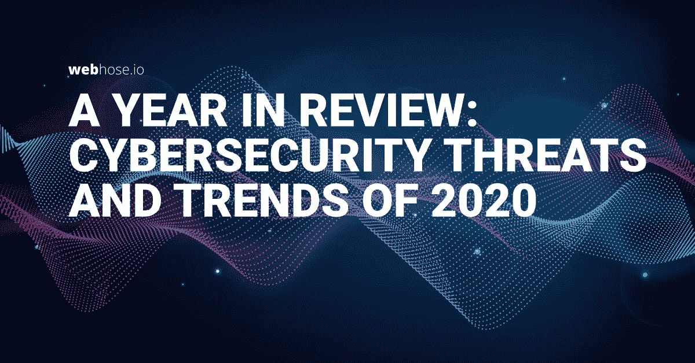

# 一年回顾:2020 年网络安全威胁与趋势

> 原文：<https://medium.datadriveninvestor.com/a-year-in-review-cybersecurity-threats-and-trends-of-2020-ffd465089ee6?source=collection_archive---------29----------------------->

正如伯德夫妇流行歌曲中的歌词所说，任何事情都有一个时间——包括疯狂的惊喜。这是有许多意外惊喜的一年，包括新的网络安全威胁和趋势。新冠肺炎病毒的突然传播无疑影响了其中的许多趋势，包括数据泄露、勒索软件攻击和极端主义内容在互联网上的上升——特别是在最近的美国选举之后。

在这篇文章中，我们想花一点时间来思考 2020 年的几个主要趋势和威胁。我们还提到了 Webhose 如何扩大其暗网覆盖范围作为回应，从而使其[暗网监控](https://webhose.io/products/darkweb-monitoring/)在市场上获得更大优势。

我们还将加入我们对 2021 年的预期。

# 反思
2020 年网络安全趋势的时候到了

回顾我们早在 2019 年预测的不同[趋势，我们看到一些趋势一直延续到 2020 年:](https://webhose.io/blog/dark-web/top-cyber-predictions-2019/)

1.  *网络罪犯继续从黑暗网络向聊天应用转移*

正如我们的网络业务部门经理 Liran Sorani 预测的那样，这主要是因为这些平台突然提供了安全和加密的通信。这使得网络罪犯能够避开执法机构对 TOR 市场和论坛的审查。

为了应对这一趋势，Webhose 开发了一种自动发现机制，可以识别新的相关来源，包括今天在 [Cyber API](https://webhose.io/products/darkweb-monitoring/) 中支持的聊天应用程序的不同组和渠道。在 2020 年，这包括调查超过 15 个新网络和数百个具有大量非法活动的额外来源，将其中许多作为相关来源添加到我们的网络覆盖范围。

2.*个人身份信息(PII)泄露和欺诈的增加*

个人身份信息(PII)以及被盗或受损的身份验证凭据仍然是攻击者的诱人目标。2020 年，超过 80%的安全漏洞包括 PII，比任何其他被破坏的数据类型都多。

在 Webhose，我们早在 2019 年就发现这一趋势在黑客和演员中非常重要。我们的应对措施是加大搜索来源的力度，包括泄露的凭证、检测到的新数据库、搜索无索引粘贴站点等等。

3.*僵尸网络使用的增加*

僵尸网络的兴起被与全球疫情直接相关的网络安全领域的主要参与者视为一种日益增长的趋势。我们在数据中也清楚地看到了这一趋势。下图显示了 2020 年我们的 DDOS 攻击、僵尸网络和移动恶意软件信息库中提及率的平均增长。这种增长在今年 4 月份尤为显著。

4.*数据泄露将威胁每个行业*

正如我们在 2019 年预测的那样，2020 年组织遭受数据泄露的概率上升了 2%。2021 年，公司数据泄露的预计成本为 1 万亿美元。

基于这些信息，今年 [Webhose 推出了一个数据泄露检测 API](https://www.youtube.com/watch?v=6aNTk1yVGLE&t=6s) ，用于监控泄露的凭证和实体，如信用卡、社会安全号码和其他 PII 信息。去年，我们通过各种新论坛、聊天组、渠道和索引到该端点的数据库，发现了 200，000 多起数据泄露事件。

# 待在家里的时间
冠状病毒相关的骗局

一个没有人预料到的全球疫情产生了各种有趣的内容:诈骗、诈骗方法和市场中的列表都与疫情有关。这包括假疫苗和与识别欺诈相关的失业骗局。我们能够通过对提供这些服务的最新相关 card 论坛、市场和聊天的持续报道和来源映射来发现这些内容。

假疫苗在 FDA 批准之前就在暗网上销售，有可能危及生命。下图显示，这些假 COVID 疫苗骗局自 2000 年以来广受欢迎。请注意从骗局最流行的 4 月份到 12 月份美国首次正式推出疫苗之间的时间框架:整整 8 个月。

据估计，这些类型的欺诈，尤其是那些与对小企业或失业者的财政援助有关的欺诈，造成的损失高达 10 亿美元。

下图显示了与小企业管理局(SBA)和新冠肺炎福利相关的诈骗和欺诈服务的增长情况。请注意诈骗的数量是如何在接近财年结束时显著增加的。

# 抛弃勒索软件的时候到了
知名勒索软件集团的崛起

2020 年的勒索软件集团随着官方勒索软件集团网站的出现变得更加突出。据预测，在 2021 年，每 11 秒钟就会发生一次勒索病毒攻击，代价高达 200 亿美元。

今天，在 Webhose，我们监控并不断添加最新的勒索软件集团网站，如 Maze、NetWalker 和 Pay2Key。快速添加这些网站使我们能够发现这些网站中提到的所有公司及其数据(全部或部分转储)。我们能够检索到的勒索软件组织的责任声明包括 Kopter 和 Habana Labs 等。这些攻击是由 Lockbit 和 Pay2Key 执行的。

# 言论自由的时代
言论自由平台上极端内容的兴起

我们发现，与主流社交媒体相比，另类社交媒体网络上的极端主义内容今年大幅增加。在美国大选期间尤其如此。这包括关于纳粹主义、白人至上、反犹太主义和针对不同社区的一般性仇恨言论的激进讨论。这种极端的内容在许多言论自由的社交网络中找到了归宿。

基于这一趋势，我们深入研究了这些网络，映射出与上述主题相匹配的个人资料、标签、群组和页面。

2019 年，我们看到这种趋势在[匿名图像板中迅速传播，如 8chan](https://webhose.io/blog/dark-web/imageboards-hotbeds-extremism/) (与美国致命的大规模枪击事件直接相关)。今天，我们在 Parler、 [Gab](https://webhose.io/blog/dark-web/all-about-gab-com-webhose-source-review/) 、Bitchute、Rumble、Minds、Mastodon 等社交网络中，以及 Atomwaffen 和 The Proud Boys 等知名团体中看到了这些内容。不幸的是，言语可以转化为行动。这就是为什么组织继续监控这些来源并保持对故意行为和威胁的掌控至关重要。

下图显示了从举办此类活动和讨论的各种社交网络中抓取的数据的增长情况。(请注意，由于在我们的报道中加入了来自 Parler 的极端主义内容，今年 12 月的图表出现了显著的飞跃)。

# 预测 2021 年新的网络趋势的时候到了

到 2021 年，我们预计网络罪犯将会发现新的和创新的方法来攻击个人和组织。全球疫情已经迅速加速了向远程工作空间和在线技术侵入性使用的转变。黑客将继续利用这种转变来利用人与技术之间的差距中发现的漏洞。

以下是我们预测的 2021 年的一些具体趋势:

## 滥用云托管技术

自 20 世纪 90 年代中期针对美国在线(AOL)的首次攻击以来，网络钓鱼攻击已经走过了漫长的道路。如今，网络犯罪分子拥有各种工具，可以根据行业和多个垂直行业的目标组织来自动化、注入甚至生成新的网络钓鱼内容和攻击。

例如，如今大多数云托管服务，如 Azure 和 AWS，都提供互联网可访问的数据存储，用户可以上传从数据库备份到个人文件的任何内容。这些服务通过自定义子域或主要域(如 cloudfront.net、windows.net 和 googleapis.com)上的 URL 路径向互联网公开。网络犯罪分子通常滥用这些功能来托管网站 HTML 文件，这些文件旨在模仿 Microsoft365 或 Google Drive 等合法网站的身份验证形式，并窃取不知情的受害者提交的凭据。

这种攻击技术非常有效，因为电子邮件链接到类似已知域的欺骗表单。这些链接也可能出现在流行的广告平台、脸书认证页面和 Linkedin 等地方。如果没有及时跟踪这类攻击的能力，它可以欺骗成千上万的用户。

到 2021 年，我们预测这些类型的云托管攻击将会增加。然而，与此同时，云托管服务也将开始通过部署自动工具和文件验证来严厉打击网络钓鱼和其他欺诈行为，这些工具和文件验证可以发现欺骗性的认证门户。

为了应对这一趋势，Webhose 将支持不同的相关实体，从而简化搜索公司数字资产(如域名和 IP 地址)风险的能力。这些风险类型可能会对云存储基础架构造成威胁或损害。

## 勒索软件攻击将对组织构成越来越大的威胁

[勒索软件的使用加速](https://webhose.io/blog/dark-web/rising-trends-in-ransomware-and-data-in-the-dark-web/#:~:text=Rising%20Trends%20in%20Ransomware%20and%20Data%20in%20the%20Dark%20Web,-Posted%20on%20October&text=Experts%20predict%20that%20ransomware%20attacks,reach%20%2420%20billion%20by%202021.)并变得比我们在 2020 年见过的更危险。疫情期间针对医疗设施的定点袭击越过了新的界限。一家德国医院因勒索软件攻击而关闭，迫使一名妇女被送到更远的医院接受治疗。她的死亡后来被报道，首次证明勒索软件与个人死亡直接相关。

我们预计，随着勒索软件运营商变得更加激进，勒索软件在 2021 年的频率和种类都将继续升级。我们希望看到攻击者在消化内容时以新的不同方式使用保留的数据。此外，威胁参与者将越来越多地将组织拥有的最重要的资产作为目标。

到 2021 年，对大多数行业来说，跟踪新的潜在勒索软件的监控将是必要的。

此外，组织将需要通过使用分段安全方法来保护自己。

Webhose 致力于追求关于勒索软件组、交易、讨论、数据发布等的新的和更新的内容。随着内容在网络、封闭论坛、个人网站和不同应用程序中传播，我们发现了这一趋势，并抓取了尽可能多的相关数据。

## 数据泄露的影响和多样性都在增加

网络犯罪分子利用窃取的用户名和密码(可在深度和黑暗论坛上获得)危害组织，利用密码喷射和凭据填充攻击，取得了令人难以置信的成功。只要个人选择弱密码，并且每个帐户都使用相同的密码，这些攻击就会持续下去。因为 20-30%的人将他们的商务电子邮件用于私人账户，这大大增加了风险水平。现在有数十亿的用户名和密码广泛存在于各种黑客入侵的黑暗网络中。每天都有数百万人加入。

组织可以通过持续监控受损的业务电子邮件或数字资产来降低违规的风险和影响。发现这些，就能及时堵住各种后门，防止攻击。

随着黑客变得越来越多才多艺，并威胁到更多的行业和组织，Webhose 将改善和增强其不同的机制，并添加新的可搜索实体，以提醒公司和域的风险。这将使搜索可能表明违规的受损实体变得更加容易。

# 每一个目的的时间

以上总结了我们对 2020 年的回顾和对 2021 年的预测。在 Webhose，我们期待着新的一年可能出现的意想不到的变化，以及我们如何尽快应对这些变化。