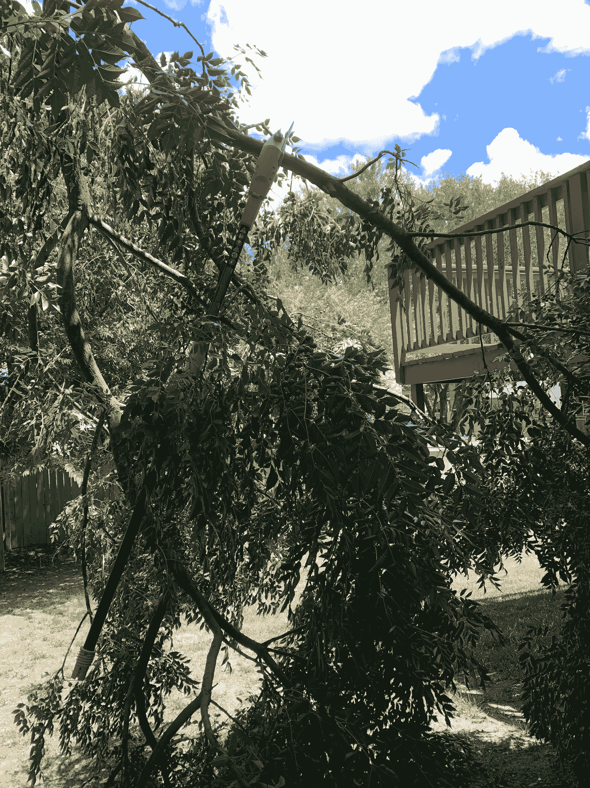

# 一年回顾:你学到了什么，你要去哪里

> 原文：<https://medium.datadriveninvestor.com/a-year-in-review-what-youve-learned-and-where-you-re-going-d5aba709c4d9?source=collection_archive---------30----------------------->

## 找到闪光点，培养它们成长

Photo by [Matheus Bertelli](https://www.pexels.com/@bertellifotografia?utm_content=attributionCopyText&utm_medium=referral&utm_source=pexels) from [Pexels](https://www.pexels.com/photo/upset-tattooed-woman-with-halloween-makeup-and-mirror-5477430/?utm_content=attributionCopyText&utm_medium=referral&utm_source=pexels)

今年对每个人来说都非常艰难。不管你想把它做得多漂亮，在美丽的瞬间闪耀的地方，总有一种潜在的悲伤。失去亲爱的人，你的希望，你的计划。无法实现所有你想实现的目标会带来痛苦。

今年，我比以往任何时候都更加认为，向前迈进必须包括回顾过去，不是以悲观的方式，而是以一种启示的方式。很少有人经历过像今年这样不可预测的一年。在很大程度上，我们将看到伟大的事情，不是因为我们期待如此快速地前进到我们要去的地方，而是因为我们幸存了下来，并从我们去过的地方学到了一些东西。

你需要处理各种情绪:痛苦、失落、悲伤、悲痛，但也有坚强和生存的时刻。重要的是不要让失败掩盖了成功。随着我们的前进，好的和坏的都会让我们在灰烬中创造出美好的东西。结束这一年并不是增加一个书挡来结束这一年，而是找到将成为美丽玫瑰的幼苗。众所周知，玫瑰本身并不美丽。它带着荆棘和痛苦的记忆，提醒我们去过哪里。

在我们试图抛开今年所经历的一切之前，让我们花一些时间来思考一下。如果没有其他原因，仅仅是为了子孙后代，通过思考一些问题来处理你所经历的事情可能是值得的。我怀疑每个人的旅程是不同的，但对一个人来说并不比另一个人更有价值。我们来问一问，回答一些问题进行反思。

# 写下不为人知的故事

你不可能预言今年的事件，但是知道你现在所知道的，你将如何像写一个故事一样写今年？如果你曾经梦想写一本书，我敢打赌你的账户可以写满足够的页面，成为一本成熟的书。不要给自己施加压力去塑造任何关于最终形态的东西。让你的感觉落在纸上。我从来没有成功地写过日记，但是当谈到处理我的情绪时，我会写下来。[科学日报](https://www.sciencedaily.com/releases/2007/06/070622090727.htm)称，将感受用语言表达出来会在大脑中产生治疗效果。

我不会告诉你你必须每天写日记，因为我自己做不到。虽然写日志是有益的，但并不是每个人都适合。道路是[个人的，每个人都有不同的](https://medium.com/better-advice/creativity-can-help-you-feel-less-stressed-16d9cc21a8d7)；你的处理方式也可能不同。

德克萨斯大学的心理学教授詹姆斯·彭尼贝克说:

> "没有正确的方法来处理你的情绪。"

我要补充说明的是，以上是真的，前提是在这个过程中你或其他人不会受到身体伤害。Pennebaker 支持写下你的感受，并研究*为什么你会有这样的感觉。情绪调节策略的实践被称为[重估](https://pubmed.ncbi.nlm.nih.gov/23765157/)。情绪驱动的过程是一个自我处理的好策略，而不是一个最好完全分享的策略。希望，当你处理和检查你的情绪时，你会到达一个更好的地方去超越它们。*

# 将话语与你的情绪联系起来

许多人选择一个词作为今年的年度词汇，意在实践它。当[选择你的词语](https://mountainmodernlife.com/word-of-the-year/)时，你通常会将你的个性和你有目的生活的目标结合起来。这是你为自己设定的目标导向的路径和焦点。今年我建议回顾过去，选择单词作为回顾你所经历的方式。很难说没有远离电网的人会预测到 [*隔离*](https://medium.com/publishous/how-to-survive-painful-isolation-and-come-out-a-winner-f99f8d6257a6) 到你今年感受到的程度，但我敢猜测这个词在我们今年的许多单词列表中名列前茅。就我个人而言，我会加上*挫折、*和年初至年中、*恐惧*。我很好奇你会用什么词来定义今年。

# 确定优势和劣势

具体来说，问:*什么让你充满活力？*和*是什么榨干了你？答案可能会让你吃惊。你可能会发现你不知道自己拥有的优势。我知道我做到了。事实上，我感到很虚弱，因为有一段时间无法继续像去健身房这样的常规活动。*

Two pole saws stuck in a tree. I need an upgrade. Photo by Author.

我重新发现了园艺工作，不是园艺、培育类的，而是砍树类的。我有一个黑色的拇指，不能种植植物来拯救我的生命，但我喜欢使用电锯。给我一把锯子，给我上发条，看着我走。你需要做一些庭院工作吗？如果需要电锯，我是你的女人，但园艺不是我的运动。有一天，我用了没多久，就发现两把电锯卡在了树上。过了一段时间，我收到了一把电锯。

你对自己了解多少？你有没有意识到你有以前没有考虑过的不同的特质和能力？值得考虑一下你可以用你新发现的优势做些什么。如果你发现了自己的弱点，也值得注意那些个人成长的领域。经过像今年这样的一年，我们可能都发现了增长潜力。

# 回顾和预测

如果你曾经经历过一年的生活和思考，*我希望我再也不会过像今年这样的一年*，我敢打赌今年很多人都会有这种想法。我们都经历过艰难的岁月，但今年充满了挑战，一点也不可预测。这是一个不确定性的过山车，不幸的是，旅程还没有结束，但它开始看起来像我们可以开始把一些正常的生活恢复到正常的秩序。尽管如此，这一年包含了我们可能还没有学到的宝贵的智慧。当我们回顾并反思我们走过的路时，我们可以[展望](https://nicoleakers.medium.com/a-beautiful-sight-happens-when-planets-come-together-e4840238644d)创造一个更加美好的明天。让我们让明年变得更好。

**访问专家视图—** [**订阅 DDI 英特尔**](https://datadriveninvestor.com/ddi-intel)