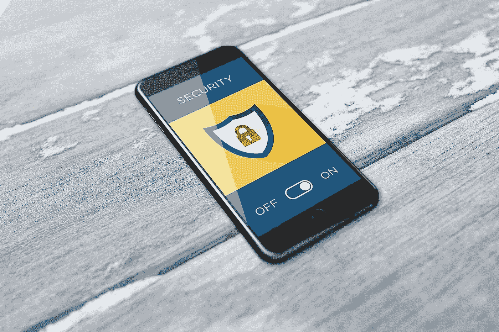
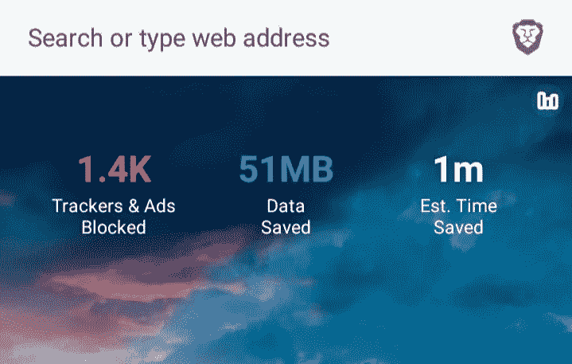
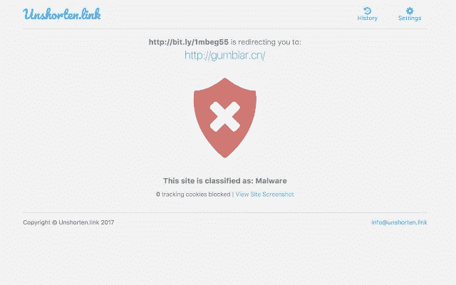

# 移动安全 A-Z 指南

> 原文：<https://medium.datadriveninvestor.com/a-z-guide-to-mobile-security-a44f945726bc?source=collection_archive---------14----------------------->

## 所有你需要知道的关于你的 android 设备的安全漏洞，以保护你的手机免受隐私侵犯和安全漏洞。

Photo by [Biljana Jovanovic](https://pixabay.com/users/biljast-2868488/) on [pixabay](http://pixabay.com)

从“别忘了你的钥匙”到“别忘了你的手机”，科技以闪电般的速度发展，现在我们生活的钥匙就藏在敞开的口袋里。

普通人每天花在手机上的时间超过 5 个小时，世界上大多数人都是用手机而不是牙刷开始新的一天。

我们在房子里检查的第一件事是门和它的锁是否正常工作，因为我们会尽一切努力保护我们的私人空间，但当我们使用手机时，我们是否也有同样的担心。我们早就应该明白，我们的手机是一把超级钥匙，可以打开我们生活的任何一扇门，无论是虚拟的还是物理的。

# 你能做些什么来保护你的手机？

移动设备使用量的大幅增长迅速增加了移动恶意软件的数量。您上网的时间或您通过互联网使用服务的时间；你可能认为自己是顾客，但你才是被卖的人，因为生活中没有免费的东西。

# 警惕应用权限

最近的研究显示，超过 1000 个 android 应用程序正在窃取你的数据，如位置、密码和其他个人数据。

千万不要给不必要的 APP 权限。

例如，考虑你已经下载了一个购物应用程序的情况。如果它要求存储、联系人和麦克风等权限；想想这个；为什么购物应用程序需要访问你的存储空间，有了这个权限，它就可以得到你内存中的任何东西，如果它请求麦克风权限，那么它就可以监听你所有的音频消息或通话。

一个合法的应用程序只会根据它的功能来请求许可。

管理应用程序权限

进入**设置** > **应用** >选择一个应用> **权限**

# 强制密码规则:

*   始终使用至少 8 个字符的长密码。
*   它应该是大写字母、小写字母、数字和符号的混合。
*   保持每 60 天更换一次密码的习惯。
*   切勿为多个帐户重复相同的密码。

一些网站可能会强制执行这些规则，而一些网站会忽略这些规则。你有没有想过为什么我们需要坚持以上 4 条规则？这是保护你的账户免受暴力密码攻击的最有效的方法。

**什么是暴力攻击？**

在暴力攻击中，攻击者尝试不同的字符和符号组合，直到它与您的密码匹配。现在我们有了计算能力更强的计算机，因此暴力攻击可以很容易地用你使用的任何普通密码来完成。

[**【haveibeenpwned.com】**](https://haveibeenpwned.com/)是一个网站，让你检查我们的电子邮件 id 或密码是否在互联网上的任何地方被盗。

howsecureismypassword.net[这个网站会告诉你黑客破解你选择的密码可能需要多长时间](https://howsecureismypassword.net/)

# 少即是多

**如果有不用的 app 就卸载。把应用程序想象成你房子的窗户。他们越少，你就越安全。**

**避开第三方网站的应用。**仅从 Google Play 商店或 Apple play 商店下载您的应用。

# 始终设置多因素身份验证:

认证的第一个因素是**你知道的东西**(密码和 pin)。如果攻击者获得了您的密码，并试图访问您的帐户，他们会要求第二个因素，即**您拥有的某种东西**(令牌、OTP、验证器)。这个令牌设置了时间限制，它每分钟都在变化，所以即使攻击者得到了你的密码，他们也必须访问你的手机。不仅仅是访问手机，他们还必须拥有来自验证器应用程序的 PIN 或您收到的令牌。这就是为什么我们说**黑客讨厌双重认证**

# 确保使用安全可靠的浏览器，而不是 chrome，因为浏览器的安全性很重要

浏览器比我们生活中的任何人都了解我们。它知道你搜索的东西，你输入的密码，你的病史，你聊天的人，你是什么，你在哪里。说到浏览器安全，**选择一款兼顾隐私和安全的浏览器。**

用[全景点击](https://panopticlick.eff.org/cy)测试你的浏览器隐私。总是浏览 HTTP**s 的网站，而不是 HTTP。**

Mozilla Firefox**和[**Brave**](https://brave.com/)**以提供足够的隐私和安全级别而闻名。不同的是，在 firefox 中，我们必须手动添加插件，如 Noscripts 和 ghostery，以确保隐私和安全，但在 brave 中，他们有内置的跟踪拦截器，广告拦截器和浏览器指纹拦截器。****

********

****Brave browser****

# ****从公共 wifi 浏览时，请始终使用 VPN****

****开放的公共 wifi 热点就像所有黑客和探听者的隐居地，因为开放的网络没有任何安全标准实践。通过使用基本的嗅探工具，攻击者可以窃取所有数据，如您用于登录的密码，尤其是社交网站、银行帐户、电子邮件等。****

****VPN(虚拟专用网络)可以通过安全的加密隧道发送您的网络流量，使其他人很难试图拦截您的数据。VPN 有几个很酷的功能，比如允许访问地区限制的内容，防止 ISP 窃取你的浏览隐私，以及加密互联网上的网络流量。它提供了隐私和安全。****

# ****对链接持怀疑态度。****

****千万不要盲目相信任何链接。始终将鼠标悬停在你在电子邮件或社交媒体网站中收到的任何链接上，看看它是否会将你带到正确的页面。攻击者可以使用[社会工程](https://usa.kaspersky.com/resource-center/definitions/what-is-social-engineering)战术窃取你的数据。****

****[**virus total**](https://www.virustotal.com/gui/)**:**该网站可用于分析可疑文件和 URL。将 [unshorten.link](https://unshorten.link/) 添加到 chrome。它可以揭示任何缩短链接的确切网址，还可以让你知道该网站是否被归类为恶意网站。****

******给 chrome 添加**[**un short . link**](https://unshorten.link/)**。它可以显示任何缩短链接的确切网址，还可以让你知道该网站是否被归类为恶意网站。******

********

******为您的移动设备下载** [**反恶意软件**](https://www.malwarebytes.com/android/) **like Malwarebytes。如果您碰巧下载了恶意应用程序或打开了恶意附件，移动反恶意软件保护可以防止感染，******

******启用 Google Play Protect** (设置>安全> google play protect)这是谷歌为 android 内置的恶意软件防护。点击此处了解更多信息****

******如果您发现任何性能问题，如应用程序频繁崩溃、屏幕上令人讨厌的弹出广告以及速度和性能异常下降，请将您的设备引导至*安全模式*(关闭，然后按下电源按钮+音量降低)，因为这些都可能是恶意软件感染的迹象。******

****任何可以执行恶意活动的软件，如窃取您的敏感数据、密码、控制您的设备以及在您不知情的情况下破坏您的系统，都是**恶意软件**。如果您的手机被最近安装的应用程序感染，安全模式允许您测试您刚刚安装的应用程序是否在您的手机上引起了问题。****

****掌控您的数据永远不会太迟。****

## ****你的数据，你的生活，你的责任。****