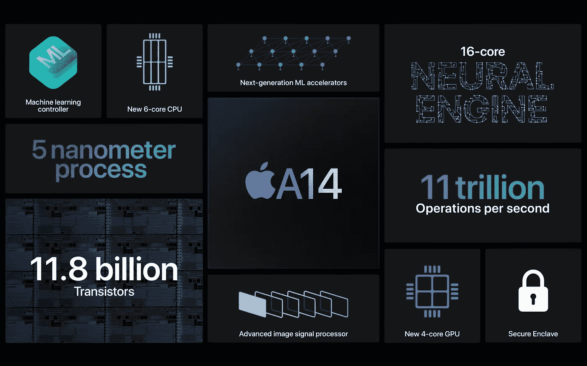
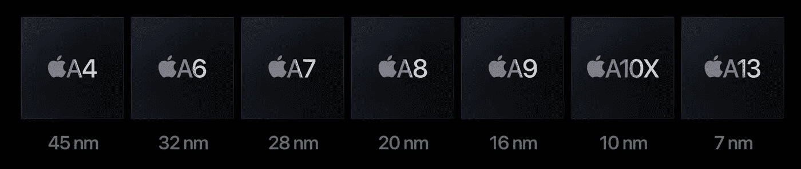
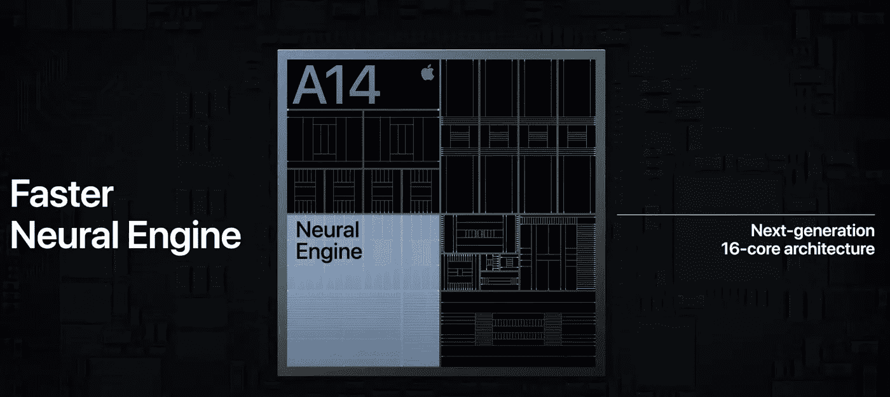
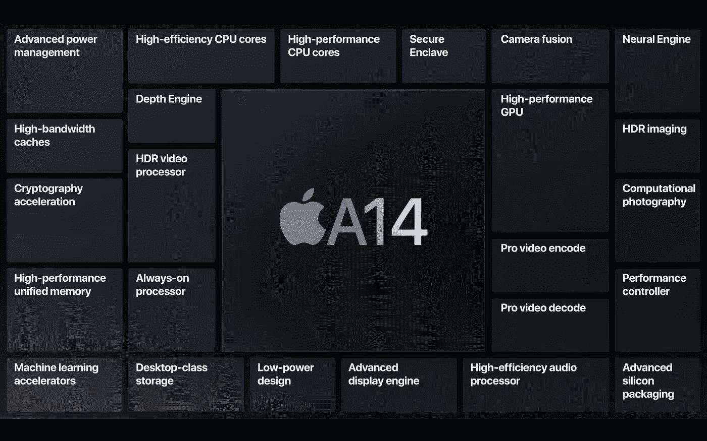

# A14 仿生在 iPhone 12 之前就在这里了

> 原文：<https://medium.datadriveninvestor.com/a14-bionic-is-here-before-the-iphone-3d2b0f0139c6?source=collection_archive---------7----------------------->

## 全球首款五纳米制程工艺芯片，专为 ML 和 AI 打造。

The latest A14 Bionic Chip — Photo by 

今天播放的“时光飞逝”活动为 Apple Watch 和 iPad 系列带来了一些重大升级，让期待新 iPhone 的粉丝失望了。但当天最引人注目的宣布之一是最新的 A 系列处理器。通常，苹果会在 iPhone 发布会上宣布最新的芯片。在过去的几年里，A 系列新芯片的发布是每一次 iPhone 发布活动的关键亮点之一，苹果公司在发布会上谈论该芯片在 iPhone 内部的性能将有多好。苹果每年都在通过这些仿生芯片不断推动 CPU 和 GPU 的极限，今年也不例外。

 [## 新的健康技术如何让我们活过 100 岁？数据驱动的投资者

### 不久前，我们都在看一台黑色电视，不得不带着天线跑遍整个公寓，以确保…

www.datadriveninvestor.com](https://www.datadriveninvestor.com/2020/08/12/how-new-health-technology-makes-us-live-past-100-years/) 

在今天的活动中，苹果平台架构副总裁蒂姆·小米发布了最新的 **A14 仿生芯片**，苹果声称这是世界上第一款使用五纳米工艺技术的芯片。这与 2010 年第一代 iPad 最初采用的 A4 芯片相去甚远。以防还不清楚，5 纳米晶体管的尺寸是以原子为单位测量的。

‘Evolution of apple’s older chips before A14 — Photo by 

A14 内部包含 118 亿个****晶体管**，比 A13 的 85 亿个晶体管增加了 40%。A14 在 CPU 方面也有很好的更新，采用了包括 4 个高效和 2 个高性能核心的 **6 核**设计，与前代产品相比，CPU 性能提升了 40%。GPU 也从旧芯片得到了重大升级，新的 **4 核** **图形**架构苹果承诺将图形性能提高 30%。**

****

**The neural engine on A14 — Photo by **

**苹果已经通过去年的 A13 为移动芯片上的机器学习能力设立了高标准，这一次他们将内核数量增加了一倍，为神经引擎构建了一个 16 核架构。苹果声称，它每秒能够执行高达 11 万亿次运算，允许机器学习和人工智能应用在移动设备上利用前所未有的能力。该 CPU 还包含第二代机器学习加速器，具有加速的矩阵乘法，与旧芯片相比，执行机器学习计算的速度快 10 倍。**

**该芯片还具有最新的图像信号处理器，用于更高质量的照片和视频，以及更快的 Touch id 安全飞地(用于新 iPad)。所有这些功能以及众多可以驱动独特 iPad 体验的定制技术将吸引拥有有史以来性能最好的移动芯片的游戏玩家和专业人士。而应用程序开发人员可以充分利用芯片的特性来构建以前只能在 Mac 或 PC 上运行的更强大和高性能的应用程序。**

****

**Custom features on the A14 bionic- Photo by **

**有趣的是，苹果还宣布 iOS 14 将于明天向公众开放，这对于苹果来说，在新 iPhone 之前发布最新的移动操作系统再次非常不同寻常。这和 A14 芯片的发布让许多人想知道他们的袖子里是否有什么东西会成为即将于 10 月份举行的 iPhone 发布会的亮点。像往常一样，苹果喜欢让我们猜测到发布日。**

## **访问专家视图— [订阅 DDI 英特尔](https://datadriveninvestor.com/ddi-intel)**