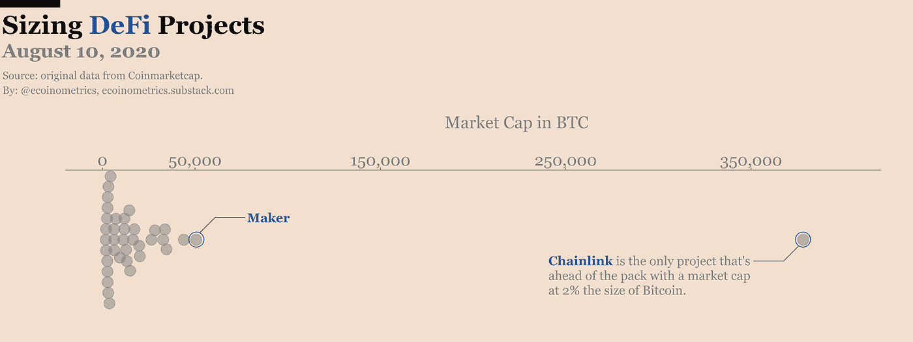
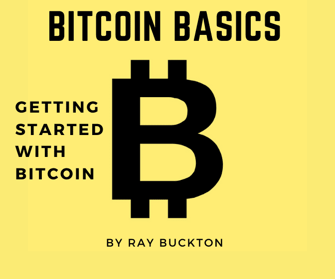

# 它不见了。比特币两次突破 12000 美元，BTC、瑞士联邦理工学院和 DeFi 在贵金属调整中剧烈波动。

> 原文：<https://medium.datadriveninvestor.com/aaaand-its-gone-706f05f8b254?source=collection_archive---------8----------------------->

## **DDI 加密简讯，8 月 12 日开始的一周**

# 家政

我们一起将《数据驱动的投资者》打造成为数据科学、区块链和企业家精神的顶级媒体出版物之一。月读者 80 万到 100 万，有理由骄傲！

但我们只是触及了表面。数据驱动的投资者不仅仅是一份出版物。

**正在进行的项目:**

*   **DDI 专家聊天程序:**一个协作市场，人们可以在这里与能够解决他们问题的专家聊天。你是专家吗？为你的时间和努力获得报酬！报名已经开启， [**在此**](https://datadriveninvestor.com/expertchatregistration) 跳上船。

你想在你的专业领域建立你的权威吗？我们需要你的帮助来揭示人们从别处得不到的洞察力。作为回报，我们将在我们的时事通讯中突出显示最佳投稿。

您可以使用 [**提交链接**](https://datadriveninvestor.com/mainsubmission) 将您的原创文章提交到我们的主站点。

*(注意:如果你喜欢这封邮件，请考虑将它转发给某个会从中受益匪浅的人。如果有朋友给你发了这封邮件，你可以* [*订阅 DDI 简讯*](https://www.datadriveninvestor.com/about/) *这样你就不会错过任何一个节拍。)*

# 分析

**隐密恐惧&贪婪指数:**【75:贪婪】([截至 2020 年 8 月 11 日](https://alternative.me/crypto/fear-and-greed-index/))

捕捉上一期关于加密货币 [**【此处】**](https://medium.com/datadriveninvestor/volatile-follows-gold-high-yield-crypto-dd6e55ae9bb1) 以及所有关于市场和经济的**[**此处**](https://medium.com/datadriveninvestor/executive-order-trumps-new-stimulus-tech-shake-up-f846d81d0239)**。****

****对于 crypto 来说，这是不稳定的一周。DeFi 继续打破记录，比特币(BTC)投机者进入“极度贪婪”模式，根据奥术研究[。在与 12，000 美元短暂约会后，BTC 跌至 11，200 美元以下的水平，并放弃了一些市场主导地位，以替代硬币。整个市场慢慢地重新站稳了脚跟，许多 DeFi 的名字享受了大量的炒作。](https://research.arcane.no/feed/the-weekly-update-week-32)****

****其中表现最好的是 DeFi 的领导者 Tezos (XTZ)和 ChainLink(链接)。然而，由于重大的经济变化，整个加密市场已经回落到以前的每日支持水平。****

******拉动市场的因素:******

*   ****加密空间中的许多名称都过度扩张，包括 RSI 在内的各种指标都显示出超买状态。****
*   ****标准普尔 500 和[贵金属回落](https://www.ft.com/content/11927118-382c-48c3-a52b-451739b2b330)，因为许多人预计美元将反弹，特朗普总统推进下一个刺激计划的行政命令存在不确定性。****
*   ****随着 COVID 感染在世界一些地区的放缓，许多投资者正在寻找不那么被高估的领域来获取收益。尽管美联储可能准备在未来几个月提高通货膨胀率，但可能会有一个暂时的现金滚回。最终，我们的分析师预计，一旦当前的回撤完成，通胀对冲资产将出现反弹。****

******要点:**尽管当投资者对冲美联储货币政策时，加密受益于比特币与贵金属的相关性，但没有什么会永远直线上升。也就是说，加密市场正在见证波动性和 FOMO，这与 2017 年的牛市相呼应。****

# ****DDI 编写器亮点****

****每周，我们都会为读者带来一些精选的故事，这些故事来自《数据驱动投资者》的朋友。想让你的故事成为特色吗？ [**在这里提交你最好的**](https://datadriveninvestor.com/mainsubmission) **。******

****[该不该考数据科学证书？流程图。](https://medium.com/datadriveninvestor/should-you-get-a-data-science-certificate-a-flowchart-3e349cc7c43a)****

*   ****证书是向你的社交网络证明你技能的好方法。虽然它们不是一切，但它们肯定有助于向潜在雇主展示你的专业知识。Frederik Bussler 创建了一个很棒的流程图，可以帮助您就是否应该获得数据科学证书做出决策。****

****[5 篇 AI 训练数据精华论文](https://medium.com/datadriveninvestor/5-essential-papers-on-ai-training-data-aba8ea359f79)****

*   ****数据科学家 80%的时间花在预处理阶段。处理海量数据集是工作描述的一部分，因此以最佳方式处理是工作成功的核心。Limarc Ambalina 汇编了五篇关于数据科学的论文，他认为这些论文对该领域的工作流程至关重要。****

****[一帖汇集顶级计算机科学资源](https://medium.com/datadriveninvestor/top-computer-science-resources-compiled-in-one-post-6dc383b7f192)****

*   ****你想在计算机科学领域看到一些繁重的工作吗？Naina Chaturvedi 支持你。从初级课程到高级课程，这篇文章包含了足够的资源来开始这个领域的职业生涯。社交媒体渠道、图书馆、深度学习资源等等，这一块都有。****

****[如果我们今天有一台完美的量子计算机会怎么样？](https://medium.com/datadriveninvestor/what-if-we-had-a-perfected-quantum-computer-today-643ad31e9c99)****

*   ****两个事实:你不能同时在两个地方，计算机是一堆 1 和 0。量子计算试图使这两点无效，并允许一个比特同时保持 1 和 0 的值。表面上听起来很简单，但这将彻底改变我们的世界。它不仅将彻底革新密码学，而且计算速度的提高也将允许软件模型、金融预测等方面的突破。Vishal 解释说我们就快到了。****

****[如何保持家庭网络安全](https://medium.com/datadriveninvestor/how-to-keep-a-secure-home-network-5800df519bbe)****

*   ****量子计算机可能还不能打破你的防火墙，但是传统的网络安全仍然是生活中不可或缺的事实。Kevin Gabeci 讲述了家庭网络安全的现实，解释了网络硬件和软件之间的差异。请继续阅读，了解确保我们家庭网络安全的一些关键步骤。****

****[纳米技术是一个新的前沿](https://medium.com/datadriveninvestor/nano-technology-is-a-new-frontier-56c1bd6f8d87)****

*   ****晶体管在短短 16 年内缩小了 250 倍。虽然纳米技术听起来像是星际迷航中的技术，但它惊人地多产。从玻璃上的纳米级薄膜到其他原子级薄的组件，你无法用肉眼看到最新的技术前沿。毒性较低的癌症治疗方法和水溶性药物只是这一新兴技术领域中少数改变生活的应用。Sunanda 提供了关于这些发展将如何很快彻底改变整个行业的见解。****

# ****在新闻报道中出现****

## ****对冲你的赌注****

****美元崩溃妄想症让你夜不能寐？你并不孤单。纳斯达克上市的商业智能公司 **MicroStrategy 已经** [**拨出 2.5 亿美元**](https://www.coindesk.com/microstrategy-invests-bitcoin-gold-dollar-inflation) **用于比特币和黄金**等资产，以对冲美元通胀。****

## ****大挫折****

******以太坊经典(ETC)在过去几周内已经遭受了两次 51%的攻击** ，最近的一次攻击是在 ETC 中重复花费了超过 560 万美元。****

# ****挑战****

****这个空间已经存在了一段时间，但最近在投机者中出现了迷因能量。主要生活在以太坊网络中，DeFi 需求已经将以太坊的费用提高到超过 3 美元。更重要的是，DeFi 锁定的总价值在 2020 年增长了 5 倍以上。Coinmarketcap 上的 DeFi 类别下列出了 50 多种 DeFi 代币。不过，只有 37 个项目的市值超过了 1000 BTC。****

****下面的经济计量学图表显示，与 BTC 相比，林克的市值约为 2%，远远领先于同行。****

********

****根据连锁和社交分析公司 Santiment 的说法，社交媒体对 LINK 的关注也达到了顶点。在本文撰写前大约 24 小时，该资产的年初至今涨幅超过了 700%。****

# ****加密采用****

****大规模领养？在我有生之年？比你想象的更有可能。|链上分析公司 [Glassnode 报告](https://cryptopotato.com/increasing-decentralization-in-bitcoin-ownership-signals-greater-adoption/)持有少于或等于 10 个 BTC 的地址在 5 年内从 5.1%增长到 13.8%，而 100 到 100，000 个 BTC 地址从 62.9%下降到 49.8%。****

## ****先行者****

******支付公司 Square 报告称，其现金应用[的比特币销售额在 Q2 达到 8.75 亿美元](https://www.coindesk.com/square-reports-increase-quarterly-bitcoin-revenue)。该公司在 BTC 销售的利润率很低，但这仍相当于超过 1700 万美元的利润，比 2019 年同期增长了 711%。******

******认真对待** |高盛正在考虑推出一种专有加密货币[同时任命其数字资产团队的新负责人。](https://www.cnbc.com/2020/08/06/goldman-names-new-head-of-digital-assets-in-bet-that-blockchain-is-the-future-of-financial-markets.html)****

*   ******未包装:**公司正在探索区块链如何对回购市场交易、信贷和抵押贷款产生积极影响。他们还可能与脸书和摩根大通在开发项目上合作。****

## ****亚洲****

****中国的区块链空间爆炸了。在 2020 年的前七个月里，中国已经注册了 10，000 家总部设在区块链的公司。与 2017 年众所周知中国可能禁止加密货币相比，2020 年中国区块链领域出现了巨大的飞跃。****

*   ******Unpacked:** 中国基于区块链的服务网(BSN)发布了其[官方国际网站](https://global.bsnbase.com/g/main/index)，面向全球的 DLT 开发者。未来的合作伙伴可能包括谷歌和亚马逊网络服务。****

## ****社会化媒体****

****Reddit [希望奖励参与其社区的用户](https://www.coinspeaker.com/top-players-reddits-great-bake-off/)，这可能发生在以太坊区块链。这个项目每月有超过 4.3 亿的用户，将会是一个相当大的项目。****

# ****比特币到底是什么？****

********

****比特币被一些人誉为“数字黄金”，被另一些人誉为“纯粹的货币”，对许多人来说，它意味着许多东西。 [**比特币基础知识:比特币入门**](https://www.amazon.com/dp/B08FBP9W4Y) 帮助你开启比特币之旅。****

****这本书将帮助你对构成比特币的**基本概念**感到舒适，无论你是寻求被告知还是**准备好亲自参与**比特币。**了解比特币网络的关键特征**，解释如何将比特币从一个人转移到另一个人，深入研究**比特币的历史**，等等。****

# ****其他新闻****

******以太坊——配可乐更好？|** 可口可乐北美(CONA)，[将实施](https://cointelegraph.com/news/coca-cola-embraces-dlt-and-ethereum-for-supply-chain-efficiency)以太坊基线协议，以提高可口可乐装瓶供应链的透明度和效率。****

******空前的高点*|****荷兰大麻素协会[刚刚发布了](https://cointelegraph.com/news/europes-new-seed-to-shelf-cannabidiol-blockchain-tracking-tool)一个位于区块链的种子到销售 CBD 追踪器。该组织与北美的 StrainSecure 和 Uruguay Can 一起将大麻产业引入区块链。*****

*****在一个很难确定产品来源的行业，这是证明分布式账本技术(DLTs)实用性的一个安静但重要的步骤。*****

# *****观看表演*****

*****我们在 Alpha Trades 的朋友们本周深入研究了市场、密码和经济。通过最近的剧集找到你的优势:*****

*****[**如何为下一轮牛市构建加密投资组合**](https://youtu.be/TH0Bocil8xs)*****

*****[**加密市场更新:比特币和 Altcoins，给我们强烈的看涨信号！**](https://youtu.be/z84vX2lKV50)*****

*****[**为什么保险股会是下一个热门板块**](https://youtu.be/W8rfYm33_GE)*****

**********

*****[订阅 Alpha Trades Discord 服务器](https://bit.ly/2KJ1oor)学习技术分析以及如何投资获利。询问 2 天的高级会员试用！*****

# *****放弃*****

*****数据驱动投资者(DDI)提供的信息不用于做出任何金融决策，也不是购买、持有和/或出售特定证券或金融工具的请求或建议。*****

*****Alpha Trades，LLC 提供的信息不用于制定任何财务决策，也不是购买、持有和/或出售特定证券或金融工具的请求或建议。*****

*****访问 Alpha Trades 的完整服务条款:[https://bit.ly/3faVeeV](https://bit.ly/3faVeeV)*****