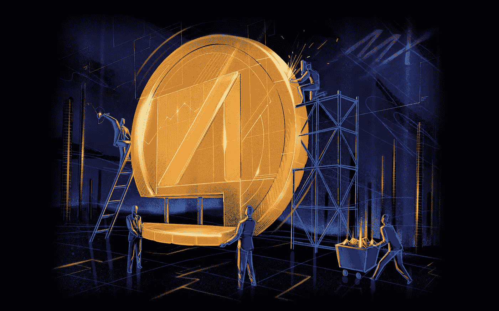

# AAX 交易所:快速回顾

> 原文：<https://medium.datadriveninvestor.com/aax-exchange-a-quick-review-9559c24da73e?source=collection_archive---------6----------------------->

AAX 交易所平台是市场上较为冷静的加密货币平台之一。它的成熟和方向提升了它作为领先的数字交换平台的全球地位。其服务的核心是 Millennium Exchange 技术，伦敦证券交易所使用的也是同样的技术。匹配引擎技术提升了 AAX 在安全性、服务、完整性和性能方面的标准。AAX 在塞舌尔注册，符合所有监管要求。

在我的评论中，我强调了它的起源以及是什么让 AAX 在同行中脱颖而出。

***免责声明:本文不作为投资建议。这只是我个人对 AAX 的看法。你应该总是做自己的研究。***

# 发展中的 AAX

AAX 交易所平台成立于 2018 年，当时大多数密码相关平台都在崩溃。尽管当时市场存在各种负面因素，AAX 还是成立了，这一举动凸显了它的韧性和坚定性。

它也是在整个行业的成熟期建立的。该行业正在为成熟的产品和服务转移不必要和不合逻辑的平台，这将在全球范围内影响该行业。AAX 正在创建一个安全的平台，具有完整性和令人印象深刻的性能——一个适合不断发展的加密货币市场的平台。

如上所述，AAX 选择使用千年交换技术。这项技术已经在伦敦证券交易所得到了验证，这是一个高交易平台，是 AAX 交易所未来的一瞥。

在安全方面，AAX 与网络安全领域的权威机构 Kroll 合作。该合作伙伴关系为 AAX 提供了政府、情报机构以及银行等其他高级机构在网络安全方面所使用的安全性。他们的合作伙伴关系还允许为他们的数字资产安全量身定制解决方案，这对整个平台的完整性至关重要。

在其成立期间，AAX 还热衷于在其网络中使用市场监控系统，以注意、跟踪和阻止任何可能正在使用的市场操纵软件。AAX 还能够建立一个有效的反洗钱和其他金融犯罪的系统，将其廉政提升到尽可能高的水平。

 [## 人工智能、区块链和智能合约:为什么我们都需要拥抱创新|数据驱动的投资者

### 区块链是一个抓住了我的想象力的行业，有助于为更大的利益改造社会。我开始…

www.datadriveninvestor.com](https://www.datadriveninvestor.com/2020/08/03/ai-blockchain-and-smart-contracts-why-we-all-need-to-embrace-innovation/) 

尽管使用了所有复杂的技术，但 AAX 确保了他们的平台是简单的。

# 来自 AAX 的价值

该平台提供各种交易功能，使其用户能够从其数字资产中获得最大价值。这些交易选项包括:

购买或出售加密货币

场外交易

现货交易

期货交易

AAX 储蓄

在交易方面，AAX 的平台上有 50 多个交易对。AAX 还提供比特币、以太币和 DeFi 代币的期货，这些代币的交易杠杆高达 100 倍。在现货市场，AAX 支持 30 多个交易对，其日利息比场外交易高出 50%。

该平台的用户还可以通过信用卡、Visa、支付宝、万事达卡、Instapay、银行账户和其他平台等金融工具上坡道。也有可能出站到银行账户。

这些服务在币安等其他竞争平台上也有，那么，为什么要用 AAX 呢？原因如下:

1.可以说，AAX 提供了市场上最好的流动性。

2.鉴于其与伦敦证券交易所集团(LSEG)的关联，AAX 的诚信水平高于其竞争对手。

3.低廉的交易费用符合市场需求。大多数用户希望有效、高效且经济地进行交易。

4.AAX 在各个领域都有领先的合作伙伴，如安全领域的 Kroll、保险领域的 Copper、技术领域的 LSEG 以及监管要求领域的 Elliptic。该平台还与路孚特合作，对其成员进行筛查，以防止洗钱和其他金融犯罪。

5.该平台正致力于不同的项目，以使其与 AAX 的贸易几乎是自由的。

6.就市场基础设施而言，AAX 可以说是同行中基础设施最好的。

7.有了 AAX，用户得到的不仅仅是交易解决方案。该平台还提供资产管理解决方案。

# AAB 代币为 AAX 供电

AAB 代币于今年 4 月发行。市场反应令人印象深刻，因为在 AAB 代币发行几天后，代币就筹集了 900 多万美元。代币通过引入其他利益渠道为 AAX 增添了一个新的层面。例如，AAB 用户可以通过在 AAB 支付交易费用来节省更多费用。代币的所有者也从每日的硬币燃烧中受益。

焚烧硬币有助于通过减少流通中的 AAB 数量来保持 AAB 的高价值。

# AAX 给你

AAX 平台是为各种交易者设计的。它建立在诚信、速度、安全和先进技术的基础上，以满足所有现有的和新兴的交易需求。它有困扰机构和个人投资者的选择。专业交易者和首次交易者都会发现这个平台非常容易使用。AAX 还开展促销活动，参与者可以获得 AAB 奖和其他奖项。

您可以访问[https://www.aax.com/](https://www.aax.com/)了解更多关于该平台的信息。

## 获得专家视图— [订阅 DDI 英特尔](https://datadriveninvestor.com/ddi-intel)