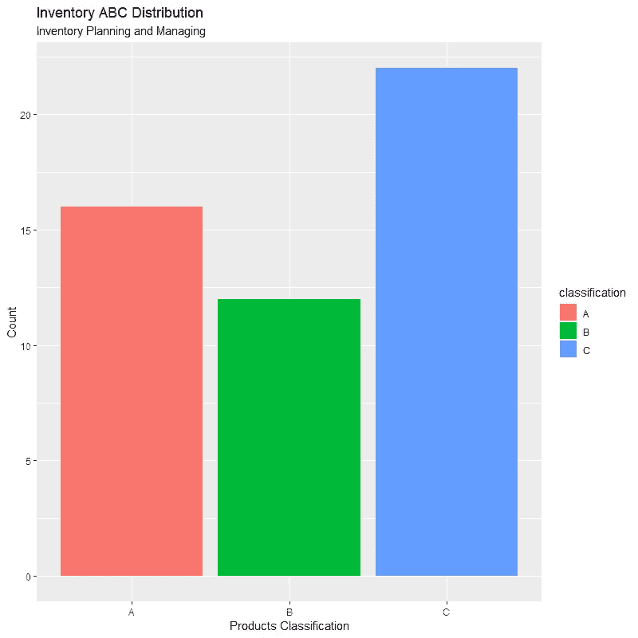

# 带 R 的 ABC 库存分析

> 原文：<https://medium.datadriveninvestor.com/abc-inventory-analysis-with-r-d77408cb07d2?source=collection_archive---------0----------------------->

## r 代表工业工程师

## 有效的库存计划和管理

Image by Unleashed Software available at [Unleashed Software](https://www.unleashedsoftware.com/inventory-management-guide)

# ABC 库存分析

ABC 库存分析是运营、供应链和物流部门使用的一种方法，用于根据消耗值对库存项目进行分类。这种方法基于帕累托原则，用于识别对总库存成本有重大影响的项目，以及需要严格管理和控制的项目。

ABC 库存分析表明，一个组织的库存不是等值的，这就是为什么一些项目需要根据其估计的重要性进行更严格和详细的分析。

# ABC 分析类别

ABC 分析将库存项目分为三个不同的类别:

*   **“A”类商品**:年销售额最高的商品。它们在成套项目中所占的比例相对较小，但具有相对较高的消费价值。这种类型的物品需要严格的库存控制，在储存方面，它们被给予高度安全的区域，它们被作为优先物品保存，并努力避免不可用或缺货。
*   **‘B’物品**:是跨类物品。它们在成套项目中所占比例较大，但消费价值低于“A”类项目。这种类型的项目需要不太严格的库存控制。
*   **‘C’类商品**:年销售额最低的商品。它们在成套物品中所占比例很高，但消费价值很低。这些项目不太重要，控制和管理最简单。

在确定将项目分类的位置时，没有统一的阈值；每个企业都应该根据自己的目标和标准确定适当的比例。但是，由于 ABC 库存分析遵循帕累托原则，物料的类别通常会在以下范围内波动:

*   **“A”类物品** : 20%的物品占该物品年消费价值的 70%
*   **【B】项** : 30%的项目占该项目年消费价值的 20%
*   **“C”类物品** : 50%的物品占该物品年消费价值的 10%

# 应用 ABC 分析的好处

*   帮助企业保持对投入大量资本的昂贵项目的控制。
*   提供了一种跟踪所有库存的详尽任务的方法。
*   通过系统的库存控制，确保库存周转率保持在较高的水平。
*   更有效地利用库存管理资源。
*   通过显著减少缺货来提高生产效率，从而获得更可靠的周期时间和更高的客户满意度。

对于下面的例子，让我们考虑 50 个不同的 SKU，它们具有随机的统一需求和价格。

让我们看看 R 代码！

**结果:**

现在已经获得了产品的分类，让我们使用 [ggplot2](https://cran.r-project.org/web/packages/ggplot2/ggplot2.pdf) R 包在条形图上绘制它们，以可视化它们的分布。

**成绩:**

ABC Inventory Classification

如上图所示，有 17 种商品(占总商品集的 34%)被归类为 A 类商品，占总销售额的 70%；12 个项目(占总项目集的 24%)被归类为 B 类项目，占总销售额的 20%；有 21 个项目(占总项目的 42%)被归类为 C 类项目，仅占总销售额的 10%。

# 总结想法

在当今竞争激烈、瞬息万变的世界中，库存规划和管理是每个企业和组织的一项重要任务，应将其作为一种竞争优势，在满足需求的同时实现利润最大化。

ABC 库存分析代表了一种有价值的工具，使企业和组织能够衡量其物料管理系统的当前状态。这有助于将注意力和资源集中在关键项目上(即重要的几个项目)，而不是不太重要的项目上(即琐碎的许多项目)。这种注意力和焦点的优先化对于控制供应链系统中的成本至关重要。此外，这种分析有助于企业和组织识别潜在的库存管理变化，从而在近期和中期产生更大的成本管理效益。

虽然有其他库存规划和管理软件可用，但 R 是获取库存规划和管理分析相关信息的一个很好的工具。将 ABC 库存分析 R 代码存储在您的个人代码库中，只需输入相应变量的值，即可节省大量时间。

*—*

*如果你觉得这篇文章有用，欢迎在*[*GitHub*](https://github.com/rsalaza4/R-for-Industrial-Engineering/blob/master/Inventory%20Planning%20and%20Managing/ABC%20Inventories.R)*上下载我的个人代码。你也可以直接在 rsalaza4@binghamton.edu 给我发邮件，在*[*LinkedIn*](https://www.linkedin.com/in/roberto-salazar-reyna/)*上找到我。有兴趣了解工程领域的数据分析、数据科学和机器学习应用的更多信息吗？通过访问我的媒体* [*简介*](https://robertosalazarr.medium.com/) *来探索我以前的文章。感谢阅读。*

*——罗伯特*