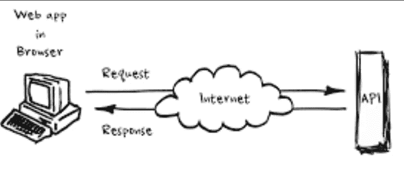
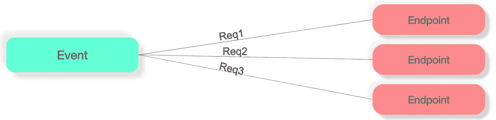
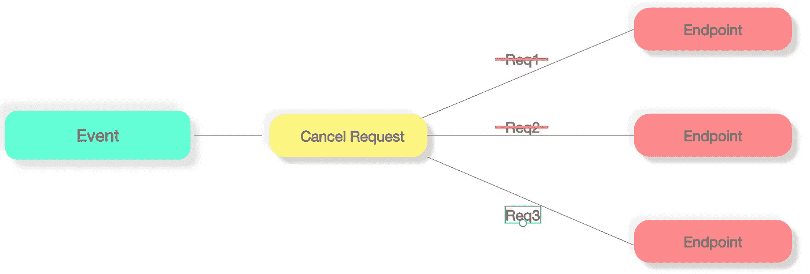
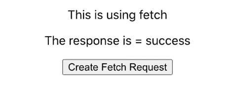
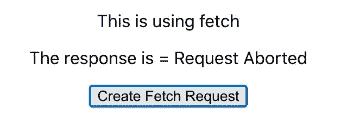
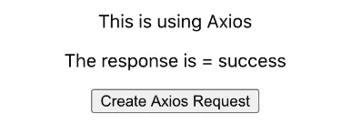

# 使用 Fetch 或 Axios 中止/取消请求

> 原文：<https://medium.datadriveninvestor.com/aborting-cancelling-requests-with-fetch-or-axios-db2e93825a36?source=collection_archive---------0----------------------->



## Axios 取消和获取中止

异步行为是 JS 中任何 **XHR** 调用的基础。处理这种行为以产生期望的输出，可能看起来很容易。毕竟这只是一个简单的*承诺。然后或等待，但随着条件的变化，解决方案必须改变以适应它们。*

有时，用户可能会使用不同的输入多次调用一个事件。当 JS 向端点发出异步请求时，人们不能认为响应也是同样的顺序。



same event tiggers multiple request

最简单的方法是让事情以某种方式同步，但这没有意义。

如果我们能在一个新的请求产生之前，仅仅 ***取消*** *请求*会怎么样。

例如，让我们以*可观察模式为例，*您创建了一个*订阅*，在进行新的订阅之前，*销毁之前的订阅*是可行的方法。

如果一个请求没有被满足，**在提出新的请求之前中止/取消**该请求可以帮助我们接受类似的行为。

理论上，我们的解决方案应该是这样的:



If request is not fulfilled, cancel the request

这可以通过使用 [**人工控制器**](https://developer.mozilla.org/en-US/docs/Web/API/AbortController)**来实现，这是一个内置的浏览器界面。**

****注意:这适用于 fetch，axios 有自己的实现***

```
const controller = new AbortController();
const signal = controller.signal
```

**Signal 表示一个信号对象，它允许您与 DOM 请求(如 Fetch)进行通信，并在需要时通过 AbortController 对象中止它。该信号作为参数在**获取请求:**中传递**

```
fetch("http://localhost:4001/", { signal });
```

**为了演示 Abort，我使用了一个基本的 express 服务器和一个 React 前端，你可以在这里 检查解决方案 [***。***](https://github.com/devAbhimanyu/AbortApiRequest)**

****

**On click, a new request is generated**

**每次点击“**创建获取请求**”时，都会产生一个新的请求，旧的请求会被中止，如下图所示。**

****

**If clicked before the response, the previous request is aborted**

**为了实现这一点，必须将请求包装在订阅中，以便在发出新的请求(订阅)之前，关闭先前的订阅。**

**在 React 中，我们可以通过使用“ **useEffect** ”钩子来实现这一点。清理功能可用于释放订阅。**

```
useEffect(() => {
 const controller = new **AbortController()**;
 const **signal** = controller.signal;
 setFetchRes("fetch request created");
 hitApi(**signal**).then((res) => {
  setFetchRes(res);
 });
 //cleanup function
 return () => {**controller.abort()**;};
}, [fetchClick]);
```

**这个"**信号"**被传递给请求:**

```
const response = await fetch("http://localhost:4001/", { **signal** });
```

**一旦请求被取消，还需要检查请求失败的*原因是中止还是实际失败。***

**使用 AbortControlled 时，如果请求被中止，error.name 属性将为" *AbortError* "**

```
catch (err) {
 if (err.name === "AbortError") {
  return "Request Aborted ";
 }
 return err;
}
```

**让我们看看如何用**轴**实现同样的效果**

**在 Axios 中，我们需要生成一个**取消令牌。**可以使用 CancelToken.source 方法生成令牌。**

```
const cancelToken = axios.CancelToken;
const **source** = cancelToken.source();
```

**这个**源**然后被传递给 axios 请求:**

```
const { data } = await instance.get("/", {
  cancelToken: source.token,
});
```

**我将使用与上述 AbortController 示例中相同的模式:**

****

****源**包含*取消*方法，可以调用该方法来中止/取消请求。**

```
useEffect(() => {
 const cancelToken = axios.CancelToken;
 const **source** = cancelToken.source();
 setAxiosRes("axios request created");
 getReq(source).then((res) => { setAxiosRes(res);});

 return () => {
  **source.cancel**("axios request cancelled");
 };
}, [axiosClick]);
```

**为了检查请求是否被取消，Axios 为我们提供了" *isCancel"* 方法，该方法可用于确定请求失败的原因。**

```
catch (err) {
 if (axios.isCancel(err)) {
  return "axios request cancelled";
 }
return err;
}
```

**我希望你能取消/中止你的任何请求。要查看示例代码，可以在这里 查看 git 解决方案 [***。***](https://github.com/devAbhimanyu/AbortApiRequest)**

**如果有任何问题或疑问，请告诉我。**