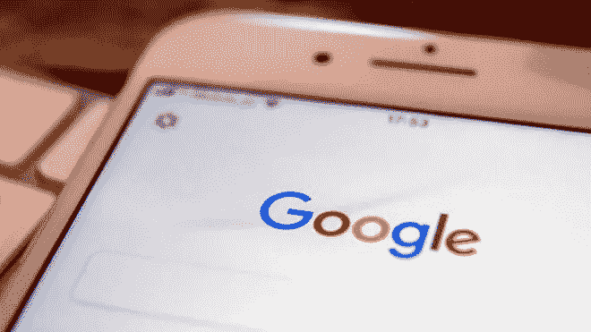
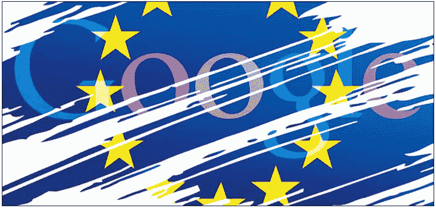
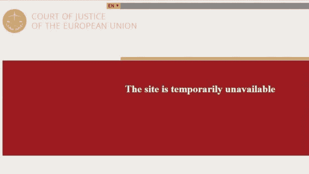
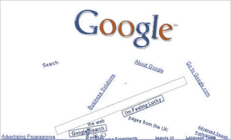

# 大约 4 个问题，4 个答案(0.28 秒)，由 Marco Gouveia 主讲

> 原文：<https://medium.datadriveninvestor.com/about-4-questions-4-answers-0-28-seconds-featuring-marco-gouveia-dd8c87cc2517?source=collection_archive---------21----------------------->

> 嘿，马内尔，一切都很好，你呢？:D
> 
> **所以，按照要求，快如内联**:

## 1 —我删除了我的 Gmail 帐户。他们会删除我在那里得到的一切吗？

> 一旦你删除了你的 Gmail 账户，这对双方来说都是过时的，所以我坚信是的，他们会的。

## 2 — DuckDuckGo。从隐私的角度来看，这还是一种选择吗？或者，如果人们想 100%安全地搜索，并且远离山景城雷达，他们应该去搜索，deep web 等等。

> 在过去的几个月里，DuckDuckGo 变了很多。那些更了解他们进化的人知道，无论他们最近宣扬什么都不完全准确，所以如果你想要适当的隐私，去别处看看。

## 3-你认为谷歌扼杀了“站起来说话”的“经典主动性”，还是相反，谷歌是知识和信息“搜索和分享”的正确答案？

> 比起在谷歌上搜索，人们更喜欢提问。都是关于人的心理。即便如此，通向无限知识的大门是敞开的。

## 4——你点击了多少次“我感到幸运”,为什么他们还留着它？就用户界面、策略和分析而言，真的…那个东西还在那里做什么？！

> 我觉得幸运是一个让谷歌每年损失数百万美元的按钮，因为它把你带到了第一个有机结果。它有一些点击量，但是因为它已经伴随他们很多年了，所以它不会被淘汰。

> muito obrigado e abra co，
> Marco G.
> 数字营销培训师&顾问

 [## 人们对隐私的不理解是什么？数据驱动的投资者

### 你知道那种感觉。无论是访问应用程序、订阅还是你最喜欢的运动鞋。你按下…

www.datadriveninvestor.com](https://www.datadriveninvestor.com/2019/04/11/privacy-and-convenience/) 

**访问专家视图—** [**订阅 DDI 英特尔**](https://datadriveninvestor.com/ddi-intel)