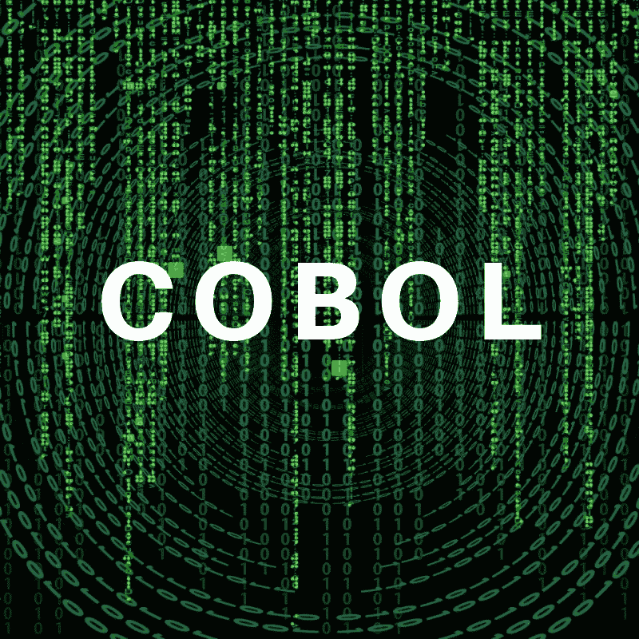
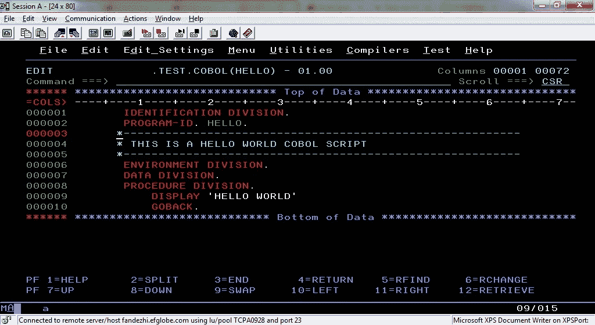

# 关于 Cobol

> 原文：<https://medium.datadriveninvestor.com/about-cobol-99200559fa77?source=collection_archive---------20----------------------->

Cobol 是现存最古老的编程语言之一。它是面向商业的通用语言的缩写。美国国防部在 1959 年创建了它，旨在创建一种可移植编程语言，一种可以在多种计算平台上使用的语言，用于数据处理。

它很冗长，有 300 个保留字(300 个字不能用作变量名)，但是由于它的类似英语的语法，它既可读又自文档化。

不幸的是，Cobol 的使用正在减少。它的有经验的程序员都退休了，年轻的程序员也不想学 Cobol 了。相反，他们学习新技术。

然而，尽管如此，Cobol 仍然主要用于银行业和其他行业。每天，2200 亿行 Cobol 代码用于生产，处理 3 万亿美元。

现在，让我们看一个用 Cobol 编写的 Hello World 程序:

Hello World program in COBOL

一开始看起来可能有点奇怪，但是一旦解释清楚，整个代码就会变得有意义。

首先，Cobol 代码行最大跨度超过 80 个字符。我们还可以看到代码从第 8 列开始。在那之前的任何东西都不是代码。一个 Cobol 程序分为四个主要部分:
标识部分
环境部分
数据部分
程序部分

让我们一行一行地分析这个 Hello World 程序:

# 鉴定科。

这种划分必须出现在任何标准的 Cobol 程序中。它通过提供其名称来识别它。如您所见，您有 PROGRAM-ID，它必须与包含源代码的文件名相同。在我们的例子中，它是“你好”。你也可以有作者的名字和程序编写的日期，尽管它们不是强制性的。

然后你有三个星号后面跟着破折号或一个句子。这些是评论。第 9 列有星号的任何一行都是注释。

# 环境部。

这种划分允许您指定源计算机(用于编译程序的系统)和目标计算机(用于执行程序的系统)，以及输入和输出文件与外部媒体的关联。

# 数据部。

这是你声明变量的地方。没错，在 Cobol 中，你在程序一开始就在一个分配的空间中声明所有的变量。

# 程序部。

这是所有神奇事情发生的地方:你编写算法的地方。

我们可以看到显示“HELLO WORLD ”,它告诉程序将“HELLO WORLD”打印到屏幕上。它相当于 Javascript 中的 console.log 或 Java 中的 System.out.println。

然后是“GOBACK”指令告诉程序停止。你也可以用“停止运行”给你。请注意，在这些关键字和四个主要部分的名称后面都有句号。在这些具体的指示之后，你需要一个句号。

# 给你！

你已经分析并理解了你的第一个 Cobol 程序。

请记住，我们本可以更深入地了解 Cobol 程序的结构和不同的元素，但却故意从一个简单的元素开始。