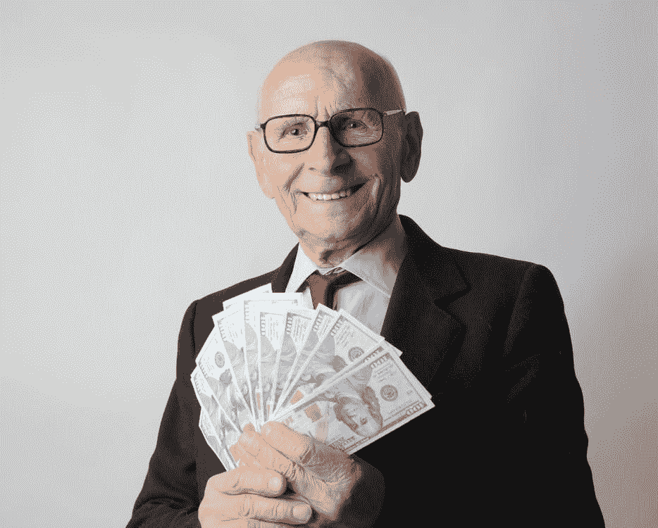

# 关于那个“金钱正在毁灭政治”的话题…

> 原文：<https://medium.datadriveninvestor.com/about-that-money-is-ruining-politics-talking-point-b9068b4cbf7e?source=collection_archive---------4----------------------->

## 彭博的崩溃如何证明选举中的金钱并不像进步人士认为的那么重要。

Photo: [Andrea Piacquadio](https://www.pexels.com/@olly) via Pexels.

如果你在他们选择的候选人输掉选举后不久听听进步媒体，他们通常会责怪三件事:不知情的选民，所有的“-ists”选民(种族主义者，性别歧视者等)，以及最高法院 2010 年的公民联合裁决。我已经听了足够长时间的进步专家，知道他们永远不会认为他们的第一个和第二个借口是错误的，所以试图说服他们是没有意义的。让他们相信他们想相信的你，这个不进步的人，继续你的生活。

但第三点对迈克尔彭博 2020 年总统竞选造成了巨大冲击。

根据进步人士的说法,“公民联合”的决定为选举打开了黑暗资金的闸门……这些钱足以左右人们的投票。优步进步主义者伯尼·桑德斯自己说:

“作为公民联合会最高法院裁决的结果，美国的民主正被科赫兄弟和其他亿万富翁家族的能力所削弱。这些富有的捐助者可以通过花费数亿美元支持他们选择的候选人来收买政客和选举。我们需要推翻公民联盟，转向公共资助选举，这样所有候选人都可以竞选公职，而不必受制于富人和权贵。”

富人可以通过在电视上播放大量广告来“购买”选举的错误想法是基于两个错误的前提，这两个前提对进步人士来说就像教条一样:

1.  只有两种选民:进步人士和不知情或被误导的人。
2.  富有到不需要任何人的帮助是不道德的。

(另外，整个“俄罗斯通过社交媒体造谣活动干预选举”也是基于第一个错误的前提。进步人士似乎不够尊重人的智力，看到虚假的故事和宣传就认。)

因此，按照进步的逻辑，彭博在超级星期二及以后应该过得很轻松，通过花自己的钱直接获得民主党提名和总统职位。[据《纽约邮报》报道](https://nypost.com/2020/02/27/ad-spending-for-democratic-primary-exceeds-1-billion-report-finds/)2020 年 2 月 27 日:

*“广告分析公司的报告发现，亿万富翁、连任三届的前纽约市长迈克·彭博已经在广告上花费了 5.39 亿美元。此前有报道称，彭博打破了总统竞选的电视和广播广告支出纪录*

他是怎么做到的？

他在超级星期二只赢得了美属萨摩亚群岛，第二天就退出了比赛。与此同时，美国有线电视新闻网(CNN)和福克斯新闻频道的选举之夜专家们都指出，拜登在他获胜的州花了多少钱，包括在马萨诸塞州花了不到 15，000 美元，在那里他轻松击败了更自由的候选人桑德斯和伊丽莎白·沃伦(在她的家乡州也是如此)。

 [## 保护主义、政治和经济动荡|数据驱动的投资者

### 美国股市昨日出现 400 多点的大幅反转，为未来的事情发出了警告信号。市场…

www.datadriveninvestor.com](https://www.datadriveninvestor.com/2018/06/28/protectionism-politics-economic-turmoil/) 

为什么拜登没有花多少钱就能赢？

因为进步人士一直错误地理解了金钱在选举中所扮演的角色，所以选民并不愚蠢。他们不会轻易被广告左右，不管这些广告制作得多么精良，多么不可避免。

如果桑德斯赢得提名，并在大选中输给特朗普，请准备好同样的三个进步借口:选民无知，害怕与他们不同的人，被特朗普花在广告上的钱所左右。

当他们这么说的时候，我们都应该提醒他们彭博的竞选。政治广告不再像过去那样有效了。