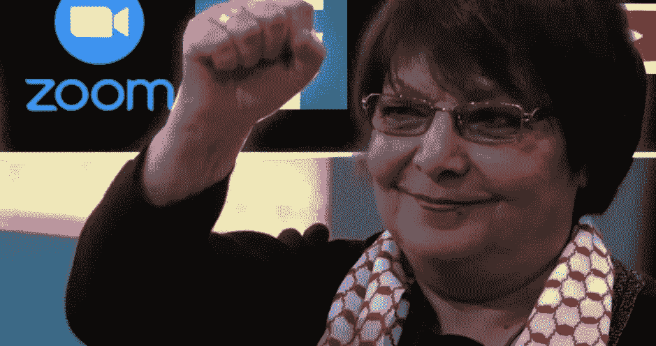
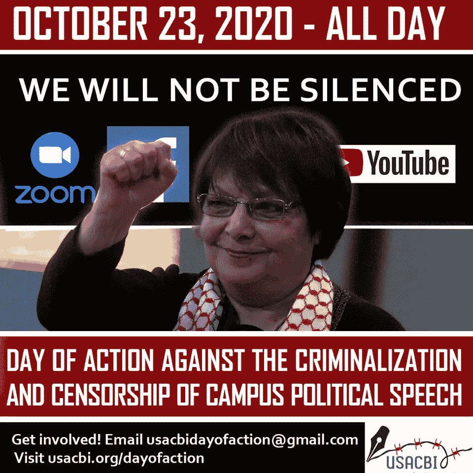
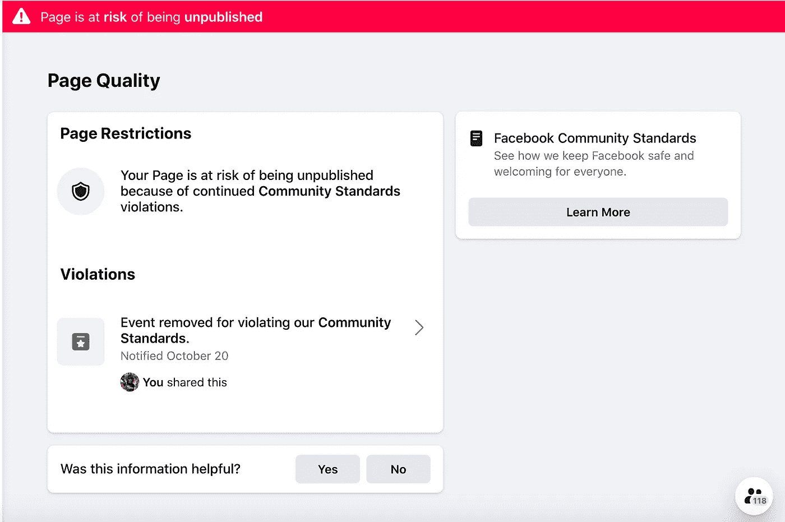
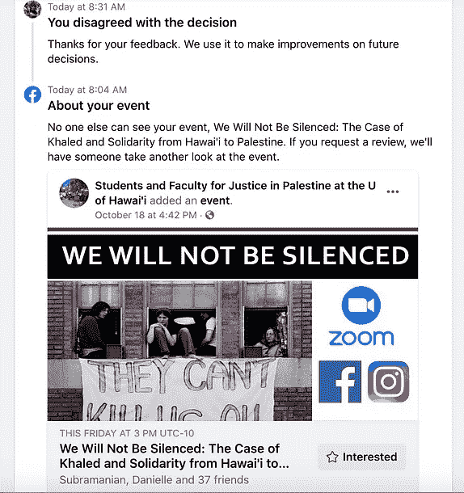
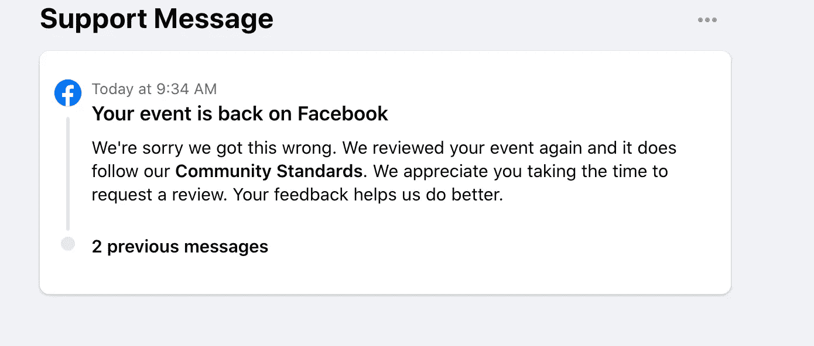
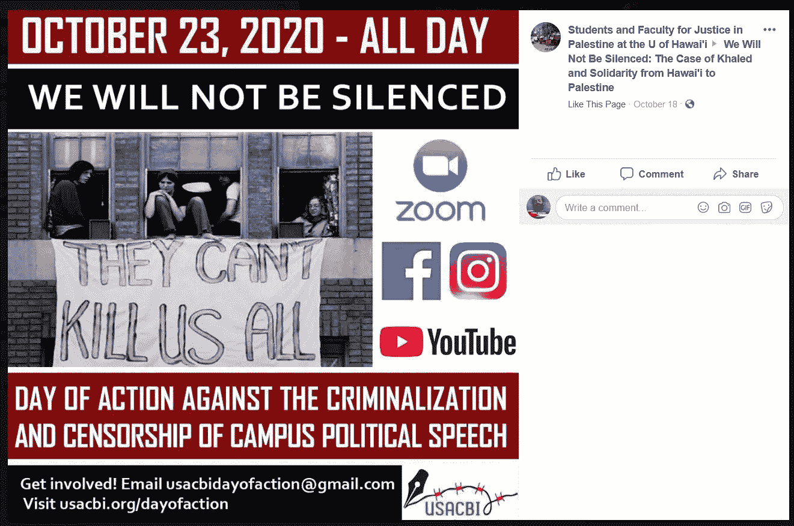

# 学者拒绝贴上“恐怖主义”的标签来审查巴勒斯坦的政治言论

> 原文：<https://medium.datadriveninvestor.com/academics-refuse-the-label-terrorism-to-censor-palestinian-political-speech-29d752c356bf?source=collection_archive---------6----------------------->

Leila Khaled as featured in USACBI’ s call: [Join the growing list of events: We Will Not Be Silenced — October 23 National Day of Action](https://usacbi.org/2020/10/join-the-growing-list-of-events-we-will-not-be-silenced-october-23-national-day-of-action/)

远离企业科技巨头和大学等的有害控制，美国几所大学的教职员工勇敢地为他们的学生树立抵制榜样。

“你不需要成为专家就能参加这个网上研讨会。USACBI 将为您提供所需的所有资源，帮助您组织一次深思熟虑、信息丰富、内容丰富的 1 小时网络研讨会。在我们的样本课程中将有一个选项菜单可供选择。你应该创建一个可行的活动，并根据你特定的校园、时间框架、政治形势和需求量身定制。”

以上来自 10 月 23 日的[行动呼吁:我们不会沉默！反对美国学术和文化抵制以色列运动(USACBI)组织的校园政治言论](https://usacbi.org/2020/10/call-to-action-october-23-we-will-not-be-silenced-against-the-criminalization-and-censorship-of-campus-political-speech/)的刑事化和审查。

[USACBI](https://usacbi.org/) 是“一场专门针对抵制以色列学术和文化机构的美国运动，由 [PACBI(巴勒斯坦学术和文化抵制以色列运动)](http://www.pacbi.org/)描述。”

> "*我们必须反击企业压制像 Leila Khaled 这样的巴勒斯坦人的声音，以及大学行政当局共谋侵犯其教师和学生的学术自由。*”

行动呼吁是对 2020 年 9 月 23 日发生的事情的回应，当时“企业科技巨头 Zoom、脸书、Instagram 和 YouTube 与三藩市州立大学(SFSU)联手[关闭了](https://electronicintifada.net/blogs/nora-barrows-friedman/youtube-zoom-and-facebook-censor-leila-khaled-israel)一场名为‘谁的叙事？“性别、正义、抵抗:与莱拉·哈立德的对话”，由 AMED 阿拉伯和穆斯林种族和散居研究项目和 WGS 圣弗朗西斯科州立大学妇女和性别研究系共同主办

USACBI Poster: Day of Action Against The Criminalization And Censorship of Campus Political Speech

破坏 SFSU 事件的“惊人的，迄今为止前所未有的行为”是由犹太复国主义犹太组织策划的，这些组织长期以来一直恶毒攻击倡导巴勒斯坦正义和解放的学者。这些包括 [Lawfare 项目](https://electronicintifada.net/tags/lawfare-project)和 [AMCHA 倡议](https://electronicintifada.net/tags/amcha-initiative)，正如电子起义[所报道的](https://electronicintifada.net/blogs/nora-barrows-friedman/youtube-zoom-and-facebook-censor-leila-khaled-israel)，以及一个以色列政府资助的应用[因取消而邀功](https://twitter.com/AntiBDSApp/status/1308732458968453124)。

> 在课堂或学术活动中邀请一名被贴上“恐怖组织”标签的美国政府成员作为演讲者并不违法，也不是“对恐怖主义的物质支持”。

他们在社交媒体上的惯用手法是对亲巴勒斯坦的事件进行算法记录。例如，脸书的犹太复国主义支持者被召集起来，通过点击该事件的“报告”来操纵算法，然后该事件因违反标准而被置于“有被公布的风险”状态。然后，脸书接受了恶意的犹太复国主义者的报道，并在没有人工审查的情况下将其删除。

Facebook “at risk” notification

在脸书提起上诉很重要，至少可以迫使该公司进行人工审查。

“You disagreed” | “Your event is back on Facebook”

USACBI 组织者对 SFSU 拒绝支持 9 月 23 日网络研讨会的组织者 Profs 感到震惊。拉巴布·阿卜杜勒哈迪(AMED)和朋美·基努卡瓦(WGS)，“捍卫他们的学术自由，或者为他们提供一个替代平台。”

夏威夷大学的管理似乎也走上了与 SFSU 相似的道路。发言人 Dan Meisenzahl 在接受《犹太日报》采访时表示，该大学与该事件无关，这表明 Zoom 已经取消了 Hawaiʻi 大学在 Mānoa 的网络研讨会。

 [## 冠状病毒流行；超越社会政治修辞|数据驱动的投资者

### 在过去的几十年里，我们都在考虑新出现的以及重新出现的传染性…

www.datadriveninvestor.com](https://www.datadriveninvestor.com/2020/03/08/coronavirus-epidemic-beyond-socio-political-rhetoric/) 

紧接着，USACBI 发表了一份名为“Zoom 想要再次审查 Leila Khaled——10 月 23 日和我们一起捍卫学术自由和巴勒斯坦权利”的声明，其中他们解释道:

> *就在今天下午，夏威夷大学组织的网络研讨会于 10 月 23 日星期五举行，主要是来自 Leila Khaled 的信息……在亲犹太复国主义者和反巴勒斯坦组织的一系列投诉后，* ***突然被取消，从缩放平台*** *中撤出。
> ……****夏威夷大学的活动是本周五组织的众多活动之一，这些活动都将与演讲者和 Leila 的信息一起进行……****我们必须反击企业压制像 Leila Khaled 这样的巴勒斯坦人的声音，以及大学行政当局参与侵犯其教师和学生的学术自由。*

犹太复国主义者和极右组织由于施加财政压力，对大学行政部门发号施令，规定什么是学术和学术活动的合法主题，这是可耻的，但也是可能的。

在[亲爱的管理者:为了保护你的教师免受右翼攻击，跟随金钱](https://www.aaup.org/JAF10/dear-administrators-protect-your-faculty-right-wing-attacks-follow-money)中，艾萨克·卡莫拉解释了“一小批亿万富翁资助的演员——校园改革、大学修复、转折点美国、布赖特巴特新闻网等——如何制造这些争议，作为加强捐助者对大学影响力的更大战略的一部分。”

这一次，这类压力集团利用可疑的法律行动威胁来实现他们的政治目标。

正如我在《学习巴勒斯坦革命》中所评论的那样，高等教育的动物化，对巴勒斯坦学术和宣传的有据可查和令人愤慨的压制和沉默,“不仅仅依赖于恐吓和压制的通常论点，例如犹太学生在这样的教室里会感到不舒服，甚至是反犹太主义的虚假主张。他们声称，根据美国反恐法律和美国 OFAC 制裁，该公司(Zoom)将面临民事诉讼和潜在的刑事处罚。他们的行动再次凸显了这些法律和裁决的危险，因为即使这些主张充其量是可疑的，但法律问题更加复杂，可能会拖很长时间。”

以下是 Leila Khaled 的简短简历，包含在 USACBI 为行动呼吁准备的材料中:

> *莱拉·卡勒德传*
> 
> *莱拉·哈立德(Leila Khaled)，巴勒斯坦抵抗以色列对巴勒斯坦殖民统治的最具代表性的人物之一，1944 年 4 月 9 日出生于巴勒斯坦港口城市海法。当时，巴勒斯坦处于英国的委任统治之下，大批犹太定居者移居国外，他们变得越来越暴力。例如，就在哈立德出生后，犹太民兵袭击了海法的火车站和附近的巴勒斯坦村庄。在哈立德四岁生日那天，犹太民兵在代尔亚辛村臭名昭著地屠杀了一百多名巴勒斯坦人。*
> 
> 结果，Khaled 的家人在她四岁生日后不久逃离了巴勒斯坦。他们根本不知道这种暴力是导致以色列国成立的全面战争的一部分，并使他们永远无法返回自己的家园。
> 
> *1948 年 5 月 15 日，以色列宣布独立，随后爆发的战争导致 75 万巴勒斯坦人逃亡并被强制驱逐，这是一场巴勒斯坦人称之为“浩劫”的种族清洗时至今日，以色列政权仍拒绝承认 1948 年 12 月发布的联合国第 194 号决议所规定的国际公认的巴勒斯坦人重返家园和土地的权利。因此，巴勒斯坦人今天是世界上最大的难民群体之一。*
> 
> 像许多其他巴勒斯坦儿童一样，年轻的 Khaled 在黎巴嫩的难民营上学，当她听她的哥哥姐姐们讲述他们在贝鲁特美国大学学习时学到的东西时，她变得政治化了，在那里他们加入了阿拉伯民族主义运动(ANM)。不久，当她得知她的家人被驱逐出巴勒斯坦和无法返回的原因时，她也投身于 ANM，参加会议，有时是秘密的。
> 
> *然而，由于内部紧张局势和 1967 年的六日战争，阿拉伯民族主义开始分裂。在六日战争中，以色列夺取并占领了约旦河西岸和东耶路撒冷、加沙地带以及戈兰高地。*
> 
> *1967 年战争之后，解放巴勒斯坦人民阵线(巴勒斯坦人民解放阵线)成立，是一个由巴勒斯坦人组成的抵抗组织，他们对战争和阿拉伯政权背弃的保护他们的承诺感到幻灭。*
> 
> 由于家人反对女性担任战斗角色，哈立德在约旦安曼接受了巴勒斯坦人民解放阵线的军事训练，并被选中执行史无前例的特殊任务，劫持一架飞往特拉维夫的商用飞机。
> 
> 这种劫持被设计成引人注目的媒体噱头，以吸引人们对巴勒斯坦事业的关注。他们的具体目标是从以色列监狱中释放数百名巴勒斯坦囚犯；结束对西岸、加沙地带和东耶路撒冷的军事占领；解放巴勒斯坦。迄今为止，与以色列讲道理和恳求“国际社会”给巴勒斯坦人带来的只是更多的占领、定居点和剥夺。巴勒斯坦人民解放阵线和哈立德认为，劫持一架以色列飞机是必要的，以提请国际社会注意巴勒斯坦人民遭受的不公正，但似乎没有人对此感兴趣或愿意承认。
> 
> *因此，在 1969 年 8 月 29 日劫持环球航空公司 840 号航班时，哈立德要求以色列空中交通管制称她为“自由阿拉伯巴勒斯坦的巴勒斯坦人民解放阵线航班”，并指示飞行员飞越她的家乡海法，她被驱逐出这个家，永远禁止她返回。在这次劫机过程中没有人受伤。*
> 
> *1970 年，Khaled 和一名战友参与了另一次劫机行动，试图让以色列航空公司的一架航班改道，这是巴勒斯坦人民解放阵线策划的一系列同时劫机行动的一部分。她的同志在行动中被以色列空警打死，飞机在伦敦降落后，她被英国当局拘留。她被英国关押了几个星期，然后在与约旦的囚犯交换中被释放。*
> 
> 从那以后，卡勒德继续为她的人民的解放而战。1971 年，她搬到了贝鲁特，在那里她继续担任巴勒斯坦人民解放阵线的成员，并努力增强黎巴嫩难民营中的难民，特别是妇女为自己说话的能力。她也是巴勒斯坦全国代表大会的成员，并在其各种会议和小组委员会中进行讨论。1989 年，黎巴嫩内战结束后，她返回约旦，此后一直呆在那里。她只在 1996 年去过一次西岸和加沙，参加全国代表大会；她从未能够访问海法。她过去是，现在仍然是奥斯陆和平进程的坚定批评者，因为她认为以色列从未对和平感兴趣。她继续公开谈论巴勒斯坦解放和他们返回家园的基本权利。

在课堂或学术活动中邀请一名被贴上“恐怖组织”标签的美国政府成员作为演讲者并不违法，也不是“对恐怖主义的物质支持”。

Poster for the University of Hawaiʻi’s webinar [event](https://www.facebook.com/events/1879089668912466/?active_tab=discussion) (now cancelled) in response to the USACBI Call to Action

根据 USACBI 最新的[更新](https://usacbi.org/2020/10/join-the-growing-list-of-events-we-will-not-be-silenced-october-23-national-day-of-action/)，“整个北美的校园都加入了抵制企业和大学压制巴勒斯坦人的叙述和声音的运动。10 月 23 日，加入我们，通过你们校园的 Zoom 账户举办一场网络研讨会，包括 Leila Khaled 的视频，以表明**我们不会沉默**。**现在加入我们还为时不晚——加入您的活动，为巴勒斯坦人的权利大声疾呼。”**

一份名为 [USACBI 与 Rabab Abdulhadi 教授和 Leila Khaled](https://usacbi.org/2020/09/usacbi-stands-with-prof-rabab-abdulhadi-and-leila-khaled/) 站在一起的声明声称:

> 美国和以色列长期以来的传统是诽谤鼓吹巴勒斯坦人民正义和解放的人民和运动，认为他们是反犹太人、不人道甚至是“恐怖分子”,这不仅仅是诽谤；它们有毒且具有破坏性。他们无视生活在以色列围困和占领下的巴勒斯坦人在实地存在的实际物质力量差距。相反，这些袭击动员了一种虚假的受害者身份和道德正义的意识形态政治来谴责“恐怖主义”，即使以色列收紧了种族主义的束缚，监禁，酷刑，隔离，剥夺，失踪，以及对那些拒绝的人进行缓慢的种族灭绝，正如爱德华·萨义德 [*曾经*](https://www.penguinrandomhouse.com/books/159795/the-question-of-palestine-by-edward-w-said/) *所说，只是“走开”巴勒斯坦人拒绝消失；因此，他们受到千百种惩罚。“恐怖主义”是这种惩罚的一个名称，西方殖民者和犹太复国主义者用这个词来称呼巴勒斯坦人拒绝消失和使巴勒斯坦人自决的所有努力丧失能力、解除武装和丧失信誉。“恐怖主义”是一种手段，通过这种手段，巴勒斯坦人不消失的决心变得罪恶、不人道、“野蛮”和邪恶。*

现在的问题是:在没有犹太复国主义团体、私营科技公司或管理人员的审查和干预的情况下，参与 USACBI 带头行动的教师们能否成功地维护莱拉·哈立德(Leila Khaled)的话语权，以及学生和教师听到她的声音的权利？

*注*:以下链接包含与 10 月 23 日 USACBI 行动相关的预定事件列表(向下滚动)。更多内容将在发布时添加:

[https://usacbi . org/2020/10/join-the-growing-list-of-events-we-not-be-silent-October-23-national-day-of-action/](https://usacbi.org/2020/10/join-the-growing-list-of-events-we-will-not-be-silenced-october-23-national-day-of-action/)

_ _ _ _ _ _ _ _ _ _ _ _ _ _ _ _ _ _
*Rima Najjar 是一名巴勒斯坦人，他的父亲来自耶路撒冷西郊人口被迫减少的 Lifta 村，母亲来自海法以南的 Ijzim 村。她是一名活动家、研究员和被占领西岸圣城大学英国文学退休教授。*

## 访问专家视图— [订阅 DDI 英特尔](https://datadriveninvestor.com/ddi-intel)