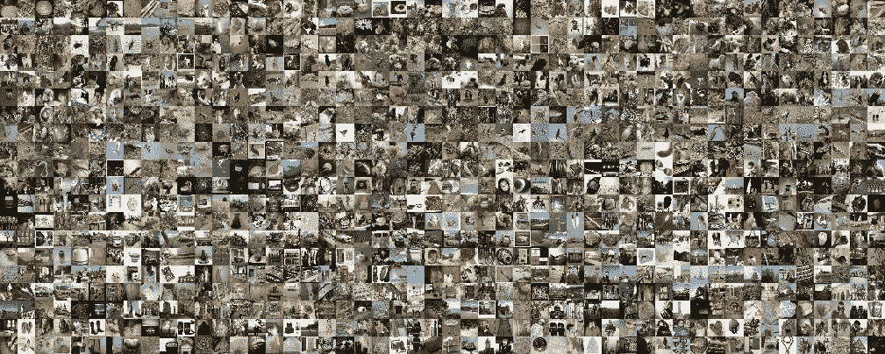
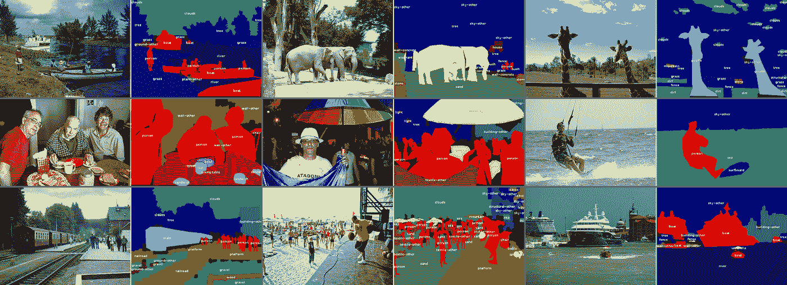
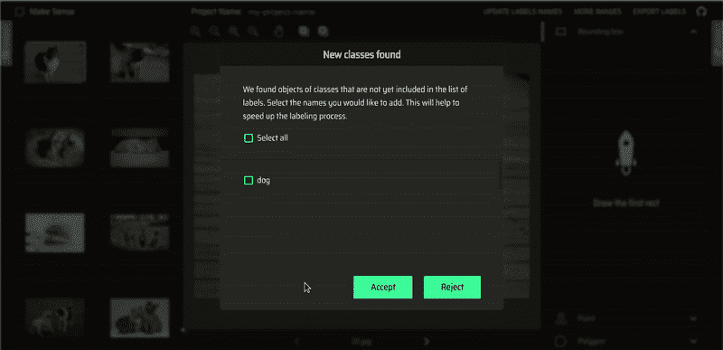
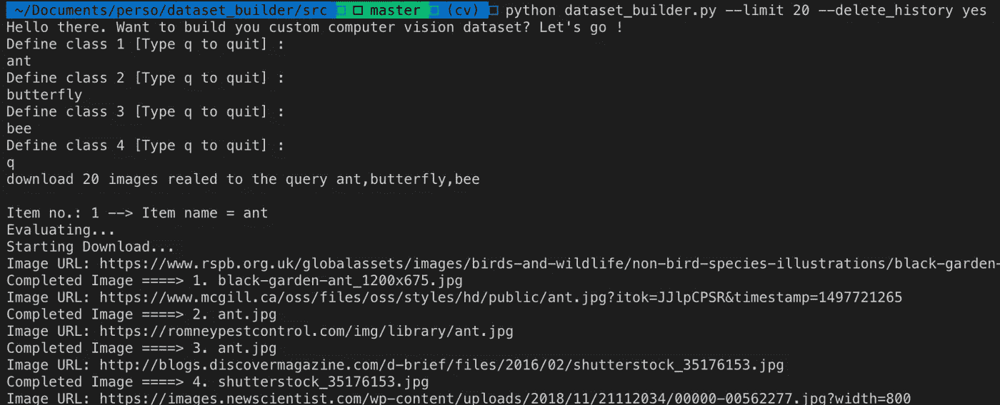
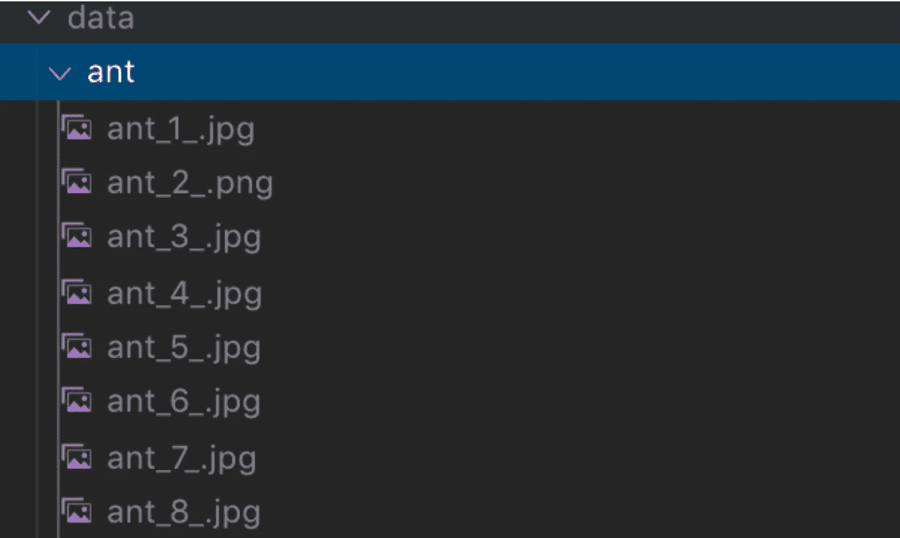
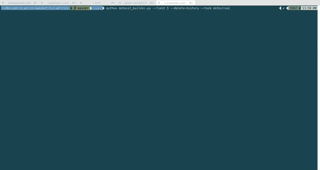

# 使用此脚本加速构建自定义计算机视觉数据集💨

> 原文：<https://medium.datadriveninvestor.com/accelerate-building-custom-computer-vision-datasets-8a1f682864a4?source=collection_archive---------5----------------------->

## 一个脚本，使用 Flickr API 和 makesense.ai 下载图像并为它们的注释做准备

你是否曾经想建立一个模型来检测浣熊却没有找到任何开源的带注释的图片来训练它？我就是这种情况。


Source: [Pexel](https://www.pexels.com/photo/brown-and-black-raccoon-photo-634255/)

坦率地说，我认识的每一个从事计算机视觉工作的人都曾经遇到过这种情况:构建一个定制的计算机视觉数据集。

如果你对计算机视觉生态系统有点熟悉，你可能听说过常见的大型图像数据库，如 [ImageNet](http://www.image-net.org/) 或 [COCO](http://cocodataset.org/) 。

这些是由研究实验室和科技公司开源的经过仔细注释的图像组成的大型数据集。它们也被认为是评估最先进模型的标准基准数据集。



Some ImageNet and COCO thumbnails



Some ImageNet and COCO thumbnails

它们包含数百万张图像和数百个类，以及标签、边界框或分段遮罩的丰富元数据。

因此，无论何时您想要构建图像分类器或对象检测器，您特别寻找的东西很有可能已经在那里了。

> 但是，如果您正在寻找不在这些数据库中的对象呢？

**简答……**

# 你必须建立自己的数据集

这个任务可能很乏味，所以我准备了一个 Python 脚本来加速它。

这个脚本旨在帮助您快速构建用于分类、检测或分割的自定义计算机视觉数据集:它不会为您做标记。

但是它预先处理了这些步骤:

*   定义您的类集。
*   从 Flickr 上收集每个班级的图片。
*   重命名文件。
*   组织文件夹结构。
*   将数据上传到 [makesense.ai](http://makesense.ai) 进行标注(异议检测或分割)。

一旦这个管道完成，你就可以开始训练了！

如果你没听说过 [makesense.ai](https://makesense.ai) ，去网上查一下。这是一个基于浏览器的工具，用于对图像进行分类、检测和分割。它非常简洁、快速、可靠，而且免费。

[](https://www.datadriveninvestor.com/2019/03/22/fixing-photography/) [## 修复摄影|数据驱动的投资者

### 汤姆·津伯洛夫在转向摄影之前曾在南加州大学学习音乐。作为一个…

www.datadriveninvestor.com](https://www.datadriveninvestor.com/2019/03/22/fixing-photography/) 

另外，它不会把你的数据上传到云中的任何地方。数据保留在您的浏览器文件系统中。

我完全推荐。向建造它的 Piotr Skalski 致敬。



[https://github.com/SkalskiP/make-sense](https://github.com/SkalskiP/make-sense)

# 我如何运行脚本？

先说一些要求。您必须安装:

*   [硒](https://www.selenium.dev/) : `pip install -U selenium`
*   [Flickr API](https://www.flickr.com/services/api/) : `pip install flickrapi`

并下载[chrome driver](https://chromedriver.chromium.org/)80 版本。嗯，需要配合你的 Chrome 版本。写这篇文章的时候，我的 Chrome 版本是 80。

你还必须创建一个 Flickr 账户并请求一个 API 密匙。这最多需要 2 分钟。有了凭证后，在`src/`文件夹中创建一个`config.yaml`，如下所示:

```
key: "XXXXXXXXXXXXXXX"
secret: "XXXXXXXXXXXXXXX"
```

## **论据**

可以通过一组选项从终端启动该脚本:

*   `output-directory` —下载图像的根文件夹。
*   `limit` —每类的最大下载次数。
*   `delete-history` —是否选择清除之前的下载。
*   `task` —分类、检测或分割。
*   `driver`—Chrome 驱动程序的路径。

下面是一个为影像分类准备数据集的例子:`python dataset_builder.py --limit 20 --delete-history`。

一旦脚本开始运行，您将被要求定义您的类:



Source: [my Github](https://github.com/ahmedbesbes/dataset-builder)

一旦脚本完成，您将拥有以下结构。



Source: [my Github](https://github.com/ahmedbesbes/dataset-builder)

下面是为图像检测准备数据集的另一个例子:`python dataset-builder.py --limit 5 --delete-history --task detection`。

正如预期的那样，该脚本打开 makesense.ai，通过 Selenium 上传其中的图像(在浏览器文件系统内),这样您就不必手动做任何事情。



A GIF of the script

差不多就是这样。

如果你想试试代码，你可以在我的回购中找到你需要的一切:

[](https://github.com/ahmedbesbes/dataset-builder) [## ahmedbesbes/数据集构建器

### 帮助您快速构建用于分类和检测的自定义计算机视觉数据集的脚本。它允许您…

github.com](https://github.com/ahmedbesbes/dataset-builder) 

# 下一步是什么🔜？

请随意投稿！在问题部分报告任何错误或请求任何您希望看到发布的功能。

以下是我在路线图中的计划:

*   对图像进行质量检查。
*   使用预先训练的网络集成自动标记。
*   支持必应或谷歌图片。