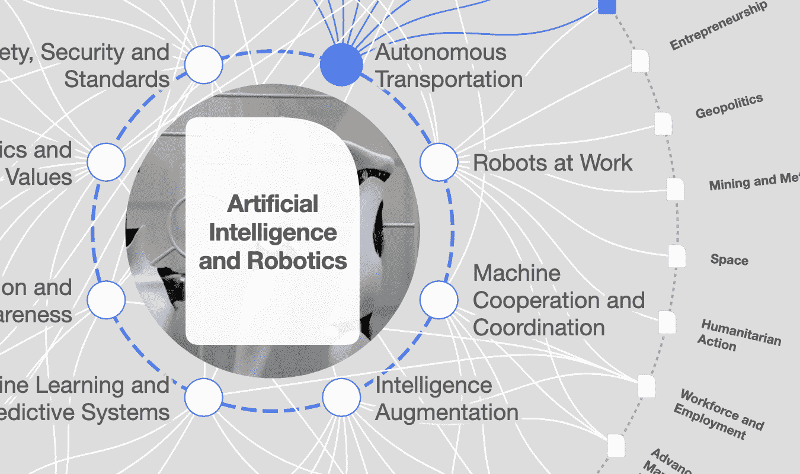

# 借助人工智能和区块链，加速迈向更具包容性的社会

> 原文：<https://medium.datadriveninvestor.com/accelerating-towards-a-more-inclusive-society-with-ai-and-blockchain-b72135f1d364?source=collection_archive---------5----------------------->

萨米兰·戈什访谈

在长达 25 年的职业生涯中， [*萨米兰*](https://urldefense.proofpoint.com/v2/url?u=https-3A__www.linkedin.com_in_samiranbghosh_&d=DwMFaQ&c=VWART3hH1Kkv_uOe9JqhCg&r=zrDyJunNVNUk_hhCvpuTilPXGhWKBJq-o3MOjJ54-Qw&m=DC3vFCIM8AQnoxEweCKh3eR9ifssF7JuJyMPMq-smsI&s=Abk4B8ZhcwnQYiu7RqIQJgsQz4cy05xh6ln1OHPPKvM&e=) *曾在麦肯锡、微软、IBM、Dun & Bradstreet 和 TCS 担任领导职务。他是麻省理工学院技术评论的全球小组成员，TEDx 演讲者，福布斯技术委员会成员和人工智能&区块链思想领袖。*

第四次工业革命通常以利用人工智能、3D 打印、区块链、物联网、5G 等新技术为特征，但它开启了一个经济破坏的新时代，带来了不确定的社会经济后果，特别是对全球南方而言。

Samiran Ghosh 一直在人工智能和区块链的交叉领域工作，特别是在全球南方的背景下。作为微软的首席数字顾问，他从事联网汽车、数字农业和智能城市等平台的工作。这些倡议都有巨大社会影响的潜流。最近，在 Aadhaar，他帮助开发了应用认证框架，该框架允许主要利益相关者在 UIDAI 生态系统中相互交流。他是主要期刊的定期撰稿人，也是印度多所大学的客座讲师。

鉴于他的专业知识，我采访了他，以更多地了解人工智能和区块链等技术在增强和超越社区方面可以发挥的作用，以及它们可能带来的社会问题。

# **在你的经验中，像人工智能(AI)和区块链这样的技术在社会包容中发挥了什么作用？**

人工智能的广阔领域可以成为解决各种全球性问题的关键因素。让我们只看一个大量使用人工智能的领域——自动驾驶汽车。专家预测，通过自动驾驶汽车通勤将减少 90%的事故；更高效的乘车共享将减少道路上多达 75%的汽车数量，智能交通灯将减少 40%的等待时间和 26%的整体旅行时间。即使这一部分成为现实，它也会对气候变化、环境、污染、道路安全、保险、燃料消耗和其他一系列问题产生深远的影响。另一个有趣的案例是罗切斯特理工学院(RIT)正在使用定制语音模型和微软技术来提高失聪或听力困难学生的实时字幕的准确性。例子很多，AI 的可能性无穷无尽。

来到区块链。总体而言，全世界有七分之一的人没有任何身份，这使得他们无法获得商品和服务。更令人不安的是，世界上近一半的 5 岁以下儿童——以及 6 亿多 14 岁以下儿童——没有出生证明或官方身份证明。这些孩子对于旨在保护他们的社会项目来说是“隐形的”。相反，他们很容易成为人贩子的猎物——被卖为现代奴隶或被摘取器官。

迫切需要一个安全的、自主的、可扩展的数字身份。我相信区块链会像网景公司在 90 年代为互联网所做的那样为数字身份做贡献。它可以为世界各地无名无姓的人提供一种身份，这样我们就可以更好地针对他们制定发展计划。这只是它可以影响的一个领域:其他领域包括农业、人权、金融包容性、环境等。

# **你如何看待人工智能和区块链在全球南方的影响？**

人工智能和区块链的开发和部署为包括全球南部在内的世界大部分地区带来了巨大的希望。

人工智能——中国的婴儿回归运动和雪豹信托基金使用人工智能的工作是科技在全球南方带来好处的经典例子。

据估计，每年全世界有 2 . 5 亿人受到洪水的影响，造成数十亿美元的损失。洪水预报模型不仅可以更准确地预测洪水可能发生的时间和地点，还可以预测事件的严重程度。谷歌在印度开始了这些洪水预报工作，通过与印度中央水资源委员会合作获得试点基础上推出早期洪水预警所需的数据，全球 20%的洪水相关死亡发生在印度

区块链——一个可能产生深远影响的经典案例是印度的丢票运动。2 . 9 亿合格选民(整个国家都比这个数字小)无法行使投票权，原因是移民没有永久的当地地址。经过长达一年的竞选活动，印度选举委员会最近宣布，他们正在制定一项基于区块链的解决方案，以解决这一问题，从而避免更多的选票流失。

区块链计划最常见的用例是支付和资金转移以及记录和验证。鉴于 10-30%的国内生产总值用于采购，WEF 最近的一份报告呼吁将公共采购作为区块链干预的一个关键领域，这将再次使全球南方显著受益。

像移动革命一样，全球南方可以在人工智能和区块链方面超越更发达的国家。数字化的速度是采用这些技术的关键因素。没有遗产，全球南方的国家和企业正在建设现代平台和生态系统，这将使他们能够利用基础数据，提供可操作的见解，并建立透明度/效率。

# **您认为数字身份的经济价值是什么？**

根据麦肯锡的估计，到 2030 年，实施数字身份证的国家可能释放出相当于国内生产总值 3%至 6%的价值，这取决于你是一个新兴经济体还是一个发达经济体(从小样本量中推断)。

个人、企业和政府肯定会从实施/采用数字身份证中找到价值。个人将通过获得金融服务和就业而受益。数字身份证可以让人们获得经济高效的数字银行账户和人才匹配平台。对于企业和政府机构来说，这将节省时间和成本，减少欺诈，增加商品和服务的销售，提高生产率，并可能增加税收。

# **鉴于数字身份的重要性，您对身份欺诈和网络复原力有什么看法？**

就像任何其他技术进步一样，数字身份证可以用来创造价值或造成伤害；核能，甚至无处不在的全球定位系统也是如此。如果没有适当的流程和控制，任何怀有邪恶目的的人都会获得对个人数字数据的访问和控制。因此，我们需要使用最安全的协议来实现数字身份证，并为每个人提供管理其数据最终用途的能力。这导致了自我主权身份和分散身份等概念的诞生。围绕身份欺诈和网络犯罪的风险现在是任何技术举措的赌注，缓解需要作为任何执行计划的一部分进行规划。

# **哪些关于隐私和数据保护的担忧可能会阻碍这些技术的采用？**

人工智能依赖于大量的数据。为了使这些系统更加高效和有效，我们一直在尽可能收集数据，并为人工智能引擎提供支持。但这些进步可能有另一面。随着公司将越来越多的消费者和供应商数据输入先进的算法，以创建新的敏感信息(受影响的消费者和员工不知道的信息)，隐私问题正在浮出水面。这意味着人工智能系统可能会创建个人数据，这带来了一个独特而严重的问题

欧盟已经通过《一般数据保护条例》率先解决了这些隐私问题，加州、菲律宾和韩国等其他国家也在效仿。

基于区块链的数字身份证也是如此。虽然它在设计上是安全的，但也不是万无一失的。违规风险是真实存在的。数字身份证的设计、管理和使用是一个不断发展的领域。虽然解决方案并不都是已知的和现成的，但数字身份证显然是推动变革的重要工具——对世界各地的经济、政府、企业和个人而言。

尽管这些技术有潜在的好处，但如果没有深思熟虑的干预，它们实际上可能会加剧结构、经济、社会和政治失衡。这可能会进一步加剧基于族裔、种族、性别、性别和性身份、宗教、国籍、地点和社会经济地位的不平等。这是我们需要认识到的一个更大的问题。

# **战略情报在弥合与这些技术相关的信息差距方面能发挥什么作用？**

世界经济论坛的战略情报平台提供了一个值得信赖的单一窗口服务——与最新技术及其在现实世界中的适用性保持同步。论坛做了大量筛选材料的繁重工作，并在仔细审查后只发布最相关的内容，这非常有帮助。通过在战略智能(SI)上发现、监控和创建内容的几乎直观的能力，跟踪人工智能和区块链等动态主题及其对社会的影响变得很容易。更重要的是，它让我能够跨越不同的全球问题，看到它们对不同地区和行业的影响——这是无价的。

SI 提供来自可靠来源的精选质量信息，允许跨主题进行组合和比较，并保存该信息以备将来参考。这是我的数字信息宝库中一个不可思议的重要工具。

[Strategic Intelligence](https://intelligence.weforum.org/) 是一个在线数字平台，帮助个人和组织解读全球复杂性加速带来的潜在影响，同时抵制正在传播的误导和不可靠信息。战略情报工具有助于您了解全球力量并做出更明智的决策。

**加入世界经济论坛的数字会员社区来关注这些问题，更多** [**点击这里**](https://digital-members.weforum.org/intelligence)

Artificial Intelligence [Transformation map](https://intelligence.weforum.org/topics/a1Gb0000000pTDREA2?tab=publications)

要探索战略情报，请访问[intelligence.weforum.org](https://intelligence.weforum.org/)或在 iOS、Play 或华为商店搜索*战略智商*。

如需进一步查询，请联系 intelligence@weforum.org。