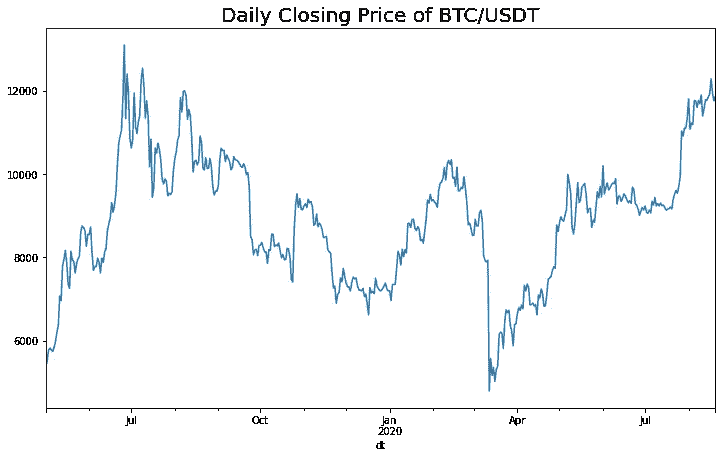

# 用 2 行 Python 代码访问加密货币数据

> 原文：<https://medium.datadriveninvestor.com/access-cryptocurrency-data-in-2-lines-of-python-37643a4bf23e?source=collection_archive---------2----------------------->

使用 fastquant 轻松提取加密数据用于您自己的分析


Photo by [Thought Catalog](https://unsplash.com/@thoughtcatalog?utm_source=unsplash&utm_medium=referral&utm_content=creditCopyText) on [Unsplash](https://unsplash.com/s/photos/crypto?utm_source=unsplash&utm_medium=referral&utm_content=creditCopyText)

加密货币(或简称“crypto ”)是目前最热门的投资之一，人们通过早期购买比特币而在一夜之间成为百万富翁的故事比比皆是。从那以后，相当多的交易所开张了，甚至更多的硬币脱颖而出。

抛开比特币，另一个很棒的例子是以太坊，它现在是第二大加密货币平台。此外，还有像 XRP 和泰瑟这样的公司，它们在过去几年中的价值大幅上升，市值分别达到 130 亿美元和 100 亿美元。

> 在这篇简短的博客文章中，我将向您展示如何使用 fastquant 访问加密货币数据，只需两行 Python 代码。我保证，真的那么简单！

举例来说， [fastquant](https://github.com/enzoampil/fastquant) 是我做的一个 Python 包，目的是让数据驱动的投资更容易为世界所用。我们有一个努力工作的志愿贡献者社区正在朝着这个目标前进。

我们开始吧！

## 用 pip 安装 fastquant

```
# Run this on your terminal
pip install fastquant# Alternatively, you can run this from jupyter this way
!pip install fastquant
```

## 以美元(BTC / USDT)拉动比特币价格

下面的代码片段显示了如何从 2019 年 5 月 1 日到 2020 年 8 月 20 日(约 15 个月)提取比特币(在 USDT)的加密数据。为简单起见，你可以将“BTC/USDT”视为比特币的美元价值。

```
from fastquant import get_crypto_data
crypto = get_crypto_data("BTC/USDT", "2019-05-01", "2020-08-20")
crypto.head()

#             open    high     low     close    volume
# dt                                                          
# 2018-12-01  4041.27  4299.99  3963.01  4190.02  44840.073481
# 2018-12-02  4190.98  4312.99  4103.04  4161.01  38912.154790
# 2018-12-03  4160.55  4179.00  3827.00  3884.01  49094.369163
# 2018-12-04  3884.76  4085.00  3781.00  3951.64  48489.551613
# 2018-12-05  3950.98  3970.00  3745.00  3769.84  44004.799448
```

*注:这允许你使用 ccxt 从*[*coin gecko*](https://www.coingecko.com/en/exchanges)*的前 6 大上市交易所中提取加密数据。*

## 分析比特币收盘价趋势

从这里，我们现在有了作为熊猫数据帧存储的加密数据，所以现在我们可以做各种快速分析。一个简单的分析是通过绘制一段时间内的价格来了解趋势。为此，我们可以从 matplotlib 获得一些帮助！

```
from matplotlib import pyplot as plt
crypto.close.plot(figsize=(12, 7))
plt.title("Daily Closing Price of BTC/USDT", fontsize=20)
```



如上图所示，自 2019 年 5 月以来，USDT 的比特币价格一直在上涨，直到 2019 年 7 月初达到峰值后开始大幅下跌。在 2020 年初短暂复苏后，2020 年 3 月左右出现了另一次下降，这恰好是冠状病毒疫情开始变得更加严重的时候。此后，该趋势一直在恢复回升！

恭喜你！现在，您已经知道如何提取加密数据，并生成一个简单的图表来分析在过去 15 个月中趋势是如何变化的。

请继续关注我们的更多内容，我们将讨论如何通过技术分析来指导您的加密交易，同时通过回溯测试来帮助您选择和优化交易策略！

如果你对使用 crypto 进行数据驱动投资还有任何问题，或者想加入我们的 fastquant 用户社区，请随时加入 fastquant [Slack](https://join.slack.com/t/fastquant/shared_invite/zt-gaaoahkz-X~5qw0psNOLg1iFYKcpRlQ) 频道，或者你也可以在下面发表评论，或者在 [Twitter](https://twitter.com/AND__SO) 或 [Linkedin](https://www.linkedin.com/in/lorenzoampil/) 上给我发消息。

# 想完全不用编码就做到这一点？

如果你想让这种分析变得更加简单，而根本不需要编码(或者想避免做所有必需的设置的痛苦)，你可以订阅这个[新的无代码工具，我正在构建](https://hawksight.co/)来民主化数据驱动的投资。

希望让更多的人能够接触到这些强大的分析！