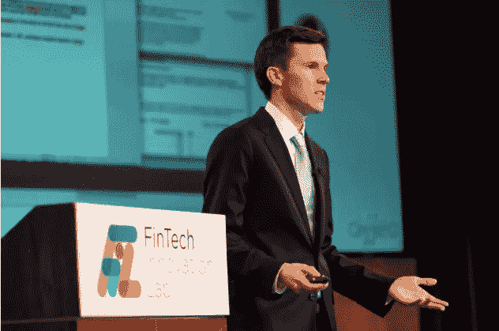

# 后天的。人工智能(第一部分)

> 原文：<https://medium.datadriveninvestor.com/acquired-ai-part-1-1f5e94095688?source=collection_archive---------6----------------------->

最近，我采访了杰森·布里格斯(Jason Briggs)，听听他对企业家精神和人工智能对未来的影响的看法。Jason 是 Salesforce 的高级主管。他之前是 Diffeo 的首席运营官，Diffeo 是一家人工智能公司，致力于构建协作式机器智能。Diffeo 于 2019 年被 Salesforce 收购。在 Diffeo 之前，Jason 在威廉姆斯学院看到他的妈妈尝试在她的电脑上查找文件，但失败了，于是他共同创立了 Meta Search。Meta Search 于 2016 年被 Diffeo 收购。

**告诉我是什么让你在 2014 年创办了 Meta？**

在回威廉姆斯大学读高三之前，我和家人在度假。我的妈妈是一名教师，她正在为即将到来的一年做准备，并努力在她的电脑上找到合适的文件。我看了看她的桌面，那简直是一团糟。作为一名计算机科学(CS)专业的学生，我花了几天时间创建了一个名为 TidyPro 的应用程序。该应用程序分析了你电脑上的文件，并推荐了组织文件的最佳文件夹。

在我高三的时候，威廉姆斯有一个商业计划竞赛，因为我开发了这个应用程序，所以我决定参加，主要是因为第一名的奖金是 15000 美元。不幸的是，我们获得了第三名，但是其中一名观众找到我，告诉我他可以看到在他的业务中使用这项技术的价值，如果我们能够筹集到 12，500 美元，他将成为我们的第一个客户。

老实说，如果这位观众没有接近我，我怀疑我会在商业计划竞赛之外继续下去。

 [## 一名大学生使用语言生成人工智能工具创建了一个病毒式博客帖子|数据驱动…

### 作为作家，我们喜欢告诉自己，我们处在一个无法自动化的职业中，至少短期内不会。但是…

www.datadriveninvestor.com](https://www.datadriveninvestor.com/2020/09/15/a-college-student-used-a-language-generating-ai-tool-to-create-a-viral-blog-post/) 

**有意思。听起来你好像刚刚开始创业了？**

是的，没错。那位观众是将这个变成现实的火花——而不仅仅是一个有趣的附带项目。

比赛结束后，我们出去开始筹集资金。在一些早期的投资者会议上，我们意识到我们必须改变业务，因为桌面清理不是一个十亿美元的想法。这是 TidyPro 成为 Meta 的时候，这是一种允许用户轻松找到他们的云存储提供商(即 Google Cloud、DropBox 等)的任何文档的技术。这是一个更好的 B2B 用例，我们能够筹集到启动项目所需的种子资金。

种子基金让我在大四后的那个夏天从威廉姆斯雇佣了五名计算机科学实习生，为我们的天使投资人的公司设计产品的测试版。

在那个夏天，我们解决了一些问题，开发了一些非常酷的技术。那时，我看到了建立“Google for your files”的潜力，并做出了几个战略决策——1)我们筹集了 50 万美元，2)我们从 B2B 转向了 B2C。

是什么促使你做出这一转变？

所以，首先，转向 B2C 并不是一个长期的决定。我想尽可能地开发最好的技术，而实现这一目标的最佳方式就是开发一些能让大量个人用户从中发现价值的东西。我认为，如果我们把精力集中在用新资本改善用户体验上，那么扩展 B2B 会容易得多。此外，这轮融资让我得以全职聘请云架构开发专家 Aaron Taylor。专注于用户体验比专注于扩大我们的客户群更有意义，因为在它成为企业级之前，需要解决一些 UX 问题。

一段时间后，我们发布了产品，反响非常积极。在公开发布后不久，我们在一天内就有 2000 人注册，我们的每次投资者会议都非常出色，因为我们可以展示人们绝对喜欢的伟大技术。

虽然这应该是积极的，但很少有个人消费者愿意为此付费，我们在这一点上陷得太深，无法有效地回到 B2B。我面临着做出一些意想不到的艰难决定。

**你做了什么？**

嗯，最明显的选择是再融资一轮，为我们有效地回到 B2B 提供足够的跑道。然而，麻省理工学院一家名为 Diffeo 的公司的首席执行官是我们的顾问，他们在非常相似的领域工作。大型企业与他们签约进行学术研究，因此将我们的技术融入到这些工作中似乎是一个自然的选择。

所以在 2016 年，我们合并了，然后合并后的公司筹集了 250 万美元，开始构建人工智能，它可以作为一个强大的研究助手，在你需要的时候为你带来你需要的任何文件。我们在金融服务行业找到了一个立足点，极大地增强了分析师产生可交付成果的能力。

从那以后，事情开始变得有条不紊。自 2017 年以来，我们一直在 Salesforce 的孵化器计划中，这使他们能够跟踪我们的进展并启动合作伙伴关系讨论。然后我们在 2019 年赢得了 MassChallenge FinTech 奖，这让我们真正出了名。2019 年 11 月我们被 Salesforce 收购。

**可怕的结局。我想不会一帆风顺吧？以你现在的势头，你有没有想过继续做独立游戏？**

尽管我们已经建立了具有独特竞争优势的伟大技术，但我们必须做出决定，我们是要自己建立一个平台，还是成为平台上的一个功能。

关于第一个问题:是的，它肯定不是一帆风顺的。我们好几次都差点没钱了。

杂志对企业家精神的描述往往过于乐观，即相信如果你创造了一个伟大的产品，一切都会好起来。我回想起德鲁·休斯顿在公共汽车上启动 Dropbox 的故事，因为他忘记了参加一个重要会议的闪存盘，然后一夜之间成为了一家十亿美元的公司，笑了。在正确的时间出现在正确的地方需要很多运气。

尤其是，我低估了一个初次创业者从零开始建立一个网络的难度。如果没有威廉姆斯商业计划竞赛中的观众成为启动整个活动的火花，以及威廉姆斯校友在整个旅程中的关键点上提供帮助的开放态度，我们就没有机会。

你会给想白手起家创办公司的创业者什么样的建议？

这是极其困难的，而且要花很长时间才能有结果。运气也很好。确保你愿意完全沉迷于构建你的产品很长一段时间，而不去想其他任何事情。

*第二部分将探索杰森关于人工智能的思想及其对未来的影响。*

## 获得专家观点— [订阅 DDI 英特尔](https://datadriveninvestor.com/ddi-intel)