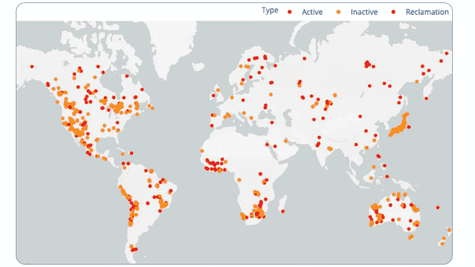
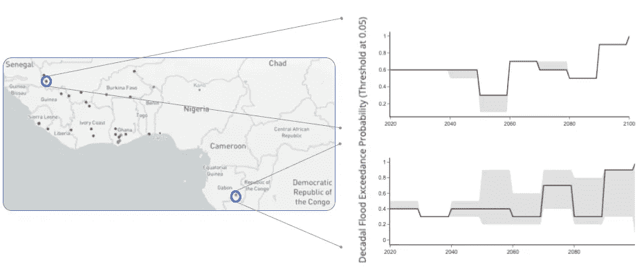

# 当地行动

> 原文：<https://medium.datadriveninvestor.com/act-local-85428f674eda?source=collection_archive---------22----------------------->

*气候风险情报如何促进地方一级的可持续行动*

Drone Imagery over a quarry in Barossa Valley, SA, Australia. Photo Credit: [Dion Beetson](https://unsplash.com/@dionbeetson?utm_source=medium&utm_medium=referral) on [Unsplash](https://unsplash.com/?utm_source=medium&utm_medium=referral)

正如我们在上一篇文章中所讨论的， [*气候风险情报*](https://medium.com/datadriveninvestor/it-matters-when-its-in-your-backyard-e3f93953e282) 通过数据转换，使前沿气候科学和大量地理空间数据变得清晰易懂。这种情报填补了全球气候数据和对最直接影响人类住区的当地资产的实际影响之间的空白。

# 让我们来看看洪水

Projected flooding across Africa and Europe. Cell color indicates the likely extent of flood exposure over the next 30 years (flood projections aggregated over cells at 1 degree spatial resolution)

基于与 IPCC CMIP6 气候情景兼容的现有气候预测(在以前的帖子中描述过)，我们能够汇总来自多个灾害模型的模拟。为了开发我们的气候风险情报，Sust Global 使用了来自 5 个不同全球气候模型的洪水影响模拟集合。每个气候模型都模拟了正常业务( [SSP5-RCP8.5](https://www.sustglobal.com/blog/house-on-fire) )气候情景下的气象变量(例如，降水、温度、长波辐射、特定湿度、风速、表面压力)。模拟的气象变量被输入 10 个候选全球水文模型，这些模型以 0.5 度的空间分辨率和 1 天的时间分辨率模拟径流。然后，将这些径流估计值输入洪水模型，模拟分辨率为 0.25 度的河流流量，并使用高分辨率数字高程剖面图绘制成 0.05 度洪水暴露区域。科学家[已经证明](https://www.nature.com/articles/s41558-018-0257-z)此类模拟可用于根据预测的暴露区域、此类受影响区域内的土地使用和人口知识来评估社会经济影响。

我们使用这样的模拟来评估未来 30 年各大洲的区域性洪水风险。结果显示了一些重要的洪水场景:

1.  [最近的 IPCC 报告](https://www.carbonbrief.org/how-much-flooding-is-in-the-uks-future-a-look-at-the-ipcc-report)预测欧洲和英国“很有可能”在本世纪末看到更多的强降雨事件。已经有证据表明，由于气候变化，英国的暴雨越来越频繁。短时间内的大量降雨增加了洪水风险。
2.  更强的降雨加上海平面上升使得风暴潮更大，更有可能突破海岸防御。科学家警告说，变暖的气候加上更强的降雨不仅会增加英国的洪水风险，而且预计到 2050 年，欧洲沿海的洪水将增加七倍。
3.  非洲部分地区预计也会遭遇大洪水。在目前容易发生洪水的某些地区，洪水的严重程度和频率预计在未来几十年将显著恶化。
4.  在亚洲，预计到 2050 年，每年约有 1.2 万亿美元的资本存量因河流洪水而受损。([来源](https://www.mckinsey.com/business-functions/sustainability/our-insights/climate-risk-and-response-in-asia?cid=other-eml-alt-mgi-mck&hdpid=54c52272-021b-4932-8b3f-a2c2d8dbdf8b&hctky=11758141&hlkid=2ef16b3d4c484b08b68017443f793718)

# 基于洪水的金属供应链中断

A global collection of mines around the world at different stages of the mine lifecycle: active, inactive, reclamation.

Future flooding risk at the individual asset level at specific mine sites. We feature two sites. Top Right: An active Mine in Mali where increasing decadal flooding probabilities in the active mine are indicative of upcoming disruptions. Bottom Right: An inactive tailings dam in Gabon where consistently high decadal flooding probabilities are indicative of likely environmental hazards.

[矿场洪水](http://water.columbia.edu/files/2018/01/14.2017.Mudd_.Report.Water-Use-and-Risks-in-Mining.pdf)是继续采矿的一个干扰源。尽管事故之间存在很大的可变性，但是损失的生产时间、维修和维护成本，加上当地水系统污染造成的罚款或法律费用，可能意味着从 1000 万美元到 9 亿美元的收入损失。这影响了金属商品的供应链，是矿业公司的一项重要成本。[最近的研究](http://water.columbia.edu/files/2015/05/NBIM-Synthesis-Chapter-FInal-4.11.18.pdf)已经量化了矿区洪水的经济影响，每次事故高达数百万美元。

 [## 如何在不牺牲孩子或财务的情况下安全理智地离婚|数据驱动…

### 在美国，七月是以孩子为中心的离婚月。作为 cdfaⓡ的专业人士，我可以向你保证，从长远来看…

www.datadriveninvestor.com](https://www.datadriveninvestor.com/2020/07/28/how-to-divorce-safely-and-sanely-without-sacrificing-your-children-or-your-finances/) 

气候引发的洪水污染是矿业公司面临的最大环境和社会挑战之一。大多数现役和退役矿山附近都有相关的尾矿坝。[尾矿坝溢流](https://www.hindawi.com/journals/ace/2019/4159306/)会导致酸性堆浸溶液失控排放，污染水系统，扰乱农田，导致牛和其他牲畜死亡，并对水生生态系统产生负面影响。这可能导致巨额罚款，并招致数百万美元的清理费用。此外，污染和水问题的累积效应引发了来自邻近社区和非政府组织的社会和监管压力，这反过来会影响整个采矿业。

通过使用气候风险情报，投资者和公司可以与当地社区、政府和非政府组织合作，帮助评估特定地区的洪水风险，然后制定减轻这些风险的战略。

# 关键要点

*   **位置，位置，位置:**在理解极端气候灾害风险和评估气候变化的短期和长期影响时，位置很重要。气候适应和缓解战略将因地点而异。
*   **气候对供应链的影响:**我们应该预测和计划影响经济的活跃矿区和易受有害环境物质影响的矿区日益增多的洪水。
*   **资产级别评估支持气候情报:**了解特定物理位置的气候风险暴露，使我们能够量化物理风险，进行规划和调整，以避免重大的环境破坏、经济损失和供应链中断。

如果你觉得这份材料很有趣，并且关心气候变化，我会很感激你转发给朋友并留下评论。Sust Global 可以轻松跟上前沿气候科学的最新分析和趋势，只需订阅[*Sust Insights*](https://www.sustglobal.com/blog)*。如果您希望在未来几年评估您的资产和业务因暴露于极端物理风险而面临的风险，* [*请联系我们*](https://www.sustglobal.com/climate-risk) *并注册试用我们的* [*气候情景分析平台*](https://www.sustglobal.com/financial-services) *。*

**相关阅读:**

 [## 当它在你的后院时就很重要了

### 气候风险情报，告知特定位置现在和未来的物理风险。

medium.com](https://medium.com/datadriveninvestor/it-matters-when-its-in-your-backyard-e3f93953e282)  [## 我们的房子着火了吗？

### 探索气候变化的未来情景

medium.com](https://medium.com/datadriveninvestor/is-our-house-on-fire-98919692259c)  [## 迈向地理空间 2.0:大规模释放数十亿个垂直市场

### 地理空间技术领域的新范式分析，将产生大规模的商业价值，通过…

medium.com](https://medium.com/sust-insights/https-medium-com-joshjgilbert-approaching-geospatial-2-0-eae02538200) 

## 访问专家视图— [订阅 DDI 英特尔](https://datadriveninvestor.com/ddi-intel)